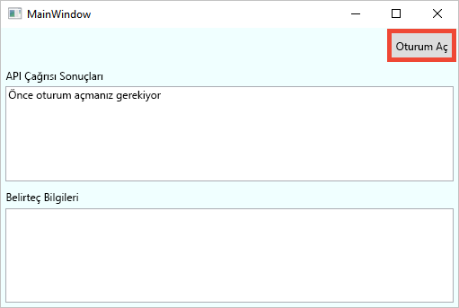
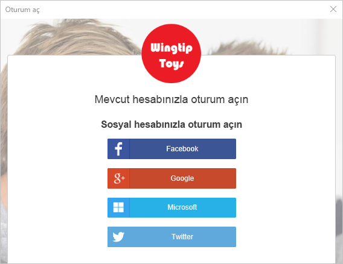
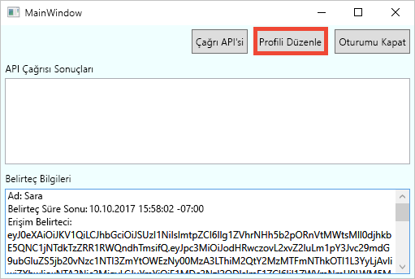
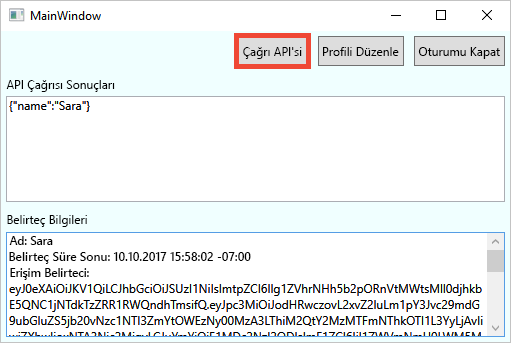

# <a name="quickstart-set-up-sign-in-for-a-desktop-app-using-azure-active-directory-b2c"></a>Hızlı Başlangıç: Azure Active Directory B2C kullanarak bir masaüstü uygulaması için oturum açma ayarlama 

Azure Active Directory (Azure AD) B2C, uygulamanız, işletmeniz ve müşterileriniz için koruma sağlamak üzere bulut kimliği yönetimi sunar. Azure AD B2C; uygulamalarınızın, açık standart protokolleri kullanarak sosyal hesaplarda ve kurumsal hesaplarda kimlik doğrulaması gerçekleştirmesine olanak tanır. Bu hızlı başlangıçta bir sosyal kimlik sağlayıcısı kullanarak oturum açmak ve Azure AD B2C korumalı bir web API’sini çağırmak için bir Windows Presentation Foundation (WPF) masaüstü uygulaması kullanacaksınız.

[!INCLUDE [quickstarts-free-trial-note](../../includes/quickstarts-free-trial-note.md)]

## <a name="prerequisites"></a>Önkoşullar

- **ASP.NET ve web geliştirme** iş yüküyle [Visual Studio 2017](https://www.visualstudio.com/downloads/). 
- Facebook’tan, Google’dan, Microsoft’tan veya Twitter’dan bir sosyal hesap.
- GitHub’dan [zip dosyasını indirin](https://github.com/Azure-Samples/active-directory-b2c-dotnet-desktop/archive/master.zip) veya örnek web uygulamasını kopyalayın.

    ```
    git clone https://github.com/Azure-Samples/active-directory-b2c-dotnet-desktop.git
    ```

## <a name="run-the-application-in-visual-studio"></a>Uygulamayı Visual Studio'da çalıştırma

1. Örnek uygulama proje klasöründeki **active-directory-b2c-wpf.sln** çözümünü Visual Studio'da açın.
2. Uygulamada hata ayıklamak için **F5**’e basın.

## <a name="sign-in-using-your-account"></a>Hesabınızı kullanarak oturum açın

1. **Kaydolma veya Oturum Açma** iş akışını başlatmak için **Oturum aç**’a tıklayın.

    

    Örnek, sosyal kimlik sağlayıcısı kullanma veya bir e-posta adresiyle yerel bir hesap oluşturma da dahil olmak üzere çeşitli kaydolma seçeneklerini destekler. Bu hızlı başlangıç için Facebook’tan, Google’dan, Microsoft’tan veya Twitter’dan bir sosyal kimlik sağlayıcısı hesabı kullanın. 


2. Azure AD B2C, örnek web uygulaması için Wingtip Toys adlı bir kurgusal markaya yönelik özel bir oturum açma sayfası sunar. Sosyal kimlik sağlayıcısı kullanarak kaydolmak için, kullanmak istediğiniz kimlik sağlayıcısının düğmesine tıklayın. 

    

    Sosyal hesap kimlik bilgilerinizi kullanarak kimlik doğrulaması (oturum açma) gerçekleştirir ve uygulamaya sosyal hesabınızdaki bilgileri okuma yetkisi verirsiniz. Erişim izni verdiğinizde uygulama sosyal hesabınızdan adınız ve şehriniz gibi profil bilgilerini alabilir. 

2. Kimlik sağlayıcısına ilişkin oturum açma işlemini tamamlayın.

    Yeni hesap profili ayrıntılarınız, sosyal hesabınızdaki bilgilerle önceden doldurulur.

## <a name="edit-your-profile"></a>Profilinizi düzenleme

Azure AD B2C, kullanıcılara profillerini güncelleme olanağı tanıyan bir işlev sunar. Örnek web uygulaması iş akışı için bir Azure AD B2C düzenleme profil kullanıcı akışını kullanır. 

1. Oluşturduğunuz profili düzenlemek için uygulamanın menü çubuğunda **Profili düzenle**’ye tıklayın.

    

2. Oluşturduğunuz hesapla ilişkili kimlik sağlayıcısını seçin. Örneğin, hesabınızı oluşturduğunuzda kimlik sağlayıcısı olarak Twitter’ı kullandıysanız ilişkili profil ayrıntılarını değiştirmek için Twitter’ı seçin.

3. **Görünen adınızı** veya **Şehrinizi** değiştirip **Devam**’a tıklayın.

    *Belirteç bilgileri* metin kutusunda yeni bir erişim belirteci görüntülenir. Profilinizdeki değişiklikleri doğrulamak istiyorsanız erişim belirtecini kopyalayıp https://jwt.ms belirteç kod çözücüsüne yapıştırın.

## <a name="access-a-protected-api-resource"></a>Korumalı bir API kaynağına erişme

Korumalı kaynaktan istekte bulunmak için **API’yi çağır**’a tıklayın. 

    

    The application includes the Azure AD access token in the request to the protected web API resource. The web API sends back the display name contained in the access token.

Azure AD B2C korumalı bir web API’si için yetkili bir çağrıda bulunmak üzere Azure AD B2C kullanıcı hesabınızı başarıyla kullandınız.

## <a name="clean-up-resources"></a>Kaynakları temizleme

Diğer Azure AD B2C hızlı başlangıçlarını veya öğreticilerini denemeyi planlıyorsanız Azure AD B2C kiracınızı kullanabilirsiniz. Artık ihtiyaç duymuyorsanız [Azure AD B2C kiracınızı silebilirsiniz](active-directory-b2c-faqs.md#how-do-i-delete-my-azure-ad-b2c-tenant).

## <a name="next-steps"></a>Sonraki adımlar

Bu hızlı başlangıçta özel bir oturum açma sayfasıyla oturum açmak, sosyal kimlik sağlayıcısı ile oturum açmak, bir Azure AD B2C hesabı oluşturmak ve Azure AD B2C tarafından korunan bir web API’sini çağırmak için örnek masaüstü uygulamasını kullandınız. 

Kendi Azure AD B2C kiracınızı oluşturarak kullanmaya başlayın. 

> [!div class="nextstepaction"]
> [Azure portalında Azure Active Directory B2C kiracısı oluşturma](tutorial-create-tenant.md)
