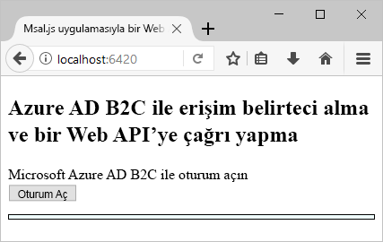
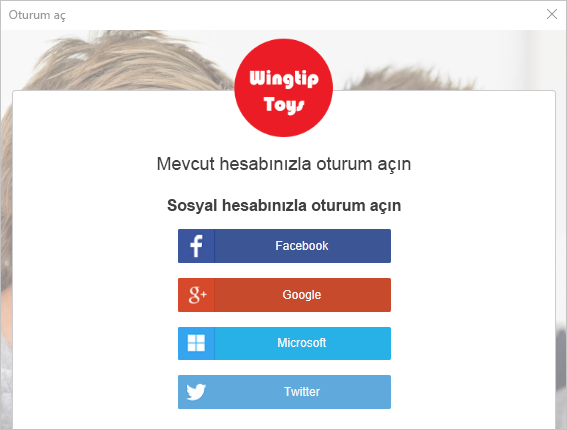
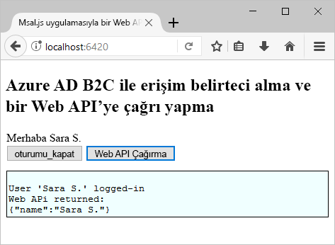

# <a name="quickstart-set-up-sign-in-for-a-single-page-app-using-azure-active-directory-b2c"></a>Hızlı Başlangıç: Azure Active Directory B2C kullanarak bir tek sayfalı uygulama için oturum açma ayarlama

Azure Active Directory (Azure AD) B2C, uygulamanız, işletmeniz ve müşterileriniz için koruma sağlamak üzere bulut kimliği yönetimi sunar. Azure AD B2C; uygulamalarınızın, açık standart protokolleri kullanarak sosyal hesaplarda ve kurumsal hesaplarda kimlik doğrulaması gerçekleştirmesine olanak tanır. Bu hızlı başlangıçta, sosyal kimlik sağlayıcısı kullanıp Azure AD B2C korumalı web API’si çağırarak oturum açmak için bir tek sayfalı uygulama kullanırsınız.

[!INCLUDE [quickstarts-free-trial-note](../../includes/quickstarts-free-trial-note.md)]

## <a name="prerequisites"></a>Önkoşullar

- **ASP.NET ve web geliştirme** iş yüküyle [Visual Studio 2017](https://www.visualstudio.com/downloads/).
- [Node.js](https://nodejs.org/en/download/)’yi yükleme
- Facebook’tan, Google’dan, Microsoft’tan veya Twitter’dan bir sosyal hesap.
- GitHub’dan [zip dosyasını indirin](https://github.com/Azure-Samples/active-directory-b2c-javascript-msal-singlepageapp/archive/master.zip) veya örnek web uygulamasını kopyalayın.

    ```
    git clone https://github.com/Azure-Samples/active-directory-b2c-javascript-msal-singlepageapp.git
    ```

## <a name="run-the-application"></a>Uygulamayı çalıştırma

1. Node.js komut isteminde şu komutları çalıştırarak sunucuyu başlatın: 

    ```
    cd active-directory-b2c-javascript-msal-singlepageapp
    npm install && npm update
    node server.js
    ```

    Server.js, localhost’ta dinlediği bağlantı noktası numarasını çıkarır.

    ```
    Listening on port 6420...
    ```

2. Uygulamanın URL'sine göz atın. Örneğin, `http://localhost:6420`.

## <a name="sign-in-using-your-account"></a>Hesabınızı kullanarak oturum açın

1. İş akışını başlatmak için **Oturum aç**'a tıklayın.

    

    Örnek, sosyal kimlik sağlayıcısı kullanma veya bir e-posta adresiyle yerel bir hesap oluşturma da dahil olmak üzere çeşitli kaydolma seçeneklerini destekler. Bu hızlı başlangıç için Facebook’tan, Google’dan, Microsoft’tan veya Twitter’dan bir sosyal kimlik sağlayıcısı hesabı kullanın. 

2. Azure AD B2C, örnek web uygulaması için Wingtip Toys adlı bir kurgusal markaya yönelik özel bir oturum açma sayfası sunar. Sosyal kimlik sağlayıcısı kullanarak kaydolmak için, kullanmak istediğiniz kimlik sağlayıcısının düğmesine tıklayın.

    

    Sosyal hesap kimlik bilgilerinizi kullanarak kimlik doğrulaması (oturum açma) gerçekleştirir ve uygulamaya sosyal hesabınızdaki bilgileri okuma yetkisi verirsiniz. Erişim izni verdiğinizde uygulama sosyal hesabınızdan adınız ve şehriniz gibi profil bilgilerini alabilir. 

3. Kimlik sağlayıcısına ilişkin oturum açma işlemini tamamlayın.

## <a name="access-a-protected-api-resource"></a>Korumalı bir API kaynağına erişme

Görünen adınızın Web API’si çağrısından JSON nesnesi olarak döndürülmesi için **Web API’si Çağrısı**'na tıklayın. 



Örnek tek sayfalı uygulama, korumalı web API’si kaynağına yönelik isteğe bir erişim belirteci ekler.

## <a name="clean-up-resources"></a>Kaynakları temizleme

Diğer Azure AD B2C hızlı başlangıçlarını veya öğreticilerini denemeyi planlıyorsanız Azure AD B2C kiracınızı kullanabilirsiniz. Artık ihtiyaç duymuyorsanız [Azure AD B2C kiracınızı silebilirsiniz](active-directory-b2c-faqs.md#how-do-i-delete-my-azure-ad-b2c-tenant).

## <a name="next-steps"></a>Sonraki adımlar

Bu hızlı başlangıçta özel bir oturum açma sayfasıyla oturum açmak, sosyal kimlik sağlayıcısı ile oturum açmak, bir Azure AD B2C hesabı oluşturmak ve Azure AD B2C tarafından korunan bir web API’sini çağırmak için örnek tek sayfalı uygulamayı kullandınız. 

Kendi Azure AD B2C kiracınızı oluşturarak kullanmaya başlayın.

> [!div class="nextstepaction"]
> [Azure portalında Azure Active Directory B2C kiracısı oluşturma](tutorial-create-tenant.md)
