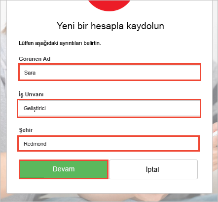

# <a name="quickstart-test-drive-an-azure-ad-b2c-enabled-web-app"></a>Hızlı Başlangıç: Azure AD B2C etkin bir web uygulaması için test sürüşü

Azure Active Directory (Azure AD) B2C, uygulamanız, işletmeniz ve müşterileriniz için koruma sağlamak üzere bulut kimliği yönetimi sunar. Azure AD B2C; uygulamalarınızın, açık standart protokolleri kullanarak sosyal hesaplarda ve kurumsal hesaplarda kimlik doğrulaması gerçekleştirmesine olanak tanır.

Bu hızlı başlangıçta, sosyal bir kimlik sağlayıcısı kullanarak oturum açmak ve Azure AD B2C korumalı bir web API’si çağırmak için Azure AD B2C etkin örnek bir ASP.NET uygulaması kullanabilirsiniz.

[!INCLUDE [quickstarts-free-trial-note](../../includes/quickstarts-free-trial-note.md)]

## <a name="prerequisites"></a>Ön koşullar

* **ASP.NET ve web geliştirme** iş yüküyle [Visual Studio 2017](https://www.visualstudio.com/downloads/). 
* Facebook’tan, Google’dan, Microsoft’tan veya Twitter’dan bir sosyal hesap.

## <a name="download-the-sample"></a>Örneği indirme

GitHub’dan [zip dosyasını indirin](https://github.com/Azure-Samples/active-directory-b2c-dotnet-webapp-and-webapi/archive/master.zip) veya örnek web uygulamasını kopyalayın.

```
git clone https://github.com/Azure-Samples/active-directory-b2c-dotnet-webapp-and-webapi.git
```

## <a name="run-the-app-in-visual-studio"></a>Uygulamayı Visual Studio’da çalıştırma

Örnek uygulama proje klasöründen, Visual Studio’da `B2C-WebAPI-DotNet.sln` çözümünü açın.

Örnek çözümde iki proje vardır:

**Örnek web uygulaması (TaskWebApp):** Görev listesi oluşturmak ve düzenlemek için kullanılan web uygulaması. Web uygulaması, kullanıcıların oturum açması için **kaydolma veya oturum açma** ilkesi kullanır.

**Örnek web API’si uygulaması (TaskService):** Görev listesi oluşturma, okuma, güncelleştirme ve silme işlevlerini destekleyen web API’si. Web API’si, Azure AD B2C tarafından korunur ve web uygulaması tarafından çağrılır.

Bu hızlı başlangıç için aynı anda hem `TaskWebApp` hem de `TaskService` projesini çalıştırıyorsunuz. 

1. Çözüm Gezgini’nde `B2C-WebAPI-DotNet` çözümünü seçin.
2. Visual Studio menüsünde **Proje > Başlangıç Projeleri Ayarla...** seçeneğini belirleyin. 
3. **Birden fazla başlangıç projesi** radyo düğmesini seçin.
4. İki proje için de **Eylem**’i **Başlat** olarak değiştirin. **Tamam**’a tıklayın.

Her iki uygulamada da hata ayıklama gerçekleştirmek için **F5**’e basın. Her uygulama kendi tarayıcı sekmesinde açılır:

`https://localhost:44316/` - Bu sayfa, ASP.NET web uygulamasıdır. Hızlı başlangıçta doğrudan bu uygulamayla etkileşim kurarsınız.
`https://localhost:44332/` - Bu sayfa, ASP.NET web uygulaması tarafından çağrılan web API’sidir.

## <a name="create-an-account"></a>Hesap oluşturma

Azure AD B2C ilkesi temelinde **Kaydolma veya Oturum Açma** iş akışını başlatmak için ASP.NET web uygulamasındaki **Kaydol/Oturum Aç** bağlantısına tıklayın.


Örnek, sosyal kimlik sağlayıcısı kullanma veya bir e-posta adresiyle yerel bir hesap oluşturma da dahil olmak üzere çeşitli kaydolma seçeneklerini destekler. Bu hızlı başlangıç için Facebook’tan, Google’dan, Microsoft’tan veya Twitter’dan bir sosyal kimlik sağlayıcısı hesabı kullanın. 

### <a name="sign-up-using-a-social-identity-provider"></a>Sosyal kimlik sağlayıcısı kullanarak kaydolma

Azure AD B2C, örnek web uygulaması için Wingtip Toys adlı bir kurgusal markaya yönelik özel bir oturum açma sayfası sunar. 

1. Sosyal kimlik sağlayıcısı kullanarak kaydolmak için, kullanmak istediğiniz kimlik sağlayıcısının düğmesine tıklayın.

    

    Sosyal hesap kimlik bilgilerinizi kullanarak kimlik doğrulaması (oturum açma) gerçekleştirir ve uygulamaya sosyal hesabınızdaki bilgileri okuma yetkisi verirsiniz. Erişim izni verdiğinizde uygulama sosyal hesabınızdan adınız ve şehriniz gibi profil bilgilerini alabilir. 

2. Kimlik sağlayıcısına ilişkin oturum açma işlemini tamamlayın. Örneğin, Twitter’i seçtiyseniz Twitter kimlik bilgilerinizi girin **Oturum aç**’a tıklayın.

    

    Yeni Azure AD B2C hesabı profil ayrıntılarınız sosyal hesabınızdan alınan bilgilerle önceden doldurulur.

3. Görünen Ad, İş Unvanı ve Şehir alanlarını güncelleştirip **Devam**’a tıklayın.  Girdiğiniz değerler Azure AD B2C kullanıcı hesabı profiliniz için kullanılır.

    

    Bir kimlik sağlayıcısı kullanarak kimlik doğrulaması gerçekleştirmek ve Azure AD B2C kullanıcı hesabı oluşturmak için, Azure AD B2C ilkesi kullanan örnek web uygulamasını başarıyla kullandınız. 

## <a name="edit-your-profile"></a>Profilinizi düzenleme

Azure Active Directory B2C, kullanıcılara profillerini güncelleme olanağı tanıyan bir işlev sunar. Örnek web uygulaması, iş akışı için bir Azure AD B2C düzenleme profil ilkesi kullanır. 

1. Web uygulamasın menü çubuğunda profil adınıza tıklayın ve oluşturduğunuz profili düzenlemek için **Profili düzenle**’yi seçin.

    

2. **Görünen adınızı** ve **Şehrinizi** değiştirin.  
3. Profilinizi güncelleştirmek için **Devam**’a tıklayın. Yeni görünen ad, web uygulamasının giriş sayfasının sağ üst kısmında görüntülenir.

## <a name="access-a-protected-web-api-resource"></a>Korumalı bir API kaynağına erişme

1. Yapılacaklar listesi öğelerinizi girmek ve değiştirmek için **Yapılacaklar Listesi**’ne tıklayın. 

2. Metni **Yeni Öğe** metin kutusuna girin. Yapılacaklar listesi öğesi ekleyen Azure AD B2C korumalı web API’sini çağırmak için **Ekle**’ye tıklayın.

    

    ASP.NET web uygulaması, kullanıcının yapılacaklar listesi öğelerinde işlem gerçekleştirmek için korumalı web API’si kaynağına gönderilen isteğe bir Azure AD erişim belirteci ekler.

Azure AD B2C korumalı bir web API’si için yetkili bir çağrıda bulunmak üzere Azure AD B2C kullanıcı hesabınızı başarıyla kullandınız.

## <a name="clean-up-resources"></a>Kaynakları temizleme

Diğer Azure AD B2C hızlı başlangıçlarını veya öğreticilerini denemeyi planlıyorsanız Azure AD B2C kiracınızı kullanabilirsiniz. Artık ihtiyaç duymuyorsanız [Azure AD B2C kiracınızı silebilirsiniz](active-directory-b2c-faqs.md#how-do-i-delete-my-azure-ad-b2c-tenant).

## <a name="next-steps"></a>Sonraki adımlar

Bu hızlı başlangıçta özel bir oturum açma sayfasıyla oturum açmak, sosyal kimlik sağlayıcısı ile oturum açmak, bir Azure AD B2C hesabı oluşturmak ve Azure AD B2C tarafından korunan bir web API’sini çağırmak için Azure AD B2C etkin bir örnek ASP.NET uygulaması kullandınız. 

Örnek ASP.NET uygulamasını kendi Azure AD B2C kiracınızı kullanacak şekilde nasıl yapılandıracağınızı öğrenmek için öğreticiye devam edin.

> [!div class="nextstepaction"]
> [Öğretici: Bir ASP.NET web uygulamasında Azure Active Directory B2C ile kullanıcılar için kimlik doğrulaması gerçekleştirme](active-directory-b2c-tutorials-web-app.md)