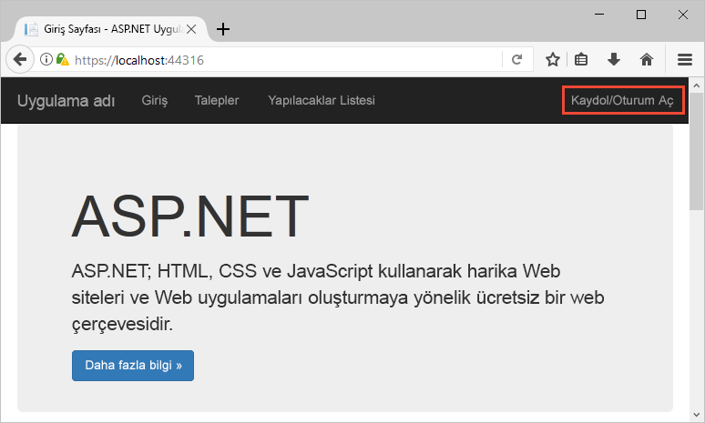
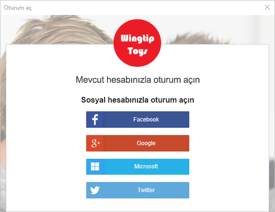
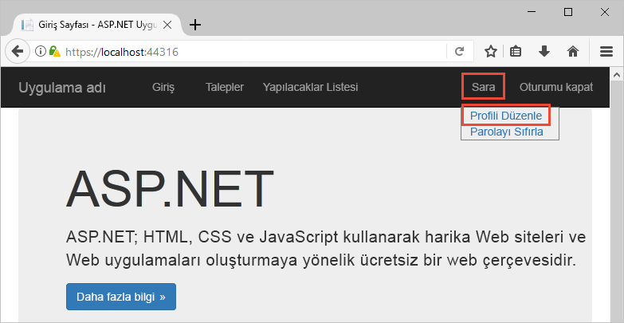
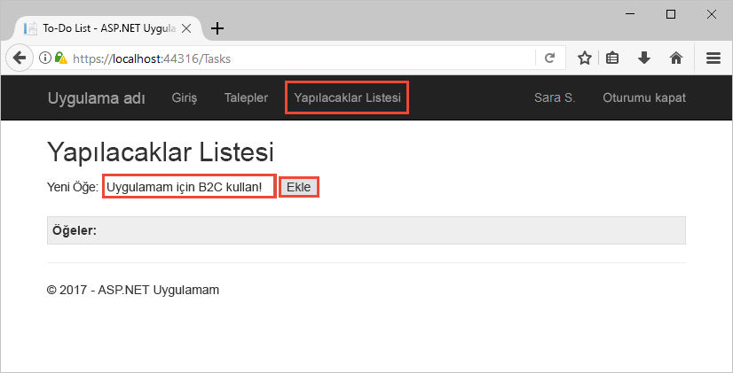

# <a name="quickstart-set-up-sign-in-for-an-aspnet-application-using-azure-active-directory-b2c"></a>Hızlı Başlangıç: Azure Active Directory B2C kullanarak ASP.NET uygulaması için oturum açma ayarlama

Azure Active Directory (Azure AD) B2C, uygulamanız, işletmeniz ve müşterileriniz için koruma sağlamak üzere bulut kimliği yönetimi sunar. Azure AD B2C; uygulamalarınızın, açık standart protokolleri kullanarak sosyal hesaplarda ve kurumsal hesaplarda kimlik doğrulaması gerçekleştirmesine olanak tanır. Bu hızlı başlangıçta, sosyal kimlik sağlayıcısı kullanıp Azure AD B2C korumalı web API’si çağırarak oturum açmak için bir ASP.NET uygulaması kullanacaksınız.

[!INCLUDE [quickstarts-free-trial-note](../../includes/quickstarts-free-trial-note.md)]

## <a name="prerequisites"></a>Önkoşullar

- **ASP.NET ve web geliştirme** iş yüküyle [Visual Studio 2017](https://www.visualstudio.com/downloads/). 
- Facebook’tan, Google’dan, Microsoft’tan veya Twitter’dan bir sosyal hesap.
- GitHub’dan [zip dosyasını indirin](https://github.com/Azure-Samples/active-directory-b2c-dotnet-webapp-and-webapi/archive/master.zip) veya örnek web uygulamasını kopyalayın.

    ```
    git clone https://github.com/Azure-Samples/active-directory-b2c-dotnet-webapp-and-webapi.git
    ```

    Örnek çözümde iki proje vardır:

    - **TaskWebApp**: Görev listesi oluşturan ve düzenleyen bir web uygulamasıdır. Web uygulaması kullanır **kaydolma veya oturum açma** kullanıcı flow'a kaydolma veya oturum açma kullanıcı.
    - **TaskService**: Görev listesi oluşturma, okuma, güncelleştirme ve silme işlevlerini destekleyen web API’sidir. Web API’si Azure AD B2C tarafından korunur ve web uygulaması tarafından çağrılır.

## <a name="run-the-application-in-visual-studio"></a>Uygulamayı Visual Studio'da çalıştırma

1. Örnek uygulama proje klasöründen, Visual Studio’da **B2C-WebAPI-DotNet.sln** çözümünü açın.
2. Bu hızlı başlangıç için aynı anda hem **TaskWebApp** hem de **TaskService** projesini çalıştırıyorsunuz. Çözüm Gezgini'nde **B2C-WebAPI-DotNet** çözümüne sağ tıklayıp **Başlangıç Projelerini Ayarla**'yı seçin. 
3. **Çoklu başlangıç projeleri**'ni seçin ve iki projenin de **Eylem** alanını **Başlat** olarak değiştirin. 
4. **Tamam** düğmesine tıklayın.
5. Her iki uygulamada da hata ayıklama gerçekleştirmek için **F5**’e basın. Her uygulama kendi tarayıcı sekmesinde açılır:

    - `https://localhost:44316/` - ASP.NET web uygulaması. Hızlı başlangıçta doğrudan bu uygulamayla etkileşim kurarsınız.
    - `https://localhost:44332/` - ASP.NET web uygulaması tarafından çağrılan web API’si.

## <a name="sign-in-using-your-account"></a>Hesabınızı kullanarak oturum açın

1. İş akışını başlatmak için ASP.NET web uygulamasında **Kaydol/Oturum aç**'a tıklayın.

    

    Örnek, sosyal kimlik sağlayıcısı kullanma veya bir e-posta adresiyle yerel bir hesap oluşturma da dahil olmak üzere çeşitli kaydolma seçeneklerini destekler. Bu hızlı başlangıç için Facebook’tan, Google’dan, Microsoft’tan veya Twitter’dan bir sosyal kimlik sağlayıcısı hesabı kullanın.

2. Azure AD B2C, örnek web uygulaması için Wingtip Toys adlı bir kurgusal markaya yönelik özel bir oturum açma sayfası sunar. Sosyal kimlik sağlayıcısı kullanarak kaydolmak için, kullanmak istediğiniz kimlik sağlayıcısının düğmesine tıklayın.

    

    Sosyal hesap kimlik bilgilerinizi kullanarak kimlik doğrulaması (oturum açma) gerçekleştirir ve uygulamaya sosyal hesabınızdaki bilgileri okuma yetkisi verirsiniz. Erişim izni verdiğinizde uygulama sosyal hesabınızdan adınız ve şehriniz gibi profil bilgilerini alabilir. 

3. Kimlik sağlayıcısına ilişkin oturum açma işlemini tamamlayın.

## <a name="edit-your-profile"></a>Profilinizi düzenleme

Azure Active Directory B2C, kullanıcılara profillerini güncelleme olanağı tanıyan bir işlev sunar. Örnek web uygulaması iş akışı için bir Azure AD B2C düzenleme profil kullanıcı akışını kullanır. 

1. Uygulamanın menü çubuğunda profil adınıza tıklayın ve oluşturduğunuz profili düzenlemek için **Profili düzenle**’yi seçin.

    

2. **Görünen adınızı** veya **Şehrinizi** değiştirin ve profilinizi güncelleştirmek için **Devam**’a tıklayın. 

    Değişiklik, web uygulamasının giriş sayfasının sağ üst kısmında görüntülenir.

## <a name="access-a-protected-api-resource"></a>Korumalı bir API kaynağına erişme

1. Yapılacaklar listesi öğelerinizi girmek ve değiştirmek için **Yapılacaklar Listesi**’ne tıklayın. 

2. Metni **Yeni Öğe** metin kutusuna girin. Yapılacaklar listesi öğesi ekleyen Azure AD B2C korumalı web API’sini çağırmak için **Ekle**’ye tıklayın.

    

    ASP.NET web uygulaması, kullanıcının yapılacaklar listesi öğelerinde işlem gerçekleştirmek için korumalı web API’si kaynağına gönderilen isteğe bir Azure AD erişim belirteci ekler.

Azure AD B2C korumalı bir web API’si için yetkili bir çağrıda bulunmak üzere Azure AD B2C kullanıcı hesabınızı başarıyla kullandınız.

## <a name="clean-up-resources"></a>Kaynakları temizleme

Diğer Azure AD B2C hızlı başlangıçlarını veya öğreticilerini denemeyi planlıyorsanız Azure AD B2C kiracınızı kullanabilirsiniz. Artık ihtiyaç duymuyorsanız [Azure AD B2C kiracınızı silebilirsiniz](active-directory-b2c-faqs.md#how-do-i-delete-my-azure-ad-b2c-tenant).

## <a name="next-steps"></a>Sonraki adımlar

Bu hızlı başlangıçta özel bir oturum açma sayfasıyla oturum açmak, sosyal kimlik sağlayıcısı ile oturum açmak, bir Azure AD B2C hesabı oluşturmak ve Azure AD B2C tarafından korunan bir web API’sini çağırmak için örnek ASP.NET uygulamasını kullandınız. 

Kendi Azure AD B2C kiracınızı oluşturarak kullanmaya başlayın.

> [!div class="nextstepaction"]
> [Azure portalında Azure Active Directory B2C kiracısı oluşturma](tutorial-create-tenant.md)
