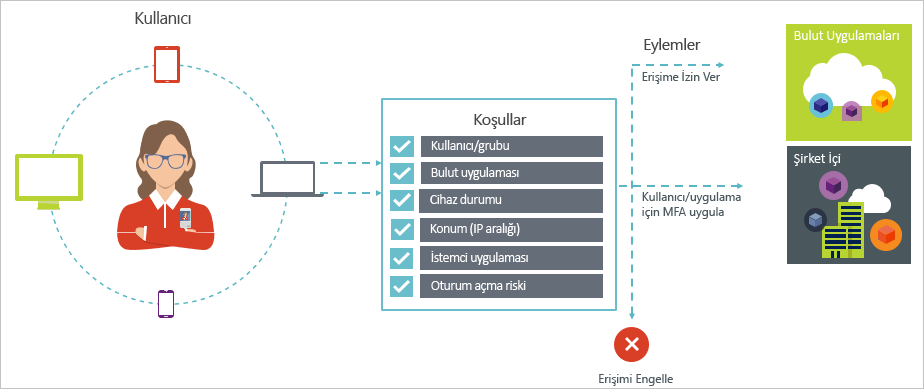
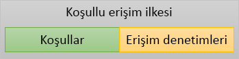

# Azure Active Directory'de koşullu erişim

Güvenlik, bulut kullanan kurumlar için üst bir konudur. Bulut kaynaklarınızı yönetmek için geldiğinde bir anahtar bulut güvenlik kimlik ve erişim yönüdür. Bir mobil ilk olarak, bulut ilk dünyanın çeşitli cihazlar ve uygulamalar her yerden kullanarak, kuruluşunuzun kaynakları kullanıcılar erişebilir. Bunun sonucunda, yalnızca bir kaynak erişebilecek kişileri odaklanan artık yeterli değil. Güvenlik ve üretkenlik arasındaki dengeyi Yöneticisi için BT uzmanları da nasıl bir kaynakları erişildiğinde bir erişim denetimi karar faktörü gerekir. Azure AD ile koşullu erişim, bu gereksinim karşılayabilir. Koşullu erişim, ortamınızdaki belirli koşullar merkezi bir konumdan dayalı uygulamalara erişim denetimleri zorunlu tutmanıza olanak sağlayan Azure Active Directory bir yetenektir. 

Bu makalede Azure AD ile koşullu erişim kavramsal genel bakış sağlar.

## Genel senaryolar

Bir mobil ilk olarak, bulut ilk dünyasında, Azure Active Directory çoklu oturum açma cihazları, uygulamaları ve Hizmetleri için yerden sağlar. Devre dışı şirket ağlarına (KCG dahil) aygıtların artışı ile çalışır ve 3 taraf SaaS uygulamalar, BT uzmanları iki rakip hedefle karşılaştığı:

- Yerde ve zamanda üretken olmak için kullanıcılara güç kazandırma
- Herhangi bir zamanda Kurumsal varlıklar koruma

Koşullu erişim ilkelerini kullanarak, gerekli koşullarda doğru erişim denetimleri uygulayabilirsiniz. Azure AD koşullu erişim ile gerekli ve onu olmadığı durumlarda, kullanıcının yolu dışında kalır, ek güvenlik sağlar. 

Koşullu erişim size yardımcı olabilecek bazı genel erişim sorunları aşağıda verilmiştir:

- **[Oturum açma riski](active-directory-conditional-access-conditions.md#sign-in-risk)**: Azure AD kimlik koruması, oturum açma riskleri algılar. Nasıl algılanan bir oturum açma riski hatalı aktör gösteriyorsa erişimi kısıtlama? Ne bir oturum açma gerçekten yasal kullanıcı tarafından gerçekleştirilen veya, şüpheniz bile belirli kullanıcıların uygulama erişmesini engellemek için güçlü daha güçlü bir kanıtı almak ister misiniz?

- **[Ağ konumu](active-directory-conditional-access-locations.md)**: Azure AD herhangi bir yerden erişilebilir. Ne erişim girişiminde, BT departmanınızın denetimi altında olmayan bir ağ konumundan yapılır? Erişim için kimlik kanıtı kaynaklarınıza Kurumsal ağınızdan çalışır gibi bir kullanıcı adı ve parola birleşimini kullanarak yeterince iyi olabilir. Peki, isteğe bağlı kimlik daha güçlü bir kanıtı erişim denemelerinin başlatılan diğer beklenmeyen ülke veya bölgelerden dünya? Ne bile erişimini engellemek istediğiniz belirli konumlardan çalışır?  

- **[Aygıt Yönetimi](active-directory-conditional-access-conditions.md#device-platforms)**: Azure AD'de kullanıcıları geniş bir dizi cihazı mobil ve aynı zamanda kişisel aygıtlar dahil olmak üzere bulut uygulamalarını erişebilirsiniz. Bu erişim girişimi talep ne yalnızca BT departmanınız tarafından yönetilen cihazlar kullanarak gerçekleştirilen kullanıcı olması gerekiyor mu? Ne bile bulut uygulamalarında ortamınızdaki belirli aygıt türleri form erişimini engellemek istediğiniz? 

- **[İstemci uygulaması](active-directory-conditional-access-conditions.md#client-apps)**: Bugün, web tabanlı uygulamalar, mobil uygulama veya Masaüstü uygulamaları gibi farklı uygulama türleri kullanarak birçok bulut uygulamaları erişebilirsiniz. Ne erişim girişiminde bilinen sorunlara neden olan bir istemci uygulaması türü kullanılarak yapılır? Ne belirli uygulama türleri için BT bölümünüze tarafından yönetilen bir cihaz gerektiriyor? 

Bu sorular ve ilgili yanıtları Azure AD koşullu erişim için genel erişim senaryoları temsil eder. Koşullu erişim, ilke tabanlı bir yaklaşım kullanarak erişim senaryoları işlemek sağlar Azure Active Directory bir yetenektir.

## Koşullu erişim ilkeleri

Bir koşullu erişim ilkesi şu biçimi kullanarak bir erişim senaryo tanımı şöyledir:

**Bunu yapmak** ilkenizin yanıt tanımlar. Amacı bir koşullu erişim ilkesi, bir bulut uygulama erişimi vermek olduğunu dikkate almak önemlidir. Azure AD içinde bulut uygulamalarında erişim verilmesi kullanıcı atamaları konusudur. Koşullu erişim ilkesi ile nasıl yetkili kullanıcıların Denetim (bulut uygulamasına erişim izni verilen kullanıcılar), belirli koşullar altında bulut uygulamalarını erişebilir. Yanıtınız, çok faktörlü kimlik doğrulaması, bir yönetilen cihaz ve diğerleri gibi ek gereksinimler uygulayın. Azure AD koşullu erişimi bağlamında ilkeniz zorlar gereksinimleri erişim denetimleri denir. En kısıtlayıcı formunda ilkeniz erişimi engelleyebilir. Daha fazla bilgi için bkz: [erişim denetimleri de Azure Active Directory koşullu erişim](active-directory-conditional-access-controls.md).
     

**Bu durumda** ilkeniz tetiklemek neden tanımlar. Bu nedenle memnun koşulların grubu tarafından belirlenir. Azure AD koşullu erişim, iki atama koşullar özel bir rol oynar:

- **[Kullanıcıların](active-directory-conditional-access-conditions.md#users-and-groups)**: erişim girişiminde gerçekleştirme kullanıcılar (**kimin**). 

- **[Bulut uygulamaları](active-directory-conditional-access-conditions.md#cloud-apps)**: erişim girişiminde hedefleri (**ne**).    

Bu iki koşulun bir koşullu erişim ilkesi zorunlu değildir. İki zorunlu koşul yanı sıra erişim denemesi nasıl gerçekleştirildiğini açıklayan ek koşullar da içerebilir. Ortak örnekler, mobil cihazlarda ya da şirket ağının dışındayken konumlar kullanıyor. Daha fazla bilgi için bkz: [Azure Active Directory koşullu erişim koşullarında](active-directory-conditional-access-conditions.md).   

Koşullar erişim denetimleri ile birlikte bir koşullu erişim ilkesi temsil eder. 

Azure AD koşullu erişimle nasıl yetkili kullanıcılar denetleyebilir, bulut uygulamalarınızı erişebilirsiniz. Koşullu erişim ilkesinin amacı erişim girişiminde nasıl gerçekleştirildiğini tarafından yönetilen bir bulut uygulamasına erişim girişiminde ek erişim denetimleri zorunlu sağlamaktır.

Bulut uygulamalarınıza korumak için bir ilke tabanlı yaklaşımı kullanmanın bir avantajı, teknik uygulama hakkında endişelenmeden bu makalede açıklanan yapısını kullanarak, ortamınız için ilke gereksinimlerini taslağı oluşturma başlatabilirsiniz ' dir. 

## Sonraki adımlar

- Hakkında daha fazla bilgi edinmek istiyorsanız:
    - Koşullar, bkz: [Azure Active Directory koşullu erişim koşullarında](active-directory-conditional-access-conditions.md).

    - Erişim denetimleri, bkz: [erişim denetimleri de Azure Active Directory koşullu erişim](active-directory-conditional-access-controls.md).

- Koşullu erişim ilkelerini yapılandırma ile biraz deneyim almak isterseniz bkz [Azure Active Directory'de koşullu erişimi kullanmaya başlama](active-directory-conditional-access-azure-portal-get-started.md).

- Ortamınız için koşullu erişim ilkelerini yapılandırma için hazır olup olmadığını görmek [Azure Active Directory'de koşullu erişim için en iyi uygulamaları](active-directory-conditional-access-best-practices.md). 
