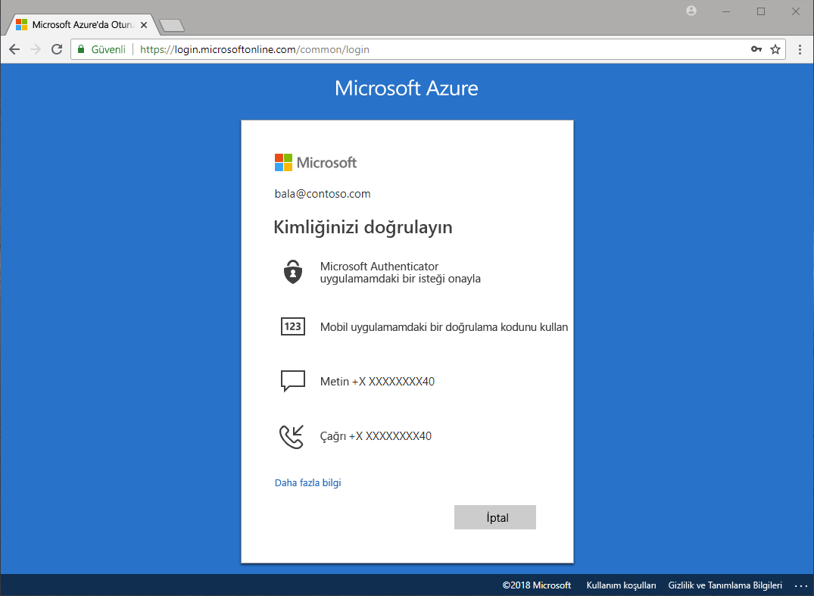

# Hangi kimlik doğrulama yöntemleri kullanılabilir?

Her gün çalınan parolalar ve gizliliği tehlikeye giren kimliklerle ilgili yeni haberler görüyoruz. Parolaya ek olarak ikinci bir adımın eklenmesi, kuruluşunuzun güvenliğini anında artıran yöntemlerden biridir. Microsoft Azure Active Directory (Azure AD), ek kimlik doğrulama yöntemleri ile yöneticilerin kuruluşlarının ve kullanıcılarının güvenliğini korumasına yardımcı olmak için Azure Multi-Factor Authentication (Azure MFA) ve Azure AD self servis parola sıfırlama (SSPR) gibi özellikler sunmaktadır.

Dahil birçok senaryo vardır: Windows Hello ve diğerleri etkinleştirme parolasını sıfırlama bir uygulamada oturum açarken, kullanıcılarınızın ek doğrulama kimin söyledikleri olmalarını sağlamak için istenebilir.

Ek doğrulama adımları aşağıdaki gibi kimlik doğrulama yöntemleri olabilir:

* E-posta veya SMS ile iletilen bir kod
* Telefon araması
* Telefona gelen bildirim veya kod
* Güvenlik sorularını yanıtlama

Azure MFA ve Azure AD self servis parola sıfırlama özellikleri, yöneticilerin kuruluşlarını korumak için Azure AD ve Azure portal kullanarak yapılandırma, ilke, izleme ve raporlama konularında denetim sahibi olmasını sağlar.

## Self servis parola sıfırlama

Self servis parola sıfırlama, kullanıcıların istediği yerden ve istediği zaman yönetici müdahalesi olmadan parolalarını sıfırlamasını sağlar.

> [!VIDEO https://www.youtube.com/embed/hc97Yx5PJiM]

Self servis parola sıfırlama şu adımlardan oluşur:

* **Parola değiştirme:** Parolamı biliyorum, ancak yeni bir şeyle değiştirmek istediğiniz bildirimi.
* **Parola sıfırlama:** Ben oturum açamaz ve bir veya daha fazla onaylanmış kimlik doğrulama yöntemleri kullanan parolamı sıfırlamak istiyor.
* **Hesap kilidinizi açın:** Hesabımı kilitli ve bir veya daha fazla onaylanmış kimlik doğrulama yöntemleri kullanarak kilidini açmak istediğiniz olduğundan oturum açamıyorum.

## Multi-Factor Authentication

Azure Multi-Factor Authentication (MFA) Microsoft'un iki adımlı doğrulama çözümüdür. Yönetici onaylı kimlik doğrulama yöntemlerini kullanan Azure MFA, oturum açma sürecini karmaşık hale getirmeden verilerinize ve uygulamalarınıza erişimin güvenli hale getirilmesine yardımcı olur.

## Lisans gereksinimleri

[!INCLUDE [Active Directory P1 license](../../../includes/active-directory-p1-license.md)]

## Sonraki adımlar

Bir sonraki adım self servis parola sıfırlama ve Azure Multi-Factor Authentication özelliklerini ayrıntılı bir şekilde incelemek ve yapılandırmak olacaktır.

Self servis parola sıfırlama özelliğini kullanmaya başlamak için bkz. [SSPR 'yi etkinleştirme hızlı başlangıç makalesi](quickstart-sspr.md).

Self Servis parola sıfırlama makalede hakkında daha fazla bilgi [nasıl çalışır: Azure AD Self Servis parola sıfırlama](concept-sspr-howitworks.md)

Makalede, Azure multi-Factor Authentication hakkında daha fazla bilgi edinin [nasıl çalışır: Azure Multi-Factor Authentication](concept-mfa-howitworks.md)
