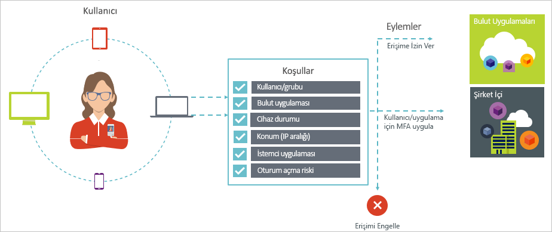
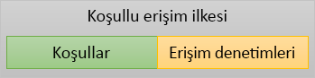

# Azure Active Directory'de koşullu erişim nedir?

Bulutu kullanan kuruluşlar için en önemli konu güvenliktir. Bulut kaynaklarınızı yönetmek söz konusu olduğunda, bulut güvenliğinin temel etmenlerinden biri güvenlik ve kimliktir. Mobil ve bulut öncelikli bir dünyada kullanıcılar, kuruluşunuzun kaynaklarına erişmek için farklı konumlardan farklı cihazlar ve uygulamalar kullanabilir. Bunun sonucunda artık yalnızca bir kaynağa erişim sağlayabilecek kullanıcılara odaklanmak yeterli değildir. Güvenlik ve üretkenlik arasındaki dengeyi kurmak için, erişim denetimi kararı sırasında bir kaynağa erişim şeklini de dikkate almanız gerekir. Azure Active Directory (Azure AD) koşullu erişim ile bu gereksinimleri karşılayabilirsiniz. Koşullu erişim, Azure Active Directory tarafından sunulan bir özelliktir. Koşullu erişim sayesinde, bulut uygulamalarınıza erişim sağlamak için koşullara bağlı otomatik erişim denetimi kararları uygulayabilirsiniz. 

Koşullu erişim ilkeleri, ilk-faktörlü kimlik doğrulaması tamamlandıktan sonra uygulanır. Bu nedenle, koşullu erişim, hizmet reddi (DoS) saldırıları gibi senaryolar için ilk satırı savunma olarak tasarlanmamıştır, ancak bu olaylar (örneğin oturum açma risk düzeyini, konum isteği ve benzeri) gelen sinyalleri erişimini belirlemek için kullanabilir.  

Bu makalede Azure AD'deki koşullu erişim özelliklerine kavramsal genel bakış sağlanır.

## Genel senaryolar

Mobil ve bulut öncelikli bir dünyada Azure Active Directory cihazlarda, uygulamalarda ve hizmetlerde tüm konumlardan çoklu oturum açma özelliğinin kullanılmasını sağlar. Cihaz kullanımı (KCG dahil), kuruluş ağı dışında çalışma ve üçüncü taraf SaaS uygulamaları arttıkça iki hedefle karşılaşırsınız:

- Kullanıcıların her yerde ve her zaman üretken olmasını sağlama
- Kuruluş varlıklarını her zaman koruma altında tutma

Koşullu erişim ilkelerini kullanarak gerekli koşullarda doğru erişim denetimlerini uygulayabilirsiniz. Azure AD koşullu erişimi, gerekli olduğunda ek güvenlik katmanı sağlar ve gerekli olmadığında kullanıcınızın işini zorlaştırmaz. 

Erişim konusunda sıkça akla takılan ve koşullu erişimin yardımcı olabileceği konulardan bazıları şunlardır:

- **[Oturum açma riski](conditions.md#sign-in-risk)**: Azure AD kimlik koruması, oturum açma riskleri algılar. Oturum açma riskinin kötü niyetli bir kullanıcıyı işaret ettiği durumda erişimi nasıl sınırlarsınız? Oturumun açma işleminin doğru kullanıcı tarafından gerçekleştirilmiş olduğuna dair daha kuvvetli bir kanıta ihtiyaç duyarsanız ne olur? Şüpheleriniz, belirli kullanıcıların bir uygulamaya erişimini engelleyecek kadar kuvvetliyse ne yapmalısınız?  

- **[Ağ konumu](location-condition.md)**: Azure AD her yerden erişilebilir. BT departmanınızın denetimi altında olmayan bir ağ konumundan erişim girişimi gerçekleştirilirse ne olur? Kullanıcı adı ve parola bileşimi, kuruluş ağınızdan yapılan erişim denemelerinde kimliğinizi kanıtlamaya yeterli olabilir. Peki dünya üzerindeki diğer beklenmeyen ülkelerden veya bölgelerden başlatılan erişim girişimleri için daha kuvvetli bir kimlik kanıtına ihtiyaç duyuyorsanız? Belirli konumlardan erişim girişimlerini tamamen engellemek isterseniz ne yapmalısınız?  

- **[Cihaz Yönetimi](conditions.md#device-platforms)**: Azure AD'de, bulut uygulamaları dahil olmak üzere mobil cihazları hem de kişisel cihazları geniş aralığından kullanıcılar erişebilir. Peki ya erişim denemelerinin yalnızca BT departmanınız tarafından yönetilen cihazlardan gerçekleştirilmesini isterseniz? Peki ya belirli cihaz türlerinin ortamınızdaki bulut uygulamalarına erişmesini engellemek isterseniz? 

- **[İstemci uygulaması](conditions.md#client-apps)**: Günümüzde, çok sayıda bulut uygulamaları, web tabanlı uygulamalar, mobil uygulamalar ve Masaüstü uygulamaları gibi farklı uygulama türlerini kullanarak erişebilirsiniz. Peki bilinen sorunlara yol açan türde bir istemci uygulaması kullanılarak erişim girişimi gerçekleştirilirse ne olur? Belirli uygulama türleri için BT departmanınız tarafından yönetilen bir cihazı şart koşmak istiyorsanız ne yapmalısınız? 

Bu sorular ve yanıtları, Azure AD koşullu erişim özelliğinin yaygın erişim senaryolarını oluşturmaktadır. Azure Active Directory'nin koşullu erişim özelliği, senaryoları ilke tabanlı bir yaklaşımla ele almanızı sağlar.

  

> [!VIDEO https://www.youtube.com/embed/eLAYBwjCGoA]

## Koşullu erişim ilkeleri

Koşullu erişim ilkesi, aşağıdaki modeli kullanan bir erişim senaryosunun tanımıdır:

**Ardından bunu yap**, ilkenizin yanıtını belirtir. Koşullu erişim ilkesinin amacının bir bulut uygulamasına erişim sağlamak olmadığını anlamanız önemlidir. Azure AD'de bulut uygulamalarına erişim izni verme işlemi, kullanıcı atamaları ile gerçekleştirilir. Koşullu erişim ilkesiyle yetkili kullanıcıların (bulut uygulamasına erişim izni verilmiş olan kullanıcıların) bulut uygulamalarına belirli koşullarda nasıl erişebileceğini denetlersiniz. Yanıt olarak çok faktörlü kimlik doğrulaması, yönetilen cihaz ve diğerleri gibi ek gereksinimlerin uygulanmasını sağlayabilirsiniz. Azure AD koşullu erişim bağlamında ilkenizin uyguladığı gereksinimler, erişim denetimleri olarak adlandırılır. İlkeniz, en kısıtlayıcı düzeyde erişimi engelleyebilir. Daha fazla bilgi için bkz. [Azure Active Directory koşullu erişim özelliğindeki erişim denetimleri](controls.md).
     

**Bu ortaya çıktığında**, ilkenizin tetiklenme nedenini tanımlar. Neden, karşılanan bir koşul grubu ile belirlenir. Azure AD koşullu erişim özelliğinde iki atama koşulu özel bir role sahiptir:

- **[Kullanıcılar](conditions.md#users-and-groups)**: Erişim denemesi gerçekleştiren kullanıcıları (**kimin**). 

- **[Bulut uygulamaları](conditions.md#cloud-apps)**: Erişim denemesi hedefleri (**ne**).    

Bu iki koşulun, koşullu erişim ilkesinde kullanılması zorunludur. Bu iki zorunlu koşula ek olarak, erişim girişiminin gerçekleştirilme şeklini açıklayan ek koşullar da kullanabilirsiniz. Mobil cihazların veya kuruluş ağınızın dışındaki konumların kullanılması, yaygın örnekler arasında sayılabilir. Daha fazla bilgi için bkz. [Azure Active Directory koşullu erişim özelliğindeki koşullar](conditions.md).   

Koşullar ile erişim denetimleriniz bir araya gelerek koşullu erişim ilkelerini oluşturur. 

Azure AD koşullu erişim özelliğini kullanarak yetkili kullanıcıların bulut uygulamalarınıza nasıl erişeceğini denetleyebilirsiniz. Bir koşullu erişim ilkesinin amacı, gerçekleştirilme şekline göre bir bulut uygulaması erişim girişimine ek erişim denetimleri uygulamaktır.

Bulut uygulamalarınıza erişimi korumak için ilke tabanlı bir yaklaşım kullanmak, ortamınızın ilke gereksinimlerini işin teknik boyutu konusunda kaygılanmadan bu makalede ana hatları belirlenen yapıyı kullanarak belirlemeye başlamanızı sağlar. 

## Azure AD koşullu erişim ve federe kimlik doğrulaması

Koşullu erişim ilkeleri [federe kimlik doğrulaması](../../security/azure-ad-choose-authn.md#federated-authentication) ile sorunsuz bir şekilde çalışır. Bu desteğe, desteklenen tüm koşul ve denetimler ve [Azure AD raporlaması](../reports-monitoring/concept-sign-ins.md)'nı kullanarak ilkenin etkin kullanıcı oturum açmalarına nasıl uygulandığını görebilme de dahildir.

*Azure AD ile federe kimlik doğrulaması*, Azure AD kullanıcı kimliği doğrulamalarının tümünün güvenilen bir kimlik doğrulama hizmeti tarafından halledilmesi anlamına gelir. Güvenilen bir kimlik doğrulama hizmeti; örneğin Active Directory Federasyon Hizmetleri (AD FS) ya da başka bir Federasyon Hizmetidir. Bu yapılandırmada birincil kullanıcı kimlik doğrulaması hizmette gerçekleştirilir, sonra bireysel uygulamalarda oturum için Azure AD kullanılır. Azure AD koşullu erişimi, kullanıcının eriştiği uygulamaya erişim verilmeden önce uygulanır. 

Yapılandırılmış koşullu erişim ilkesi çok faktörlü kimlik doğrulaması gerektirdiğinde Azure AD varsayılan olarak Azure MFA'yı kullanır. MFA için federasyon hizmetini kullanıyorsanız, [PowerShell](https://docs.microsoft.com/powershell/module/msonline/set-msoldomainfederationsettings)'de `-SupportsMFA` değerini `$true` yaparak Azure AD'yi MFA gerektiğinde federasyon hizmetine yönlenecek şekilde yapılandırabilirsiniz. Bu ayar, Azure AD tarafından `wauth= http://schemas.microsoft.com/claims/multipleauthn` kullanılarak gönderilen MFA sınama isteğini destekleyen federe kimlik doğrulama hizmetleri içindir.

Kullanıcı federe kimlik doğrulama hizmetinde oturum açtıktan sonra Azure AD, cihaz uyumluluğu ya da uygulamanın onaylanmış olması gibi diğer ilke gereksinimlerini halleder.

## Koşullu erişim kullanımı için lisans gereksinimleri

Koşullu erişimi kullanabilmek için Azure AD Premium lisansına ihtiyacınız vardır. Gereksinimlerinize uygun lisansı bulmak için bkz. [Ücretsiz, Temel ve Premium sürümlerinin genel olarak sağlanan özelliklerini karşılaştırma](https://azure.microsoft.com/pricing/details/active-directory/).

## Sonraki adımlar

Koşullu erişim, ortamınızda uygulama hakkında bilgi edinmek için bkz: [Azure Active Directory'de koşullu erişim dağıtımınızı planlama](plan-conditional-access.md).

