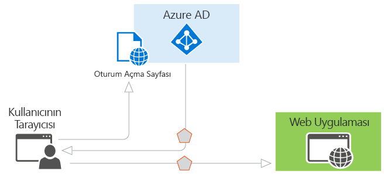

# Azure AD için kimlik doğrulama senaryoları

Azure Active Directory (Azure AD) olarak yardımcı olması farklı platformlar için bir OAuth 2.0 ve Openıd Connect gibi endüstri standardı protokoller için desteği ile hizmet yanı sıra açık kaynak kitaplıkları kimlik sağlayarak geliştiriciler için kimlik doğrulaması kolaylaştırır hızlı bir şekilde kodlamaya başlayın. Bu makalede, çeşitli senaryolarda Azure AD'ye destekler anlama ve kullanmaya nasıl başlayacağınızı Göster yardımcı olur. Bunu yapmak için aşağıdaki bölümlere ayrılmıştır:

* [Azure AD'de kimlik doğrulaması temelleri](#basics-of-authentication-in-azure-ad)
* [Azure AD güvenlik belirteçlere talep](#claims-in-azure-ad-security-tokens)
* [Bir uygulamayı Azure AD'ye kaydetme temelleri](#basics-of-registering-an-application-in-azure-ad)
* [Uygulama türleri ve senaryolar](#application-types-and-scenarios)

  * [Web uygulamasına Web tarayıcısı](#web-browser-to-web-application)
  * [Tek sayfalı uygulama (SPA)](#single-page-application-spa)
  * [Web API'si için yerel uygulama](#native-application-to-web-api)
  * [Web uygulaması web API'si](#web-application-to-web-api)
  * [Web API arka plan programı veya sunucu uygulaması](#daemon-or-server-application-to-web-api)

## Azure AD'de kimlik doğrulaması temelleri

Azure AD'de kimlik doğrulaması temel kavramlarını sahibi değilseniz, bu bölümü okuyun. Aksi halde, atlamak aşağı isteyebilirsiniz [uygulama türleri ve senaryolar](#application-types-and-scenarios).

Kimlik gereklidir burada en temel senaryo düşünelim: bir web tarayıcısında bir kullanıcının bir web uygulaması için kimlik doğrulaması gerekir. Bu senaryo daha ayrıntılı olarak açıklanan [web uygulamasına Web tarayıcısı](#web-browser-to-web-application) bölümü, ancak kullanıcının Azure AD özelliklerini göstermek ve senaryoyu nasıl çalıştığını kavramsallaştırmanın için kullanışlı bir başlangıç noktası. Bu senaryo için aşağıdaki çizime göz önünde bulundurun:

Yukarıdaki diyagramda ile unutmayın, işte çeşitli bileşenleri hakkında bilmeniz gerekenler:

* Azure AD kimlik, kullanıcı ve kuruluşun dizininde mevcut uygulamaların kimlik doğrulama ve sonuçta bu kullanıcılar ve uygulamalar, başarılı kimlik doğrulamadan sonra güvenlik belirteçleri verme sorumlu sağlayıcıdır.
* Azure AD kimlik dış isteyen uygulamaya kaydeder ve uygulamayı dizininde benzersiz olarak tanıtan Azure AD'de kayıtlı olması gerekir.
* Geliştiriciler, kimlik doğrulama protokolü ayrıntıları işleyerek kolaylaştıran açık kaynaklı Azure AD kimlik doğrulama kitaplıkları kullanabilirsiniz. Daha fazla bilgi için [Azure Active Directory kimlik doğrulama kitaplıkları](active-directory-authentication-libraries.md).
* Uygulama, bir kullanıcının kimliği doğrulandıktan sonra söz konusu kimlik doğrulamasını başarılı olmak için kullanıcının güvenlik belirteci doğrulamanız gerekir. Uygulama çeşitli diller ve çerçeveler yapmalısınız örneklerin sahibiz [GitHub](https://github.com/Azure-Samples?q=active-directory). Bir ASP.NET web uygulaması derliyorsanız bkz [oturum açmak için bir ASP.NET web uygulaması Kılavuzu ekleme](https://docs.microsoft.com/en-us/azure/active-directory/develop/guidedsetups/active-directory-aspnetwebapp). Bir web API'si kaynağına ASP.NET'te oluşturuyorsanız, bkz. [web API'si ile çalışmaya başlama Kılavuzu](https://docs.microsoft.com/en-us/azure/active-directory/develop/active-directory-devquickstarts-webapi-dotnet).
* İsteklerin ve yanıtların kimlik doğrulama sürecine akışı, OAuth 2.0 gibi Openıd Connect, kullanılan kimlik doğrulama protokolü belirlenir SAML 2.0 veya WS-Federation. Bu protokollerin daha ayrıntılı olarak ele alınmıştır [Azure Active Directory kimlik doğrulama protokolleri](active-directory-authentication-protocols.md) makale ve aşağıdaki bölümler.

> [!NOTE]
> Azure AD OAuth 2.0 destekler ve taşıyıcı belirteçler, taşıyıcı belirteçleri Jwt'ler temsil dahil olmak üzere kapsamlı olun, Openıd Connect standartları kullanın. A *taşıyıcı belirteç* korumalı bir kaynağın "bearer" erişim veren bir basit güvenlik belirtecidir. Bu anlamda belirteç sunabilir herhangi bir tarafa "bearer" olur. Gerekli adımları iletilmesini ve depolanmasını belirteci güvenliğini sağlamak için alınır değil, bir tarafın ilk taşıyıcı belirteç almak için Azure AD kimlik doğrulaması gerekir ancak kesildi ve istenmeyen bir şahıs tarafından kullanılır. Bazı güvenlik belirteçleri yetkisiz taraflar bunları tüketmesini için yerleşik bir mekanizma olsa da, taşıyıcı belirteçleri Bu mekanizma yoktur ve Aktarım Katmanı Güvenliği (HTTPS) gibi güvenli bir kanal taşınan gerekir. Açık bir şekilde bir taşıyıcı belirteç iletilirse, bir adam-de-ortadaki adam saldırısı belirteci almak ve korumalı kaynağa yetkisiz erişim için kullanmak üzere kötü amaçlı bir şahıs tarafından kullanılabilir. Depolama veya daha sonra kullanmak için taşıyıcı belirteçlerini önbelleğe alma aynı güvenlik ilkeleri uygulayın. Uygulamanızı iletir ve güvenli bir şekilde taşıyıcı belirteçleri depolar her zaman emin olmalısınız. Taşıyıcı belirteçleri hakkında daha fazla güvenlik konuları için bkz. [RFC 6750 bölüm 5](http://tools.ietf.org/html/rfc6750).

Temel bakış olduğuna göre Azure AD'de nasıl sağlama çalışır ve Azure AD destekleyen ortak senaryolar anlamak için aşağıdaki bölümleri okuyun.

## Azure AD güvenlik belirteçlere talep

Azure AD tarafından verilen güvenlik belirteçleri (erişim ve kimlik belirteçlerini) talep veya onayları doğrulandıktan sonra konu hakkında bilgi içerir. Bu talep, çeşitli görevler için uygulama tarafından kullanılabilir. Örneğin, uygulamalar, talep belirteci doğrulamak, öznenin directory kiracısını tanımlamak, kullanıcı bilgilerini görüntülemek, öznenin yetkilendirme belirlemek ve benzeri için kullanabilirsiniz. Herhangi belirli güvenlik belirtecinde talep belirteci, kullanıcı ve uygulama yapılandırmasını doğrulamak için kullanılan kimlik bilgisi türünü türüne bağlıdır. Aşağıdaki tabloda her bir Azure AD tarafından yayılan talep türünü kısa bir açıklaması sağlanmaktadır. Daha fazla bilgi için [desteklenen belirteç ve talep türleri](active-directory-token-and-claims.md).

| İste | Açıklama |
| --- | --- |
| Uygulama Kimliği | Belirteci kullanarak uygulamayı tanımlar. |
| Hedef kitle | Belirteç için hedeflenen alıcı kaynağı tanımlar. |
| Uygulama kimlik doğrulaması bağlamı sınıf başvurusu | İstemci kimliği doğrulanmış (genel istemci-gizli istemci) nasıldı gösterir. |
| Anında kimlik doğrulaması | Kimlik doğrulaması oluştuğu saat ve tarihi kaydeder. |
| Kimlik Doğrulama Yöntemi | Belirtecin konu kimliğinin nasıl gösterir (parola, sertifika, vb.). |
| Ad | Kullanıcının verilen adı Azure AD'de sunmaktadır. |
| Gruplar | Kullanıcının üyesi olduğu nesne kimlikleri, Azure AD gruplarını içerir. |
| Kimlik Sağlayıcısı | Belirtecin konu kimliği doğrulanmış kimlik sağlayıcısı olarak kaydeder. |
| Çıkışı | Belirteç, belirteç yenilik için sık kullanılan düzenlendiği süreyi kaydeder. |
| Sertifikayı Veren | Belirteç, hem de Azure AD kiracısını yayılan STS tanımlar. |
| Soyadı | Kullanıcının soyadı, Azure AD'de kümesi sağlar. |
| Ad | Belirtecin konu tanımlayan bir insan tarafından okunabilir değer sağlar. |
| Nesne kimliği | Azure AD'de bir değişmez ve benzersiz tanımlayıcı konu içerir. |
| Roller | Kullanıcıya izni Azure AD uygulama rolleri kolay adlarını içerir. |
| Kapsam | İstemci uygulamaya verilen izinleri belirtir. |
| Konu | Sorumlu olduğu hakkında bilgi belirteci onaylar gösterir. |
| Kiracı Kimliği | Belirteci veren directory kiracısının sabit, benzersiz bir tanımlayıcı içerir. |
| Belirteç ömrü | Bir belirtecin geçerli olduğu zaman aralığını tanımlar. |
| Kullanıcı Asıl Adı | Konu kullanıcı asıl adını içerir. |
| Sürüm | Belirteç sürüm numarasını içerir. |

## Bir uygulamayı Azure AD'ye kaydetme temelleri

Azure AD kimlik outsources herhangi bir uygulama bir dizinde kayıtlı olması gerekir. Bu adım, Azure AD'ye nerede, kimlik doğrulamasından sonra uygulamanızı tanımlamak için URI yanıtların gönderileceği URL URL'si dahil olmak üzere, uygulamanızla ilgili belirten içerir. Bu bilgiler, birkaç önemli nedenden dolayı gereklidir:

* Azure AD oturum açma veya alışverişi belirteçleri işlerken uygulama ile iletişim kurması gerekir. Bilgiler, Azure AD arasında geçirilen ve uygulama şunları içerir:
  
  * **Uygulama Kimliği URI'si** -bir uygulama için tanımlayıcı. Bu değer, hangi uygulamanın arayan için bir belirteç istediği göstermek için Azure ad kimlik doğrulaması sırasında gönderilir. Ayrıca, böylece uygulamayı, istenen hedef olduğunu bilir bu değer belirtece dahildir.
  * **Yanıt URL'si** ve **yeniden yönlendirme URI'si** -bir web API'si veya web uygulaması için yanıt URL'si Azure AD kimlik doğrulaması başarılı olursa, bir belirteç de kimlik doğrulaması yanıtını gönderir burada konumdur. Yerel bir uygulama için yeniden yönlendirme URI'si, Azure AD bir OAuth 2.0 isteğindeki kullanıcı aracısını yönlendireceği bir benzersiz bir tanımlayıcıdır.
  * **Uygulama Kimliği** -uygulamanın kayıtlı ne zaman Azure AD tarafından oluşturulan bir uygulama için kimliği. Bir yetkilendirme kodunu veya belirteci isteğinde bulunurken uygulama kimliği ve anahtarı Azure AD'ye kimlik doğrulaması sırasında gönderilir.
  * **Anahtar** -bir uygulama kimliği ile birlikte kimlik doğrulaması yapılırken Azure AD ile bir web API'sini çağırmak için gönderilen anahtarı.
* Azure AD uygulama dizin verilerinize, kuruluşunuzdaki diğer uygulamaların erişmek üzere gerekli izinlere sahip olduğundan emin olmak gerekir.

Geliştirilen ve Azure AD ile tümleştirilmiş uygulamalar iki kategorisi vardır anladığınızda sağlama daha anlaşılır hale gelir:

* **Tek kiracılı uygulama** -tek kiracılı bir uygulama bir kuruluş içinde kullanıma yöneliktir. Bir kurumsal geliştirici tarafından yazılan genellikle satır iş kolu (LoB) uygulamaları şunlardır. Tek kiracılı bir uygulama yalnızca bir dizindeki kullanıcılar tarafından erişilmesi gereken ve sonuç olarak, yalnızca bir dizinde sağlanması gerekir. Bu uygulamalar, genellikle kuruluştaki bir geliştirici tarafından kaydedilir.
* **Çok kiracılı uygulama** -çok kiracılı bir uygulama pek çok kuruluşta, kullanım için tasarlanmamış yalnızca bir kuruluş. Bir bağımsız yazılım satıcısı (ISV) tarafından yazılan genellikle yazılım olarak-hizmet (SaaS) uygulamalarıyla şunlardır. Çok kiracılı uygulamaları, bunları kaydetmek için kullanıcı veya yönetici onayı gerektiren nerede bunlar kullanılır, her dizinde sağlanması gerekir. Bir uygulama dizinde kayıtlı ve Graph API'sini ya da belki başka bir web API'si için erişim verilir, bu onay işlemini başlatır. Bir kullanıcı veya farklı bir kuruluşun Yöneticisi uygulamasını kullanmak oturum açtığında, onlara uygulama izinleri görüntüleyen bir iletişim kutusu ile gösterilir. Kullanıcı veya yönetici belirtilen uygulama erişmesini sağlayan ve son olarak, dizinde uygulama kaydeder uygulamaya sonra onay verebilir. Daha fazla bilgi için [onay Framework'ün genel bakış](quickstart-v1-integrate-apps-with-azure-ad.md#overview-of-the-consent-framework).

### Tek bir kiracı veya çok kiracılı uygulamalar geliştirirken dikkat edilecek diğer noktalar
Bazı ek hususlar, çok kiracılı bir uygulama yerine tek kiracılı bir uygulama geliştirirken ortaya çıkar. Örneğin, uygulamanızın kullanılabilir birden çok dizini kullanıcılara yapıyorsanız, hangi Kiracı belirlemek için bir mekanizma gerekir bulundukları. Tek kiracılı bir uygulama, yalnızca kendi dizinde bir kullanıcının Azure AD'de belirli bir kullanıcı tarafından tüm dizinleri tanımlamak çok kiracılı bir uygulama gereksinimlerini aramak gerekir. Bu görevi gerçekleştirmek için Azure AD oturum açma istekleri bir kiracıya özgü uç nokta yerine herhangi bir çok kiracılı Uygulama yeri yönlendirebilir ortak bir kimlik doğrulama uç noktası sağlar. Bu uç nokta https://login.microsoftonline.com/common Azure AD'de, tüm dizinler için bir kiracıya özgü uç nokta olabilir ancak https://login.microsoftonline.com/contoso.onmicrosoft.com. Ortak uç nokta, oturum açma, oturum kapatma ve belirteç doğrulama sırasında birden fazla Kiracı işlemek için gerekli mantığı gerekeceği için Uygulamanızı geliştirirken dikkat edilmesi özellikle önemlidir.

Şu anda tek kiracılı bir uygulama geliştiriyorsanız, ancak çoğu kuruluş için kullanılabilir hale getirmek istediğiniz kolayca uygulama ve çok kiracılı sağlamak üzere Azure AD yapılandırmasında için özellikli değişiklik yapabilirsiniz. Ayrıca, tek bir kiracı veya çok kiracılı uygulamada kimlik doğrulaması sağlanmaktadır olup olmadığını Azure AD tüm dizinlerdeki tüm belirteçler aynı imzalama anahtarı kullanır.

Bu belgede listelenen her bir senaryo sağlama gereksinimleri tanımlayan bir alt içerir. Azure AD'de bir uygulama yanı sıra tek ve çok kiracılı uygulamaları arasındaki farklar sağlama hakkında daha ayrıntılı bilgi için bkz. [uygulamaları Azure Active Directory ile tümleştirme](quickstart-v1-integrate-apps-with-azure-ad.md) daha fazla bilgi için. Azure AD'de genel uygulama senaryolarının anlamak için okumaya devam edin.

## Uygulama türleri ve senaryolar

Burada açıklanan senaryoların her biri, çeşitli dilleri ve platformları kullanarak geliştirilebilir. Bunlar tüm bulunan tam kod örnekleri tarafından desteklenen [kod örneklerini kılavuz](active-directory-code-samples.md), veya doğrudan ilgili [GitHub örnek depoları](https://github.com/Azure-Samples?q=active-directory). Uygulamanızın belirli bir parça veya bir uçtan uca senaryo segmentini gerekiyorsa, ek olarak, çoğu durumda bu işlevselliği bağımsız olarak eklenebilir. Örneğin, bir web API'si çağıran bir yerel bir uygulamanız varsa, web API'si çağıran bir web uygulamasını kolayca ekleyebilirsiniz. Aşağıdaki diyagram bu senaryoları ve uygulama türleri gösterir ve ne kadar farklı bileşenleri eklenebilir:

Azure AD tarafından desteklenen beş birincil uygulama senaryoları şunlardır:

* [Web uygulamasına Web tarayıcısı](#web-browser-to-web-application): bir kullanıcı Azure AD tarafından güvenliği sağlanan bir web uygulamasına oturum açması gerekiyor.
* [Tek sayfa uygulama (SPA)](#single-page-application-spa): bir kullanıcı Azure AD tarafından güvenliği sağlanan bir tek sayfalı bir uygulamada oturum açması gerekiyor.
* [Web API'si yerel uygulamaya](#native-application-to-web-api): telefon, tablet veya PC çalıştıran yerel bir uygulama bir Web API'si Azure AD tarafından güvenli hale getirilen kaynakları almak için bir kullanıcının kimliğini doğrulaması gerektiğinde.
* [Web uygulaması web API'si için](#web-application-to-web-api): bir Web API'si Azure AD tarafından güvenliği sağlanan kaynakları almak bir web uygulaması gerekir.
* [Web API arka plan programı ya da sunucu uygulamasında](#daemon-or-server-application-to-web-api): bir Web API'si Azure AD tarafından güvenliği sağlanan kaynakları almak bir arka plan programı uygulaması veya web kullanıcı arabirimi ile bir sunucu uygulaması gerekir.

### Web uygulamasına Web tarayıcısı

Bu bölümde, bir kullanıcının bir web uygulaması için bir web tarayıcısında kimlik uygulamanın açıklanmaktadır. Bu senaryoda, Azure AD'de oturum açmak için kullanıcının tarayıcısına web uygulamasının yönlendirir. Azure AD oturum açma yanıt içeren bir güvenlik belirteci kullanıcı hakkında talepler kullanıcının tarayıcısından döndürür. Bu senaryo, WS-Federation, SAML 2.0 ve Openıd Connect protokolleri kullanarak oturum açmayı destekler.

#### Diyagram

#### Protokolü akış açıklaması

1. Bir kullanıcı oturum açmak için gereksinimleri ve uygulama ziyaret ettiğinde, bir oturum açma isteği için kimlik doğrulama uç noktası aracılığıyla Azure AD'de yönlendirilir.
1. Oturum açma sayfasında oturum açtığında kullanıcı.
1. Kimlik doğrulaması başarılı olursa, Azure AD kimlik doğrulama belirteci oluşturur ve uygulamanın yanıt URL'si Azure portalında yapılandırılmış bir oturum açma yanıtı döndürür. Bir üretim uygulaması için bu yanıt URL'si HTTPS olmalıdır. Döndürülen belirteç, Azure AD ve kullanıcı belirteci doğrulamak için uygulama tarafından gerekli olan talepleri içerir.
1. Uygulama, bir ortak imzalama anahtar ve veren bilgi kullanılabilir Azure AD için Federasyon meta veri belge kullanarak belirteci doğrular. Uygulama belirteci doğruladıktan sonra kullanıcı ile yeni bir oturum başlatır. Bu oturumun süresi sona erene kadar uygulamaya erişmek kullanıcı izin verir.

#### Kod örnekleri

Kod örnekleri için Web tarayıcısı Web uygulaması senaryoları için bkz. Ve sıkça tekrar kontrol edin; yeni örnekleri sık eklenir. [Web uygulaması](active-directory-code-samples.md#web-applications).

#### Kaydediliyor

* Tek Kiracılı: yalnızca kuruluşunuz için bir uygulama oluşturuyorsanız, bunu şirketinizin dizininde Azure portalını kullanarak kayıtlı olması gerekir.
* Çok Kiracılı: kuruluşunuzun dışındaki kullanıcılar tarafından kullanılabilen bir uygulama oluşturuyorsanız bunu şirketinizin dizinde kayıtlı olması gerekir, ancak uygulamayı kullanarak her kuruluşun dizininde da kayıtlı olması gerekir. Uygulamanızı directory'lerinde kullanılabilir hale getirme için uygulamanıza onay verme tanıyan müşterileriniz için bir kayıt işlemi dahil edebilirsiniz. Bunlar, uygulamanız için oturum açarken uygulama izinleri gösteren bir iletişim kutusu, ardından onay seçeneği ile sunulur. Gerekli izinlere bağlı olarak diğer kuruluştaki bir yöneticisinin izni vermek için gerekebilir. Kullanıcı veya yönetici onay verdiğinde, uygulama, dizinde kayıtlı. Daha fazla bilgi için [uygulamaları Azure Active Directory ile tümleştirme](quickstart-v1-integrate-apps-with-azure-ad.md).

#### Belirteç süre sonu

Azure AD tarafından verilen belirtecin süresi dolduğunda, kullanıcının oturum sona erer. Uygulamanızı bir işlem yapılmadan geçen süre üzerinde bağlı olarak kullanıcılara imzalama gibi isterseniz, bu süre içinde kısaltabilirsiniz. Oturumun süresi dolduğunda, kullanıcı yeniden oturum açmanız istenir.

### Tek sayfalı uygulama (SPA)

Bu bölümde, web API geri son güvenliğini sağlamak için Azure AD kullanır ve OAuth 2.0 örtük yetkilendirme izni tek sayfa uygulaması için kimlik doğrulaması açıklanmaktadır. Tek sayfa uygulamaları, genellikle uygulamanın iş mantığını uygular ve çalıştıran bir sunucuya bir Web API arka ucu ve tarayıcı ile çalışan bir JavaScript sunu katmanı (ön uç) olarak yapılandırılmıştır. Örtük yetki verme hakkında daha fazla bilgi edinin ve Uygulama senaryonuz için doğru olup olmadığını karar vermenize yardımcı olması için bkz: [anlama OAuth2 örtük verme flow'da Azure Active Directory](active-directory-dev-understanding-oauth2-implicit-grant.md).

Bu senaryoda, kullanıcı oturum açtığında JavaScript'in ön uç kullanan [Active Directory Authentication Library (ADAL JavaScript için. JS)](https://github.com/AzureAD/azure-activedirectory-library-for-js) ve bir kimlik belirteci (id_token) Azure AD'den elde etmek için örtük yetki verme. Belirteç önbelleğe alınır ve istemci bunu isteği taşıyıcı belirteci olarak, Web API arka ucu, OWIN ara yazılımı kullanarak güvenliği çağrı yaparken ekler. 

#### Diyagram

#### Protokolü akış açıklaması

1. Kullanıcı, web uygulamasına gider.
1. Uygulamayı tarayıcıda JavaScript ön uç (sunu katmanı) döndürür.
1. Kullanıcı, oturum açma, örneğin bir oturum açma bağlantısına tıklayarak başlatır. Tarayıcı, bir kimlik belirteci istemek için Azure AD yetkilendirme uç noktası için bir GET gönderir. Bu istek sorgu parametrelerinde uygulama kimliği ve yanıt URL'sini içerir.
1. Azure AD yanıt URL'si Azure portalında yapılandırılmış kayıtlı yanıt URL'si karşı doğrular.
1. Oturum açma sayfasında oturum açtığında kullanıcı.
1. Kimlik doğrulaması başarılı olursa, Azure AD kimlik belirteci oluşturur ve uygulamanın yanıt URL'si için bir URL parçası belirtmesini (#) döndürür. Bir üretim uygulaması için bu yanıt URL'si HTTPS olmalıdır. Döndürülen belirteç, Azure AD ve kullanıcı belirteci doğrulamak için uygulama tarafından gerekli olan talepleri içerir.
1. Tarayıcıda çalışan JavaScript istemci kodu uygulamanın web API geri son çağrısına güvenliğini kullanılacak yanıt belirteç ayıklar.
1. Geri API ile kimlik belirteci yetkilendirme üst bilgisinde son uygulamanın web tarayıcı çağırır. Azure AD kimlik doğrulama hizmeti kaynak istemci kimliği ile aynı olduğunda, bir taşıyıcı belirteci kullanılabilir bir kimlik belirteci veren (uygulamanın kendi arka uç web API'si olduğu gibi bu durumda, true olur). 

#### Kod örnekleri

Tek sayfa uygulama (SPA) senaryoları için kod örneklere bakın. Geri sık sık kontrol etmeyi unutmayın--yeni örnekler sık eklenir. [Tek sayfalı uygulama (SPA)](active-directory-code-samples.md#single-page-applications).

#### Kaydediliyor

* Tek Kiracılı: yalnızca kuruluşunuz için bir uygulama oluşturuyorsanız, bunu şirketinizin dizininde Azure portalını kullanarak kayıtlı olması gerekir.
* Çok Kiracılı: kuruluşunuzun dışındaki kullanıcılar tarafından kullanılabilen bir uygulama oluşturuyorsanız bunu şirketinizin dizinde kayıtlı olması gerekir, ancak uygulamayı kullanarak her kuruluşun dizininde da kayıtlı olması gerekir. Uygulamanızı directory'lerinde kullanılabilir hale getirme için uygulamanıza onay verme tanıyan müşterileriniz için bir kayıt işlemi dahil edebilirsiniz. Bunlar, uygulamanız için oturum açarken uygulama izinleri gösteren bir iletişim kutusu, ardından onay seçeneği ile sunulur. Gerekli izinlere bağlı olarak diğer kuruluştaki bir yöneticisinin izni vermek için gerekebilir. Kullanıcı veya yönetici onay verdiğinde, uygulama, dizinde kayıtlı. Daha fazla bilgi için [uygulamaları Azure Active Directory ile tümleştirme](quickstart-v1-integrate-apps-with-azure-ad.md).

Uygulamayı kaydettikten sonra OAuth 2.0 örtülü izin protokolünü kullanmak için yapılandırılmalıdır. Varsayılan olarak, bu protokolü, uygulamalar için devre dışıdır. Uygulamanız için OAuth2 örtük verme Protokolü etkinleştirmek için Azure portalından, uygulama bildirimini düzenleme ve "oauth2AllowImplicitFlow" değeri true olarak ayarlayın. Ayrıntılı yönergeler için bkz. [etkinleştirme OAuth 2.0 örtülü izin tek sayfalı uygulamalar için](quickstart-v1-integrate-apps-with-azure-ad.md).

#### Belirteç süre sonu

İle ADAL.js kullanarak yardımcı olur:

* süresi dolmuş bir belirteç yenileniyor
* bir web API'si kaynağına çağırmak için bir erişim belirteci istenirken

Başarılı bir kimlik doğrulamasından sonra Azure AD, kullanıcının tarayıcısında oturum oluşturmak için bir tanımlama bilgisi yazar. Azure AD (arasında değil, kullanıcı ve web uygulaması) ve kullanıcı arasında oturum var unutmayın. Bir belirtecin süresi dolduğunda, ADAL.js sessizce farklı bir belirteç almak için bu oturumu kullanır. ADAL.js gizli bir iFrame OAuth örtük verme protokolü kullanarak istek alıp göndermek için kullanır. ADAL.js sessizce destek çıkış noktaları arası kaynak paylaşımı (CORS), bu kaynakları sürece uygulama çağırır ve diğer web API'si kaynaklarının kullanıcının dizinde kayıtlı ve tüm gerekli izni olan erişim belirteçleri almak için de aynı Bu mekanizma kullanabilirsiniz oturum açma sırasında kullanıcı tarafından verilir.

### Web API'si için yerel uygulama

Bu bölümde, bir kullanıcı adına bir web API'si çağıran bir yerel uygulamayı açıklar. Bu senaryo genel bir istemci ile OAuth 2.0 yetkilendirme kodu verme türü, 4.1 bölümünde anlatıldığı gibi üzerine inşa edilmiştir [OAuth 2.0 belirtimini](http://tools.ietf.org/html/rfc6749). Yerel uygulama OAuth 2.0 protokolünü kullanarak bu kullanıcı için bir erişim belirteci alır. Bu erişim belirteci daha sonra kullanıcı yetkisi verir ve istenen kaynağa döndüren API web isteği gönderilir.

#### Diyagram

#### Protokolü akış açıklaması

Protokol aşağıda açıklanan ayrıntıların birçoğu AD kimlik doğrulama kitaplıkları kullanıyorsanız, tarayıcı açılır pencere, belirteç önbelleğe alma ve yenileme belirteçleri işlenmesini gibi işlenir.

1. Yerel uygulama yetkilendirme uç noktası için Azure AD'de istekte açılan bir tarayıcı kullanarak. Bu istek, uygulama kimliği ve yeniden yönlendirme URI'si yerel uygulamanın gösterildiği Azure portalı ve web API'si için uygulama kimliği URI'si içerir. Kullanıcı zaten oturum taşınmadığından, bunlar yeniden oturum açmanız istenir
1. Azure AD, kullanıcının kimliğini doğrular. Çok kiracılı bir uygulama ise ve uygulamayı kullanma izni gereklidir, kullanıcı Bunlar zaten yapmadıysanız onay gerekecektir. Onay verme sonra ve başarılı kimlik doğrulamadan sonra bir yetkilendirme kodu yanıt istemci uygulamanın yeniden yönlendirme URI'si Azure AD'ye verir.
1. Azure AD dön yeniden yönlendirme URI'si bir yetkilendirme kodu yanıt verdiğinde, istemci uygulama tarayıcı etkileşimi durdurur ve yetkilendirme kodu yanıttan ayıklar. Bu yetkilendirme kodunu kullanarak, istemci uygulama bir istek yetki kodunu içerir, istemci uygulaması (uygulama kimliği ve yeniden yönlendirme URI'si) ve istenen kaynağın ayrıntıları Azure AD'nin belirteç uç noktası gönderir (uygulama kimliği URI'si için Web API'si için).
1. Yetkilendirme kodunu ve istemci uygulaması ve web API'si hakkında bilgi, Azure AD tarafından doğrulanır. Doğrulama başarıyla tamamlandıktan sonra Azure AD iki belirteçleri döndürür: JWT erişim belirteci ve JWT yenileme belirteci. Ayrıca, Azure AD, görünen adı ve Kiracı kimliği gibi kullanıcıyla ilgili temel bilgileri döndürür
1. HTTPS üzerinden istemci uygulama bir "Bearer" atama JWT dizesiyle isteğin yetkilendirme üst bilgisinde web API'sine eklemek için döndürülen JWT erişim belirtecini kullanır. Web API'si daha sonra JWT belirteci doğrular ve doğrulama başarılı olursa, istenen kaynak döndürür.
1. Erişim belirtecinin süresi dolduğunda, istemci uygulama, kullanıcının yeniden kimlik doğrulaması yapması belirten bir hata alırsınız. Uygulamanın geçerli yenileme belirteci varsa yeniden oturum açmak için kullanıcıya sormadan yeni bir erişim belirteci almak için kullanılabilir. Yenileme belirtecinin süresi dolarsa, uygulamanın etkileşimli kullanıcı yeniden kimlik doğrulaması yapmanız gerekir.

> [!NOTE]
> Azure AD tarafından verilen bir yenileme belirteci, birden çok kaynağa erişmek için kullanılabilir. Örneğin, iki web API'lerini çağırma izni olan bir istemci uygulaması varsa, yenileme belirtecini erişim diğer web API'sine de belirteci almak için kullanılabilir.

#### Kod örnekleri

Web API senaryoları için yerel uygulama için kod örneklere bakın. Ve sıkça tekrar kontrol edin - yeni örnekler sık ekleriz. [Web API'si yerel uygulamaya](active-directory-code-samples.md#desktop-and-mobile-public-client-applications-calling-microsoft-graph-or-a-web-api).

#### Kaydediliyor

* Tek Kiracılı: Hem yerel uygulama ve web API'si kaydedilmelidir aynı dizinde Azure AD'de. Web API'si, yerel uygulamanın kaynaklarına erişimi sınırlamak için kullanılan bir izin kümesi kullanıma sunmak için yapılandırılabilir. İstemci uygulama, Azure portalında "İzinleri için diğer uygulamaları" açılan menüsünden istenen izinleri seçer.
* Çok Kiracılı: İlk olarak, yerel uygulama her zaman sadece bir geliştirici veya yayımcının dizinde kayıtlı. İkinci olarak, yerel uygulama işlevsel olmasını gerektiren izinleri belirtmek için yapılandırılır. Bir kullanıcının veya yöneticinin hedef dizinde kuruluşları için kullanılabilir hale getirir uygulamaya izin verilirse bu gerekli izinlerin listesi iletişim kutusunda gösterilir. Bazı uygulamalar, yalnızca kuruluşunuzdaki herhangi bir kullanıcı onay verebildiği kullanıcı düzeyi izinleri gerektirir. Diğer uygulamalar, kuruluşunuzdaki bir kullanıcı onay veremez yönetici düzeyi izinlerini gerektirir. Dizin Yöneticisi yalnızca bu izin düzeyini gerektiren uygulamalar için izin verebilirsiniz. Kullanıcı veya yönetici onay verdiğinde, yalnızca web API'si, dizinde kayıtlı. Daha fazla bilgi için [uygulamaları Azure Active Directory ile tümleştirme](quickstart-v1-integrate-apps-with-azure-ad.md).

#### Belirteç süre sonu

Yerel uygulama, JWT erişim belirteci almak için yetkilendirme kodunu kullandığında, ayrıca bir JWT yenileme belirtecini alır. Erişim belirtecinin süresi dolduğunda yenileme belirtecini kullanıcının tekrar oturum açmaya gerek kalmadan yeniden kimlik doğrulaması için kullanılabilir. Bu yenileme belirteci daha sonra kullanıcının kimliğini doğrulamak için kullanılan bir yeni bir erişim belirteci ve yenileme belirteci sonuçlanır.

### Web uygulaması web API'si

Bu bölümde bir web API'sini kaynakları almak için gereken bir web uygulaması açıklanmaktadır. Bu senaryoda, web uygulamasının kimliğini doğrulamak ve web API'sini çağırmak için kullanabileceğiniz iki kimlik türü vardır: uygulama kimliği veya yetkilendirilmiş kullanıcının kimliği.

*Uygulama Kimliği:* uygulamanın kimliğini doğrulamak ve web API'sine erişmek için OAuth 2.0 istemci kimlik bilgileri verme Bu senaryo kullanır. Uygulama kimliği, web API'si, yalnızca web uygulaması, aradığı algılayabilir kullanırken web kullanıcı hakkındaki tüm bilgileri API almaz. Uygulama kullanıcı hakkındaki bilgileri alırsa, uygulama protokol üzerinden gönderilir ve Azure AD tarafından imzalanmadı. Web API'si, web uygulaması kullanıcının kimliğinin güvenir. Bu nedenle, bu düzen, bir güvenilir alt sistem adı verilir.

*Yönetici temsilcisi kullanıcı kimliği:* bu senaryo iki şekilde gerçekleştirilebilir: Openıd Connect ve OAuth 2.0 yetkilendirme kodu verme gizli bir istemci ile. Web uygulaması, web API'sine kullanıcı, web uygulamasını başarıyla kimlik doğrulaması ve web uygulaması web API'sini çağırmak için bir yetkilendirilmiş kullanıcının kimliği alabilmiş kanıtlar kullanıcı için bir erişim belirteci alır. Bu erişim belirteci kullanıcı yetkisi verir ve istenen kaynağa döndüren API web isteği gönderilir.

#### Diyagram

#### Protokolü akış açıklaması

Uygulama kimliği ve yetkilendirilmiş kullanıcının kimlik türleri flow'da ele alınmıştır. Aralarındaki temel fark, kullanıcı oturum açın ve Web API'sine erişmek için önce yetkilendirilmiş kullanıcının kimliğini ilk kez bir yetkilendirme kodu almalıdır ' dir.

##### Uygulama kimliği ile OAuth 2.0 istemci kimlik bilgileri verme

1. Bir kullanıcı Azure AD web uygulamasında oturum açmış (bkz [Web uygulamasına Web tarayıcısı](#web-browser-to-web-application) yukarıda).
1. Web API'si için kimlik doğrulaması yapmak ve almak istediğiniz kaynak bir erişim belirteci almak web uygulaması gerekir. Kimlik bilgisi, uygulama kimliği ve web API'SİNİN uygulama kimliği URI'si sağlama Azure AD'nin belirteç uç noktası için bir talep gönderir.
1. Azure AD uygulama ve web API'sini çağırmak için kullanılan bir JWT erişim belirtecini döndürür.
1. HTTPS üzerinden web uygulaması "Bearer" tayin JWT dizesiyle isteğin yetkilendirme üst bilgisinde web API'sine eklemek için döndürülen JWT erişim belirtecini kullanır. Web API'si daha sonra JWT belirteci doğrular ve doğrulama başarılı olursa, istenen kaynak döndürür.

##### Openıd Connect ile yetkilendirilmiş kullanıcının kimliği

1. Bir kullanıcının Azure AD kullanarak bir web uygulamasına oturum açtığı (bkz [Web uygulamasına Web tarayıcısı](#web-browser-to-web-application) yukarıdaki bölümde). Web uygulamasının kullanıcı henüz web uygulaması, kendi adına web API'sini çağırmak izin verme durumuna değil etmişse, kullanıcı onayı gerekir. Uygulamanın gerektirdiği izinleri görüntülenir ve aşağıdakilerden herhangi biri yönetici düzeyi izinlerini varsa, normal bir kullanıcı dizinde onay verme mümkün olmayacaktır. Uygulamanın zaten gerekli izinlere sahip şekilde bu onayı işlemi yalnızca değil tek kiracılı uygulamalar, çok kiracılı uygulamalar için geçerlidir. Kullanıcının oturum açtığı, web uygulaması bir yetkilendirme kodu yanı sıra, kullanıcı hakkında bilgi içeren bir kimlik belirteci alındı.
1. Azure AD tarafından verilen yetkilendirme kodunu kullanarak, web uygulaması bir isteği ayrıntılarını (uygulama kimliği ve yeniden yönlendirme URI'si) istemci uygulaması ve istenen kaynağa (uygulama kimliği yetkilendirme kodu içeren Azure AD'nin belirteç uç noktası gönderir URI web API'si için).
1. Yetkilendirme kodunu ve web uygulaması ve web API'si hakkında bilgi, Azure AD tarafından doğrulanır. Doğrulama başarıyla tamamlandıktan sonra Azure AD iki belirteçleri döndürür: JWT erişim belirteci ve JWT yenileme belirteci.
1. HTTPS üzerinden web uygulaması "Bearer" tayin JWT dizesiyle isteğin yetkilendirme üst bilgisinde web API'sine eklemek için döndürülen JWT erişim belirtecini kullanır. Web API'si daha sonra JWT belirteci doğrular ve doğrulama başarılı olursa, istenen kaynak döndürür.

##### Yetkilendirilmiş kullanıcının kimliği OAuth 2.0 yetkilendirme kodu verme ile

1. Bir kullanıcı zaten bir web uygulaması için Azure AD, kimlik doğrulama mekanizması bağımsızdır imzalanır.
1. Web uygulamasının uygulama kimliği sağlayarak Azure AD'nin yetkilendirme uç noktasına, tarayıcı üzerinden bir istek sorunları için bir erişim belirteci almak ve başarılı kimlik doğrulamadan sonra web uygulaması için yeniden yönlendirme URI'si bir yetkilendirme kodu gerektirir. Azure AD'de oturum açtığında kullanıcı.
1. Web uygulamasının kullanıcı henüz web uygulaması, kendi adına web API'sini çağırmak izin verme durumuna değil etmişse, kullanıcı onayı gerekir. Uygulamanın gerektirdiği izinleri görüntülenir ve aşağıdakilerden herhangi biri yönetici düzeyi izinlerini varsa, normal bir kullanıcı dizinde onay verme mümkün olmayacaktır. Bu onay, hem tek hem de çok kiracılı uygulama için geçerlidir. Tek kiracılı durumunda yönetici kullanıcıları adına yönetici onayı için onay gerçekleştirebilirsiniz. Bu yapılabilir kullanarak `Grant Permissions` düğmesine [Azure portalı](https://portal.azure.com). 
1. Kullanıcının seçtiği sonra web uygulaması, bir erişim belirteci almak için gereken yetkilendirme kodunu alır.
1. Azure AD tarafından verilen yetkilendirme kodunu kullanarak, web uygulaması bir isteği ayrıntılarını (uygulama kimliği ve yeniden yönlendirme URI'si) istemci uygulaması ve istenen kaynağa (uygulama kimliği yetkilendirme kodu içeren Azure AD'nin belirteç uç noktası gönderir URI web API'si için).
1. Yetkilendirme kodunu ve web uygulaması ve web API'si hakkında bilgi, Azure AD tarafından doğrulanır. Doğrulama başarıyla tamamlandıktan sonra Azure AD iki belirteçleri döndürür: JWT erişim belirteci ve JWT yenileme belirteci.
1. HTTPS üzerinden web uygulaması "Bearer" tayin JWT dizesiyle isteğin yetkilendirme üst bilgisinde web API'sine eklemek için döndürülen JWT erişim belirtecini kullanır. Web API'si daha sonra JWT belirteci doğrular ve doğrulama başarılı olursa, istenen kaynak döndürür.

#### Kod örnekleri

Web API senaryoları için Web uygulaması için kod örneklere bakın. Ve sıkça tekrar kontrol edin; yeni örnekleri sık eklenir. Web [Web API'si uygulamaya](active-directory-code-samples.md#web-applications-signing-in-users-calling-microsoft-graph-or-a-web-api-with-the-users-identity).

#### Kaydediliyor

* Tek Kiracılı: uygulama kimliği hem yetkilendirilmiş kullanıcının kimliğinin servis talepleri için web uygulaması ve web API'si aynı dizinde Azure AD'de kayıtlı olması gerekir. Web API'si, bir web uygulamasının kaynaklarına erişimi sınırlamak için kullanılan bir izin kümesi kullanıma sunmak için yapılandırılabilir. Yetkilendirilmiş kullanıcının kimlik türü kullanılıyorsa, web uygulaması, Azure portalında "İzinleri için diğer uygulamaları" aşağı açılan menüden istediğiniz izinleri seçin gerekir. Uygulama kimlik türü kullanılıyorsa bu adım gerekli değildir.
* Çok Kiracılı: Web uygulaması, işlevsel olmasını gerektiren izinleri belirtmek için ilk olarak yapılandırılır. Bir kullanıcının veya yöneticinin hedef dizinde kuruluşları için kullanılabilir hale getirir uygulamaya izin verilirse bu gerekli izinlerin listesi iletişim kutusunda gösterilir. Bazı uygulamalar, yalnızca kuruluşunuzdaki herhangi bir kullanıcı onay verebildiği kullanıcı düzeyi izinleri gerektirir. Diğer uygulamalar, kuruluşunuzdaki bir kullanıcı onay veremez yönetici düzeyi izinlerini gerektirir. Dizin Yöneticisi yalnızca bu izin düzeyini gerektiren uygulamalar için izin verebilirsiniz. Kullanıcı veya yönetici onay verdiğinde, web uygulaması ve web API'si hem de onların dizinde kaydedilir.

#### Belirteç süre sonu

Web uygulaması, bir JWT erişim belirteci almak için yetkilendirme kodunu kullandığında, ayrıca JWT yenileme belirtecini alır. Erişim belirtecinin süresi dolduğunda yenileme belirtecini kullanıcının tekrar oturum açmaya gerek kalmadan yeniden kimlik doğrulaması için kullanılabilir. Bu yenileme belirteci daha sonra kullanıcının kimliğini doğrulamak için kullanılan bir yeni bir erişim belirteci ve yenileme belirteci sonuçlanır.

### Web API arka plan programı veya sunucu uygulaması

Bu bölümde bir web API'sini kaynakları almak için gereken bir daemon veya sunucu Uygulamam açıklanmaktadır. Bu bölüm için geçerli iki alt senaryo vardır: bir web API'si, OAuth 2.0 istemci kimlik bilgileri verme türünü; yerleşik çağırmayı gerektiren bir arka plan programı ve web API'si, OAuth 2.0 On-Behalf-Of taslak belirtimi yerleşik çağırmak için gereken sunucu uygulaması (örneğin, bir web API'si).

Daemon uygulamasının bir web API'sini çağırmak gerektiğinde senaryosu için birkaç şey anlamak önemlidir. İlk olarak, kullanıcı etkileşimi uygulamayı kendi kimliğini gerektirir ve arka plan programı uygulama ile mümkün değildir. Daemon uygulamasının bir batch işi veya arka planda çalışan bir işletim sistemi hizmet örneğidir. Bu tür bir uygulama bir erişim belirteci kullanarak uygulama kimliğini ve bunun uygulama kimliği, kimlik bilgisi (parola veya sertifika) ve uygulama sunma ister Azure AD'ye kimliği URI'si. Başarılı kimlik doğrulamasından sonra arka plan programı, web API'sini çağırmak için kullanılır, Azure AD'den bir erişim belirteci alır.

Sunucu uygulaması, bir web API'sini çağırmak gerektiğinde senaryo için bir örneği kullanmak yararlıdır. Bir kullanıcı bir yerel uygulamasında kimlik doğrulaması ve bu yerel uygulama bir web API'sini çağırmak gereken hayal edin. Azure AD, web API'sini çağırmak için bir JWT erişim belirteci verir. Web API'si, başka bir aşağı akış web API'si çağırma yapması gerekiyorsa, kullanıcının kimliğini temsilci ve ikinci katman web API'sine kimliğini doğrulamak için on-behalf-of akışı kullanabilirsiniz.

#### Diyagram

#### Protokolü akış açıklaması

##### Uygulama kimliği ile OAuth 2.0 istemci kimlik bilgileri verme

1. İlk olarak, insan etkileşimi gibi etkileşimli bir oturum açma iletişim kutusu olmadan kendisini olarak Azure AD kimlik doğrulaması gerçekleştirmek sunucu uygulaması gerekir. Kimlik bilgisi, uygulama kimliği ve uygulama kimliği URI'si sağlama Azure AD'nin belirteç uç noktası için bir talep gönderir.
1. Azure AD uygulama ve web API'sini çağırmak için kullanılan bir JWT erişim belirtecini döndürür.
1. HTTPS üzerinden web uygulaması "Bearer" tayin JWT dizesiyle isteğin yetkilendirme üst bilgisinde web API'sine eklemek için döndürülen JWT erişim belirtecini kullanır. Web API'si daha sonra JWT belirteci doğrular ve doğrulama başarılı olursa, istenen kaynak döndürür.

##### Yetkilendirilmiş kullanıcının kimliği OAuth 2.0 On-Behalf-Of taslak belirtimi ile

Aşağıda açıklanan akış, bir kullanıcı başka bir uygulamada (örneğin, yerel bir uygulama) kimliği ve kullanıcı kimliklerini ilk katman Web API'sine erişim belirteci almak için kullanılan varsayar.

1. Yerel uygulama erişim belirteci ilk katman web API'sine gönderir.
1. İlk katman web API'si, kullanıcının erişim belirtecini yanı sıra uygulama Kimliğini ve kimlik bilgilerini sağlayarak Azure AD'nin belirteç uç noktası için bir istek gönderir. Ayrıca, istek ile gönderilen bir özgün kullanıcı adına bir aşağı akış web API'sini çağırmak için yeni bir belirteç isteyen web gösteren parametresi on_behalf_of API.
1. Azure AD, ilk katman web API'si, ikinci katman web API'sine erişim izni olduğundan ve döndüren bir JWT belirteç isteği doğrular ve bir JWT belirteci ilk katman Web API'sine Yenile doğrular.
1. HTTPS üzerinden ilk katman web API'si daha sonra ikinci katman web API'si istekteki yetkilendirme üst bilgisi belirteç dizesinde ekleyerek çağırır. İlk katman web API'sine erişim belirteci ve yenileme belirteçleri geçerli olduğu sürece ikinci katman web API'sini çağırmak devam edebilirsiniz.

#### Kod örnekleri

Daemon veya Web API senaryoları için sunucu uygulaması için kod örneklere bakın. Ve sıkça tekrar kontrol edin; yeni örnekleri sık eklenir. [Sunucu veya Web API arka plan programı uygulama](active-directory-code-samples.md#daemon-applications-accessing-web-apis-with-the-applications-identity)

#### Kaydediliyor

* Tek Kiracılı: uygulama kimliği hem yetkilendirilmiş kullanıcının kimliğinin servis talepleri için arka plan programı veya sunucu uygulaması aynı dizinde Azure AD'de kayıtlı olması gerekir. Web API'si, bir arka plan programı veya sunucunun kaynaklarına erişimi sınırlamak için kullanılan bir izin kümesi kullanıma sunmak için yapılandırılabilir. Yetkilendirilmiş kullanıcının kimlik türü kullanılıyorsa, Azure portalında "İzinleri için diğer uygulamaları" aşağı açılan menüden istediğiniz izinleri seçin sunucu uygulaması gerekir. Uygulama kimlik türü kullanılıyorsa bu adım gerekli değildir.
* Çok Kiracılı: İşlevsel olmasını gerektiren izinleri belirtmek için arka plan programı veya sunucu uygulaması ilk olarak yapılandırılır. Bir kullanıcının veya yöneticinin hedef dizinde kuruluşları için kullanılabilir hale getirir uygulamaya izin verilirse bu gerekli izinlerin listesi iletişim kutusunda gösterilir. Bazı uygulamalar, yalnızca kuruluşunuzdaki herhangi bir kullanıcı onay verebildiği kullanıcı düzeyi izinleri gerektirir. Diğer uygulamalar, kuruluşunuzdaki bir kullanıcı onay veremez yönetici düzeyi izinlerini gerektirir. Dizin Yöneticisi yalnızca bu izin düzeyini gerektiren uygulamalar için izin verebilirsiniz. Kullanıcı veya yönetici onay verdiğinde, her iki web API'leri, dizinde kayıtlı.

#### Belirteç süre sonu

İlk uygulama, JWT erişim belirteci almak için yetkilendirme kodunu kullandığında, ayrıca JWT yenileme belirtecini alır. Erişim belirtecinin süresi dolduğunda yenileme belirteci kullanıcı kimlik bilgileri istemeden yeniden kimlik doğrulaması için kullanılabilir. Bu yenileme belirteci daha sonra kullanıcının kimliğini doğrulamak için kullanılan bir yeni bir erişim belirteci ve yenileme belirteci sonuçlanır.

## Ayrıca Bkz.

[Azure Active Directory Geliştirici Kılavuzu](azure-ad-developers-guide.md)

[Azure Active Directory kod örnekleri](active-directory-code-samples.md)

[Azure AD'de imzalama anahtarı geçiş işlemi hakkında önemli bilgiler](active-directory-signing-key-rollover.md)

[Azure AD'nin OAuth 2.0](https://msdn.microsoft.com/library/azure/dn645545.aspx)
