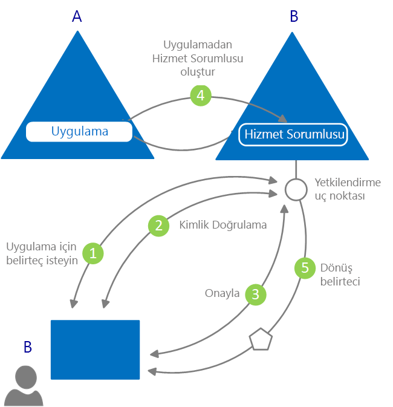

# Kimlik doğrulaması nedir?

*Kimlik doğrulaması*, taraflardan geçerli kimlik bilgileri isteyerek kimlik ve erişim denetimi için kullanılacak bir güvenlik sorumlusu oluşturmaktır. Daha basit bir deyişle söylediğiniz kişi olduğunuzu kanıtlama işlemidir. Kimlik doğrulaması bazen AuthN şeklinde kısaltılabilir.

*Yetkilendirme*, kimliği doğrulanmış bir güvenlik sorumlusuna bir şeyi yapma iznini vermektir. Erişme iznine sahip olduğunuz verileri ve bu verilerle gerçekleştirebileceğiniz işlemleri belirtir. Yetkilendirme bazen AuthZ şeklinde kısaltılabilir.

Azure Active Directory (Azure AD) kimliği hizmet olarak sunmasına ek olarak OAuth 2.0 ve OpenID Connect gibi sektör standardı protokollerin yanı sıra farklı platformlar için açık kaynak kitaplıkları destekleyerek kimlik doğrulamasını uygulama geliştiricileri için kolay hale getirir ve hemen kod yazmaya başlamanıza yardımcı olur.

Azure AD programlama modelinde iki temel kullanım örneği vardır:

* OAuth 2.0 yetki verme akışı: Burada kaynak sahibi istemci uygulamayı yetkilendirerek istemcinin kaynak sahibinin kaynaklarına erişmesini sağlar.
* İstemci tarafından kaynak erişimi sırasında: Kaynak sunucusu erişim belirtecindeki talep değerlerini kullanarak erişim denetimi kararları alır.

## Azure Active Directory'de kimlik doğrulamasıyla ilgili temel bilgiler

Kimliğin gerekli olduğu en basit senaryoyu ele alalım: Bir kullanıcının web tarayıcısından bir web uygulaması için kimlik doğrulamasından geçmesi gerekiyor. Aşağıdaki diyagramda bu senaryo gösterilmektedir:

Diyagramda gösterilen bileşenlerle ilgili bilmeniz gerekenler burada v erilmiştir:

* Azure AD, kimlik sağlayıcısıdır. Kimlik sağlayıcısı, kuruluşun dizinindeki kullanıcıların ve uygulamaların kimliğinin doğrulanmasından sorumludur ve bu kullanıcılarla uygulamalar kimlik doğrulamasından başarıyla geçtiğinde güvenlik belirteçleri oluşturur.
* Kimlik doğrulaması için Azure AD'yi kullanmak isteyen bir uygulamanın Azure AD'ye kaydedilmesi gerekir. Azure AD, dizindeki her uygulamayı kaydeder ve benzersiz bir şekilde tanımlar.
* Geliştiriciler açık kaynak Azure AD kimlik doğrulaması kitaplıklarını kullanarak protokolün ayrıntılarıyla ilgilenmeden kolayca kimlik doğrulaması gerçekleştirebilir. Azure AD hakkında daha fazla bilgi için bkz. [v2.0 kimlik doğrulama kitaplıkları](reference-v2-libraries.md) ve [v1.0 kimlik doğrulama kitaplıkları](active-directory-authentication-libraries.md).
* Kullanıcının kimliği doğrulandıktan sonra uygulamanın kimlik doğrulamasının başarılı olduğundan emin olmak için kullanıcının güvenlik belirtecini doğrulaması gerekir. Farklı diller ve çerçeveler için uygulamanın yapması gereken işlemleri anlatan birçok hızlı başlangıç, öğretici ve kod örneği mevcuttur.
  * Hızlıca uygulama derlemek ve belirteç alma, belirteçleri yenileme, kullanıcı oturumu açma ve kullanıcı bilgilerini görüntüleme gibi işlevler eklemek için belgelerin **Hızlı başlangıçlar** bölümüne bakın.
  * Erişim belirteçleri alma ve bunları Microsoft Graph API ve diğer API'lere yapılan çağrılarda kullanma, OpenID Connect kullanarak geleneksel bir web tarayıcısı tabanlı uygulamaya Microsoft ile oturum açma özelliğini ekleme ve daha fazla geliştirici görevi için ayrıntılı ve senaryo tabanlı yordamlar için belgelerin **Öğreticiler** bölümüne bakın.
  * Kod örneklerini indirmek için [GitHub](https://github.com/Azure-Samples?q=active-directory)'a gidin.
* Kimlik doğrulaması işlemi için istek ve yanıt akışı OAuth 2.0, OpenID Connect, WS-Federation veya SAML 2.0 gibi kullandığınız kimlik doğrulaması protokolü tarafından belirlenir. Protokoller hakkında daha fazla bilgi için belgelerin **Kavramlar > Protokoller** bölümüne bakın.

Yukarıdaki örnek senaryoda uygulamaları bu iki role göre sınıflandırabilirsiniz:

* Kaynaklara güvenli bir şekilde erişmesi gereken uygulamalar
* Kaynağın rolünü oynaması gereken uygulamalar

Temel kavramları oturttuğunuza göre okumaya devam ederek kimlik uygulaması modeli ve API, Azure AD'te sağlama ve Azure AD tarafından desteklenen yaygın senaryolar hakkında ayrıntılı bilgiler bölümlerini inceleyebilirsiniz.

## Uygulama modeli

Azure AD uygulamaları iki ana işlevi gerçekleştirmek üzere tasarlanmış bir modelle temsil eder:

* **Uygulamayı desteklediği kimlik doğrulaması protokollerine göre tanımlama**: Bu model tüm tanımlayıcıların, URL'lerin, gizli dizilerin ve kimlik doğrulaması sırasında gerekli olan ilgili bilgilerin listelenmesini kapsar. Burada Azure AD:

    * Çalışma zamanında kimlik doğrulamasını gerçekleştirmek için gerekli tüm verileri barındırır.
    * Bir uygulamanın erişmesi gerekebilecek kaynakları ve belirli bir isteğin gerçekleştirilip gerçekleştirilmeyeceğini ve hangi koşullarda gerçekleştirileceğini belirlemek için gerekli tüm verileri barındırır.
    * Uygulama geliştiricisinin kiracısında ve diğer Azure AD kiracısında uygulama sağlamak için gerekli altyapıyı sağlar.

* **Belirteç istendiğinde kullanıcı onayını işleme ve kiracılar arasında uygulamaların dinamik sağlamasını kolaylaştırma**: Burada Azure AD:

    * Kullanıcıların ve yöneticilerin uygulamanın kendileri adına kaynaklara erişmesine dinamik olarak onay vermesini veya reddetmesini sağlar.
    * Yöneticilerin uygulamaların gerçekleştirebilecekleri işlemler, belirli uygulamalara erişebilecek kullanıcılar ve erişilen dizin kaynakları hakkında son kararı vermesini sağlar.

Azure AD'de **uygulama nesnesi**, bir uygulamayı soyut varlık olarak tanımlar. Geliştiriciler uygulamalarla çalışır. Dağıtım zamanında Azure AD belirli bir uygulama nesnesini şema olarak kullanarak dizin veya kiracı içindeki uygulama örneğini temsil eden bir **hizmet sorumlusu** oluşturur. Uygulamanın belirli bir hedef dizinde yapabileceklerini, onu kullanabilecek kişileri, erişim sağlayabileceği kaynakları ve diğer bilgileri tanımlayan hizmet sorumlusudur. Azure AD, uygulama nesnesinden hizmet sorumlusu oluşturmak için **onayları** kullanır.

Aşağıdaki diyagramda onay temelli basitleştirilmiş bir Azure AD sağlama akışı gösterilmektedir.  İçinde iki Kiracı yok (A ve B), burada Kiracı A sahip uygulamayı ve B kiracısındaki bir hizmet sorumlusu aracılığıyla uygulamaya örnekleme.  

Bu sağlama akışında:

|   |   |
|---|---|
| 1 | B kiracısındaki bir kullanıcı uygulamada oturum açması dener |
| 2 | Kullanıcı kimlik bilgileri alınır ve doğrulanır |
| 3 | Kullanıcıdan uygulamaya B kiracısına erişme onayı vermesi istenir |
| 4 | Azure AD uygulama nesnesi içinde bir şema B kiracısında hizmet sorumlusu oluşturmak için kullanır |
| 5 | Kullanıcı istenen belirteci alır |
|   |   |

Bu işlemi diğer kiracılar için (C, D vb.) istediğiniz kadar tekrarlayabilirsiniz. Kiracı bir uygulama (uygulama nesnesi) için şema korur. Uygulama için onay verilen diğer kiracıların kullanıcıları ve yöneticileri kiracıdaki hizmet sorumlusu nesnesini kullanarak uygulamanın gerçekleştirmesine izin verilen işlemleri belirler. Daha fazla bilgi için bkz. [Azure AD'de uygulama ve hizmet sorumlusu nesneleri](app-objects-and-service-principals.md).

## Azure AD güvenlik belirteçlerindeki talepler

Azure AD tarafından oluşturulan güvenlik belirteçlerinde (erişim ve kimlik belirteçleri) talepler, başka bir deyişle kimliği doğrulanan özne hakkındaki onaylanmış bilgiler bulunur. Uygulamalar talepleri birçok görev için kullanabilir; bazıları:

* Belirteci doğrulama
* Öznenin dizin kiracısını tanımlama
* Kullanıcı bilgilerini görüntüleme
* Öznenin yetkilendirme durumunu belirleme

Herhangi bir güvenlik belirtecindeki talepler belirteç türüne, kullanıcının kimliğini doğrulamak için kullanılan kimlik bilgisi türüne ve uygulama yapılandırmasına göre değişiklik gösterir.

Aşağıdaki tabloda Azure AD tarafından düzenlenen talep türleri hakkında kısa açıklamalara yer verilmiştir. Daha ayrıntılı bilgi için Azure tarafından düzenlenen [erişim belirteçleri](access-tokens.md) ve [kimlik belirteçleri](id-tokens.md) bölümlerine bakın.

| İste | Açıklama |
| --- | --- |
| Uygulama Kimliği | Belirteci kullanan uygulamayı tanımlar. |
| Hedef kitle | Belirtecin gönderileceği alıcı kaynağını tanımlar. |
| Uygulama Kimlik Doğrulaması Bağlamı Sınıf Başvurusu | İstemcinin kimliğinin nasıl doğrulandığını belirtir (genel istemci veya gizli istemci). |
| Kimlik Doğrulaması Anı | Kimlik doğrulamasının gerçekleştirildiği tarihi ve saati kaydeder. |
| Kimlik Doğrulama Yöntemi | Belirtecin kimlik doğrulama yöntemini (parola, sertifika vb.) belirtir. |
| Ad | Kullanıcının Azure AD'deki adını sağlar. |
| Gruplar | Kullanıcının üyesi olduğu Azure AD gruplarının nesne kimliklerini içerir. |
| Kimlik Sağlayıcı | Belirtecin öznesinin kimliğini doğrulayan kimlik sağlayıcısını kaydeder. |
| Verilme Zamanı | Belirtecin verilme zamanını kaydeder ve bu değer genellikle belirtecin ne kadar güncel olduğunu anlamak için kullanılır. |
| Veren | Belirteci oluşturan STS ve Azure AD kiracısını tanımlar. |
| Soyadı | Kullanıcının Azure AD'deki soyadını sağlar. |
| Ad | Belirtecin konusunu tanımlayan ve okunabilir bir değer sunar. |
| Nesne Kimliği | Öznenin Azure AD'deki değişmez ve benzersiz tanıtıcısını içerir. |
| Roller | Kullanıcıya verilmiş olan Azure AD Uygulama Rollerinin kolay adlarını içerir. |
| Kapsam | İstemci uygulamasına verilmiş olan izinleri belirtir. |
| Özne | Belirtecin bilgi verdiği sorumluyu belirtir. |
| Kiracı Kimliği | Belirteci düzenleyen dizin kiracısının değişmez ve benzersiz tanıtıcısını içerir. |
| Belirteç Ömrü | Belirtecin geçerli olduğu zaman aralığını tanımlar. |
| Kullanıcı Asıl Adı | Öznenin kullanıcı asıl adını içerir. |
| Sürüm | Belirtecin sürüm numarasını içerir. |

## Sonraki adımlar

* [Azure Active Directory'de desteklenen uygulama türleri ve senaryolar](app-types.md) hakkında bilgi edinin
