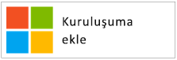
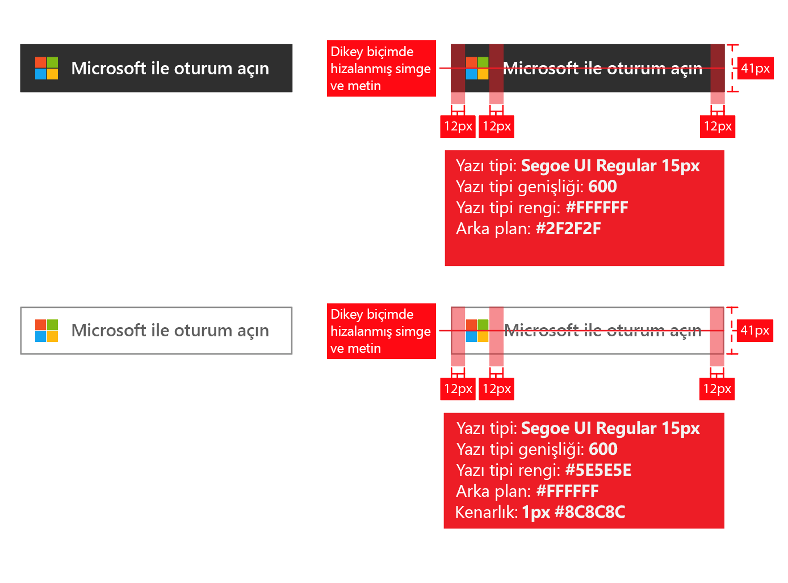
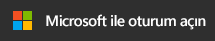
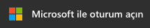
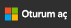
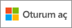

# Uygulamalar için markalama yönergeleri

Azure Active Directory (Azure AD) ile uygulama geliştirirken uygulamanıza kaydolmak veya uygulamanızda oturum açmak için iş veya okul hesaplarını (Azure AD’de yönetilen) ya da kişisel hesaplarını kullanmak istediklerinde müşterilerinizi yönlendirmeniz gerekir.

Bu makalede şunları yapacaksınız:

- Microsoft tarafından yönetilen iki hesap türünü ve uygulamanızdan Azure AD hesaplarına nasıl başvuracağınızı öğreneceksiniz
- Uygulamanıza Microsoft logosunu eklemek için yapmanız gerekenleri öğreneceksiniz
- Uygulamanızda kullanmak için resmi **Oturum açın** veya **Microsoft hesabıyla oturum açın** görsellerini indireceksiniz
- Marka ve gezinti konularında yapmanız ve yapmamanız gerekenleri öğreneceksiniz

## Microsoft kişisel hesapları ile iş veya okul hesapları karşılaştırması

Microsoft, iki tür kullanıcı hesabı yönetir:

- **Kişisel hesaplar** (eski adıyla Windows Live ID olarak da bilinir). Bu hesaplar, *bireysel* kullanıcılar ile Microsoft arasındaki ilişkiyi temsil eder ve tüketici cihazlarına ve Microsoft hizmetlerine erişmek üzere kullanılır. Bu hesaplar, kişisel kullanım için tasarlanmıştır.
- **İş veya okul hesapları.** Bu hesaplar, Azure Active Directory kullanan kuruluşlar adına Microsoft tarafından yönetilir. Bu hesaplar, Office 365 ve diğer Microsoft iş hizmetlerinde oturum açmak için kullanılır.

Microsoft iş veya okul hesapları genel olarak kuruluşlar (şirket, okul, devlet kurumu) tarafından son kullanıcılara (çalışanlar, öğrenciler, kamu çalışanları) atanır. Bu hesaplar doğrudan bulutta (Azure AD platformu) yönetilir veya Windows Server Active Directory gibi bir şirket içi dizinden Azure AD’ye eşitlenir. Microsoft iş veya okul hesaplarının *koruyucusudur* ancak hesapların mülkiyeti ve denetimi kuruluşa aittir.

## Uygulamanızda Azure AD hesaplarına başvurma

Microsoft, son kullanıcılara Azure veya Active Directory marka adlarını göstermez ve sizin de göstermemeniz gerekir.

- Kullanıcılar oturum açtıktan sonra mümkün olduğunca kuruluşun adını ve logosunu kullanın. Bu, “kuruluşunuz” gibi genel terimler kullanılmasından çok daha iyidir.
- Kullanıcılar oturum açmadıklarında hesaplarından “İş veya okul hesapları” olarak bahsedin ve bu hesapları Microsoft’un yönettiğini belirtmek üzere Microsoft logosunu kullanın. Kullanıcının kafasını karıştırabilecek şekilde “kuruluş hesabı”, “iş hesabı” veya “kurumsal hesap” gibi terimler kullanmayın.

## Kullanıcı hesabı piktogramı

Bu yönergelerin daha önceki bir sürümünde “mavi rozet” piktogramı kullanılmasını önermiştik. Kullanıcı ve geliştirici geri bildirimleri doğrultusunda şu anda bunun yerine Microsoft logosunun kullanılmasını öneriyoruz. Microsoft logosu, kullanıcıların uygulamanızda oturum açmak için Office 365 veya diğer Microsoft iş hizmetleri ile kullandıkları hesabı yeniden kullanabileceklerini anlamalarına yardımcı olacaktır.

## Azure AD ile kaydolma ve oturum açma

Uygulamanız kaydolma ve oturum açma için ayrı yollar sunabilir. Aşağıdaki bölümlerde her iki duruma uygun görsel kılavuz sağlanmaktadır.

**Uygulamanız son kullanıcının kaydolmasını destekliyorsa (örneğin, ücretsiz deneme sürümü veya freemium modeli)**: Kullanıcıların iş hesapları veya kişisel hesapları ile uygulamanıza erişmesine izin veren bir **oturum aç** düğmesi gösterebilirsiniz. Azure AD, uygulamanıza ilk eriştiklerinde bir izin alma istemi gösterecektir.

**Uygulamanız yalnızca yöneticilerin verebileceği izinleri gerektiriyorsa veya uygulamanız kuruluş lisansı gerektiriyorsa**: Yönetici alımını kullanıcı oturum açma işleminden ayırın. **“Bu uygulamayı al” düğmesi** yöneticileri oturum açma ekranına yeniden yönlendirecek ve ardından kuruluştaki kullanıcılar adına izin vermelerini isteyecektir; bu düğme, son kullanıcı izin alma istemlerini uygulamanıza gizleme açısından ek avantaj sunar.

## Uygulama alımı için görsel kılavuz

“Uygulamayı al” bağlantınızın, Microsoft tarafından barındırılan kuruluş verilerine erişmek üzere bir kuruluş yöneticisinin uygulamanızı yetkilendirmesine izin vermek için kullanıcıyı Azure AD erişim verme (yetkilendirme) sayfasına yeniden yönlendirmesi gerekir. Nasıl erişim talep edileceğine ilişkin ayrıntılar [Integrating Applications with Azure Active Directory (Uygulamaları Azure Active Directory ile Tümleştirme)](quickstart-v1-integrate-apps-with-azure-ad.md) makalesinde açıklanmaktadır.

Yöneticiler uygulamanıza izin verdikten sonra uygulamanızı kullanıcılarının Office 365 uygulama başlatıcı deneyimine ekleyebilirler (waffle menüsünden ve [https://portal.office.com/myapps](https://portal.office.com/myapps) bölümünden erişilebilir). Bu özelliği tanıtmak istiyorsanız “Bu uygulamayı kuruluşunuza ekleyin” gibi ifadeler kullanabilir ve aşağıdaki gibi bir düğme görüntüleyebilirsiniz:

Ancak düğmelere güvenmek yerine açıklayıcı metinler yazmanızı öneririz. Örnek:

> *Office 365 veya diğer bir Microsoft iş hizmeti kullanıyorsanız kuruluşunuzun verilerine <uygulamanızın_adı> erişimi verebilirsiniz. Bu, kullanıcılarınızın mevcut iş hesapları ile <uygulamanızın_adı> uygulamanıza erişebilmelerini sağlayacaktır.*

Uygulamanızda kullanmak üzere resmi Microsoft logosunu indirmek için, kullanmak istediğiniz logoya sağ tıklayın ve ardından bilgisayarınıza kaydedin.

| Varlık                                | PNG biçimi | SVG biçimi |
| ------------------------------------ | ---------- | ---------- |
| Microsoft logosu  |  |  |

## Oturum açma için görsel kılavuz

Uygulamanızda kullanıcıları, Azure AD ile tümleştirme için kullandığınız protokole karşılık gelen oturum açma uç noktasına yönlendiren bir oturum açma düğmesinin görüntülenmesi gerekir. Aşağıdaki bölümde bu düğmenin nasıl görünmesi gerektiğine ilişkin ayrıntılı bilgi sağlanmaktadır.

### Piktogram ve “Microsoft ile Oturum Aç”

Microsoft logosu ve “Microsoft ile Oturum Aç” ifadesinin bir arada sunulması, Azure AD çözümünü uygulamanızın destekleyebileceği diğer kimlik sağlayıcılarından benzersiz şekilde ayıran özelliktir. “Microsoft ile Oturum Aç” ifadesinin tamamını içerecek kadar alanınız yoksa “Oturum Aç” olarak kısaltabilirsiniz. Düğmeler için açık veya koyu renk şeması kullanabilirsiniz.

Aşağıdaki diyagramda, uygulamanızla birlikte varlıkları kullanırken Microsoft tarafından önerilen kırmızı çizgiler gösterilmektedir. Kırmızı çizgiler, “Microsoft ile Oturum Aç” veya kısa hali “Oturum Aç” sürümü için geçerlidir.

Uygulamanızda kullanmak üzere resmi görüntüleri indirmek için kullanmak istediğiniz görüntüye sağ tıklayın ve ardından görüntüyü bilgisayarınıza kaydedin.

| Varlık                                | PNG biçimi | SVG biçimi |
| ------------------------------------ | ---------- | ---------- |
| Microsoft ile Oturum Aç (koyu tema)  |  |  |
| Microsoft ile Oturum Aç (açık tema) |  |  |
| Oturum Aç (koyu tema)                 |  |  |
| Oturum Aç (açık tema)                |  |  |

## Markalama için Yapılması ve Yapılmaması Gerekenler

**YAPIN**: Son kullanıcıların kullanıp kullanamayacaklarını anlamalarına yardımcı olmak üzere ek açıklama sağlamak için “Microsoft ile Oturum Aç” düğmesi ile birlikte “iş veya okul hesabı” ifadesini kullanın. **YAPMAYIN**: “Kuruluş hesabı”, “iş hesabı” veya “kurumsal hesap” gibi başka ifadeler kullanmayın.”

**YAPMAYIN**: “Office 365 ID” veya “Azure ID” kullanmayın. Office 365 aynı zamanda Microsoft’un tüketicilere yönelik bir teklifinin adıdır ve kimlik doğrulama için Azure AD kullanmaz.

**YAPMAYIN**: Microsoft logosunu değiştirmeyin.

**YAPMAYIN**: Son kullanıcılara Azure veya Active Directory markalarını sunmayın. Ancak geliştiriciler, BT uzmanları ve yöneticilere sunabilirsiniz.

## Gezinti için Yapılması ve Yapılmaması Gerekenler

**YAPIN**: Kullanıcılara, oturumu kapatma ve başka bir kullanıcı hesabına geçme olanağı sağlayın. Çoğu kişi tek bir Microsoft/Facebook/Google/Twitter hesabına sahip olsa da genellikle birden fazla kuruluş ile ilişkilidir. Birden fazla hesapla oturum açan kullanıcılar için destek yakında sunulacaktır.
