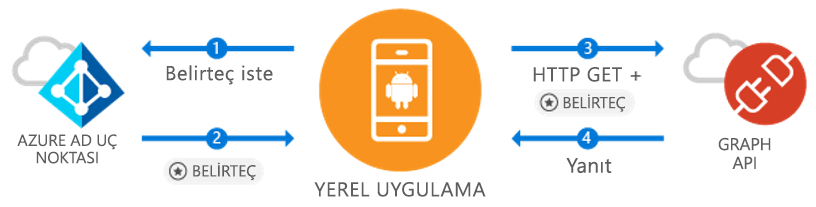

# <a name="quickstart-sign-in-users-and-call-the-microsoft-graph-api-from-an-android-app"></a>Hızlı başlangıç: Android uygulamasından kullanıcıların oturum açma ve Microsoft Graph API'sini çağırma

[!INCLUDE [active-directory-develop-applies-v1-adal](../../../includes/active-directory-develop-applies-v1-adal.md)]

Android uygulaması geliştiriyorsanız, Microsoft Azure Active Directory (Azure AD) kullanıcılarının oturum açmasını kolaylaştırıyor ve basit hale getirir. Azure AD, Microsoft Graph veya kendi korumalı web API’niz üzerinden uygulamanızın kullanıcı verilerine erişmesini sağlar.

Azure AD Authentication Library (ADAL) Android kitaplığı, endüstri standardı OAuth 2.0 ve OpenID Connect'i kullanarak [Microsoft Azure Active Directory hesapları](https://azure.microsoft.com/services/active-directory/) için destek sağladığından, uygulamanıza [Microsoft Azure Cloud](https://cloud.microsoft.com) & [Microsoft Graph API'si](https://developer.microsoft.com/graph) kullanabilme olanağı getirir.

Bu hızlı başlangıçta şunları yapmayı öğreneceksiniz:

* Microsoft Graph için belirteç alma
* Belirteci yenileme
* Microsoft Graph'ı çağırma
* Kullanıcının oturumu kapatma

## <a name="prerequisites"></a>Önkoşullar

Başlamak için, kullanıcıları oluşturabildiğiniz ve uygulama kaydedebildiğiniz bir Azure AD kiracısına ihtiyacınız vardır. Henüz kiracınız yoksa, [nasıl alabileceğinizi öğrenin](quickstart-create-new-tenant.md).

## <a name="scenario-sign-in-users-and-call-the-microsoft-graph"></a>Senaryo: Kullanıcıların oturumunu açma ve Microsoft Graph'ı çağırma



Bu uygulamayı tüm Azure AD hesaplarında kullanabilirsiniz. Hem tek kiracılı hem de çok kiracılı senaryoları destekler (adımlarda açıklanmıştır). Kurumsal kullanıcılarla bağlantı kurmak ve Microsoft Graph üzerinden onların Azure + O365 verilerine erişmek için nasıl uygulama oluşturabileceğinizi gösterir. Kimlik doğrulaması akışı sırasında son kullanıcıların oturum açması ve uygulama izinlerini onaylaması gerekebilir. Bazı durumlarda da yöneticinin uygulamaya onay vermesi gerekebilir. Bu örnekteki mantığın büyük bölümü, son kullanıcının kimliğini doğrulamayı ve Microsoft Graph’a temel bir çağrı yapmayı gösterir.

## <a name="sample-code"></a>Örnek kod

Tam örnek kodu [Github’da](https://github.com/Azure-Samples/active-directory-android) bulabilirsiniz.

```Java
// Initialize your app with MSAL
AuthenticationContext mAuthContext = new AuthenticationContext(
        MainActivity.this, 
        AUTHORITY, 
        false);


// Perform authentication requests
mAuthContext.acquireToken(
    getActivity(), 
    RESOURCE_ID, 
    CLIENT_ID, 
    REDIRECT_URI,  
    PromptBehavior.Auto, 
    getAuthInteractiveCallback());

// ...

// Get tokens to call APIs like the Microsoft Graph
mAuthResult.getAccessToken()
```

## <a name="step-1-register-and-configure-your-app"></a>1. Adım: Uygulamanızı kaydetme ve yapılandırma

[Azure portalını](https://portal.azure.com) kullanarak Microsoft'a kaydedilmiş yerel bir istemci uygulamanız olması gerekir.

1. Uygulama kaydını alma
    - [Azure portalına](https://aad.portal.azure.com) gidin.
    - ***Azure Active Directory*** > ***Uygulama kayıtları***’nı seçin.

2. Uygulama oluşturma
    - **Yeni uygulama kaydı**’nı seçin.
    - **Ad** alanına bir uygulama adı girin.
    - **Uygulama türü**’nde **Yerel**’i seçin.
    - **Yeniden yönlendirme URI'si** olarak `http://localhost` girin.

3. Microsoft Graph’ı yapılandırma
    - **Ayarlar > Gerekli izinler**’i seçin.
    - **Ekle**’yi seçin, **Bir API seçin** alanında ***Microsoft Graph***’ı seçin.
    - **Oturum açma ve kullanıcı profilini okuma** iznini seçin ve kaydetmek için **Seç**'e basın.
        - Bu izin `User.Read` kapsamıyla eşleşir.
    - İsteğe bağlı: **Gerekli izinler > Windows Azure Active Directory**'nin altında, seçilen **Oturum açma ve kullanıcı profilini okuma** iznini kaldırın. Bu, kullanıcı onayı sayfasında iznin iki kez listelemesini önler.

4. Tebrikler! Uygulamanız başarıyla yapılandırıldı. Sonraki bölümde size gerekecekler:
    - `Application ID`
    - `Redirect URI`

## <a name="step-2-get-the-sample-code"></a>2. Adım: Örnek kodu alma

1. Kodu kopyalayın.
    ```
    git clone https://github.com/Azure-Samples/active-directory-android
    ```
2. Örneği Android Studio’da açın.
    - **Var olan Android Studio projesini aç**'ı seçin.

## <a name="step-3-configure-your-code"></a>3. Adım: Kodunuzu yapılandırma

Bu kod örneğinin tüm yapılandırmasını ***src/main/java/com/azuresamples/azuresampleapp/MainActivity.java*** dosyasında bulabilirsiniz.

1. `CLIENT_ID` sabitini `ApplicationID` ile değiştirin.
2. `REDIRECT URI` sabitini daha önce yapılandırdığınız `Redirect URI` ile (`http://localhost`) değiştirin.

## <a name="step-4-run-the-sample"></a>4. Adım: Örneği çalıştırma

1. **Derle > Projeyi Temizle**’yi seçin.
2. **Çalıştır > Uygulamayı çalıştır**’ı seçin.
3. Uygulama oluşturulmuş olma.ı biraz temel UX göstermelidir. `Call Graph API` düğmesine tıkladığınızda, oturum açılmasını isteyecek ve ardından sessizce yeni belirteçle Microsoft Graph API'sini çağıracaktır.

## <a name="next-steps"></a>Sonraki adımlar

1. Kitaplığı mekanizması ve yeni senaryolarla özellikleri yapılandırma hakkında daha fazla bilgi için [ADAL Android Wiki'sini](https://github.com/AzureAD/azure-activedirectory-library-for-android/wiki) gözden geçirin.
2. Yerel senaryolarda uygulama, eklenmiş bir Webview kullanır ve uygulamadan çıkılmaz. `Redirect URI` rastgele olabilir.
3. Sorun mu buldunuz yoksa istekleriniz mi var? Bir sorun oluşturabilir veya `azure-active-directory` etiketiyle Stackoverflow'a gönderi ekleyebilirsiniz.

### <a name="cross-app-sso"></a>Uygulamalar arası SSO

[ADAL kullanarak Android’de uygulamalar arası SSO’nun nasıl etkinleştirildiğini](howto-v1-enable-sso-android.md) öğrenin.

### <a name="auth-telemetry"></a>Kimlik doğrulaması telemetrisi

ADAL kitaplığı, uygulama geliştiricilerin kendi uygulamalarının davranışlarını anlamalarına ve daha iyi deneyimler oluşturmalarına yardımcı olmak için kimlik doğrulama telemetrisi sunar. Bu sayede başarılı oturum açma işlemlerini, etkin kullanıcıları ve bunlar dışında bazı ilginç içgörüleri yakalayabilirsiniz. Kimlik doğrulama telemetrisini kullanmak için, uygulama geliştiricilerin olayları toplamak ve depolamak üzere bir telemetri hizmeti kurması gerekmez.

Kimlik doğrulaması telemetrisi hakkında daha fazla bilgi için [ADAL Android kimlik doğrulaması telemetrisi](https://github.com/AzureAD/azure-activedirectory-library-for-android/wiki/Telemetry) konusunu gözden geçirin.