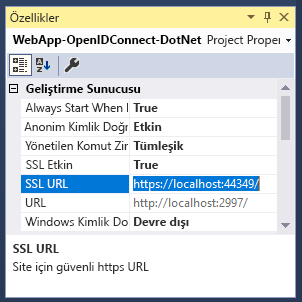
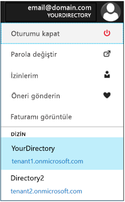
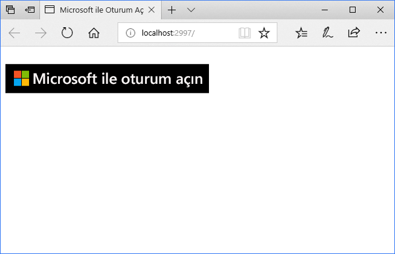
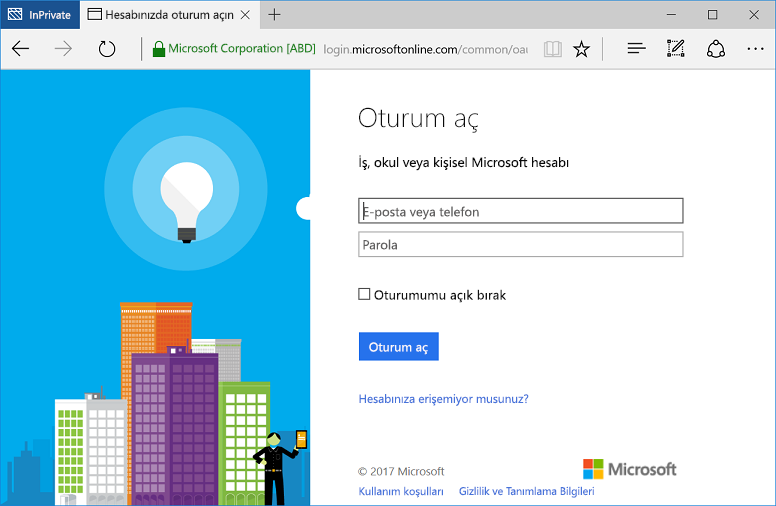

# <a name="quickstart-add-sign-in-with-microsoft-to-an-aspnet-web-app"></a>Hızlı Başlangıç: Oturum açma Microsoft ile bir ASP.NET web uygulamasına ekleme

[!INCLUDE [active-directory-develop-applies-v1](../../../includes/active-directory-develop-applies-v1.md)]

Bu hızlı başlangıçta, oturum açma Openıd Connect'i kullanarak geleneksel web tarayıcı tabanlı bir uygulama ile ASP.NET Model View Controller (MVC) çözümünü kullanarak Microsoft ile nasıl uygulanacağı öğreneceksiniz. ASP.NET uygulamanızda iş ve okul hesaplarıyla oturum açmayı etkinleştirmeyi öğreneceksiniz.

Bu hızlı başlangıcın sonunda uygulamanız Azure Active Directory (Azure AD) ile tümleşik kuruluşların iş ve okul hesapları ile oturum açılmasını kabul ediyor olacak.

> [!NOTE]
> İş ve Okul hesaplarında yanı sıra kişisel hesapları için oturum açma etkinleştirmeniz gerekirse, kullanabileceğiniz  *[Microsoft kimlik platformu uç nokta](azure-ad-endpoint-comparison.md)*. Daha fazla bilgi için bkz. [ASP.NET Öğreticisine](tutorial-v2-asp-webapp.md) yanı [bu makalede](active-directory-v2-limitations.md) açıklayan *Microsoft kimlik platformu uç nokta*.

## <a name="prerequisites"></a>Önkoşullar

Başlamak için aşağıdaki önkoşulları karşıladığınızdan emin olun:

* Visual Studio 2015 güncelleştirme 3 veya Visual Studio 2019 yüklü. Sizde yok mu? [Visual Studio 2019 ücretsiz olarak indirin](https://www.visualstudio.com/downloads/)

## <a name="scenario-sign-in-users-from-work-and-school-accounts-in-your-aspnet-app"></a>Senaryo: ASP.NET uygulamanızı iş ve Okul hesaplarında kullanıcılardan oturum açma


Bir tarayıcı, ASP.NET web sitesi erişir ve kullanarak bir oturum açma düğmesi Bu senaryoda, kimlik doğrulaması için bir kullanıcı ister. Bu senaryoda web sayfasını oluşturma işlemlerinin çoğu sunucu tarafında gerçekleştirilmektedir.

Hızlı kullanıcılar boş bir şablondan başlayan bir ASP.NET web uygulamasında oturum açmak nasıl bağlanacağınız gösterilmiştir. Ayrıca, bir oturum açma düğmesi ve her denetleyici ve yöntemleri ekleme gibi adımlarını içerir ve bu görevleri kavramları açıklar. Azure AD kullanıcılarının (iş ve Okul hesapları) kullanarak oturum açmak için bir proje oluşturabilirsiniz [Visual Studio web şablonu](https://docs.microsoft.com/aspnet/visual-studio/overview/2013/creating-web-projects-in-visual-studio#organizational-account-authentication-options) seçerek **Kurumsal hesaplar** ve ardından bir bulut seçeneklerine - bu seçeneği, ek denetleyicileri, yöntemleri ve görünümler ile daha zengin bir şablon kullanır.

## <a name="libraries"></a>Kitaplıklar

Bu hızlı başlangıçta aşağıdaki paketler kullanılır:

| Kitaplık | Açıklama |
|---|---|
| [Microsoft.Owin.Security.OpenIdConnect](https://www.nuget.org/packages/Microsoft.Owin.Security.OpenIdConnect/) | Uygulamanın kimlik doğrulaması için OpenIdConnect kullanmasını sağlayan ara yazılım |
| [Microsoft.Owin.Security.Cookies](https://www.nuget.org/packages/Microsoft.Owin.Security.Cookies) |Uygulamanın tanımlama bilgilerini kullanarak kullanıcı oturumunu korumasını sağlayan ara yazılım |
| [Microsoft.Owin.Host.SystemWeb](https://www.nuget.org/packages/Microsoft.Owin.Host.SystemWeb) | OWIN tabanlı uygulamaların ASP.NET istek işlem hattını kullanarak IIS üzerinde çalışmasını sağlar |
|  |  |

## <a name="step-1-set-up-your-project"></a>1. Adım: Projenizi ayarlama

Bu adımlarda OpenID Connect kullanarak bir ASP.NET projesi üzerinde OWIN ara yazılımı aracılığıyla kimlik doğrulaması işlem hattı yükleme ve yapılandırma adımları gösterilmektedir.

Bu örneğe ait Visual Studio projesini indirmek için şu adımları izleyin:
1. [GitHub'daki projeyi indirin](https://github.com/AzureADQuickStarts/WebApp-OpenIdConnect-DotNet/archive/GuidedSetup.zip).
1. Kod örneği çalıştırmadan önce yapılandırmak için yapılandırma adımı atlayın.

## <a name="step-2-create-your-aspnet-project"></a>2. Adım: ASP.NET projenizi oluşturun

1. Visual Studio'da **Dosya > Yeni > Proje**'yi seçin.
2. **Visual C#\Web** bölümünde **ASP.NET Web Uygulaması (.NET Framework)** girişini seçin.
3. Uygulamanıza bir ad verin ve **Tamam**'ı seçin.
4. **Boş**'u seçin ve **MVC** başvurusu eklemek için onay kutusunu seçin.

## <a name="step-3-add-authentication-components"></a>3. Adım: Kimlik doğrulama bileşenleri ekleme

1. Visual Studio'da, **Araçlar > NuGet Paket Yöneticisi > Paket Yöneticisi Konsolu**’na gidin.
2. Paket Yöneticisi Konsolu penceresinde aşağıdakileri yazarak **OWIN ara yazılım NuGet paketlerini** ekleyin:

    ```powershell
    Install-Package Microsoft.Owin.Security.OpenIdConnect
    Install-Package Microsoft.Owin.Security.Cookies
    Install-Package Microsoft.Owin.Host.SystemWeb
    ```

<!--start-collapse-->
> ### <a name="about-these-packages"></a>Bu paketler hakkında
>Yukarıdaki kitaplıklar, tanımlama bilgisi tabanlı kimlik doğrulaması aracılığıyla OpenID Connect kullanarak çoklu oturum açma (SSO) sağlar. Kimlik doğrulaması tamamlandıktan ve kullanıcıyı temsil eden belirteç uygulamanıza gönderildikten sonra OWIN ara yazılımı bir oturum tanımlama bilgisi oluşturur. Tarayıcı sonraki isteklerde bu tanımlama bilgisini kullanarak kullanıcının yeniden kimlik doğrulamasından geçmesine ve ek doğrulamaya gerek duyulmamasını sağlar.
<!--end-collapse-->

## <a name="step-4-configure-the-authentication-pipeline"></a>4. Adım: Kimlik doğrulaması işlem hattı yapılandırın

Bu adımları izleyerek OpenID Connect kimlik doğrulamasını yapılandırmak üzere bir OWIN ara yazılımı *Başlangıç Sınıfı* oluşturun. Bu sınıf otomatik olarak yürütülür.

> [!TIP]
> Projenizin kök klasöründe `Startup.cs` adlı bir dosya yoksa:<br/>
> 1. Projenin kök klasörüne sağ tıklayın: **Ekle > Yeni Öğe... > OWIN Başlangıç sınıfı**<br/>
> 2. Bunu, `Startup.cs` olarak adlandırın.<br/>
>
>> Seçilen sınıfın standart bir C# sınıfı değil OWIN Başlangıç Sınıfı olduğundan emin olun. Doğrulamak için ad alanının üzerinde `[assembly: OwinStartup(typeof({NameSpace}.Startup))]` yazıp yazmadığını kontrol edin.

OWIN ara yazılımı *Başlangıç Sınıfı* oluşturmak için:

1. *OWIN* ve *Microsoft.IdentityModel* ad alanlarını `Startup.cs` dosyasına ekleyin:

    [!code-csharp[main](../../../WebApp-OpenIDConnect-DotNet/WebApp-OpenIDConnect-DotNet/Startup.cs?name=AddedNameSpaces "Startup.cs")]

2. Başlangıç sınıfını aşağıdaki kodla değiştirin:

    [!code-csharp[main](../../../WebApp-OpenIDConnect-DotNet/WebApp-OpenIDConnect-DotNet/Startup.cs?name=Startup "Startup.cs")]

<!--start-collapse-->
> [!NOTE]
> *OpenIDConnectAuthenticationOptions* içinde sağladığınız parametreler uygulamanın Azure AD ile iletişim kurmak için kullanacağı koordinatlara benzer. OpenID Connect ara yazılımı tanımlama bilgilerini kullandığından yukarıdaki kodda gösterildiği gibi tanımlama bilgisi kimlik doğrulaması ayarları da yapmanız gerekir. *ValidateIssuer* değeri OpenIdConnect öğesine erişimi tek bir kuruluşla sınırlamamasını söyler.
<!--end-collapse-->

<!--end-setup-->

<!--start-use-->

## <a name="step-5-add-a-controller-to-handle-sign-in-and-sign-out-requests"></a>5. Adım: Oturum açma ve oturum kapatma istekleri işlemek üzere bir denetleyici ekleyin

Oturum açma ve oturumu kapatma metotlarını kullanıma sunmak için yeni bir denetleyici oluşturun.

1.  **Denetleyiciler** klasörüne sağ tıklayın ve **Ekle > Denetleyici**'yi seçin.
2.  **MVC (.NET sürümü) Denetleyici – Boş** girişini seçin.
3.  **Add (Ekle)** seçeneğini belirleyin.
4.  `HomeController` olarak adlandırın ve **Ekle**'yi seçin.
5.  **OWIN** ad alanlarını sınıfa ekleyin:

    [!code-csharp[main](../../../WebApp-OpenIDConnect-DotNet/WebApp-OpenIDConnect-DotNet/Controllers/HomeController.cs?name=AddedNameSpaces "HomeController.cs")]

6. Kod aracılığıyla kimlik doğrulaması sınaması başlatarak denetleyicinizde oturum açma ve oturumu kapatmayı işlemek için aşağıdaki metotları ekleyin:

    [!code-csharp[main](../../../WebApp-OpenIDConnect-DotNet/WebApp-OpenIDConnect-DotNet/Controllers/HomeController.cs?name=SigInAndSignOut "HomeController.cs")]

## <a name="step-6-create-the-apps-home-page-to-sign-in-users-via-a-sign-in-button"></a>6. Adım: Kullanıcılar bir oturum açma düğmesi aracılığıyla oturum açmak için uygulama giriş sayfası oluşturma

Visual Studio'da oturum açma düğmesini eklemek ve kimlik doğrulaması sonrasında kullanıcı bilgilerini görüntülemek için yeni bir görünüm ekleyin:

1. **Görünümler\Giriş Sayfası** klasörüne sağ tıklayın ve **Görünüm Ekle**'yi seçin.
1. **Index** adını verin.
1. Oturum açma düğmesini de içeren aşağıdaki HTML kodunu dosyaya ekleyin:

    [!code-html[main](../../../WebApp-OpenIDConnect-DotNet/WebApp-OpenIDConnect-DotNet/Views/Home/Index.cshtml "Index.cshtml")]

<!--start-collapse-->
Bu sayfa, siyah bir arka plan SVG biçiminde bir oturum açma düğmesi ekler:<br/><br/> Daha fazla oturum açma düğmesi için bkz. [Uygulamalar için markalama yönergeleri](howto-add-branding-in-azure-ad-apps.md).
<!--end-collapse-->

## <a name="step-7-display-users-claims-by-adding-a-controller"></a>7. Adım: Kullanıcı talepleri bir denetleyici ekleyerek görüntüleme

Bu denetleyici bir denetleyiciyi koruma amacıyla `[Authorize]` özniteliğini kullanma şeklini gösterir. Bu öznitelik yalnızca kimliği doğrulanan kullanıcılara izin vererek denetleyici erişimini sınırlar. Aşağıdaki kod özniteliği kullanarak oturum açma işleminin bir parçası olarak getirilen kullanıcı taleplerini görüntüler.

1. **Denetleyiciler** klasörüne sağ tıklayın ve ardından **Ekle > Denetleyici**'yi seçin.
1. **MVC {sürüm} Denetleyici – Boş** girişini seçin.
1. **Add (Ekle)** seçeneğini belirleyin.
1. **ClaimsController** olarak adlandırın.
1. Bu örnek ekler, denetleyici sınıfının kodunu aşağıdaki kodla - değiştirin `[Authorize]` öznitelik sınıfı:

    [!code-csharp[main](../../../WebApp-OpenIDConnect-DotNet/WebApp-OpenIDConnect-DotNet/Controllers/ClaimsController.cs?name=ClaimsController "ClaimsController.cs")]

<!--start-collapse-->
> [!NOTE]
> `[Authorize]` özniteliğinin kullanılması nedeniyle bu denetleyicinin tüm metotları yalnızca kullanıcının kimliğinin doğrulanması durumunda yürütülebilir. Kimliği doğrulanmamış bir kullanıcının denetleyiciye erişmeye çalışması durumunda OWIN bir kimlik doğrulaması sınaması başlatır ve kullanıcıyı kimlik doğrulaması için zorlar. Yukarıdaki kod kullanıcı belirtecinde bulunan belirli öznitelikler için kullanıcının talep koleksiyonuna bakar. Bu öznitelik kullanıcının tam adını, kullanıcı adını ve genel kullanıcı tanımlayıcısı nesnesini içerir. Ayrıca kullanıcının kuruluşunun kimliğini temsil eden *Kiracı Kimliği* değerini de içerir.
<!--end-collapse-->

## <a name="step-8-create-a-view-to-display-the-users-claims"></a>8. adım: Kullanıcı talepleri görüntülemek için bir görünüm oluşturma

Visual Studio'da kullanıcının taleplerini bir web sayfasında görüntülemek için yeni bir görünüm oluşturun:

1. **Görünümler\Talepler** klasörüne sağ tıklayın ve **Görünüm Ekle**'yi seçin.
1. **Index** adını verin.
1. Aşağıdaki HTML kodunu dosyaya ekleyin:

    [!code-html[main](../../../WebApp-OpenIDConnect-DotNet/WebApp-OpenIDConnect-DotNet/Views/Claims/Index.cshtml "Index.cshtml")]

<!--end-use-->

<!--start-configure-->

## <a name="step-9-configure-your-webconfig-and-register-an-application"></a>9. adım: Yapılandırma, *web.config* ve bir uygulamayı kaydetme

1. Visual Studio'da aşağıdaki kodu `configuration\appSettings` dizinindeki `web.config` dosyasına (kök klasörde bulunur) ekleyin:

    ```xml
    <add key="ClientId" value="Enter_the_Application_Id_here" />
    <add key="RedirectUrl" value="Enter_the_Redirect_Url_here" />
    <add key="Tenant" value="common" />
    <add key="Authority" value="https://login.microsoftonline.com/{0}" />
    ```
2. Çözüm Gezgini'nde projeyi seçin ve <i>Özellikler</i> penceresine bakın (Özellikler penceresi yoksa F4 tuşuna basın)
3. SSL Etkin ayarını <code>True</code> olarak değiştirin
4. Projenin SSL URL'sini panoya kopyalayın:<br/><br/><br />
5. <code>web.config</code> içinde <code>Enter_the_Redirect_URL_here</code> yerine projenizin SSL URL'sini yazın.

### <a name="register-your-application-in-the-azure-portal-then-add-its-information-to-webconfig"></a>Azure portalında kaydedin, ardından kendi ilgili bilgileri *web.config*

1. Uygulamanızı kaydetmek için [Microsoft Azure portal - Uygulama kayıtları](https://portal.azure.com/#blade/Microsoft_AAD_IAM/ActiveDirectoryMenuBlade/RegisteredApps) sayfasına gidin.
2. **Yeni uygulama kaydı**’nı seçin.
3. Uygulamanız için bir ad girin.
4. Visual Studio projesinin *SSL URL* değerini **Oturum Açma URL'si** alanına yapıştırın. Bu URL de kaydettirmekte uygulama için yanıt URL'leri listesine otomatik olarak eklenir.
5. Uygulamayı kaydetmek için **Oluştur** seçeneğine tıklayın. Uygulama listesi sayfasına dönersiniz.
6. Şimdi yeni oluşturduğunuz uygulamayı arayın ve/veya seçin ve özelliklerini açın.
7. **Uygulama Kimliği** bölümündeki GUID değerini panoya kopyalayın.
8. Visual Studio ve içinde dönün `web.config`, değiştirin `Enter_the_Application_Id_here` kaydettiğiniz uygulamadan uygulama kimliği.

> [!TIP]
> Hesabınız birden fazla dizine erişecek şekilde yapılandırılmışsa aşağıda gösterilen şekilde Azure portalda sağ üst köşedeki hesap adına tıklayıp seçili dizini doğrulayarak uygulamanın kaydedilmesini istediğiniz kuruluş için doğru dizini seçtiğinizden emin olun:<br/>

## <a name="step-10-configure-sign-in-options"></a>10. adım: Oturum açma seçeneklerini yapılandırın

Uygulamanızı, oturum açmak için bir kuruluşun Azure AD'ye örneğine ait olan kullanıcıların izin verecek şekilde yapılandırın ya da herhangi bir kuruluşa ait olan kullanıcıların oturum açma işlemleri kabul edin. Aşağıdaki seçeneklerden birini yönergeleri izleyin:

### <a name="configure-your-application-to-allow-sign-ins-of-work-and-school-accounts-from-any-company-or-organization-multi-tenant"></a>Uygulamanızı tüm şirketlere veya kuruluşlara ait iş ve okul hesaplarıyla oturum açılmasına izin verecek şekilde ayarlama (çok kiracılı)

Azure AD ile tümleşik şirketlerden veya kuruluşlardan iş ve okul hesaplarıyla oturum açılmasını kabul etmek için aşağıdaki adımları izleyin. Bu yaygın bir senaryodur *SaaS uygulamalarına*:

1. Geri Git [Microsoft Azure Portalı - Uygulama kayıtları](https://portal.azure.com/#blade/Microsoft_AAD_IAM/ActiveDirectoryMenuBlade/RegisteredApps) ve kaydettiğiniz uygulamayı bulun.
2. **Tüm Ayarlar** bölümünde **Özellikler**'i seçin.
3. **Çok kiracılı** özelliğini **Evet** olarak ayarlayın ve **Kaydet**'i seçin.

Bu ayar ve çok kiracılı uygulamalar hakkında daha fazla bilgi için bkz. [Çok kiracılı uygulamalara genel bakış](howto-convert-app-to-be-multi-tenant.md).

### <a name="restrict-users-from-only-one-organizations-active-directory-instance-to-sign-in-to-your-application-single-tenant"></a>Uygulamanızı yalnızca bir kuruluşun Active Directory örneğindeki kullanıcıların oturum açabileceği şekilde kısıtlama (tek kiracılı)

Bu senaryo genellikle iş kolu uygulamalarında tercih edilir.

Uygulamanızın yalnızca belirli bir Azure AD örneğine ait olan hesaplardan gelen oturum açma isteklerini kabul etmesini istiyorsanız (bu örneğin *konuk hesapları* dahil olmak üzere) şu adımları izleyin:

1. *web.config* dosyasındaki `Tenant` parametresinde `Common` yerine kuruluşun kiracı adını (*contoso.onmicrosoft.com* gibi) kullanın.
1. [*OWIN Başlangıç sınıfınızdaki*](#step-4-configure-the-authentication-pipeline) `ValidateIssuer` bağımsız değişkenini `true` olarak değiştirin.

Yalnızca belirli kuruluşların kullanıcılarına izin vermek için şu adımları izleyin:

1. `ValidateIssuer` değerini true olarak ayarlayın.
1. `ValidIssuers` parametresini kullanarak kuruluş listesi belirtin.

Başka bir seçenek de *IssuerValidator* parametresini kullanarak düzenleyenleri doğrulayan özel bir metot uygulamaktır. Hakkında daha fazla bilgi için `TokenValidationParameters`, bkz: [bu MSDN makalesinde](https://msdn.microsoft.com/library/system.identitymodel.tokens.tokenvalidationparameters.aspx "tokenvalidationparameters değerini MSDN makalesi").

<!--end-configure-->

<!--start-configure-arp-->
<!--
## Configure your ASP.NET Web App with the application's registration information

In this step, you will configure your project to use SSL, and then use the SSL URL to configure your application’s registration information. After this, add the application’ registration information to your solution via *web.config*.

1.  In Solution Explorer, select the project and look at the `Properties` window (if you don’t see a Properties window, press F4)
2.  Change `SSL Enabled` to `True`
3.  Copy the value from `SSL URL` above and paste it in the `Redirect URL` field on the top of this page, then click *Update*:<br/><br/><br />
4.  Add the following in `web.config` file located in root’s folder, under section `configuration\appSettings`:

```xml
<add key="ClientId" value="[Enter the application Id here]" />
<add key="RedirectUri" value="[Enter the Redirect URL here]" />
<add key="Tenant" value="common" />
<add key="Authority" value="https://login.microsoftonline.com/{0}" /> 
```
-->
<!--end-configure-arp-->
<!--start-test-->

## <a name="step-11-test-your-code"></a>11. adım: Kodunuzu test etme

1. Visual Studio projenizi çalıştırmak için **F5** tuşuna basın. Tarayıcı açılır ve **Microsoft ile Oturum Aç** düğmesinin bulunduğu `http://localhost:{port}` sayfası görüntülenir.
1. Düğmeyi seçerek oturum açın.

### <a name="sign-in"></a>Oturum aç

Test için hazır olduğunuzda bir iş hesabı (Azure AD) kullanarak oturum açın.





#### <a name="expected-results"></a>Beklenen sonuçlar

Kullanıcı oturum açtıktan sonra kullanıcı, uygulamanızın kayıt bilgileri Microsoft uygulama kayıt Portalı'nda belirtilen HTTPS URL'si, web sitenizin, giriş sayfasına yönlendirilir. Bu sayfada *Merhaba {Kullanıcı}* ifadesi ve oturumu kapatma bağlantısı ile kullanıcının taleplerini görme bağlantısı bulunur. Bu, önceki adımlarda oluşturduğunuz Authorize denetleyicisinin bağlantısıdır.

### <a name="see-users-claims"></a>Kullanıcının taleplerini görme

Kullanıcının taleplerini görmek için köprüyü seçin. Bu eylem yalnızca kimliği doğrulanmış kullanıcıların görebileceği denetleyiciyi ve görünümü açar.

#### <a name="expected-results"></a>Beklenen sonuçlar

 Oturum açmış olan kullanıcının temel özelliklerinin bulunduğu bir tablo görmeniz gerekir:

| Özellik | Değer | Açıklama |
|---|---|---|
| Ad | {User Full Name} | Kullanıcının adı ve soyadı |
| Kullanıcı adı | <span>user@domain.com</span> | Oturum açmış kullanıcıyı tanımlamak için kullanılan kullanıcı adı |
| Konu| {Subject} |Kullanıcı oturum açma web üzerinden benzersiz şekilde tanımlamak için bir dize |
| Kiracı Kimliği | {Guid} | Kullanıcının Azure AD kuruluşunu benzersiz bir şekilde temsil eden *guid* değeri |

Ayrıca kimlik doğrulaması isteğinde bulunan tüm kullanıcı taleplerinin yer aldığı bir tablo da görürsünüz. Bir Kimlik Belirtecindeki tüm taleplerin listesi ve açıklamaları için bkz. [Kimlik belirtecindeki taleplerin listesi](https://docs.microsoft.com/azure/active-directory/develop/active-directory-token-and-claims).

### <a name="optional-access-a-method-that-has-an-authorize-attribute"></a>(İsteğe bağlı) *[Authorize]* özniteliğine sahip olan bir metoda erişme

Bu adımda Claims denetleyicisine anonim kullanıcı olarak erişmeyi test edeceksiniz:<br/>
Bağlantıyı seçerek kullanıcı oturumunu kapatın ve oturumu kapatma işlemlerini tamamlayın.<br/>
Şimdi tarayıcınızda `http://localhost:{port}/claims` yazarak `[Authorize]` özniteliğiyle korunan denetleyicinize erişmeyi deneyin

#### <a name="expected-results"></a>Beklenen sonuçlar

Görünüme ulaşmak için kimlik doğrulaması gerektiğini belirten bir istem görmeniz gerekir.

## <a name="additional-information"></a>Ek bilgiler

<!--start-collapse-->
### <a name="protect-your-entire-web-site"></a>Web sitenizin tamamını koruma

Web sitenizin tamamını korumak için `Global.asax` `Application_Start` metodunun içindeki `GlobalFilters` bölümüne `AuthorizeAttribute` ekleyin:

```csharp
GlobalFilters.Filters.Add(new AuthorizeAttribute());
```
<!--end-collapse-->

<div></div>
<br/>

<!--end-test-->

## <a name="next-steps"></a>Sonraki adımlar

Artık ek senaryolara geçebilirsiniz.

> [!div class="nextstepaction"]
> [ASP.NET öğreticisi](https://docs.microsoft.com/azure/active-directory/develop/tutorial-v2-asp-webapp)
