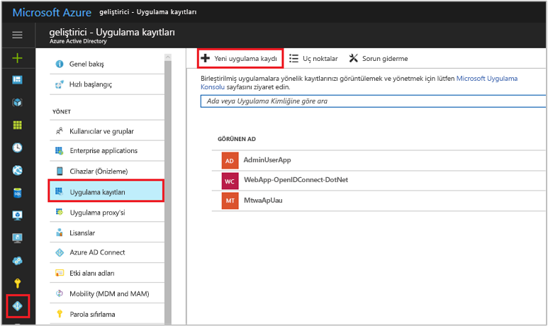
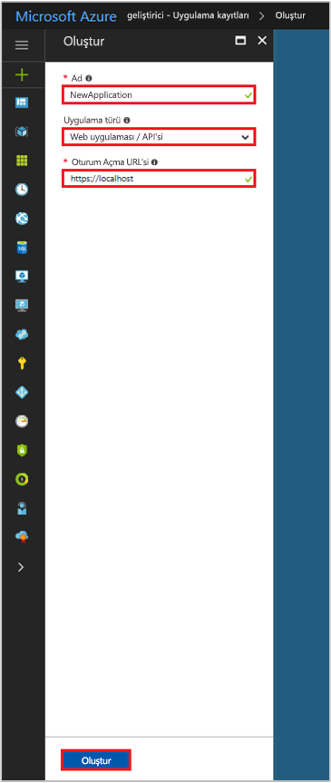

# <a name="integrating-applications-with-azure-active-directory"></a>Uygulamaları Azure Active Directory ile tümleştirme

[!INCLUDE [active-directory-develop-applies-v1](../../../includes/active-directory-develop-applies-v1.md)]

Kurumsal geliştiriciler ve hizmet olarak yazılım-a-(SaaS) sağlayıcıları geliştirebilir ticari bulut Hizmetleri veya Azure Active Directory (güvenli oturum açma ve yetkilendirme sağlamak için Azure AD) ile tümleştirilebilen satır iş kolu uygulamaları için kendi Hizmetler. Bir geliştirici bir uygulama veya hizmeti Azure AD ile tümleştirmek için Azure AD ile uygulama önce kaydetmeniz gerekir.

Bu makalede, eklemek, güncelleştirmek ya da Azure AD'de bir uygulama kaydı Kaldır işlemini göstermektedir. Azure AD ile tümleştirilebilen uygulamaları farklı türleri hakkında bilgi edinin, uygulamalarınızı, web API'leri ve daha fazlası gibi diğer kaynaklarına erişmek için yapılandırma.

Kayıtlı bir uygulama ve aralarındaki ilişkiyi temsil eden iki Azure AD nesnesi hakkında daha fazla bilgi için bkz: [uygulama nesneleri ve hizmet sorumlusu nesneleri](app-objects-and-service-principals.md); gerektiğini markalama talimatları hakkında daha fazla bilgi için Azure Active Directory ile uygulamalar geliştirirken kullanmak [tümleşik uygulamalar için marka yönergelerini](howto-add-branding-in-azure-ad-apps.md).

## <a name="adding-an-application"></a>Bir uygulama eklendiğinde

Azure AD özelliklerini kullanmak istediği herhangi bir uygulamadan önce bir Azure AD kiracısında kayıtlı olması gerekir. Azure AD'ye nerede, bir kullanıcının kimliği doğrulandıktan sonra yanıtların gönderileceği URL URL gibi uygulamanızın ayrıntılarını vererek kayıt işlemini içerir uygulama ve benzeri tanımlayan URI.

### <a name="to-register-a-new-application-using-the-azure-portal"></a>Azure portalını kullanarak yeni bir uygulamayı kaydetme

1. [Azure Portal](https://portal.azure.com) oturum açın.
2. Kiracı, birden fazla erişim, sağ üst köşedeki hesabınızı tıklayın ve istenen Azure AD'ye portal oturumunuzu ayarlama, hesap sağlar.
3. Sol gezinti bölmesinden **Azure Active Directory** hizmeti ye **uygulama kayıtları**, tıklatıp **yeni uygulama kaydı**.

   

4. Zaman **Oluştur** sayfası görüntülenirse, uygulamanızın kayıt bilgilerini girin: 

  - **Ad:** anlamlı uygulama adı girin
  - **Uygulama türü:** 
    - "Yerel" seçin [istemci uygulamaları](developer-glossary.md#client-application) yüklenen yerel olarak bir cihazda. Bu ayar için OAuth ortak kullanılır [yerel istemci](developer-glossary.md#native-client).
    - Seçin "Web uygulaması / API'si" için [istemci uygulamaları](developer-glossary.md#client-application) ve [kaynak/API uygulamaları](developer-glossary.md#resource-server) güvenli bir sunucuya yüklenir. Bu ayar, OAuth gizli kullanılır [web istemcileri](developer-glossary.md#web-client) ve genel [kullanıcı aracı tabanlı istemciler](developer-glossary.md#user-agent-based-client). Aynı uygulama aynı zamanda hem istemci hem de kaynak/API'si üzerinden kullanıma sunabilirsiniz.
  - **Oturum açma URL'si:** için "Web uygulaması / API'si" uygulamaları, uygulamanızın temel URL'si girin. Örneğin, `http://localhost:31544` yerel makinenizde çalışan bir web uygulaması URL'si olabilir. Kullanıcılar, bir web istemci uygulamasına oturum açmak için bu URL'yi kullanmanız gerekir. 
  - **Yeniden yönlendirme URI'si:** "Yerel" uygulamaları için Azure AD'nin belirteç yanıtlarını döndürmek için kullanılan URI girin. Uygulamanıza özgü bir değer girin, örneğin `http://MyFirstAADApp`

   

   Web uygulamaları veya yerel uygulamalar için belirli örnekler isterseniz, kullanıma sunduğumuz [hızlı başlangıçlar](azure-ad-developers-guide.md#get-started).

5. Tamamladığınızda **Oluştur**’a tıklayın. Azure AD uygulamanız için benzersiz bir uygulama kimliği atar ve uygulamanızın ana kayıt sayfasına yönlendirilirsiniz. Uygulamanız bir web veya yerel uygulama olmasına bağlı olarak, uygulamanıza ek özellikler eklemek için farklı seçenekler sunulur. Ek yapılandırma özellikleri, uygulama kaydı (kimlik bilgileri, etkin oturum açma için diğer kiracılardan kullanıcıların izinleri) etkinleştirme hakkında genel bir bakış için sonraki bölüme onay ve ayrıntıları bakın

  > [!NOTE]
  > Varsayılan olarak, yeni kaydettiğiniz web uygulamasına izin vermek için yapılandırılmış **yalnızca** uygulamanıza oturum açmak için aynı kiracıda kullanıcılar.

## <a name="updating-an-application"></a>Bir uygulamayı güncelleştirme

Uygulamanızı Azure AD'ye kayıtlı sonra web API'lerine erişim sağlamak için diğer kuruluşlar ve daha fazla kullanılabilir güncelleştirilmesi gerekebilir. Bu bölümde, uygulamanızın daha fazla yapılandırabileceğiniz çeşitli yolları açıklar. İlk olarak biz diğer kullanıcıları veya uygulamalar tarafından kullanılması gerekir. uygulamaları oluştururken anlamak önemlidir onay çerçevesine genel bir bakış ile başlayın.

### <a name="overview-of-the-consent-framework"></a>Onay çerçevesine genel bakış

Azure AD onay çerçevesine, çok kiracılı web ve yerel istemci uygulamaları geliştirmeyi kolaylaştırır. Bu uygulamalar, uygulama kayıtlı olduğu farklı Azure AD kiracısı oturum açma ana kadar kullanıcı hesapları tarafından tanır. Web API (Azure Active Directory, Intune ve Office 365 hizmetlerinde erişmek için) Microsoft Graph API gibi ve web API'leri yanı sıra diğer Microsoft Hizmetleri API'leri erişmek de gerekebilir. Bir kullanıcı veya yönetici içerebilir directory verilerine erişme, dizinde kayıtlı ister bir uygulamaya onay vermiş framework dayanır.

Örneğin, web istemci uygulaması, Office 365'ten Takvim kullanıcı hakkındaki bilgileri okumak gerekiyorsa kullanıcı istemci uygulama ilk onayı gerekli. İzin verilen sonra istemci uygulaması kullanıcı adına Microsoft Graph API'sini çağırmak ve Takvim bilgileri gerektiğinde mümkün olacaktır. [Microsoft Graph API](https://graph.microsoft.io) (takvimler ve Exchange, siteler ve SharePoint, OneDrive belgelerden, Planner, Excel çalışma kitaplarından görevlerinden OneNote Not defterlerinden listelerinden iletileri gibi Office 365'te verilere erişim sağlar. , kullanıcılar ve grupları Azure ad ve diğer veri nesneleri daha fazla Microsoft bulut hizmetlerinden yanı sıra vb.). 

Genel ya da gizli istemciler kullanarak Yetkilendirme kodu verme ve istemci kimlik bilgileri verin gibi onay çerçevesine OAuth 2.0 ve kendi çeşitli akışlar üzerinde oluşturulmuştur. OAuth 2.0 kullanarak Azure AD, telefon, tablet, sunucu veya bir web uygulaması gibi farklı türlerde istemci uygulamaları oluşturmak ve gerekli kaynaklara erişmesini mümkün kılar.

Onay çerçevesine OAuth2.0 yetkilendirme vermeleri ile kullanma hakkında daha fazla bilgi için bkz. [OAuth 2.0 ve Azure AD kullanarak web uygulamalarına erişim yetkisi verme](v1-protocols-oauth-code.md) ve [AzureADiçinkimlikdoğrulamasenaryoları](authentication-scenarios.md). Microsoft Graph aracılığıyla Office 365 için yetkili erişim sağlama hakkında daha fazla bilgi için bkz: [Microsoft Graph ile uygulama kimlik doğrulamasını](https://graph.microsoft.io/docs/authorization/auth_overview).

#### <a name="example-of-the-consent-experience"></a>Onayı deneyimi örneği

Aşağıdaki adımlar nasıl onayı deneyimi uygulama geliştiriciler ve kullanıcı için çalıştığını gösterir.

1. Belirli bir kaynak/API'sine erişim izni istemek için gereken bir web istemci uygulaması olduğunu kabul edelim. Sonraki bölümde bu yapılandırmayı geçekleştirmeden öğreneceksiniz ancak temelde Azure portalı, yapılandırma sırasında izin isteklerini bildirmek için kullanılır. Diğer yapılandırma ayarları gibi uygulamanın Azure AD kaydı bir parçası haline gelir:
   
  
    
2. Uygulama izinleri güncelleştirildi, uygulamayı çalıştıran ve bir kullanıcı ilk kez kullanmak hakkında sağlamaktır göz önünde bulundurun. İlk Azure AD'den ait bir yetkilendirme kodunu almak uygulamanın ihtiyacı `/authorize` uç noktası. Yetkilendirme kodu, ardından belirteci yenileyin ve yeni bir erişim almak için kullanılabilir.

3. Kullanıcı kimliği doğrulanmış, Azure AD'nin değilse `/authorize` için oturum açma uç noktası ister.
   
  

4. Kullanıcı oturum açtıktan sonra Azure AD kullanıcı bir onay sayfası gerekip gerekmediğini belirler. Bu belirleme, kullanıcı (veya onun kuruluşunun yönetici) zaten uygulama onay verilip üzerinde temel alır. Onay zaten verilmedi, Azure AD kullanıcıdan onayı ister ve çalışması için gerekli izinleri görüntüler. Onay iletişim kutusunda görüntülenen izinler kümesini temsilci izinleri Azure portalında seçilen eşleştirin.
   
  

5. Kullanıcıya izin verir. sonra bir yetkilendirme kodu erişim belirteci alma ve yenileme belirteci için kullanılan, uygulamaya döndürülür. [Web API]](web-api.md). Bu akışı hakkında daha fazla bilgi için bkz.

6. Bir yönetici olarak, aynı zamanda tüm kullanıcılar adına uygulamanın temsilci izinleri için kiracınızda onay verebilir. Yönetici onayı onay iletişim kutusunu kiracıdaki her kullanıcı için görüntülenmesini engeller ve yapılabilir [Azure portalında](https://portal.azure.com) Yönetici rolüne sahip kullanıcılar tarafından. Gelen **ayarları** sayfasında uygulamanız için **gerekli izinler** tıklayın **izinleri verin** düğmesi. 

  
    
  > [!NOTE]
  > Açık verme onay kullanarak **izinleri verin** düğmesidir ADAL.js kullanan tek sayfalı uygulamalar için (SPA) şu anda gerekli. Erişim belirteci istendiğinde, aksi takdirde uygulama başarısız olur. 

### <a name="configure-a-client-application-to-access-web-apis"></a>Web API'leri erişmek için bir istemci uygulaması yapılandırma

Kimlik doğrulaması gerektiren bir yetkilendirme verme akışı katılmak (ve bir erişim belirteci almak) web/gizli bir istemci uygulaması için sırada güvenli kimlik bilgileri oluşturmanız gerekir. Azure portal tarafından desteklenen varsayılan kimlik doğrulama yöntemidir istemci kimliği ve gizli anahtarı. Bu bölüm, müşterinizin kimlik bilgileriyle gizli anahtar sağlamak için gerekli yapılandırma adımları kapsar.

Bir istemci bir web API kaynak uygulaması (örneğin, Microsoft Graph API) tarafından sunulan erişebilmeniz için önce ek olarak, onay çerçevesine istemci diğer iznini gerekli alır sağlar istenen izinlere göre. Varsayılan olarak, tüm uygulama izinleri "Windows Azure Active Directory" (Graph API'si) ve "Windows Azure Hizmet Yönetimi API'si" seçebilirsiniz [Graph API'si "oturum açma arama ve salt okunur kullanıcı profili" izni](https://msdn.microsoft.com/Library/Azure/Ad/Graph/howto/azure-ad-graph-api-permission-scopes#PermissionScopeDetails) de varsayılan olarak seçilidir. Office 365'e abone hesaplarına sahip bir kiracıdaki istemcinizi Kaydedilmekte, web API'leri ve SharePoint ve Exchange Online için izinleri seçilebilir. Aralarından seçim yapabileceğiniz [iki tür izinler](developer-glossary.md#permissions) her istenen web API'si için:

- Uygulama izinleri: İstemci uygulamanızı web API'sini doğrudan kendisi (kullanıcı içerik yok) olarak erişmesi gerekir. Bu tür bir izni yönetici onayı gerektirir ve ayrıca yerel istemci uygulamaları için kullanılabilir değildir.

- Temsilci izinleri: İstemci uygulamanızı web API'si oturum açmış kullanıcı olarak, ancak seçilen izinle sınırlı erişimi olan erişmesi gerekir. Yönetici onayı izni gerektirmediği sürece bu tür bir izni bir kullanıcı tarafından verilebilir. 

  > [!NOTE]
  > Temsilci atanmış izin, bir uygulamaya ekleme otomatik onay Kiracı içindeki kullanıcılar tanımaz. Yönetici, tüm kullanıcılar adına izin veren sürece kullanıcılar çalışma zamanında, eklenen Temsilcili izinler için yine de el ile onaylamalıdır.

#### <a name="to-add-application-credentials-or-permissions-to-access-web-apis"></a>Uygulama kimlik bilgileri veya web API'lerine erişim izni eklemek için

1. [Azure Portal](https://portal.azure.com) oturum açın.
2. Kiracı, birden fazla erişim, sağ üst köşedeki hesabınızı tıklayın ve istenen Azure AD'ye portal oturumunuzu ayarlama, hesap sağlar.
3. Sol gezinti bölmesinden **Azure Active Directory** hizmeti ye **uygulama kayıtları**, sonra bulma/tıklatın yapılandırmak istediğiniz uygulama.

   

4. Açılan uygulamanın ana kayıt sayfasına yönlendirilirsiniz **ayarları** uygulama sayfası. Web uygulamanız için bir kimlik bilgisi eklemek için:
  - Tıklayın **anahtarları** bölümünde **ayarları** sayfası. 
  - Bir sertifika eklemek için:
    - Seçin **ortak anahtarı karşıya**.
    - Yüklemek istediğiniz dosyayı seçin. Aşağıdaki dosya türlerinden biri olmalıdır: .cer, .pem, .crt.
  - Bir parola eklemek için:
    - Anahtarınız için bir açıklama ekleyin.
    - Bir süre seçin.
    - **Kaydet**’e tıklayın. Yapılandırma değişiklikleri kaydettikten sonra en sağdaki sütun anahtar değerini içerir. **Anahtarı kopyaladığınızdan emin olun** istemci uygulama kodunuzda kullanmak için bir kez erişilebilir olmadığından bu sayfadan ayrılmadan.

5. Kaynak API'leri istemcinizden erişmek için izinler eklemek için
  - Tıklayın **gerekli izinler** bölümünde **ayarları** sayfası. 
  - **Ekle** düğmesine tıklayın.
  - Tıklayın **bir API seçin** arasından istediğiniz kaynak türünü seçin.
  - Kullanılabilir API'ler listesine göz atın veya bir web API'sini kullanıma sunan kullanılabilir kaynak uygulamalardan dizininizdeki seçmek için arama kutusunu kullanın. İlgilendiğiniz ve'ı tıklatın, kaynağa tıklayın **seçin**.
  - Adresine yönlendirilirsiniz **erişimini etkinleştir** sayfası. Uygulama izinleri ve/veya API erişirken uygulamanızın ihtiyaç duyduğu izinleri için temsilci seçin.
   
  

  

6. İşiniz bittiğinde tıklayın **seçin** düğmesini **erişimini etkinleştir** sayfasında, ardından **Bitti** düğmesini **API erişimi Ekle** sayfası. Döndürülürsünüz **gerekli izinler** sayfasında, yeni kaynak API'ler listesine eklenen burada.

### <a name="configuring-a-resource-application-to-expose-web-apis"></a>Web API'leri kullanıma sunmak için bir kaynak uygulaması yapılandırma

Web API'si geliştirin ve istemci uygulamaları için erişim göstererek kullanabilmesi [kapsamları](developer-glossary.md#scopes) ve [rolleri](developer-glossary.md#roles). Doğru şekilde yapılandırılmış bir web API'si yalnızca diğer Microsoft web gibi API'leri, Graph API'sini ve Office 365 API'leri dahil olmak üzere kullanıma sunulmaktadır. Erişim kapsamları ve rolleri aracılığıyla sunulur, [uygulamanın bildirim](developer-glossary.md#application-manifest), uygulamanızın kimlik yapılandırması temsil eden bir JSON dosyası olduğu. 

Aşağıdaki bölümde, kaynak uygulama bildirimini değiştirerek erişim kapsamları kullanıma işlemini göstermektedir.

#### <a name="adding-access-scopes-to-your-resource-application"></a>Erişim kapsamları kaynak uygulamanıza ekleme

1. [Azure Portal](https://portal.azure.com) oturum açın.
2. Kiracı, birden fazla erişim, sağ üst köşedeki hesabınızı tıklayın ve istenen Azure AD'ye portal oturumunuzu ayarlama, hesap sağlar.

3. Sol gezinti bölmesinden **Azure Active Directory** hizmeti ye **uygulama kayıtları**, sonra bulma/tıklatın yapılandırmak istediğiniz uygulama.

   

4. Açılan uygulamanın ana kayıt sayfasına yönlendirilirsiniz **ayarları** uygulama sayfası. Geçiş **düzenleme bildirimi** sayfasındaki **bildirim** uygulama kayıt sayfasında. Olanak tanıyan web tabanlı bir bildirim düzenleyicisinde açar **Düzenle** Portal bildirimi. İsteğe bağlı olarak, tıklayabilirsiniz **indirme** ve yerel olarak düzenlemek ve ardından kullanmak **karşıya** uygulamanızı uygulamak için.

5. Bu örnekte biz adlı yeni bir kapsam açığa çıkarır `Employees.Read.All` kaynak/aşağıdaki JSON öğesine ekleyerek API'mizi üzerinde `oauth2Permissions` koleksiyonu. Varolan `user_impersonation` kapsamı, kayıt sırasında varsayılan olarak sağlanır. `user_impersonation` altında oturum açmış kullanıcının kimliğini kaynağa erişim izni istemek bir istemci uygulaması sağlar. Virgülden sonra varolan eklediğinizden emin olun `user_impersonation` kapsam öğesi ve özellik değerlerini kaynağınızın gereksinimlerinize uyacak şekilde değiştirin. 

  ```json
  {
    "adminConsentDescription": "Allow the application to have read-only access to all Employee data.",
    "adminConsentDisplayName": "Read-only access to Employee records",
    "id": "2b351394-d7a7-4a84-841e-08a6a17e4cb8",
    "isEnabled": true,
    "type": "User",
    "userConsentDescription": "Allow the application to have read-only access to your Employee data.",
    "userConsentDisplayName": "Read-only access to your Employee records",
    "value": "Employees.Read.All"
  }
  ```
  > [!NOTE]
  > "ID" değeri bir GUID üretme aracı gibi kullanarak oluşturulabilir [GUIDgen](https://msdn.microsoft.com/library/ms241442%28v=vs.80%29.aspx) veya programlama yoluyla. Web API'si tarafından gösterilen kapsamı için benzersiz bir tanımlayıcı gösterir. İstemci web API'nizi erişim izinleriyle birlikte uygun şekilde yapılandırıldıktan sonra Azure AD tarafından bir OAuth2.0 erişim belirteci verilir. İstemci web API çağrıları, bu kapsamı (scp) sahip bir erişim belirteci gösterdiğinde talep kendi uygulama kaydında istenen izinleri ayarlayın.
  >
  > Ek kapsamların daha sonra gerektiğinde kullanıma sunabilirsiniz. Web API'nizi çeşitli farklı işlevler ile ilişkili birden çok kapsam sunabileceğinize göz önünde bulundurun. Kaynağınızı çalışma zamanında, Web API'sine erişim kapsamı değerlendirerek denetleyebilirsiniz (`scp`) alınan OAuth 2.0 erişim belirtecinde talep.
  > 

6. İşiniz bittiğinde tıklayın **Kaydet**. Artık web API'nizi dizininizdeki başka uygulamalar tarafından kullanılmak üzere yapılandırılmıştır. 

  

#### <a name="verify-the-web-api-is-exposed-to-other-applications-in-your-tenant"></a>Web API, kiracınızın diğer uygulamalarda maruz doğrulayın
1. Git'a tıklayın, Azure AD kiracısına **uygulama kayıtları** yeniden sonra bulma/yapılandırmak istediğiniz istemci uygulamayı tıklatın.

   

2. Yaptığınız gibi 5. adımı yineleyin [web API'lerine erişmek için bir istemci uygulamasını yapılandırmak](#configure-a-client-application-to-access-web-apis). Ulaştığınızda **bir API seçin** tıklayın adım ve arama alanına uygulama adını girerek bir kaynak arama **seçin**. 

3. Üzerinde **erişimini etkinleştir** istemci izin istekleri için kullanılabilir yeni kapsam gördüğünüz sayfası.

  

#### <a name="more-on-the-application-manifest"></a>Uygulama bildirimi hakkında daha fazla bilgi

Uygulama bildirimi, aslında Bahsettiğimiz API erişim kapsamları dahil olmak üzere Azure AD uygulama kimliği yapılandırması, tüm özniteliklerini tanımlayan uygulama varlığı güncelleştirmek için bir mekanizma olarak işlev görür. Uygulama varlığı ve şeması hakkında daha fazla bilgi için bkz. [Graph API uygulaması entity belgeleri](https://msdn.microsoft.com/Library/Azure/Ad/Graph/api/entity-and-complex-type-reference#application-entity). Makale, API'niz için izinleri belirlemek için kullanılan uygulama varlık üyeleri tam başvuru bilgileri içerir dahil olmak üzere:  

- Bir koleksiyonu appRoles üyesi, [AppRole](https://msdn.microsoft.com/Library/Azure/Ad/Graph/api/entity-and-complex-type-reference#approle-type) tanımlamak için kullanılan varlıkları [uygulama izinleri](developer-glossary.md#permissions) web API'si için. 
- Bir koleksiyon olan oauth2Permissions üyesi, [OAuth2Permission](https://msdn.microsoft.com/Library/Azure/Ad/Graph/api/entity-and-complex-type-reference#oauth2permission-type) tanımlamak için kullanılan varlıkları [temsilci izinleri](developer-glossary.md#permissions) web API'si için.

Uygulama hakkında daha fazla bilgi için kavramlar genel bildirimi, bkz: [Azure Active Directory Uygulama bildirimini anlama](reference-app-manifest.md).

### <a name="accessing-the-azure-ad-graph-and-office-365-via-microsoft-graph-apis"></a>Azure AD Graph ve Office 365 Microsoft Graph API'leri aracılığıyla erişme  

Gösterme/API'leri kendi uygulamalarınız için erişmenin yanı sıra daha önce belirtildiği gibi istemci uygulamanızı Microsoft kaynakları tarafından kullanıma sunulan API'lere kaydedebilirsiniz. Microsoft Graph API, adlandırılan portal'ın kaynak/API listesinde, "Microsoft Graph" gibi Azure AD'ye kayıtlı tüm uygulamalar için kullanılabilir. İstemci uygulamanızı bir Office 365 aboneliği için kaydolup, hesaplarını içeren bir kiracıdaki kaydediyorsanız, çeşitli Office 365 kaynaklar tarafından kullanıma sunulan kapsamları da erişebilirsiniz.

Microsoft Graph API'si tarafından kullanıma sunulan kapsamlardaki tam açıklama için bkz [Microsoft Graph izinleri başvurusu](https://developer.microsoft.com/en-us/graph/docs/concepts/permissions_reference) makalesi.

> [!NOTE]
> Geçerli bir sınırlama nedeniyle, "kuruluşunuzun dizininde erişim" izni kullanıyorlarsa yerel istemci uygulamaları Azure AD Graph API yalnızca çağırabilirsiniz. Bu kısıtlama, web uygulamaları için geçerli değildir.

### <a name="configuring-multi-tenant-applications"></a>Çok kiracılı uygulamaları yapılandırma

Azure AD'de bir uygulama kaydı sırasında uygulamanızı yalnızca kuruluşunuzdaki kullanıcılar tarafından erişilmek üzere isteyebilirsiniz. Alternatif olarak, uygulamanızın dış kuruluşlardaki tarafından erişilebilir olmasını isteyebilirsiniz. Bu iki uygulama türleri, tek kiracılı ve çok kiracılı uygulamalar olarak adlandırılır. Bu bölümde, çok kiracılı bir uygulama sağlamak için bir tek kiracılı uygulama yapılandırmasının nasıl değiştirileceği açıklanmaktadır.

Tek kiracılı ve çok kiracılı bir uygulama arasındaki farklılıkları göz önünde bulundurmanız önemlidir:  

- Tek kiracılı bir uygulama, bir kuruluştaki kullanıma yöneliktir. Genellikle, bir kurumsal geliştirici tarafından yazılan satır iş kolu (LoB) uygulaması olan. Tek kiracılı bir uygulama, yalnızca uygulama kaydı ile aynı kiracıda bir hesabı olan kullanıcılar tarafından erişilebilir. Sonuç olarak, bu yalnızca bir dizine hazırlanması gerekir.
- Çok kiracılı bir uygulama, pek çok kuruluşta kullanıma yöneliktir. Başvurulan bir hizmet olarak yazılım (SaaS) web uygulaması olarak, genellikle bağımsız yazılım satıcısı (ISV) tarafından yazılmış olduğu. Çok kiracılı uygulamaları burada kullanıcılar erişmesi gereken her kiracıda sağlanması gerekir. Farklı uygulama burada kayıtlı kiracılarında, bunları kaydetmek için kullanıcı veya yönetici onayı gereklidir. Kaynak sahibinin cihaz üzerinde yüklü yerel istemci uygulamalar varsayılan olarak çok kiracılı olduğunu unutmayın. Önceki bkz [onay çerçevesine genel bakış](#overview-of-the-consent-framework) onay çerçevesine hakkında ayrıntılı bilgi için bölüm.

Bir uygulamayı çok kiracılı yaparak her iki uygulama kayıt değişiklikleri gerektirir yanı web uygulama kendisini değiştirir. Aşağıdaki bölümlerde her ikisi de kapsar.

#### <a name="changing-the-application-registration-to-support-multi-tenant"></a>Çok kiracılı desteklemek için uygulama kaydı değiştirme

Müşterilerinize veya kuruluşunuz dışındaki iş ortakları için kullanılabilir yapmak istediğiniz bir uygulama yazıyorsanız, Azure portalında uygulama tanımını güncelleştirmeniz gerekiyor.

> [!IMPORTANT]
> Azure AD uygulama kimliği URI'si çok kiracılı uygulamaların genel olarak benzersiz olması gerekir. Uygulama Kimliği URI'si, uygulamanın iletişim kuralı iletileri içinde tanımlanan yollardan biridir. Tek kiracılı bir uygulama için uygulama kimliği URI'Sİ'ın bu kiracıda benzersiz olması için yeterli. Azure AD uygulama tüm kiracılarda bulabilmesi için çok kiracılı bir uygulama için genel olarak benzersiz olmalıdır. Azure AD kiracısının doğrulanmış bir etki alanıyla eşleşen bir konak adı uygulama kimliği URI'si gerektirerek genel benzersizlik zorlanır. Örneğin, kiracınızın adını contoso.onmicrosoft.com geçerli ise uygulama kimliği URI'si olması https://contoso.onmicrosoft.com/myapp. Kiracınızda doğrulanmış bir etki alanı contoso.com olan sonra geçerli bir uygulama kimliği URI'si de https://contoso.com/myapp. Çok kiracılı başarısız olarak bir uygulama ayarı bu düzen uygulama kimliği URI'si izleyin değil ise.
> 

Dış kullanıcılar uygulamanızı erişim vermek için: 

1. [Azure Portal](https://portal.azure.com) oturum açın.
2. Kiracı, birden fazla erişim, sağ üst köşedeki hesabınızı tıklayın ve istenen Azure AD'ye portal oturumunuzu ayarlama, hesap sağlar.
3. Sol gezinti bölmesinden **Azure Active Directory** hizmeti ye **uygulama kayıtları**, sonra bulma/tıklatın yapılandırmak istediğiniz uygulama. Açılan uygulamanın ana kayıt sayfasına yönlendirilirsiniz **ayarları** uygulama sayfası.
4. Gelen **ayarları** sayfasında **özellikleri** değiştirip **çok kiracılı** geçin **Evet**.

Değişiklikleri yaptıktan sonra kullanıcıların ve yöneticilerin diğer kuruluşlardaki uygulamanızı kendi Kiracı tarafından güvenli hale getirilmiş kaynaklara erişmesine izin vererek, kullanıcıların uygulamanıza oturum açmak için hakkı da verebilirsiniz.

#### <a name="changing-the-application-to-support-multi-tenant"></a>Çok kiracılı destekleyecek şekilde değiştirme

Çok kiracılı uygulamalar için destek, Azure AD onay çerçevesine üzerinde yoğun olarak kullanır. Onay kaynaklarına kullanıcının Kiracı tarafından güvenli uygulama erişimi vermek için başka bir kiracıdaki bir kullanıcıya izin veren mekanizmadır. Bu deneyim "kullanıcı onay." olarak adlandırılır

Web uygulamanız aynı zamanda teklif edebilir:

- Özelliği "Benim şirket imzalamak." Yöneticiler için İçin "yönetici onayı" adlandırılır, bu deneyimi Yönetici adına izin verme olanağı sunar. *tüm kullanıcılar* kuruluşlarındaki. Genel yönetici rolüne ait bir hesapla kimlik doğrulayan bir kullanıcı, yönetici onayı sağlayabilir. diğer bir hata alırsınız.

- Kullanıcılar için bir kayıt deneyimi. Kullanıcı için Azure AD OAuth2.0 tarayıcı yönlendireceği bir "kayıt" düğme sağlanır beklenir `/authorize` uç nokta veya Openıd Connect `/userinfo` uç noktası. Bu uç noktaları id_token inceleyerek yeni kullanıcı hakkındaki bilgileri elde etmek için uygulamaya izin verin. Kullanıcı de gösterilene benzer bir onay istemi ile sunulur kaydolma aşama aşağıdaki [onay çerçevesine genel bakış](#overview-of-the-consent-framework) bölümü.

Çok kiracılı erişim ve oturum-içinde açma/kaydolma deneyimlerini desteklemek için gereken uygulama değişiklikleri ile ilgili daha fazla bilgi için bkz:

- [Çok kiracılı uygulama desenini kullanarak istediğiniz bir Azure Active Directory (AD) kullanıcısı ile oturum açma](howto-convert-app-to-be-multi-tenant.md)
- Listesini [çok kiracılı kod örnekleri](https://azure.microsoft.com/documentation/samples/?service=active-directory&term=multi-tenant). 
- [Hızlı Başlangıç: Azure AD'de, oturum açma sayfası markalama şirket ekleme](../fundamentals/customize-branding.md)

### <a name="enabling-oauth-20-implicit-grant-for-single-page-applications"></a>Etkinleştirme OAuth 2.0 örtük tek sayfalı uygulamalar için verme

Tek sayfa uygulamaları (Spa'lar), genellikle uygulamanın web API'si çağıran iş mantığını gerçekleştirmek için arka uç tarayıcıda çalışan bir JavaScript ağır ön ucu ile yapılandırılmıştır. Azure AD'de barındırılan Spa'lar için kullanıcının Azure AD ile kimlik doğrulaması ve uygulamanın JavaScript istemci çağrıları, arka uç web API'si güvenliğini sağlamak için kullanabileceğiniz bir belirteç almak için OAuth 2.0 örtülü izin kullanın. 

Kullanıcı onayı verildi sonra bu aynı kimlik doğrulama protokolü, uygulama için yapılandırılan API'si kaynaklarına istemci ve diğer web arasındaki çağrıların güvenliğini sağlamak için belirteçleri elde etmek için kullanılabilir. Örtük yetki verme hakkında daha fazla bilgi edinin ve Uygulama senaryonuz için doğru olup olmadığını karar vermenize yardımcı olması için bkz: [anlama OAuth2 örtük verme flow'da Azure Active Directory](v1-oauth2-implicit-grant-flow.md).

Varsayılan olarak, OAuth 2.0 örtülü izin uygulamalar için devre dışıdır. Uygulamanız için OAuth 2.0 örtülü izin ayarlayarak etkinleştirebilirsiniz `oauth2AllowImplicitFlow` değerini kendi [uygulama bildirimini](reference-app-manifest.md).

#### <a name="to-enable-oauth-20-implicit-grant"></a>OAuth 2.0 örtülü izin etkinleştirmek için

> [!NOTE]
> Uygulama bildirimini düzenleme hakkında ayrıntılar için önceki bölümde önce gözden geçirdiğinizden emin [kullanıma sunmak için bir kaynak uygulaması web API'lerini](#configuring-a-resource-application-to-expose-web-apis).

1. [Azure Portal](https://portal.azure.com) oturum açın.
2. Kiracı, birden fazla erişim, sağ üst köşedeki hesabınızı tıklayın ve istenen Azure AD'ye portal oturumunuzu ayarlama, hesap sağlar.
3. Sol gezinti bölmesinden **Azure Active Directory** hizmeti ye **uygulama kayıtları**, sonra bulma/tıklatın yapılandırmak istediğiniz uygulama. Açılan uygulamanın ana kayıt sayfasına yönlendirilirsiniz **ayarları** uygulama sayfası.
4. Geçiş **düzenleme bildirimi** sayfasındaki **bildirim** uygulama kayıt sayfasında. Olanak tanıyan web tabanlı bir bildirim düzenleyicisinde açar **Düzenle** Portal bildirimi. Bulun ve "oauth2AllowImplicitFlow" değeri "true" olarak ayarlayın Varsayılan olarak, "false" olarak ayarlanır
   
  ```json
  "oauth2AllowImplicitFlow": true,
  ```
5. Güncelleştirilmiş bildirimini kaydedin. Kaydedildikten sonra kullanıcıların kimlik doğrulaması için OAuth 2.0 örtülü izin kullanmak için web API'niz artık yapılandırılmıştır.

## <a name="removing-an-application"></a>Uygulama kaldırma

Bu bölümde, Azure AD kiracınızda uygulama kaydını kaldırmak açıklar.

### <a name="removing-an-application-authored-by-your-organization"></a>Kuruluşunuz tarafından yazılmış bir uygulamayı kaldırma

Kuruluşunuzun kayıtlı uygulamalar altında görünür kiracınızın ana "uygulama kayıtları" sayfasındaki "Uygulamalarım" filtresi. Bu Azure portalından veya programlama yoluyla PowerShell veya Graph API'si aracılığıyla el ile kayıtlı olanları uygulamalardır. Özellikle, bunlar kiracınızdaki hem bir bir uygulama ve hizmet sorumlusu nesnesi tarafından temsil edilir. Daha fazla bilgi için [uygulama nesneleri ve hizmet sorumlusu nesneleri](app-objects-and-service-principals.md).

#### <a name="to-remove-a-single-tenant-application-from-your-directory"></a>Tek kiracılı bir uygulama, dizinden kaldırmak için

1. [Azure Portal](https://portal.azure.com) oturum açın.
2. Kiracı, birden fazla erişim, sağ üst köşedeki hesabınızı tıklayın ve istenen Azure AD'ye portal oturumunuzu ayarlama, hesap sağlar.
3. Sol gezinti bölmesinden **Azure Active Directory** hizmeti ye **uygulama kayıtları**, sonra bulma/tıklatın yapılandırmak istediğiniz uygulama. Açılan uygulamanın ana kayıt sayfasına yönlendirilirsiniz **ayarları** uygulama sayfası.
4. Uygulamanın ana kayıt sayfasında, **Sil**.
5. Tıklayın **Evet** onay iletisi.

#### <a name="to-remove-a-multi-tenant-application-from-its-home-directory"></a>Çok kiracılı bir uygulama, giriş dizininden kaldırmak için

1. [Azure Portal](https://portal.azure.com) oturum açın.
2. Kiracı, birden fazla erişim, sağ üst köşedeki hesabınızı tıklayın ve istenen Azure AD'ye portal oturumunuzu ayarlama, hesap sağlar.
3. Sol gezinti bölmesinden **Azure Active Directory** hizmeti ye **uygulama kayıtları**, sonra bulma/tıklatın yapılandırmak istediğiniz uygulama. Açılan uygulamanın ana kayıt sayfasına yönlendirilirsiniz **ayarları** uygulama sayfası.
4. Gelen **ayarları** sayfasında **özellikleri** değiştirip **çok kiracılı** geçin **Hayır**, ilk uygulamanızı değiştirmek için tek kiracılı ardından **Kaydet**. Uygulama hizmet sorumlusu nesneleri kiracılar için zaten onaylı tüm kuruluşların kalır.
5. Tıklayarak **Sil** uygulamanın ana kayıt sayfasından düğmesi.
6. Tıklayın **Evet** onay iletisi.

### <a name="removing-a-multi-tenant-application-authorized-by-another-organization"></a>Çok kiracılı bir uygulama tarafından başka bir kuruluştaki yetki kaldırma

Bir alt kümesi, "Tüm uygulamalar" Filtresi altında görünen uygulamaların (hariç "Uygulamalarım" kayıtları) kiracınızın ana "Uygulama kayıtları" sayfasında, çok kiracılı uygulamalardır. Teknik terimlerle bu çok kiracılı uygulamaları başka bir kiracıdaki olan ve kiracınızda oturum onayı işlemi sırasında kaydedilmiş. Özellikle, bunlar tarafından yalnızca bir hizmet sorumlusu nesnesi, kiracınızdaki karşılık gelen hiçbir uygulama nesnesi ile temsil edilir. Uygulama ve hizmet sorumlusu nesneleri arasındaki farklar hakkında daha fazla bilgi için bkz. [uygulaması ve Azure AD'de hizmet sorumlusu nesneleri](app-objects-and-service-principals.md).

(İzin verilen sonra), dizininize çok kiracılı uygulamanızın erişimi kaldırmak için şirket Yöneticisi, hizmet sorumlusu kaldırmanız gerekir. Yönetici gerekir genel yönetici erişimine sahip ve Azure portalı üzerinden kaldırın veya kullanın [Azure AD PowerShell cmdlet'leri](http://go.microsoft.com/fwlink/?LinkId=294151).

## <a name="next-steps"></a>Sonraki adımlar

- Azure AD'de kimlik doğrulaması birlikte nasıl çalıştığı hakkında daha fazla bilgi için bkz. [Azure AD için kimlik doğrulama senaryoları](authentication-scenarios.md).
- Bkz: [tümleşik uygulamalar için marka yönergelerini](howto-add-branding-in-azure-ad-apps.md) uygulamanız için görsel kılavuz ilişkin ipuçları için.
- Bir uygulamanın uygulama ve hizmet sorumlusu nesneleri arasındaki ilişki hakkında daha fazla bilgi için bkz. [uygulama nesneleri ve hizmet sorumlusu nesneleri](app-objects-and-service-principals.md).
- Uygulama bildirim yürütür rolü hakkında daha fazla bilgi edinmek için [Azure Active Directory Uygulama bildirimini anlama](reference-app-manifest.md)
- Bkz: [Azure AD Geliştirici sözlüğü](developer-glossary.md) Azure AD Geliştirici kavramları bazılarının tanımları için.
- Ziyaret [Active Directory Geliştirici Kılavuzu](azure-ad-developers-guide.md) Geliştirici ile ilgili tüm içeriği genel bakış.
