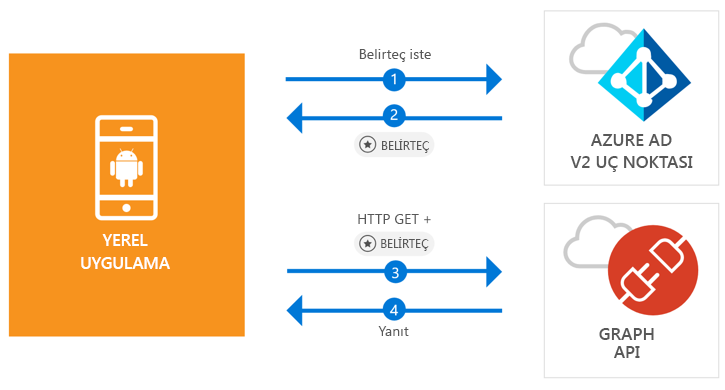

# <a name="quickstart-sign-in-users-and-call-the-microsoft-graph-api-from-an-android-app"></a>Hızlı başlangıç: Android uygulamasından kullanıcıların oturum açma ve Microsoft Graph API'sini çağırma

[!INCLUDE [active-directory-develop-applies-v2-msal](../../../includes/active-directory-develop-applies-v2-msal.md)]

Bu hızlı başlangıç, bir Android uygulaması ile kişisel, iş ve okul hesaplarının oturumunu açmayı, erişim belirteci almayı ve Microsoft Graph API’sini çağırmayı gösteren bir kod örneği içerir.



> [!NOTE]
> **Önkoşullar**
> * Android Studio 3 veya üzeri
> * Android SDK 21 veya üzeri gerekir (SDK 27 önerilir)

> [!div renderon="docs"]
> ## <a name="register-and-download"></a>Kaydolma ve indirme
> ### <a name="register-and-configure-your-application-and-code-sample"></a>Uygulamanızı ve kod örneğinizi kaydedip yapılandırma
> #### <a name="step-1-register-your-application"></a>1. Adım: Uygulamanızı kaydetme
> Uygulamanızı kaydetmek ve uygulama kayıt bilgilerinizi çözümünüze eklemek için aşağıdakileri yapın:
> 1. Uygulamayı kaydetmek için [Microsoft Uygulama Kayıt Portalı](https://apps.dev.microsoft.com/portal/register-app)’na gidin.
> 1. **Uygulama Adı** kutusuna uygulamanız için bir ad girin.
> 1. **Destekli Kurulum** onay kutusunun boş olduğundan emin olun ve **Oluştur**’u seçin.
> 1. **Platform Ekle**’yi, **Yerel Uygulama**’yı ve **Kaydet**’i seçin.

> [!div renderon="portal" class="sxs-lookup"]
> #### <a name="step-1-configure-your-application"></a>1. Adım: Uygulamanızı yapılandırma
> Bu hızlı başlangıçtaki kod örneğinin çalışması için, **msal{AppId}://auth** gibi bir yanıt URL'si eklemelisiniz (burada {AppId}, uygulamanızın kimliğidir).
> > [!div renderon="portal" id="makechanges" class="nextstepaction"]
> > [Bu değişikliği benim için yap]()
>
> > [!div id="appconfigured" class="alert alert-info"]
> >  Uygulamanız bu özniteliklerle yapılandırılmış

#### <a name="step-2-download-the-project"></a>2. Adım: Projeyi indirme

* [Android Studio Projesini İndirme](https://github.com/Azure-Samples/active-directory-android-native-v2/archive/master.zip)

#### <a name="step-3-configure-your-project"></a>3. Adım: Projenizi yapılandırma

1. Projeyi ayıklayın ve Android Studio’da açın.
1. **app** > **java** > **<i>{host}.{namespace}</i>** öğesinin altındaki **MainActivity**'yi açın.
1. `final static String CLIENT_ID` ile başlayan satırın yerine aşağıdakini koyun:

    > [!div renderon="portal" class="sxs-lookup"]
    > ```java
    > final static String CLIENT_ID = "ENTER_THE_APPLICATION_ID_HERE";
    > ```

    > [!div renderon="docs"]
    > ```java
    > final static String CLIENT_ID = "<ENTER_THE_APPLICATION_ID_HERE>";
    > ```

1. Open: **app** > **manifests** > **AndroidManifest.xml**.
1. Aşağıdaki etkinliği **manifest\application** düğümüne ekleyin. Bu kod parçacığı, kimlik doğrulaması tamamlandıktan sonra işletim sisteminin uygulamanızı sürdürmesini sağlamak için bir **BrowserTabActivity** kaydeder:

    > [!div renderon="docs"]
    > ```xml
    > <!--Intent filter to capture System Browser calling back to our app after Sign In-->
    > <activity
    >     android:name="com.microsoft.identity.client.BrowserTabActivity">
    >     <intent-filter>
    >         <action android:name="android.intent.action.VIEW" />
    >         <category android:name="android.intent.category.DEFAULT" />
    >         <category android:name="android.intent.category.BROWSABLE" />
    > 
    >         <!--Add in your scheme/host from registered redirect URI-->
    >         <!--By default, the scheme should be similar to 'msal[appId]' -->
    >         <data android:scheme="msal<ENTER_THE_APPLICATION_ID_HERE>"
    >             android:host="auth" />
    >     </intent-filter>
    > </activity>
    > ```

    > [!div renderon="portal" class="sxs-lookup"]
    > ```xml
    > <!--Intent filter to capture System Browser calling back to our app after Sign In-->
    > <activity
    >     android:name="com.microsoft.identity.client.BrowserTabActivity">
    >     <intent-filter>
    >         <action android:name="android.intent.action.VIEW" />
    >         <category android:name="android.intent.category.DEFAULT" />
    >         <category android:name="android.intent.category.BROWSABLE" />
    > 
    >         <!--Add in your scheme/host from registered redirect URI-->
    >         <!--By default, the scheme should be similar to 'msal[appId]' -->
    >         <data android:scheme="msalENTER_THE_APPLICATION_ID_HERE"
    >             android:host="auth" />
    >     </intent-filter>
    > </activity>
    > ```

> [!div renderon="docs"]
> <span>6.</span> `<ENTER_THE_APPLICATION_ID_HERE>` kısmını uygulamanız için olan *Uygulama Kimliği* ile değiştirin. *Uygulama Kimliği*’ni bulmanız gerekiyorsa *Genel Bakış* sayfasına gidin.

## <a name="more-information"></a>Daha Fazla Bilgi

Bu hızlı başlangıç hakkında daha fazla bilgi için aşağıdaki bölümleri okuyun.

### <a name="msal"></a>MSAL

MSAL ([com.microsoft.identity.client](http://javadoc.io/doc/com.microsoft.identity.client/msal)) kullanıcıların oturumlarını açmak için kullanılan kitaplığı ve Microsoft Azure Active Directory (Azure AD) tarafından korunan bir API’ye erişmek için kullanılan istek belirteçlerini içerir. Bunu Gradle kullanarak yüklemek için, **Bağımlılıklar**'ın altında **Gradle Betikleri** > **build.gradle (Module: app)** içine aşağıdaki ekleyebilirsiniz:

```gradle  
implementation 'com.android.volley:volley:1.1.1'
implementation 'com.microsoft.identity.client:msal:0.1.+'
```

### <a name="msal-initialization"></a>MSAL başlatma

Şu kodu ekleyerek MSAL başvurusunu ekleyebilirsiniz:

```java
import com.microsoft.identity.client.*;
```

Sonra da şu kodu kullanarak MSAL başlatın:

```java
sampleApp = new PublicClientApplication(
        this.getApplicationContext(),
        CLIENT_ID);
```

> |Konumlar: ||
> |---------|---------|
> |`CLIENT_ID` | *portal.azure.com* adresinde kayıtlı uygulamaya ait Uygulama Kimliği |

### <a name="requesting-tokens"></a>Belirteç isteme

MSAL’in belirteç almak için kullanılan iki yöntemi vardır: `acquireToken` ve `acquireTokenSilentAsync`

#### <a name="getting-a-user-token-interactively"></a>Kullanıcı belirtecini etkileşimli olarak alma

Bazı durumlarda kullanıcıları Azure AD v.2.0 uç noktasıyla etkileşimde bulunmaya zorlamak gerekebilir ve bu da kullanıcının kimlik bilgilerinin doğrulanmasına ya da onayı için sistem tarayıcısına bağlam geçişine neden olur. Bazı örnekler:

* Kullanıcılar uygulamada ilk kez oturum açtığında
* Parolanın süresi dolduğundan kullanıcıların kimlik bilgilerini yeniden girmesi gerektiğinde
* Uygulamanız kullanıcının onaylaması gereken bir kaynağa erişim istediğinde
* İki öğeli kimlik doğrulama gerektiğinde

```java
sampleApp.acquireToken(this, SCOPES, getAuthInteractiveCallback());
```

> |Konumlar:||
> |---------|---------|
> | `SCOPES` | İstenen kapsamları barındırır (Microsoft Graph için `{ "user.read" }` veya Web API’leri için `{ "<Application ID URL>/scope" }` (başka bir deyişle `api://<Application ID>/access_as_user`) |
> | `getAuthInteractiveCallback` | Kimlik doğrulamasından sonra denetim uygulamaya geri verildiğinde yürütülen geri arama |

#### <a name="getting-a-user-token-silently"></a>Kullanıcı belirtecini sessizce alma

Kullanıcının bir kaynağa her erişmesi gerektiğinde kimlik bilgilerini doğrulamak zorunda kalmasını istemezsiniz. Çoğu zaman belirteç alımları ve yenilemelerinin kullanıcı etkileşimi olmadan gerçekleşmesini istersiniz. İlk `acquireToken` yönteminden sonra korumalı kaynaklara erişecek belirteçleri almak için `AcquireTokenSilentAsync` yöntemini kullanabilirsiniz:

```java
sampleApp.acquireToken(getActivity(), SCOPES, getAuthInteractiveCallback());
```

> |Konumlar:||
> |---------|---------|
> | `SCOPES` | İstenen kapsamları barındırır (Microsoft Graph için `{ "user.read" }` veya Web API’leri için `{ "<Application ID URL>/scope" }` (başka bir deyişle `api://<Application ID>/access_as_user`) |
> | `getAuthInteractiveCallback` | Kimlik doğrulamasından sonra denetim uygulamaya geri verildiğinde yürütülen geri arama |

## <a name="next-steps"></a>Sonraki adımlar

### <a name="learn-the-steps-to-create-the-application-used-in-this-quickstart"></a>Bu hızlı başlangıçta kullanılan uygulamayı oluşturma adımlarını öğrenin

Uygulama oluşturma işlemiyle ve yeni özelliklerle ilgili eksiksiz adım adım yönergeleri almak için Android öğreticisini deneyin. Orada, bu hızlı başlangıcın tam açıklaması da yer alır.

> [!div class="nextstepaction"]
> [Çağrı Grafı API'si Android öğreticisi](https://docs.microsoft.com/azure/active-directory/develop/guidedsetups/active-directory-android)

### <a name="msal-for-android-library-wiki"></a>Android için MSAL kitaplığı wiki'si

Android için MSAL kitaplığı hakkındaki diğer yazıları okuyun:

> [!div class="nextstepaction"]
> [Android için MSAL kitaplığı wiki'si](https://github.com/AzureAD/microsoft-authentication-library-for-android/wiki)

[!INCLUDE [Help and support](../../../includes/active-directory-develop-help-support-include.md)]