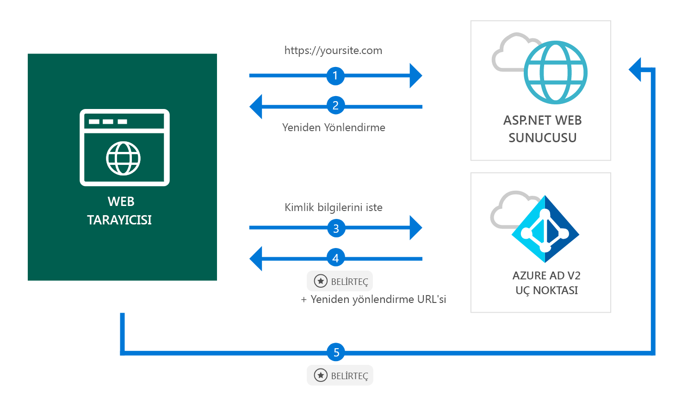

# <a name="quickstart-add-sign-in-with-microsoft-to-an-aspnet-web-app"></a>Hızlı Başlangıç: Microsoft ile ASP.NET web uygulamasına oturum açma ekleme

[!INCLUDE [active-directory-develop-applies-v2](../../../includes/active-directory-develop-applies-v2.md)]

Bu hızlı başlangıçta, ASP.NET web uygulamasının herhangi bir Azure Active Directory (Azure AD) örneğinden kişisel hesaplarda (hotmail.com, outlook.com ve diğerleri), iş ve okul hesaplarında nasıl oturum açabildiğini öğreneceksiniz.



> [!div renderon="docs"]
> ## <a name="register-your-application-and-download-your-quickstart-app"></a>Uygulamanızı kaydetme ve hızlı başlangıç uygulamanızı indirme
>
> ### <a name="register-and-configure-your-application-and-code-sample"></a>Uygulamanızı ve kod örneğinizi kaydedip yapılandırma
> #### <a name="step-1-register-your-application"></a>1. Adım: Uygulamanızı kaydetme
> 
> 1. [Microsoft Uygulama Kayıt Portalı](https://apps.dev.microsoft.com/portal/register-app)'na gidin.
> 1. Uygulamanız için bir ad girin, **Destekli Kurulum** seçeneğinin işaretli olmadığından emin olun ve **Oluştur**’a tıklayın.
> 1. `Add Platform` seçeneğine tıklayın ve `Web` öğesini seçin.
> 1. **Örtük Akışa İzin Ver**’in *işaretli* olduğundan emin olun.
> 1. **Yeniden Yönlendirme URL’leri** için `https://localhost:44368/` girin.
> 1. Sayfanın en altına kaydırın ve **Kaydet**’e tıklayın.

> [!div class="sxs-lookup" renderon="portal"]
> #### <a name="step-1-configure-your-application-in-azure-portal"></a>1. Adım: Uygulamanızı Azure portalında yapılandırma
> Bu hızlı başlangıçtaki kod örneğinin çalışması için `https://localhost:44368/` gibi bir yanıt URL’si eklemeniz gerekir.
> > [!div renderon="portal" id="makechanges" class="nextstepaction"]
> > [Bu değişikliği benim için yap]()
>
> > [!div id="appconfigured" class="alert alert-info"]
> >  Uygulamanız bu öznitelikle yapılandırılmış

#### <a name="step-2-download-your-project"></a>2. Adım: Projenizi indirme

[Visual Studio 2017 çözümünü indirme](https://github.com/AzureADQuickStarts/AppModelv2-WebApp-OpenIDConnect-DotNet/archive/master.zip)

#### <a name="step-3-configure-your-visual-studio-project"></a>3. Adım: Visual Studio projenizi yapılandırma

1. Zip dosyasını yerel bir klasöre (örneğin, **C:\Azure-Samples**) ayıklayın
1. Çözümü Visual Studio’da açın (AppModelv2-WebApp-OpenIDConnect-DotNet.sln)
1. **Web.config** dosyasını düzenleyin ve `Enter_the_Application_Id_here` öğesini yeni kaydettiğiniz uygulamaya ait Uygulama Kimliği ile değiştirin:

    ```xml
    <add key="ClientId" value="Enter_the_Application_Id_here" />
    ```
    
> [!div class="sxs-lookup" renderon="portal"]
> [!IMPORTANT]
> Uygulamanız *tek kiracılı bir uygulamaysa* (hedeflenen hesaplar yalnızca bu dizinde), **Web.config** dosyanızda `Tenant` değerini bulun ve `common` değerini size ait **Kiracı Kimliği** veya **Kiracı adı** (örneğin, contoso.microsoft.com) ile değiştirin. Kiracı adını **Genel Bakış sayfasından** alabilirsiniz.

## <a name="more-information"></a>Daha fazla bilgi

Bu bölümde, kullanıcıların oturumunu açmak için gereken koda genel bir bakış sağlanır. Hem kodun nasıl çalıştığını ve ana bağımsız değişkenleri anlamak için hem de mevcut ASP.NET uygulamasına oturum açma eklemek istediğinizde bu yararlı olabilir.

### <a name="owin-middleware-nuget-packages"></a>OWIN ara yazılımı NuGet paketleri

OWIN Ara Yazılımı paketleriyle ASP.NET’te OpenID Connect’i kullanarak, tanımlama bilgisi tabanlı kimlik doğrulamasıyla kimlik doğrulaması işlem hattını ayarlayabilirsiniz. Visual Studio’nun **Paket Yöneticisi Konsolu**’nda şu komutları çalıştırarak bu paketleri yükleyebilirsiniz:

```powershell
Install-Package Microsoft.Owin.Security.OpenIdConnect
Install-Package Microsoft.Owin.Security.Cookies
Install-Package Microsoft.Owin.Host.SystemWeb
```

### <a name="owin-startup-class"></a>OWIN Startup Sınıfı

OWIN ara yazılımı, ana işlem başlatıldığında yürütülen *startup sınıfını* kullanır (bu hızlı başlangıç örneğinde, kök klasörde bulunan *startup.cs* dosyası). Aşağıdaki kod bu hızlı başlangıcın kullandığı parametreyi gösterir:

```csharp
public void Configuration(IAppBuilder app)
{
    app.SetDefaultSignInAsAuthenticationType(CookieAuthenticationDefaults.AuthenticationType);

    app.UseCookieAuthentication(new CookieAuthenticationOptions());
    app.UseOpenIdConnectAuthentication(
        new OpenIdConnectAuthenticationOptions
        {
            // Sets the ClientId, authority, RedirectUri as obtained from web.config
            ClientId = clientId,
            Authority = authority,
            RedirectUri = redirectUri,
            // PostLogoutRedirectUri is the page that users will be redirected to after sign-out. In this case, it is using the home page
            PostLogoutRedirectUri = redirectUri,
            Scope = OpenIdConnectScope.OpenIdProfile,
            // ResponseType is set to request the id_token - which contains basic information about the signed-in user
            ResponseType = OpenIdConnectResponseType.IdToken,
            // ValidateIssuer set to false to allow personal and work accounts from any organization to sign in to your application
            // To only allow users from a single organizations, set ValidateIssuer to true and 'tenant' setting in web.config to the tenant name
            // To allow users from only a list of specific organizations, set ValidateIssuer to true and use ValidIssuers parameter 
            TokenValidationParameters = new TokenValidationParameters()
            {
                ValidateIssuer = false
            },
            // OpenIdConnectAuthenticationNotifications configures OWIN to send notification of failed authentications to OnAuthenticationFailed method
            Notifications = new OpenIdConnectAuthenticationNotifications
            {
                AuthenticationFailed = OnAuthenticationFailed
            }
        }
    );
}
```

> |Konum  |  |
> |---------|---------|
> | `ClientId`     | Azure portalına kaydedilen uygulamaya ait Uygulama Kimliği |
> | `Authority`    | Kimlik doğrulaması yapılacak kullanıcı için STS uç noktası. Çoğunlukla, genel bulut için https://login.microsoftonline.com/{tenant}/v2.0; burada {tenant}, kiracınızın adı, kiracınızın kimliği veya ortak uç noktaya başvuru olarak *common* değeridir (çok kiracılı uygulamalarda kullanılır) |
> | `RedirectUri`  | Azure AD v2.0 uç noktasında kimlik doğrulaması yapıldıktan sonra kullanıcıların gönderildiği URL |
> | `PostLogoutRedirectUri`     | Oturum kapatıldıktan sonra kullanıcıların gönderildiği URL |
> | `Scope`     | İstenen kapsamların listesi, boşlukla ayrılmış |
> | `ResponseType`     | Kimlik doğrulamadan gelen yanıtın kimlik belirteci içerdiği istek |
> | `TokenValidationParameters`     | Belirteç doğrulaması için parametre listesi. Bu durumda, tüm kişisel, iş veya okul hesabı türleriyle yapılan okurum açma işlemlerini kabul edebileceğini belirtmek için `ValidateIssuer` `false` olarak ayarlanır |
> | `Notifications`     | Farklı *OpenIdConnect* iletilerinde yürütülebilen temsilcilerin listesi |

### <a name="initiate-an-authentication-challenge"></a>Kimlik doğrulaması sınamasını başlatma

Denetleyicinizde kimlik doğrulaması sınaması isteyerek kullanıcıyı oturum açmaya zorlayabilirsiniz:

```csharp
public void SignIn()
{
    if (!Request.IsAuthenticated)
    {
        HttpContext.GetOwinContext().Authentication.Challenge(
            new AuthenticationProperties{ RedirectUri = "/" },
            OpenIdConnectAuthenticationDefaults.AuthenticationType);
    }
}
```

> [!TIP]
> Yukarıdaki yöntem kullanılarak kimlik doğrulaması sınamasının istenmesi isteğe bağlıdır ve normalde hem kimlik doğrulamalı hem de kimlik doğrulamasız kullanıcıların erişebildiği bir görünüm istediğinizde kullanılır. Alternatif olarak, bir sonraki bölümde açıklanan yöntemle denetleyicileri koruyabilirsiniz.

### <a name="protect-a-controller-or-a-controllers-method"></a>Denetleyiciyi veya denetleyici yöntemini koruma

Denetleyiciyi veya denetleyici eylemlerini `[Authorize]` özniteliğini kullanarak koruyabilirsiniz. Bu öznitelik, yalnızca kimliği doğrulanmış kullanıcıların denetleyicideki eylemlere erişmesine izin vererek denetleyiciye veya eylemlere erişimi kısıtlar. Başka bir deyişle kimlik doğrulama sınaması, *kimliği doğrulanmamış* bir kullanıcı `[Authorize]` özniteliğini içeren eylemlerden birine veya denetleyiciye erişmeyi denediğinde otomatik olarak gerçekleşir.

## <a name="next-steps"></a>Sonraki adımlar

Bu hızlı başlangıcın tam bir açıklamasının da içinde olduğu yeni özellikleri ve uygulamaları oluşturma hakkında eksiksiz adım adım kılavuz için ASP.NET öğreticisini deneyin.

### <a name="learn-the-steps-to-create-the-application-used-in-this-quickstart"></a>Bu hızlı başlangıçta kullanılan uygulamayı oluşturma adımlarını öğrenin

> [!div class="nextstepaction"]
> [Oturum açma öğreticisi](.\tutorial-v2-asp-webapp.md)

[!INCLUDE [Help and support](../../../includes/active-directory-develop-help-support-include.md)]