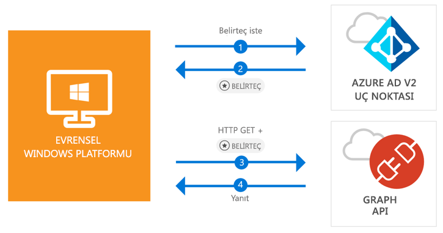

# <a name="quickstart-call-the-microsoft-graph-api-from-a-universal-windows-platform-uwp-application"></a>Hızlı Başlangıç: Evrensel Windows Platformu (UWP) uygulamasından Microsoft Graph API'sini çağırma

[!INCLUDE [active-directory-develop-applies-v2-msal](../../../includes/active-directory-develop-applies-v2-msal.md)]

Bu hızlı başlangıç, bir Evrensel Windows Platformu (UWP) uygulaması ile kişisel, iş ve okul hesaplarıyla kullanıcıların oturumunu açmayı, erişim belirteci almayı ve Microsoft Graph API’sini çağırmayı gösteren bir kod örneği içerir.



> [!div renderon="docs"]
> ## <a name="register-and-download-your-quickstart-app"></a>Hızlı başlangıç uygulamanızı kaydetme ve indirme
> [!div renderon="docs" class="sxs-lookup"]
> Hızlı başlangıç uygulamanızı başlatmak için kullanabileceğiniz iki seçenek vardır:
> * [Hızlı] [1. Seçenek: Uygulamanızı otomatik olarak kaydedip yapılandırma ve ardından kod örneğinizi indirme](#option-1-register-and-auto-configure-your-app-and-then-download-your-code-sample)
> * [El ile] [2. Seçenek: Uygulamanızı ve kod örneğinizi el ile kaydetme ve yapılandırma](#option-2-register-and-manually-configure-your-application-and-code-sample)
>
> ### <a name="option-1-register-and-auto-configure-your-app-and-then-download-your-code-sample"></a>1. Seçenek: Uygulamanızı otomatik olarak kaydedip yapılandırın ve ardından kod örneğinizi indirin
>
> 1. [Azure portal - Uygulama Kaydı](https://portal.azure.com/?Microsoft_AAD_RegisteredApps=true#blade/Microsoft_AAD_RegisteredApps) sayfasına gidin
> 1. Uygulamanız için bir ad girin ve **Kaydet**'e tıklayın.
> 1. Yönergeleri izleyerek yeni uygulamanızı tek tıkla indirin ve otomatik olarak yapılandırın.
>
> ### <a name="option-2-register-and-manually-configure-your-application-and-code-sample"></a>2. Seçenek: Uygulamanızı ve kod örneğinizi el ile kaydetme ve yapılandırma
> [!div renderon="docs"]
> #### <a name="step-1-register-your-application"></a>1. Adım: Uygulamanızı kaydetme
> Uygulamanızı kaydetmek ve uygulama kayıt bilgilerinizi çözümünüze eklemek için şu adımları izleyin:
> 1. Bir iş veya okul hesabını ya da kişisel bir Microsoft hesabını kullanarak [Azure portalda](https://portal.azure.com) oturum açın.
> 1. Hesabınız size birden fazla Azure AD kiracısına erişim sunuyorsa sağ üst köşeden hesabınızı seçin ve portal oturumunuzu istediğiniz Azure AD kiracısına ayarlayın.
> 1. Sol taraftaki gezinti bölmesinde **Azure Active Directory** hizmetini seçin ve ardından **Uygulama kayıtları (Önizleme)** > **Yeni kayıt** seçeneğini belirleyin.
> 1. **Uygulama kaydet** sayfası göründüğünde uygulamanızın kayıt bilgilerini girin:
>      - **Ad** alanına uygulama kullanıcılarına gösterilecek anlamlı bir uygulama adı girin, örneğin `UWP-App-calling-MsGraph`.
>      - **Desteklenen hesap türleri** bölümünde **Herhangi bir kuruluş dizinindeki hesaplar ve kişisel Microsoft hesapları (ör. Skype, Xbox, Outlook.com)** seçeneğini belirtin.
>      - Uygulamayı kaydetmek için **Kaydet**'i seçin.
> 1. Uygulama sayfa listesinde **Kimlik doğrulaması**'nı seçin.
> 1. **Yeniden yönlendirme URL'leri** bölümünde **Ortak istemciler (mobil, masaüstü) için önerilen Yeniden Yönlendirme URI'leri** altında **"urn:ietf:wg:oauth:2.0:oob** girişini seçin.
> 1. **Kaydet**’i seçin.

> [!div renderon="portal" class="sxs-lookup alert alert-info"]
> #### <a name="step-1-configure-your-application"></a>1. Adım: Uygulamanızı yapılandırma
> Bu hızlı başlangıç kod örneğinin çalışması için **urn:ietf:wg:oauth:2.0:oob** gibi bir yeniden yönlendirme URI’si eklemeniz gerekir.
> > [!div renderon="portal" id="makechanges" class="nextstepaction"]
> > [Bu değişikliği benim için yap]()
>
> > [!div id="appconfigured" class="alert alert-info"]
> >  Uygulamanız bu özniteliklerle yapılandırılmış.

#### <a name="step-2-download-your-visual-studio-project"></a>2. Adım: Visual Studio projenizi indirme

 - [Visual Studio 2017 projesini indirin](https://github.com/Azure-Samples/active-directory-dotnet-native-uwp-v2/archive/master.zip)

#### <a name="step-3-configure-your-visual-studio-project"></a>3. Adım: Visual Studio projenizi yapılandırma

1. Zip dosyasını diskin köküne yakın bir yerel klasöre (örneğin **C:\Azure-Samples**) ayıklayın.
1. Projeyi Visual Studio'da açın.
1. **App.Xaml.cs** dosyasını düzenleyin ve `ClientId` ile `Tenant` alanlarının değerlerini şunlarla değiştirin:

    ```csharp
    private static string ClientId = "Enter_the_Application_Id_here";
    private static string Tenant = "Enter_the_Tenant_Info_Here";
    ```

> [!div renderon="docs"]
> Konumlar:
> - `Enter_the_Application_Id_here` - Kaydettiğiniz uygulamanın Uygulama Kimliği değeridir.
> - `Enter_the_Tenant_Info_Here` - Aşağıdaki seçeneklerden biridir:
>   - Uygulamanız **Yalnızca kuruluşum** yaklaşımını destekliyorsa bu değeri **Kiracı Kimliği** veya **Kiracı adı** (örneğin, contoso.microsoft.com) ile değiştirin
>   - Uygulamanız **Herhangi bir kuruluş dizinindeki hesaplar** yaklaşımını destekliyorsa bu değeri `organizations` ile değiştirin
>   - Uygulamanız **Tüm Microsoft hesabı kullanıcıları** yaklaşımını destekliyorsa bu değeri `common` ile değiştirin
>
> > [!TIP]
> > *Uygulama Kimliği*, *Dizin (kiracı) Kimliği* ve *Desteklenen hesap türleri* değerlerini bulmak için **Genel bakış** sayfasına gidin

## <a name="more-information"></a>Daha fazla bilgi

Bu bölümde hızlı başlangıç hakkında daha fazla bilgi verilmektedir.

### <a name="msalnet"></a>MSAL.NET

MSAL ([Microsoft.Identity.Client](https://www.nuget.org/packages/Microsoft.Identity.Client)) kullanıcı oturumlarını açmak ve Microsoft Azure Active Directory tarafından korunan bir API'ye erişmek için kullanılan belirteçler istemek için kullanılan kitaplıktır. MSAL kitaplığını Visual Studio'nun *Paket Yöneticisi Konsolu*'nda aşağıdaki komutu çalıştırarak yükleyebilirsiniz:

```powershell
Install-Package Microsoft.Identity.Client -Pre
```

### <a name="msal-initialization"></a>MSAL başlatma

Şu kodu ekleyerek MSAL başvurusunu ekleyebilirsiniz:

```csharp
using Microsoft.Identity.Client;
```

Sonra şu kodu kullanarak MSAL'yi başlatın:

```csharp
public static PublicClientApplication PublicClientApp = new PublicClientApplication(ClientId);
```

> |Konumlar: ||
> |---------|---------|
> | `ClientId` | **Uygulama (istemci) Kimliği**, Azure portalda kayıtlı uygulamadır. Bu değeri Azure portalda uygulamanın **Genel bakış** sayfasında bulabilirsiniz. |

### <a name="requesting-tokens"></a>Belirteç isteme

MSAL, belirteç almak için iki yönteme sahiptir: `AcquireTokenAsync` ve `AcquireTokenSilentAsync`.

#### <a name="get-a-user-token-interactively"></a>Etkileşimli olarak kullanıcı belirteci alma

Bazı durumlar, kimlik bilgilerini doğrulamaları veya onay vermeleri için, açılan bir pencere aracılığıyla kullanıcıların Azure AD v2.0 uç noktasıyla etkileşmeye zorlanmasını gerektirir. Bazı örnekler:

- Kullanıcılar uygulamada ilk kez oturum açtığında
- Parolanın süresi dolduğundan kullanıcıların kimlik bilgilerini yeniden girmesi gerektiğinde
- Uygulamanız kullanıcının onaylaması gereken bir kaynağa erişim istediğinde
- İki faktörlü kimlik doğrulama gerektiğinde

```csharp
authResult = await App.PublicClientApp.AcquireTokenAsync(scopes);
```

> |Konumlar:||
> |---------|---------|
> | `scopes` | İstenen kapsamları (Microsoft Graph için `{ "user.read" }` veya özel Web API'leri için `{ "api://<Application ID>/access_as_user" }` gibi) barındırır. |

#### <a name="get-a-user-token-silently"></a>Kullanıcı belirtecini sessizce alma

Kullanıcının bir kaynağa her erişmesi gerektiğinde kimlik bilgilerini tekrar doğrulamak zorunda kalmasını istemezsiniz. Çoğu kez, belirteç alma ve yenileme işlemlerinin kullanıcı etkileşimi olmadan gerçekleşmesini istersiniz. Korunan kaynaklara erişmek üzere belirteç almak için, ilk `AcquireTokenAsync` yönteminden sonra `AcquireTokenSilentAsync` yöntemini kullanabilirsiniz:

```csharp
var accounts = await App.PublicClientApp.GetAccountsAsync();
authResult = await App.PublicClientApp.AcquireTokenSilentAsync(scopes, accounts.FirstOrDefault());
```

> |Konumlar: ||
> |---------|---------|
> | `scopes` | İstenen kapsamları (Microsoft Graph için `{ "user.read" }` veya özel Web API'leri için `{ "api://<Application ID>/access_as_user" }` gibi) barındırır |
> | `accounts.FirstOrDefault()` | Önbellekteki ilk kullanıcıyı belirtir (MSAL destekleyen birden çok kullanıcı tek bir uygulama olarak) |

[!INCLUDE [Help and support](../../../includes/active-directory-develop-help-support-include.md)]

## <a name="next-steps"></a>Sonraki adımlar

Bu hızlı başlangıcın tam bir açıklamasının da içinde olduğu yeni özellikleri ve uygulamaları oluşturma hakkında eksiksiz adım adım kılavuz için Windows masaüstü öğreticisini deneyin.

> [!div class="nextstepaction"]
> [UWP - Graph API'si çağırma öğreticisi](tutorial-v2-windows-uwp.md)
