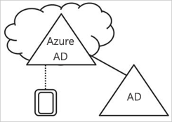
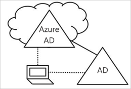

# Azure Active Directory’de cihaz yönetimi nedir?

Mobil ve bulut öncelikli bir dünyada Azure Active Directory (Azure AD) cihazlarda, uygulamalarda ve hizmetlerde dilediğiniz yerden çoklu oturum açma özelliği sağlar. Kendi Cihazını Getir (BYOD) dahil olmak üzere cihazların yaygınlaşmasıyla birlikte BT uzmanları iki karşıt hedef ile karşı karşıya:

- Son kullanıcıların her yerde ve her zaman üretken olmasını sağlama
- Kuruluş varlıklarını her zaman koruma altında tutma

Kullanıcılarınız, cihazlar aracılığıyla kuruluşunuzun varlıklarına erişir. Bir BT yöneticisi olarak, kuruluşunuzun varlıklarını korumak için bu cihazlar üzerinde denetiminiz olmalıdır. Bu sayede kullanıcılarınızın kaynaklarınıza güvenlik ve uyumluluk standartlarınızı karşılayan cihazlardan erişmesini sağlayabilirsiniz.

Cihaz yönetimi, [cihaz tabanlı koşullu erişim](../conditional-access/require-managed-devices.md) senaryolarının da temelini oluşturur. Cihaz tabanlı koşullu erişim sayesinde, ortamınızdaki kaynaklara yalnızca yönetilen cihazlar üzerinden erişilebilmesini sağlayabilirsiniz.

Bu makalede Azure Active Directory'de cihaz yönetiminin nasıl çalıştığı açıklanmaktadır.

> [!VIDEO https://www.youtube.com/embed/NeezfKhomQU]

## Cihazları Azure AD denetimi altına alma

Bir cihazı Azure AD denetimi altına almak için iki seçeneğiniz vardır:

- Kaydetme
- Katma

Cihazı Azure AD’ye **Kaydetme** seçeneğini kullanarak bir cihazın kimliğini yönetebilirsiniz. Bir cihaz kaydedildiğinde, Azure AD cihaz kaydı kullanıcı Azure AD’de oturum açtığında cihazın kimliğini doğrulamak için kullanılan bir kimlik sağlar. Cihazı etkinleştirmek veya devre dışı bırakmak için kimliği kullanabilirsiniz.

Microsoft Intune gibi bir mobil cihaz yönetimi (MDM) çözümü ile birleştirildiğinde Azure AD'deki cihaz öznitelikleri cihaz hakkındaki ek bilgilerle güncelleştirilir. Bu durum, güvenlik ve uyumluluğa yönelik standartlarınızı karşılamak için cihazlardan erişimi zorlayan koşullu erişim kuralları oluşturmanıza olanak sağlar. Microsoft Intune cihazları kaydetme hakkında daha fazla bilgi için bkz: [cihaz kaydı nedir?](https://docs.microsoft.com/intune/device-enrollment)

Bir cihazı **Katma** seçeneği, cihaz kaydının uzantısıdır. Diğer bir ifadeyle bir cihazı kaydetmenin tüm avantajlarını sağlamanın yanında aynı zamanda bir cihazın yerel durumunu da değiştirir. Yerel durumunu değiştirmek, kullanıcılarınıza kişisel hesap yerine kuruluşa ait bir iş veya okul hesabını kullanarak bir cihazda oturum açma seçeneği sağlar.

## Azure AD kayıtlı cihazlar

Azure AD kayıtlı cihazların hedefi, **Kendi Cihazını Getir (BYOD)** senaryosu için destek sağlamaktır. Bu senaryoda, kullanıcı bir kişisel cihaz kullanarak kuruluşunuza ait Azure Active Directory denetimli kaynaklarına erişebilir.  

Erişim, cihazda girilen bir iş veya okul hesabına bağlıdır.  
Örneğin, Windows 10 kullanıcıların bir kişisel bilgisayara, tablete veya telefona iş veya okul hesabı eklemesine olanak sağlar.  
Bir kullanıcı iş veya okul hesabı eklediğinde cihaz, Azure AD ile kaydedilir ve isteğe bağlı olarak kuruluşunuzun yapılandırdığı mobil cihaz yönetimi (MDM) sistemine kaydedilir.
Kuruluşunuzun kullanıcıları kişisel bir cihaza kolaylıkla iş veya okul hesabı ekleyebilir:

- Bir iş uygulamasına ilk kez erişirken
- Windows 10 için, elle **Ayarlar** menüsünden

Windows 10, iOS, Android ve macOS için Azure AD kayıtlı cihazları yapılandırabilirsiniz.

## Azure AD’ye katılmış cihazlar

Azure AD'ye katılmış cihazların hedefi şu işlemlerde basitleştirme sağlamaktır:

- İşe ait cihazların Windows dağıtımları
- Herhangi bir Windows cihazından kuruluş uygulamalarına ve kaynaklarına erişim
- İşe ait cihazların bulut tabanlı yönetimi

Aşağıdaki yöntemlerden birini kullanarak Azure AD'ye Katılım dağıtımı yapılabilir:

- [Windows Autopilot](https://docs.microsoft.com/windows/deployment/windows-autopilot/windows-10-autopilot)
- [Toplu dağıtım](https://docs.microsoft.com/intune/windows-bulk-enroll)
- [Self servis deneyimi](azuread-joined-devices-frx.md)

**Azure AD'ye Katılım**, bulut öncelikli (yani şirket içi altyapı kullanımını azaltma amacıyla birincil olarak bulut hizmetlerini kullanma) veya yalnızca bulut (şirket içi altyapısı bulunmayan) duruma geçmek isteyen kuruluşlar için tasarlanmıştır. Azure AD’ye Katılma dağıtımı sağlayabilecek kuruluşlara ilişkin hiçbir büyüklük veya tür kısıtlaması bulunmamaktadır. Azure AD’ye Katılma özelliği hibrit ortamlarda bile iyi çalışır ve hem bulut hem de şirket içi uygulamalara ve kaynaklara erişim olanağı sağlar.

Azure AD’ye katılmış cihazların uygulanması aşağıdaki avantajları sağlar:

- Azure yönetimli SaaS uygulamalarınızda ve hizmetlerinizde **Çoklu Oturum Açma (SSO)**. Kullanıcılarınız, iş kaynaklarına erişirken ek kimlik doğrulama istemleri görmez. SSO işlevselliğini bile, kullanıcılar etki alanı ağına bağlı olduğunda kullanılabilir.
- Katılan cihazlar arasında kullanıcı ayarlarına ilişkin **Kuruluşa uyumlu dolaşım**. Kullanıcıların cihazlar arasındaki ayarları görüntülemek için bir Microsoft hesabına (örneğin, Hotmail) bağlı olması gerekmez.
- Azure AD hesabı kullanarak **İş için Windows Mağazasına Erişim**. Kullanıcılarınız, kuruluş tarafından önceden seçilen bir uygulama envanterinden seçim yapabilir.
- İş kaynaklarına güvenli ve kolay erişim için **Windows Hello** desteği.
- Uygulamalara yalnızca uyumluluk ilkesine uygun cihazlardan **erişim kısıtlaması**.

- Cihaz şirket içi etki alanı denetleyicisini görebildiğinde, **şirket içi kaynaklara sorunsuz erişim**.

Azure AD’ye katılma özelliği temel olarak bir şirket içi Windows Server Active Directory altyapısı bulunmayan kuruluşlar için tasarlanmıştır ancak aşağıdaki senaryolarda siz de bu özellikten yararlanabilirsiniz:

- Azure AD ve MDM benzeri Intune kullanarak bulut tabanlı altyapıya geçiş yapmak istediğinizde.
- Şirket içi etki alanına katılma özelliğini kullanamadığınız durumlarda; örneğin, tabletler ve telefonlar gibi mobil cihazlar üzerinde denetim sağlamanız gerektiğinde.
- Kullanıcılarınızın temel olarak Office 365 veya Azure AD ile tümleşik diğer SaaS uygulamalarına erişmesi gerektiğinde.
- Active Directory yerine Azure AD’de bir kullanıcı grubunu yönetmek istediğinizde. Bu dönemsel çalışanlar, yükleniciler veya öğrenciler gibi çeşitli gruplar için uygulanabilir.
- Sınırlı şirket içi altyapısı olan uzak şube ofislerindeki çalışanlara katılma özellikleri sağlamak istediğinizde.

Windows 10 cihazları için Azure AD’ye katılmış cihazları yapılandırabilirsiniz.

## Hibrit Azure AD’ye katılmış cihazlar

On yılı aşkın süredir pek çok kuruluş şirket içi Active Directory alanları için etki alanına katılım uygulayarak:

- BT departmanlarının merkezi bir konumdan işe ait cihazları yönetebilmesini sağlamıştır.
- Kullanıcıların Active Directory iş veya okul hesapları ile cihazlarında oturum açabilmesini sağlamıştır.

Genel olarak şirket içi ayak izi olan kuruluşlar cihazları kullanıma almak için görüntüleme yöntemlerinden yararlanır ve bu cihazları yönetmek için çoğunlukla **System Center Configuration Manager (SCCM)** veya **grup ilkesi (GP)** seçeneğini kullanır.

Ortamınızda şirket içi AD ayak izi varsa ve Azure Active Directory ile sağlanan özelliklerden yararlanmak istiyorsanız hibrit Azure AD’ye katılmış cihazları uygulayabilirsiniz. Bunlar şirket içi Active Directory'nize katılmış ve Azure Active Directory'nize kaydedilmiş cihazlardır.

Aşağıdaki durumlarda Azure AD’ye katılmış hibrit cihazları kullanmanız gerekir:

- Active Directory makine kimlik doğrulamasına dayalı bu cihazlara dağıtılan Win32 uygulamalarınız varsa.
- Cihaz yönetimi için GP kullanımını gerekli kılıyorsanız.
- Çalışanlarınız için cihazların yapılandırılmasında görüntüleme çözümlerini kullanmaya devam etmek istiyorsanız.

Windows 10 için Hibrit Azure AD’ye katılmış cihazları ve Windows 8 ve Windows 7 gibi alt düzey cihazları yapılandırabilirsiniz.

## Özet

Azure AD’de cihaz yönetimi ile şunları gerçekleştirebilirsiniz:

- Cihazları Azure AD denetimine alma işlemini basitleştirme
- Kullanıcılarınıza, kuruluşunuzun bulut tabanlı kaynaklarına kolay erişim olanağı sağlama

Genel bir kural olarak şunları kullanmanız gerekir:

- Azure AD kayıtlı cihazlar:
   - Kişisel cihazlar için
   - Azure AD ile cihazları elle kaydetmek için
- Azure AD’ye katılmış cihazlar:
   - Kuruluşunuza ait cihazlar için
   - Bir şirket içi AD’ye **katılmamış** cihazlar için
   - Azure AD ile cihazları elle kaydetmek için
   - Bir cihazın yerel durumunu değiştirmek için
- Bir şirket içi AD’ye katılmış cihazlar için Hibrit Azure AD’ye katılmış cihazlar
   - Kuruluşunuza ait cihazlar için
   - Bir şirket içi AD’ye katılmış cihazlar için
   - Azure AD ile cihazları otomatik olarak kaydetmek için
   - Bir cihazın yerel durumunu değiştirmek için

## Lisans gereksinimleri

[!INCLUDE [Active Directory P1 license](../../../includes/active-directory-p1-license.md)]

## Sonraki adımlar

- Azure portal'da cihaz yönetimine ilişkin genel bir bakış edinmek için bkz. [Azure portal'ı kullanarak cihazları yönetme](device-management-azure-portal.md)
- Cihaz tabanlı koşullu erişim hakkında daha fazla bilgi edinmek için bkz. [Azure Active Directory cihaz tabanlı koşullu erişim ilkelerini yapılandır](../conditional-access/require-managed-devices.md).
- Kurulum için:
   - Azure Active Directory kayıtlı Windows 10 cihazları, bkz. [Azure Active Directory kayıtlı Windows 10 cihazları yapılandırma](../user-help/device-management-azuread-registered-devices-windows10-setup.md)
   - Azure Active Directory’ye katılmış cihazlar, bkz. [Azure Active Directory’ye katılmış cihazları yapılandırma](../user-help/device-management-azuread-joined-devices-setup.md)
   - Hibrit Azure AD’ye katılmış cihazlar, bkz. [Hibrit Azure Active Directory’ye katılma uygulamanızı planlama](hybrid-azuread-join-plan.md).
