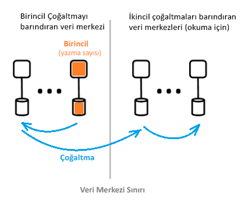

# Azure Active Directory mimarisini nedir?
Azure Active Directory (Azure AD), kullanıcılarınız için Azure hizmet ve kaynaklarına erişimi güvenli bir şekilde yönetmenizi sağlar. Azure AD ile birlikte eksiksiz kimlik yönetimi olanakları sunulur. Azure AD özellikleri hakkında daha fazla bilgi için bkz. [Azure Active Directory nedir?](active-directory-whatis.md)

Azure AD ile kullanıcı ve gruplar oluşturup bunları yönetebilir, ayrıca kurumsal kaynaklara erişim izni vermek ya da erişimi reddetmek için izinleri etkinleştirebilirsiniz. Kimlik yönetimi hakkında bilgi için bkz. [Azure kimlik yönetimi ile ilgili temel bilgiler](active-directory-whatis.md).

## Azure AD mimarisi
Azure AD'nin coğrafi olarak dağıtılmış mimarisi, kapsamlı izleme, otomatik yeniden yönlendirme, yük devretme ve kurtarma özellikleri, şirket genelinde kullanılabilirlik ve performans müşterilere teslim birleştirir.

Bu makalede aşağıdaki mimari öğeler ele alınmaktadır:
 *  Hizmet mimarisi tasarımı
 *  Ölçeklenebilirlik
 *  Sürekli kullanılabilirlik
 *  Veri merkezleri

### Hizmet mimarisi tasarımı
Erişilebilir bir oluşturmanın en yaygın yolu ve veri açısından zengin kullanılabilir sistem bağımsız yapı taşları veya ölçek birimleri. Azure AD veri katmanı ölçek birimleri çağrılır için *bölümler*. 

Veri katmanında, okuma-yazma özelliği sağlayan çok sayıda ön uç hizmeti bulunur. Aşağıdaki diyagramda, tek dizinli bir bölüme bileşenlerinin coğrafi olarak dağıtılmış veri merkezlerine nasıl teslim edildiğini gösterir. 

  

Azure AD mimarisinin bileşenleri, birincil çoğaltma ve ikincil çoğaltma öğelerini içerir.

**Birincil çoğaltma**

*Birincil çoğaltma*, ait olduğu bölüm için *yazma* işlemlerini alır. Her yazma işlemi, çağırana başarılı sonucu döndürmeden önce hemen farklı bir veri merkezindeki ikincil çoğaltmaya çoğaltılır, böylece yazma işlemlerinin coğrafi olarak yedekli dayanıklılığı sağlanır.

**İkincil çoğaltmalar**

Tüm dizin *okur* gelen hizmet *ikincil çoğaltmaları*, fiziksel olarak farklı coğrafi bölgelerde bulunan veri merkezlerinde en olduğu. Veriler zaman uyumsuz olarak kopyalandığı için çok sayıda ikincil çoğaltma vardır. Kimlik doğrulama istekleri gibi dizin okumaları, müşterilere yakın olan veri merkezlerinden sunulur. İkincil çoğaltmalar, okuma ölçeklenebilirliğinden sorumludur.

### Ölçeklenebilirlik

Ölçeklenebilirlik, bir hizmetin artan performans taleplerine göre genişleyebilme becerisidir. Yazma ölçeklenebilirliği, veri bölümlendirilerek sağlanır. Okuma ölçeklenebilirliği, bir bölümden dünyanın dört bir yanına dağıtılmış birden fazla ikincil çoğaltmaya verilerin çoğaltılması yoluyla sağlanır.

Dizin uygulamalarından gelen istekler, fiziksel olarak en yakın oldukları veri merkezine yönlendirilir. Yazma işlemleri, okuma-yazma tutarlılığı sağlamak üzere şeffaf bir şekilde birincil çoğaltmaya yönlendirilir. Dizinler çoğu zaman okuma işlemlerini sunduğundan, ikincil çoğaltmalar bölümlerin ölçeğini önemli ölçüde genişletir.

Dizin uygulamaları en yakın veri merkezlerine bağlanır. Bu bağlantı performansı artırır ve bu nedenle genişletme mümkün olur. Bir dizin bölümünde çok sayıda ikincil çoğaltma olabileceğinden, ikincil çoğaltmalar dizin istemcilerine daha yakın yerleştirilebilir. Yalnızca yazma yoğunluklu olan iç dizin hizmeti bileşenleri, etkin birincil çoğaltmayı doğrudan hedefler.

### Sürekli kullanılabilirlik

Kullanılabilirlik (veya çalışma süresi) bir sistemin kesintisiz çalışma yeteneğini tanımlar. Azure AD'nin yüksek kullanılabilirlik için birden çok coğrafi olarak dağıtılmış veri merkezleri arasında trafiği, hizmetleri hızlı bir şekilde kaydırabilirsiniz anahtardır. Her bir veri merkezi özelliği sayesinde bağıntısız hata modları sağlar, bağımsızdır. Bu yüksek kullanılabilirlik tasarımı Azure AD bakım etkinlikleri için kapalı kalma süresi gerektirir.

Azure AD'nin bölüm tasarımı, Kurumsal dikkatle düzenlenmiş ve belirleyici birincil çoğaltma yük devretme işlemini içeren bir tek yöneticili tasarıma kullanarak AD tasarımına kıyasla basitleştirilmiştir.

**Hataya dayanıklılık**

Bir sistem donanım, ağ ve yazılım hatalarına dayanıklı ise kullanılabilirliği daha yüksektir. Dizin üzerindeki her bölüm için yüksek oranda kullanılabilir bir ana çoğaltma mevcuttur: Birincil çoğaltma. Bu çoğaltma üzerinde yalnızca bölüme yazma işlemleri gerçekleştirilir. Bu çoğaltma sürekli olarak ve yakından izlenirken, bir hata algılanması durumunda yazma işlemleri hemen başka bir çoğaltmaya kaydırılabilir (bu çoğaltma yeni birincil çoğaltma olur). Yük devretme sırasında genellikle 1-2 dakikalık yazma kullanılabilirliği kaybı olabilir. Bu süre boyunca okuma kullanılabilirliği etkilenmez.

Okuma işlemleri (yazma işlemlerinden onlarca kat fazladır) yalnızca ikincil çoğaltmalara gider. İkincil çoğaltmalar bir kez etkili olduğundan, okumalar genellikle aynı veri merkezinde bulunan başka bir çoğaltmaya yönlendirilerek belirli bir bölümdeki herhangi bir çoğaltmanın kaybı kolayca telafi edilebilir.

**Veri dayanıklılığı**

Bir yazma alınıyor, önce en az iki veri merkezlerine getirilir. Bu, ilk olarak yazma işlemi birincil yapılıyor ve ardından hemen yazma en az bir diğer veri merkezine çoğaltma gerçekleşir. Bu yazma eylemi, birincil barındıran veri merkezinde bir yıkıcı kaybın veri kaybıyla sonuçlanmaz olası sağlar.

Azure AD tutar sıfır [kurtarma süresi hedefi (RTO)](https://en.wikipedia.org/wiki/Recovery_time_objective) veri kaybı yaşamayız kaybetmemek için. Buna aşağıdakiler dahildir:
-  Belirteç verme ile dizin okumaları
-  Yalnızca yaklaşık 5 dakika RTO dizin yazma işlemleri için izin verme

### Veri merkezleri

Azure AD çoğaltmaları, dünyanın dört bir yanında bulunan veri merkezlerinde depolanır. Daha fazla bilgi için [küresel Azure altyapısı](https://azure.microsoft.com/global-infrastructure/).

Azure AD aşağıdaki özelliklere sahip veri merkezlerinde çalışır:

 * Kimlik doğrulama, graf ve diğer AD Hizmetleri, Gateway hizmetinin arkasında bulunur. Gateway bu hizmetlerin yük dengelemesini yönetir. İşlemsel durum yoklamaları kullanılarak sorunlu durumda olan sunucuların algılanması durumunda bu üzerinden otomatik olarak başarısız olur. Bu durum yoklamalarına göre Gateway dinamik olarak trafiği sağlıklı veri merkezlerine olarak yönlendirir.
 * İçin *okur*, dizini ikincil çoğaltmalara ve karşılık gelen ön uç hizmetlerine birden çok veri merkezlerinde çalışan bir aktif-aktif yapılandırma vardır. Bir veri merkezinin tamamı hata durumunda, trafiği otomatik olarak farklı bir veri merkezine yönlendirilir.
 *  İçin *Yazar*, dizin birincil (ana) çoğaltmayı veri merkezleri arasında başarısız olur aracılığıyla planlı (yeni birincil, eski birincil ile eşitlenir) veya Acil Durum yük devretme yordamları. Veri dayanıklılığı, herhangi bir işlemenin en az iki veri merkezlerine çoğaltılması yoluyla elde edilir.

**Veri tutarlılığı**

Dizin modeli nihai bunları listeledik biridir. Zaman uyumsuz olarak çoğaltılan dağıtılmış sistemlerle tipik sorunlardan biri, "belirli" bir çoğaltmadan döndürülen verilerin güncel olmayabilir olmasıdır. 

Azure AD, yazma işlemlerini birincil çoğaltmaya yönlendirerek ve eşzamanlı olarak ikincil çoğaltmaya geri çekerek, ikincil çoğaltmayı hedefleyen uygulamalar için okuma-yazma tutarlılığı sağlar.

Azure AD’nin Graph API’sini kullanan uygulama yazma işlemleri, okuma-yazma tutarlılığı için dizin çoğaltması ile benzeşim sağlama yönteminden yararlanır. Azure AD Graph hizmet benzeşimi olan bir mantıksal bir oturum sürdürür; okuma için kullanılan bir ikincil çoğaltmaya benzeşim, graf hizmeti bir veri merkezindeki ikincil çoğaltmaya paylaşılan önbellek kullanarak önbelleğe alan bir "çoğaltma belirtecinde" yakalanır. Bu belirteç aynı mantıksal oturumun daha sonraki işlemleri için kullanılır. Aynı mantıksal oturumun kullanmaya devam etmek için sonraki istekler için aynı Azure AD veri merkezinde yönlendirilmesi gerekir. Dizin istemcisi birden çok Azure AD veri merkezlerine; yönlendiriliyor isterse, mantıksal bir oturum devam etmek mümkün değildir Bu durumda istemci bağımsız okuma-yazma bunları listeledik sahip birden çok mantıksal oturumu vardır.

 >[!NOTE]
 >Yazma işlemleri, mantıksal oturumdaki okumaların verildiği ikincil çoğaltmaya hemen çoğaltılır.
 >

**Yedekleme koruması**

Dizin, bir müşterinin yanlışlıkla silmesi durumunda kolay kurtarma amacıyla kullanıcılar ve kiracılar için sabit silme yerine geçici silme gerçekleştirir. Kullanıcılar Kiracı yöneticinizle yanlışlıkla silerse, bunlar kolayca geri al ve Silinen kullanıcıları geri. 

Azure AD tüm verilerin günlük yedeklemesini yapar ve bu nedenle mantıksal silme veya bozulma durumunda verileri yetkili olarak geri yükleyebilir. Veri katmanı hata kodları, böylece bu için hataları denetleyip disk hatalarının belirli türlerini otomatik olarak düzeltmek düzeltme kullanır.

**Ölçümler ve izleyiciler**

Yüksek oranda kullanılabilir bir hizmetin çalıştırılması için birinci sınıf ölçüm ve izleme özellikleri gerekir. Azure AD, temel hizmet durumu ölçümlerini ve her bir hizmetinin başarı ölçütlerini sürekli olarak analiz edip raporlar. Sürekli geliştirme ve ölçümlerini ayarlama ve izleme ve Azure AD hizmeti içinde ve tüm hizmetlerde her senaryo için uyarı bulunmaktadır.

Herhangi bir Azure AD hizmeti beklendiği gibi çalışmıyorsa, işlevselliği mümkün olan en kısa sürede geri yüklemek için hemen işlem yapılmaz. En önemli bir ölçüm Azure AD ile sorunları algılanabilir ve müşteriler için azaltılabilir ne kadar hızlı Canlı site olur. Algılama süresini azaltmak (TTD Hedefi: <5 dakika) için izleme ve uyarılara, önlem alma süresini azaltmak için (TTM Hedefi: <30 dakika) operasyonel hazırlığa önemli ölçüde yatırım yapıyoruz.

**Güvenli işlemler**

Herhangi bir işlem için çok faktörlü kimlik doğrulaması (MFA) gibi operasyonel denetimlerin kullanma gibi tüm işlemlerin denetimini. Ayrıca, tüm operasyonel görev isteğe bağlı olarak gereken geçici erişimi vermek için tam zamanında yükseltme sistemi kullanıyor. Daha fazla bilgi için bkz. [Güvenilir Bulut](https://azure.microsoft.com/support/trust-center).

## Sonraki adımlar
[Azure Active Directory geliştirici kılavuzu](https://docs.microsoft.com/azure/active-directory/develop/active-directory-developers-guide)

