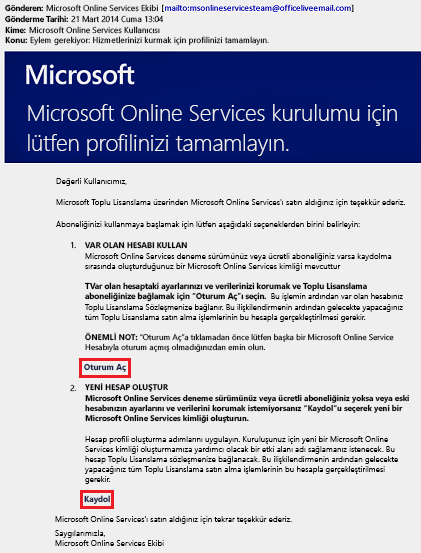
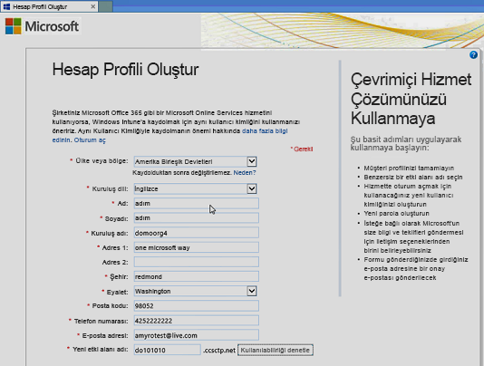
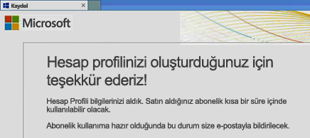
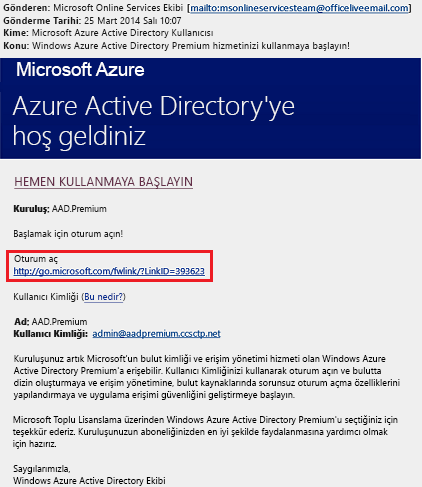
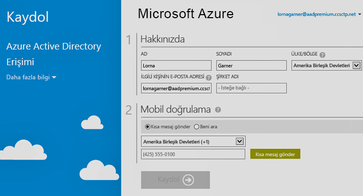

# Azure Active Directory Premium sürümleri için kaydolun
Satın alma ve Azure Active Directory (Azure AD) Premium sürümleri, Azure aboneliğinizle ilişkilendirin. Yeni bir Azure aboneliği oluşturmanız gerekiyorsa, lisans planınızı ve Azure AD hizmeti erişimini etkinleştirmeniz gerekir.

> [!NOTE]
>Azure AD Premium ve Temel sürümleri, Azure Active Directory'nin dünya çapındaki örneğini kullanan Çin'deki müşterilerin kullanımına sunulmuştur. Azure AD Premium ve Temel sürümleri, şu anda Çin’de 21Vianet tarafından işletilen Azure hizmeti kapsamında desteklenmemektedir. Daha fazla bilgi için [Azure Active Directory Forumu](https://feedback.azure.com/forums/169401-azure-active-directory/)’nu kullanarak bizimle görüşün.

Active Directory Premium 1 veya Premium 2’ye kaydolmadan önce, mevcut aboneliğinizin veya planınızın hangisini kullanacağınızı belirlemeniz gerekir:

- Mevcut Azure veya Office 365 aboneliğiniz aracılığıyla

- Enterprise Mobility + Security lisans planı aracılığıyla

- Microsoft Toplu Lisanslama planı aracılığıyla

Önceden satın alınan veya etkinleştirilen Azure AD lisanslarıyla Azure aboneliğinizi kullanarak kaydolduğunuzda aynı dizindeki lisanslar otomatik olarak etkinleştirilir. Aksi takdirde, lisans planınızı ve Azure AD erişiminizi etkinleştirmeniz gerekir. Lisans planınızı etkinleştirme hakkında daha fazla bilgi için bkz. [Yeni lisans planınızı etkinleştirme](#activate-your-new-license-plan). Azure AD erişiminizi etkinleştirme hakkında daha fazla bilgi için bkz. [Azure AD erişiminizi etkinleştirme](#activate-your-azure-ad-access). 

## Mevcut Azure veya Office 365 aboneliğinizi kullanarak kaydolma
Azure veya Office 365 abonesi olarak, Azure Active Directory Premium edition’ları çevrimiçi satın alabilirsiniz. Ayrıntılı adımlar için bkz. [Azure Active Directory Premium'u satın alma - Mevcut Müşteriler](https://channel9.msdn.com/Series/Azure-Active-Directory-Videos-Demos/How-to-Purchase-Azure-Active-Directory-Premium-Existing-Customer) veya [Azure Active Directory Premium'u satın alma - Yeni Müşteriler](https://channel9.msdn.com/Series/Azure-Active-Directory-Videos-Demos/How-to-Purchase-Azure-Active-Directory-Premium-New-Customers).

## Enterprise Mobility + Security lisans planınızı kullanarak kaydolma
Enterprise Mobility + Security, Azure AD Premium, Azure Information Protection ve Microsoft Intune oluşan bir paketi olur. Zaten bir EMS lisansınız varsa, şu lisans seçeneklerinden birini kullanarak Azure AD’yi kullanmaya başlayabilirsiniz:

EMS hakkında daha fazla bilgi için bkz. [Enterprise Mobility + Security web sitesi](https://www.microsoft.com/cloud-platform/enterprise-mobility-security).

- EMS’yi, ücretsiz bir [Enterprise Mobility + Security E5 deneme aboneliği](https://signup.microsoft.com/Signup?OfferId=87dd2714-d452-48a0-a809-d2f58c4f68b7&ali=1) ile deneyebilirsiniz.

- [Enterprise Mobility + Security E5 lisansı](https://signup.microsoft.com/Signup?OfferId=e6de2192-536a-4dc3-afdc-9e2602b6c790&ali=1) satın alma

- [Enterprise Mobility + Security E3 lisansı](https://signup.microsoft.com/Signup?OfferId=4BBA281F-95E8-4136-8B0F-037D6062F54C&ali=1) satın alma

## Microsoft Toplu Lisanslama planınızı kullanarak kaydolma
Microsoft Toplu Lisanslama planınız sayesinde, almak istediğiniz lisans sayısına göre şu iki programdan birini kullanarak Azure AD Premium’a kaydolabilirsiniz:

- **250 veya daha fazla lisans için.** [Microsoft Kurumsal Anlaşma](https://www.microsoft.com/en-us/licensing/licensing-programs/enterprise.aspx)

- **5 ila 250 lisans için.** [Açık Toplu Lisans](https://www.microsoft.com/en-us/licensing/licensing-programs/open-license.aspx)

Toplu lisans satın alma seçenekleri hakkında daha fazla bilgi için bkz. [Toplu Lisanslama ile satın alma](https://www.microsoft.com/en-us/licensing/how-to-buy/how-to-buy.aspx).

## Yeni lisans planınızı etkinleştirme
Yeni bir Azure AD lisans planı kullanarak kaydolduysanız, satın alımdan sonra gönderilen onay e-postasını kullanarak kuruluşunuz için bunu etkinleştirmeniz gerekir.

### Lisans planınızı etkinleştirmek için
- Kaydolduktan sonra Microsoft’tan aldığınız onay e-postasını açın ve sonra **Oturum Aç** veya **Kaydol** seçeneğine tıklayın.
   
    

    - **Oturum açın.** Mevcut bir kiracınız varsa bu bağlantıyı seçin ve sonra mevcut yönetici hesabınızı kullanarak oturum açın. Lisansların nerede etkinleştirilmesi, Kiracı genel yönetici olmanız gerekir.

    - **Kaydolun.** **Hesap Profili Oluştur** sayfasını açmak ve lisanslama planınız için yeni bir Azure AD kiracısı oluşturmak istiyorsanız bu bağlantıyı seçin.

        

İşiniz bittiğinde, kiracınız için lisans planını etkileştirdiğiniz için teşekkür eden bir onay kutusu görürsünüz.

## Azure AD erişiminizi etkinleştirme
Mevcut bir aboneliğe yeni Azure AD Premium lisansları ekliyorsanız Azure AD erişiminiz zaten etkinleştirilmiş olmalıdır. Aksi halde **Hoş Geldiniz e-postasını** aldıktan sonra Azure AD erişiminizi etkinleştirmeniz gerekir.  

Satın aldığınız lisanslar dizininizde sağlandıktan sonra bir **Hoş geldiniz e-postası** alırsınız. Bu e-posta, Azure AD Premium veya Enterprise Mobility + Security lisanslarınızı ve özelliklerinizi yönetmeye başlayabileceğinizi onaylar. 

> [!TIP]
> Hoş geldiniz e-postasından Azure AD dizin erişimini etkinleştirmeden yeni kiracınız için Azure AD’ye erişemezsiniz.

### Azure AD erişiminizi etkinleştirmek için

1. **Hoş geldiniz e-postasını** açın ve **Oturum Aç**’a tıklayın.
   
    

2. Başarıyla oturum açtıktan sonra bir mobil cihaz kullanarak iki aşamalı doğrulama yapacaksınız.
   
    

Etkinleştirme işlemi genellikle yalnızca birkaç dakika sürer ve daha sonra Azure AD kiracınızı kullanabilirsiniz. 

## Sonraki adımlar
Azure AD Premium’a sahip olduğunuza göre şimdi [etki alanınızı özelleştirebilir](add-custom-domain.md), [kurumsal markanızı](customize-branding.md) ekleyebilir, [bir kiracı oluşturabilir](active-directory-access-create-new-tenant.md) ve [gruplar](active-directory-groups-create-azure-portal.md) ve [kullanıcılar ekleyebilirsiniz](add-users-azure-active-directory.md).
