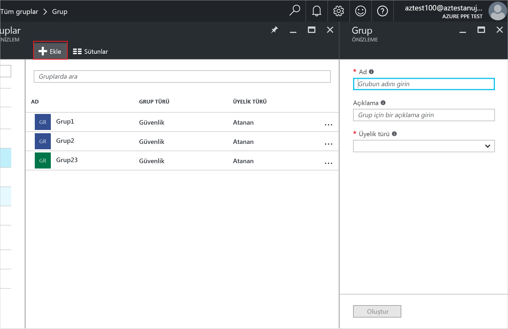
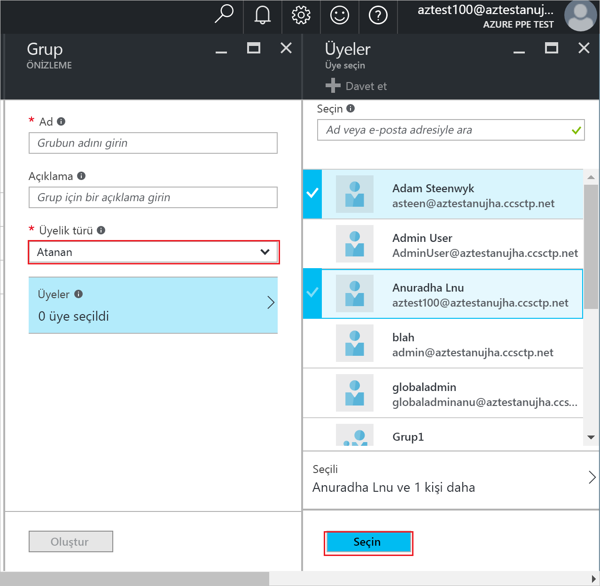
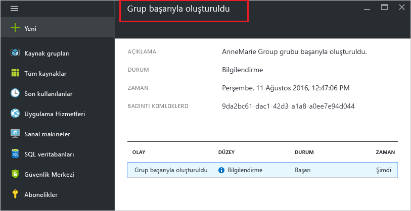

# Azure Active Directory'de grup oluşturma ve üye ekleme
> [!div class="op_single_selector"]
> * [Azure Portal](active-directory-groups-create-azure-portal.md)
> * [PowerShell](../users-groups-roles/groups-settings-v2-cmdlets.md)

Bu makalede Azure Active Directory'de yeni bir grup oluşturma ve üye ekleme adımları açıklanmaktadır. Aynı anda birkaç kullanıcıya veya cihaza lisans ya da izin atama gibi yönetim görevlerini gerçekleştirmek için grup kullanırsınız.

## Nasıl grup oluşturulur?
1. Dizin için genel yönetici olan bir hesapla [Azure portalda](https://portal.azure.com) oturum açın.
2. **Tüm hizmetler**’i seçin, metin kutusuna **Kullanıcılar ve gruplar** yazın ve ardından **Enter**’a basın.

   
3. **Kullanıcılar ve gruplar** dikey penceresinde **Tüm gruplar**’ı seçin.

   
4. **Kullanıcılar ve gruplar - Tüm gruplar** dikey penceresinde **Ekle** komutunu seçin.

   
5. **Grup** dikey penceresinde grup için bir ad ve açıklama girin.
6. Gruba eklenecek üyeleri seçmek için **Üyelik türü** kutusunda **Atanmış**'ı ve ardından **Üyeler**'i seçin. Grup üyeliklerini dinamik olarak yönetme hakkında daha fazla bilgi için bkz. [Grup üyeliği için gelişmiş kurallar oluşturmak üzere öznitelikleri kullanma](../users-groups-roles/groups-dynamic-membership.md).

   
7. **Üyeler** dikey penceresinde gruba eklemek üzere bir veya daha fazla kullanıcı ya da cihaz seçin ve bunları gruba eklemek için dikey pencerenin en altında yer alan **Seç** düğmesini seçin. **Kullanıcı** kutusu görünen sonuçları girişinizle eşleşen kullanıcı veya cihaz adlarını gösterecek şekilde filtreler. Bu kutuda joker karakter kullanılamaz.
8. Gruba üye eklemeyi tamamladıktan sonra **Grup** dikey penceresinde **Oluştur**'u seçin.    

   

## Sonraki adımlar
Bu makalelerde Azure Active Directory ile ilgili ek bilgi sağlanmıştır.

* [Var olan grupları görme](active-directory-groups-view-azure-portal.md)
* [Bir grubun ayarlarını yönetme](active-directory-groups-settings-azure-portal.md)
* [Bir grubun üyelerini yönetme](active-directory-groups-members-azure-portal.md)
* [Bir grubun üyeliklerini yönetme](active-directory-groups-membership-azure-portal.md)
* [Bir gruptaki kullanıcılar için dinamik kuralları yönetme](../users-groups-roles/groups-dynamic-membership.md)
