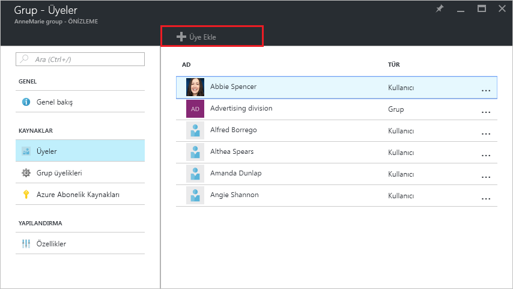
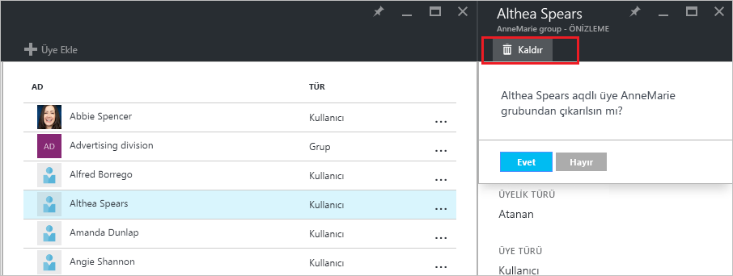

# Azure Active Directory kiracınızdaki kullanıcıların grup üyeliğini yönetme
Bu makalede Azure Active Directory'de (Azure AD) bir grubun üyelerini yönetme adımları açıklanmaktadır.

## Üyeleri nasıl bulup yönetebilirim?
1. Dizin için genel yönetici olan bir hesapla [Azure portalda](https://portal.azure.com) oturum açın.
2. **Tüm hizmetler**’i seçin, metin kutusuna **Kullanıcılar ve gruplar** yazın ve ardından **Enter**’a basın.

   
3. **Kullanıcılar ve gruplar** dikey penceresinde **Tüm gruplar**’ı seçin.

   
4. **Kullanıcılar ve gruplar - Tüm gruplar** dikey penceresinde bir grup seçin.
5. **Grup - *groupname*** dikey penceresinde **Üyeler**’i seçin.

   
6. Gruba üye eklemek için **Grup - Üyeler** dikey penceresinde **Üye Ekle**’yi seçin.

   
7. **Üyeler** dikey penceresinde gruba eklemek üzere bir veya daha fazla kullanıcı ya da cihaz seçin ve bunları gruba eklemek için dikey pencerenin en altında yer alan **Seç** düğmesini seçin. **Kullanıcı** kutusu görünen sonuçları girişinizle eşleşen kullanıcı veya cihaz adlarını gösterecek şekilde filtreler. Bu kutuda joker karakter kullanılamaz.
8. Gruptan üye kaldırmak için **Grup - Üyeler** dikey penceresinde bir üye seçin.
9. ***membername*** dikey penceresinde **Kaldır** komutunu seçin ve komut isteminde seçiminizi onaylayın.

   
10. Grubun üyelerini değiştirmeyi bitirdiğinizde **Kaydet**’i seçin.

## Ek bilgiler
Bu makalelerde Azure Active Directory ile ilgili ek bilgi sağlanmıştır.

* [Var olan grupları görme](active-directory-groups-view-azure-portal.md)
* [Yeni grup oluşturma ve üye ekleme](active-directory-groups-create-azure-portal.md)
* [Bir grubun ayarlarını yönetme](active-directory-groups-settings-azure-portal.md)
* [Bir grubun üyeliklerini yönetme](active-directory-groups-membership-azure-portal.md)
* [Bir gruptaki kullanıcılar için dinamik kuralları yönetme](../users-groups-roles/groups-dynamic-membership.md)
