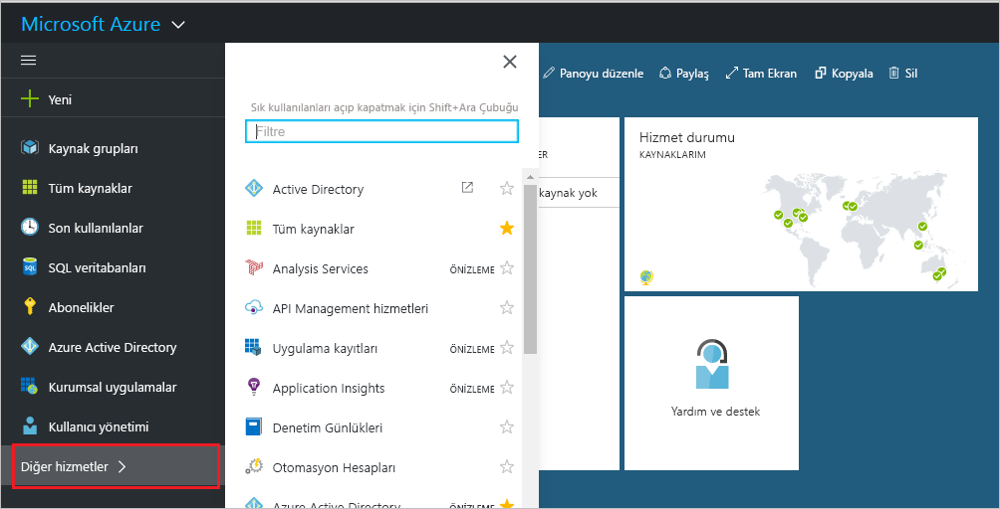
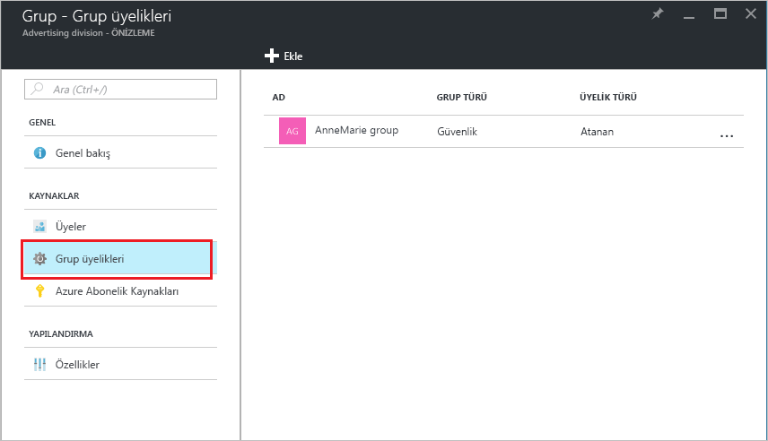
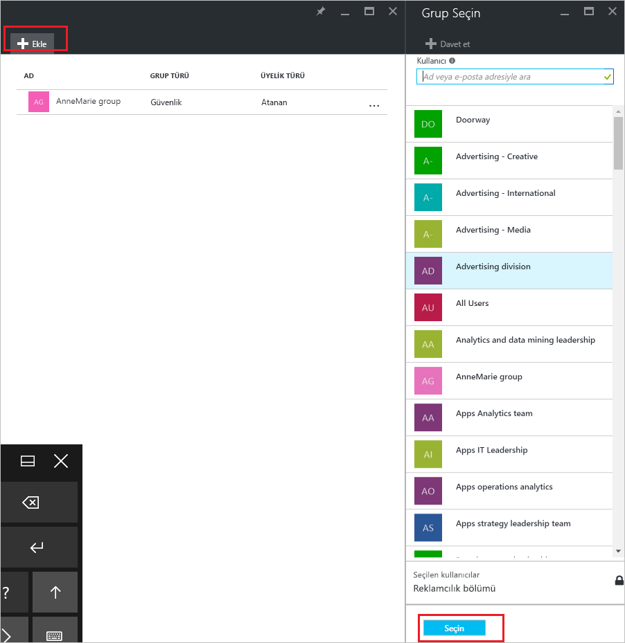
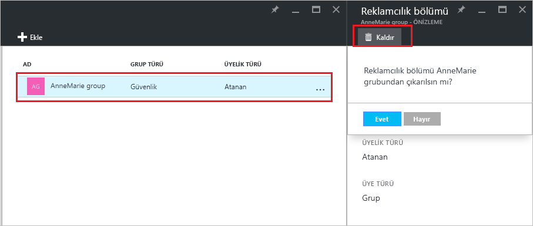

# Azure Active Directory kiracınızda grubunuzun ait olduğu grupları yönetme
Azure Active Directory'de gruplar diğer grupları içerebilir. Bu üyeliklerin nasıl yönetileceği burada açıklanmıştır.

## Grubumun üyesi olduğu grupları nasıl bulabilirim?
1. Dizin için genel yönetici olan bir hesapla [Azure AD yönetim merkezinde](https://aad.portal.azure.com) oturum açın.
2. **Kullanıcı ve gruplar**'ı seçin.

   
1. **Tüm uygulamalar**’ı seçin.

   
1. Grup seçin.
2. **Grup üyelikleri**’ni seçin.

   
1. Grubunuzu başka bir grubun üyesi olarak eklemek için **Grup - Grup üyelikleri** dikey penceresinde **Ekle** komutunu seçin.
2. **Grup Seç** dikey penceresinden bir grup seçin ve ardından dikey pencerenin alt kısmındaki **Seç** düğmesini belirleyin. Grubunuzu bir kerede yalnızca bir gruba ekleyebilirsiniz. **Kullanıcı** kutusu görünen sonuçları girişinizle eşleşen kullanıcı veya cihaz adlarını gösterecek şekilde filtreler. Bu kutuda joker karakter kullanılamaz.

   
8. Grubunuzu başka bir grubun üyeliğinden kaldırmak için **Grup - Grup üyelikleri** dikey penceresinde bir grup seçin.
9. **Kaldır** komutunu seçin ve komut isteminde seçiminizi onaylayın.

   
10. Grubunuzun grup üyeliklerini değiştirme işleminiz bitince **Kaydet**’i seçin.

## Ek bilgiler
Bu makalelerde Azure Active Directory ile ilgili ek bilgi sağlanmıştır.

* [Var olan grupları görme](active-directory-groups-view-azure-portal.md)
* [Yeni grup oluşturma ve üye ekleme](active-directory-groups-create-azure-portal.md)
* [Bir grubun ayarlarını yönetme](active-directory-groups-settings-azure-portal.md)
* [Bir grubun üyelerini yönetme](active-directory-groups-members-azure-portal.md)
* [Bir gruptaki kullanıcılar için dinamik kuralları yönetme](../users-groups-roles/groups-dynamic-membership.md)
