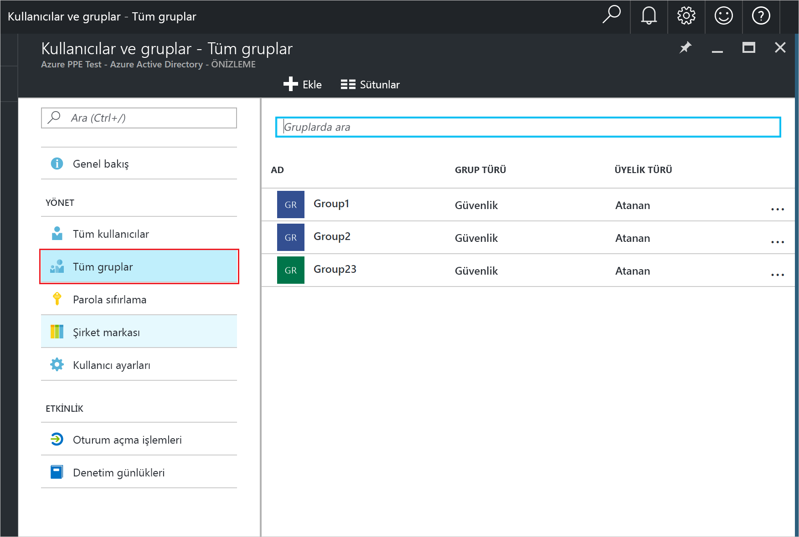
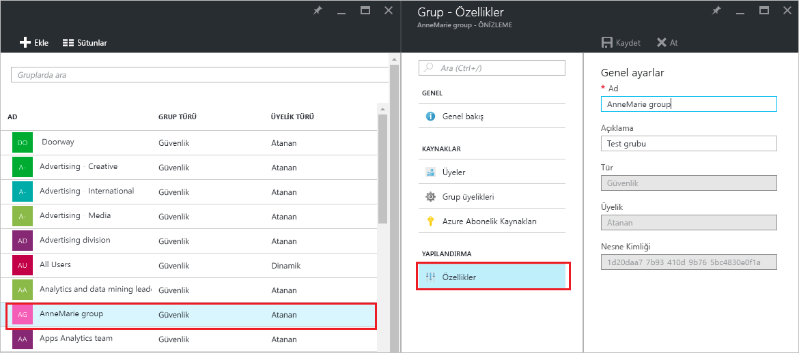

# Azure Active Directory'de bir grubun ayarlarını yönetme
Bu makalede Azure Active Directory'de (Azure AD) bir grubun ayarlarını değiştirme adımları açıklanmaktadır.

## Ayarları nasıl bulup değiştirebilirim?
1. Dizin için genel yönetici olan bir hesapla [Azure AD yönetim merkezinde](https://aad.portal.azure.com) oturum açın.
2. **Tüm hizmetler**’i seçin, metin kutusuna **Kullanıcılar ve gruplar** yazın ve ardından **Enter**’a basın.

   
3. **Kullanıcılar ve gruplar** dikey penceresinde **Tüm gruplar**’ı seçin.

   
4. **Kullanıcılar ve gruplar - Tüm gruplar** dikey penceresinde bir grup seçin.
5. **Grup - *groupname*** dikey penceresinde **Özellikler**’i seçin.

   
6. Grubun özelliklerini değiştirmeyi bitirdiğinizde **Kaydet**’i seçin.    

   

## Sonraki adımlar
Bu makalelerde Azure Active Directory ile ilgili ek bilgi sağlanmıştır.

* [Var olan grupları görme](active-directory-groups-view-azure-portal.md)
* [Yeni grup oluşturma ve üye ekleme](active-directory-groups-create-azure-portal.md)
* [Bir grubun üyelerini yönetme](active-directory-groups-members-azure-portal.md)
* [Bir grubun üyeliklerini yönetme](active-directory-groups-membership-azure-portal.md)
* [Bir gruptaki kullanıcılar için dinamik kuralları yönetme](../users-groups-roles/groups-dynamic-membership.md)
