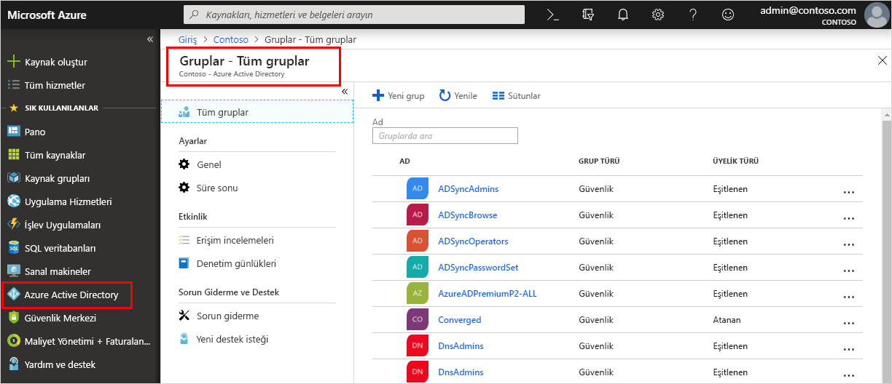

<!--As a brand-new Azure AD administrator, I need to view my organization’s groups along with the assigned members, so I can manage permissions to apps and services for people in my organization-->

# Hızlı Başlangıç: Kuruluşunuzun gruplar ve üyeler, Azure Active Directory'de görüntüle
Azure portalı kullanarak kuruluşunuzun mevcut gruplarını ve grup üyelerini görüntüleyebilirsiniz. Gruplar, büyük olasılıkla kısıtlı uygulama ve hizmetler için aynı erişim ve izinlere ihtiyacı olan kullanıcıları (üyeleri) yönetmek için kullanılır.

Bu hızlı başlangıçta, kuruluşunuzun tüm mevcut gruplarını ve atanmış üyelerini görüntüleyeceksiniz.

Azure aboneliğiniz yoksa başlamadan önce [ücretsiz bir hesap](https://azure.microsoft.com/free/) oluşturun. 

## Önkoşullar
Başlamadan önce şunları gerçekleştirmeniz gerekir:

- Bir Azure Active Directory kiracısı oluşturun. Daha fazla bilgi için, bkz. [Azure Active Directory portalına erişme ve yeni bir kiracı oluşturma](active-directory-access-create-new-tenant.md).

## Azure portalında oturum açın
Dizin için bir Genel yönetici hesabı kullanarak [Azure portalda](https://portal.azure.com/) oturum açmanız gerekir.

## Yeni grup oluşturma 
_MDM ilkesi - Batı_ adlı yeni bir grup oluşturun. Grup oluşturma hakkında daha fazla bilgi için, bkz. [Temel bir grup oluşturma ve üye ekleme](active-directory-groups-create-azure-portal.md).

1. **Azure Active Directory**’yi, **Gruplar**’ı ve ardından **Yeni grup**’u seçin.

2. **Grup** sayfasını tamamlayın:
    
    - **Grup türü:** Seçin **güvenlik**
    
    - **Grup adı:** Tür _MDM İlkesi - Batı_
    
    - **Üyelik türü:** Seçin **atanan**.

3. **Oluştur**’u seçin.

## Yeni kullanıcı oluşturma
_Alain Charon_ adı yeni bir kullanıcı oluşturun. Bir kullanıcı grup üyesi olarak eklenmeden önce mevcut olmalıdır. Kullanıcı oluşturma hakkında daha fazla bilgi için, bkz. [Kullanıcı ekleme veya silme](add-users-azure-active-directory.md).

1. **Azure Active Directory**’yi, **Kullanıcılar**’ı ve ardından **Yeni kullanıcı**’yı seçin.

2. **Kullanıcı** sayfasını tamamlayın:

    - **Adı:** Tür _Alain Charon_.

    - **Kullanıcı adı:** Tür *alain\@contoso.com*.

3. **Parola** kutusunda sağlanan otomatik olarak oluşturulmuş parolayı kopyalayın ve ardından **Oluştur** seçeneğini belirleyin.

## Grup üyesi ekleme
Şimdi bir grubunuz ve kullanıcınız olduğuna göre, _Alain Charon_’u _MDM ilkesi - Batı_ grubuna üye olarak ekleyebilirsiniz. Grup üyelerini ekleme hakkında daha fazla bilgi için, bkz. [Grup üyelerini ekleme veya kaldırma](active-directory-groups-members-azure-portal.md).

1. **Azure Active Directory** > **Gruplar**'ı seçin.

2. **Gruplar - Tüm gruplar** sayfasından, **MDM ilkesi - Batı** grubunu arayın ve seçin.

3. **MDM ilkesi - Batı Genel Bakışı** sayfasında, **Yönet** alanından **Üyeler** seçeneğini belirleyin.

4. **Üye ekle**’yi seçin ve ardından **Alain Charon** öğesini arayıp seçin.

5. **Seç**’i seçin.

## Tüm grupları görüntüleme
Kuruluşunuz için tüm grupları Azure portalın **Gruplar - Tüm gruplar** sayfasında görebilirsiniz.

- Azure **Active Directory** > **Gruplar**’ı seçin.

    **Gruplar - Tüm gruplar** sayfası görüntülenir ve tüm etkin gruplarınız gösterilir.

    

## Grubu arama
**MDM ilkesi - Batı** grubunu bulmak için **Gruplar - Tüm gruplar** sayfasında arama yapın.

1. **Gruplar - Tüm gruplar** sayfasından, **Arama** kutusuna _MDM_ yazın.

    _MDM ilkesi - Batı_ grubu dahil arama sonuçları **Arama** kutusu altında gösterilir.

    

3. **MDM ilkesi - Batı** grubunu seçin.

4. **MDM ilkesi - Batı Genel Bakışı** sayfasında, grubun üye sayısı dahil grup bilgilerini görüntüleyin.

    

## Grup üyelerini görüntüleme
Grubu bulduğunuza göre, atanan tüm üyelerini görüntüleyebilirsiniz.

- **Yönet** alanından **Üyeler**’i seçin ve ardından _Alain Charon_ da dahil olmak üzere bu gruba atanan üye adlarının tam listesini gözden geçirin.

    

## Kaynakları temizleme
Bu grup, bu belgenin **Nasıl yapılır kılavuzları** bölümündeki çeşitli nasıl yapılır işlemlerinde kullanılır. Ancak bu grubu kullanmak istemiyorsanız, aşağıdaki adımları kullanarak grubu ve atanmış üyelerini silebilirsiniz:

1. **Gruplar - Tüm gruplar** sayfasında **MDM ilkesi - Batı** grubu için arama yapın.

2.  **MDM ilkesi - Batı** grubunu seçin.

    **MDM ilkesi - Batı Genel Bakışı** sayfası görüntülenir.

3. **Sil**’i seçin.

    Grup ve ilişkili üyeleri silinir.

    

    >[!Important]
    >Bu işlem Alain Charon’u silmez, yalnızca silinen gruptaki üyeliğini siler.

## Sonraki adımlar
Azure AD aboneliğinizle bir aboneliği ilişkilendirmeyi öğrenmek için sonraki makaleye ilerleyin.

> [!div class="nextstepaction"]
> [Azure aboneliği ilişkilendirme](active-directory-how-subscriptions-associated-directory.md)
