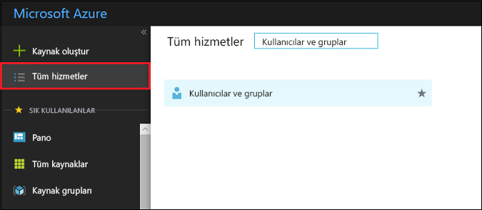

# Azure Active Directory’de kullanıcı gruplarını görüntüleme veya arama
Bu makalede Azure Active Directory'de (Azure AD) grupları görüntüleme adımları açıklanmaktadır. Azure AD kullanıcı yönetimi özelliklerinden biri de, aynı anda birkaç kullanıcıya lisans veya izin atama gibi yönetim görevleri gerçekleştirmek için grupları kullanabilmenizdir.

## Tüm grupları nasıl görebilirim?
1. Dizin için genel yönetici olan bir hesapla [Azure portalda](https://portal.azure.com) oturum açın.
2. **Tüm hizmetler**’i seçin, metin kutusuna **Kullanıcılar ve gruplar** yazın ve ardından **Enter**’a basın.

   
3. **Kullanıcılar ve gruplar** dikey penceresinde **Tüm gruplar**’ı seçin.

   
4. **Kullanıcılar ve gruplar - Tüm gruplar** dikey penceresinde, görüntü sütunlarını ekleyebilir veya kaldırabilir, bir grubu aramak için listeyi filtreleyebilir veya değiştirmek için yeterli izine sahip olduğunuz gruplara değişiklikler yapabilirsiniz.

## Sonraki adımlar
Bu makalelerde Azure Active Directory ile ilgili ek bilgi sağlanmıştır.

* [Var olan grupları görme](active-directory-groups-view-azure-portal.md)
* [Yeni grup oluşturma ve üye ekleme](active-directory-groups-create-azure-portal.md)
* [Bir grubun ayarlarını yönetme](active-directory-groups-settings-azure-portal.md)
* [Bir grubun üyelerini yönetme](active-directory-groups-members-azure-portal.md)
* [Bir grubun üyeliklerini yönetme](active-directory-groups-membership-azure-portal.md)
* [Bir gruptaki kullanıcılar için dinamik kuralları yönetme](../users-groups-roles/groups-dynamic-membership.md)
