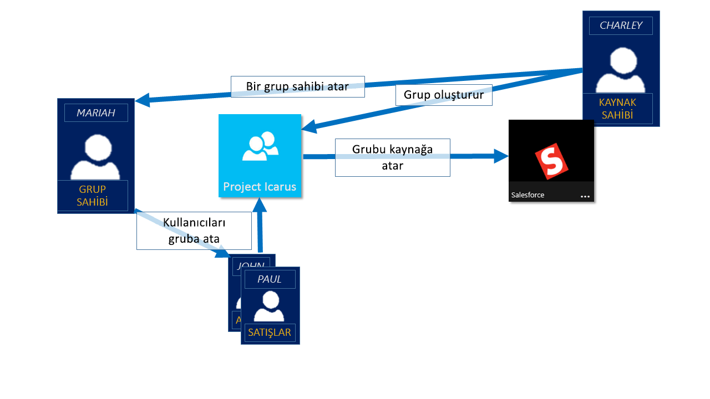

# Azure Active Directory grupları'nı kullanarak uygulama ve kaynak erişimini yönetme
Azure Active Directory (Azure AD) bulut tabanlı uygulamalarınızı şirket içi uygulamalar ve kuruluşunuzun grupları kullanarak kaynaklarınızı yönetmenize yardımcı olur. Kaynaklarınızı directory ya da dış dizin rolleri aracılığıyla nesneleri gibi yazılım olarak hizmet (SaaS) uygulamaları için Azure, SharePoint siteleri, hizmetleri ve şirket içi kaynakları yönetmek için izinleri gibi bir dizinin parçası olabilir.

>[!NOTE]
>Azure Active Directory'yi kullanmak için bir Azure hesabına ihtiyacınız vardır. Hesabınız yoksa [ücretsiz Azure hesabı için kaydolabilirsiniz](https://azure.microsoft.com/free/).

## Nasıl erişim yönetimini Azure AD iş?
Tek bir kullanıcı için erişim haklarını sağlayarak kuruluşunuzun kaynaklarına erişmesini veya grup için tüm Azure AD'yi azure AD yardımcı olur. Grupları kullanarak, kaynak sahibi (veya Azure AD directory sahibi), tek tek hakları sağlamak zorunda kalmak yerine bu grubun tüm üyeleri için erişim izinleri kümesi atama olanak tanır. Kaynak veya dizin sahibi de yönetim hakları üye listesi için bir bölüm Yöneticisi'ni veya bir Yardım Masası Yöneticisi, bu kişinin, ekleme ve gerektiğinde üyeleri kaldırma gibi başka bir kişiye verebilirsiniz. Grup sahiplerini yönetme hakkında daha fazla bilgi için bkz. [Grup sahiplerini yönetme](active-directory-accessmanagement-managing-group-owners.md)

## Erişim hakları atama yolları
Kullanıcıların erişim haklarını kaynak atamak için izleyebileceğiniz dört yol vardır:

- **Doğrudan atamayı.** Kaynak sahibi kullanıcı kaynağa doğrudan atar.

- **Grup ataması.** Kaynak sahibi Azure AD grubu için kaynak sağlayan otomatik olarak, tüm Grup üyeleri erişimi kaynağa atar. Grup üyeliği, Grup sahibi ve üye ekleme veya gruptan kaldırma ya da sahibi izin vererek kaynak sahibi tarafından yönetilir. Ekleme veya grup üyeliği kaldırma hakkında daha fazla bilgi için bkz. [nasıl yapılır: Gruba eklemek veya bir Azure Active Directory portalı kullanarak başka bir gruptan kaldırmak](active-directory-groups-membership-azure-portal.md). 

- **Kural tabanlı atama.** Kaynak sahibi bir grup oluşturur ve hangi kullanıcıların belirli bir kaynağa atanmış tanımlamak için bir kural kullanır. Kural bireysel kullanıcılara atanan ve öznitelikleri temel alır. Kaynak sahibi, hangi öznitelikleri ve değerleri kaynak erişime izin vermek için gerekli olan belirleme kural yönetir. Daha fazla bilgi için [dinamik bir grup oluşturun ve durumunu denetlemek](../users-groups-roles/groups-create-rule.md).

    Oluşturma ve dinamik grupları kullanma hakkında hızlı bir açıklama bu kısa videoyu da izleyebilirsiniz:

    >[!VIDEO https://channel9.msdn.com/Series/Azure-Active-Directory-Videos-Demos/Azure-AD--Introduction-to-Dynamic-Memberships-for-Groups/player]

- **Dış yetkilisi atama.** Bir şirket içi dizin veya bir SaaS uygulaması gibi bir dış kaynaktan erişim gelir. Bu durumda, kaynağa erişim sağlamak için bir grup kaynak sahibi atar ve ardından Grup üyelerinin dış kaynağı yönetir.

   

## Kullanıcılar, gruplar atanmadan birleştirebilir miyim?
Grup sahibi katılma, atamak yerine kendi grupları bulmak izin verebilirsiniz. Katılan tüm kullanıcılar otomatik olarak kabul etme veya onay gerektirmesini sahibi grubu de ayarlayabilirsiniz.

Bir kullanıcı bir gruba katılma isteklerini sonra isteği Grup sahibine iletilir. Gerekliyse, sahibi, isteği onaylayabilir ve kullanıcının grup üyeliğini bildirilir. Ancak, birden fazla sahibe varsa ve bunlardan birinin disapproves kullanıcı bildirilir ancak grubuna eklenmez. Daha fazla bilgi ve kullanıcılarınızın bu gruplara katılmak için istek izin vermek hakkında yönergeler için bkz. [kullanıcılar bu gruplara katılmak için isteyebilir için Azure AD'yi ayarlarken ayarlayın](../users-groups-roles/groups-self-service-management.md)

## Sonraki adımlar
Biraz erişim yönetim gruplarını kullanarak bir giriş olduğuna göre kaynakları ve uygulamaları yönetmek başlatın.

- [Azure Active Directory kullanarak yeni bir grup oluşturmak](active-directory-groups-create-azure-portal.md) veya [oluşturma ve PowerShell cmdlet'lerini kullanarak yeni bir grubu yönetme](../users-groups-roles/groups-settings-v2-cmdlets.md)

- [Tümleşik bir SaaS uygulamasına erişim atamak için grupları kullanma](../users-groups-roles/groups-saasapps.md)

- [Azure AD Connect kullanarak Azure için bir şirket içi Grup eşitleme](../hybrid/whatis-hybrid-identity.md)
