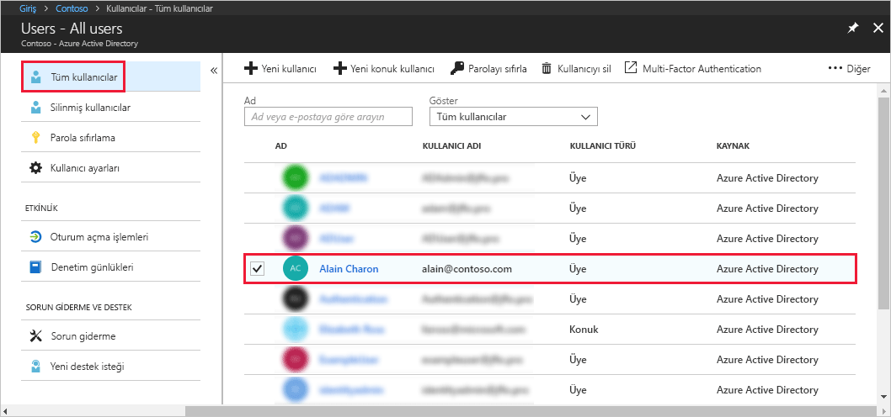
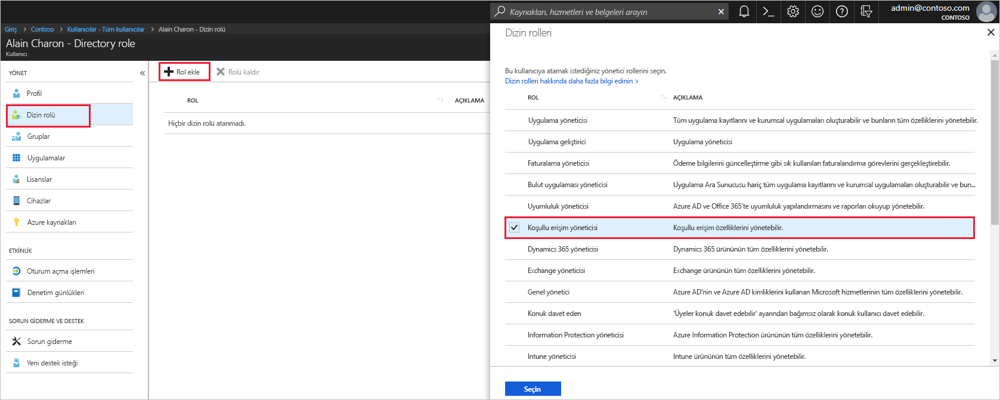

# Azure Active Directory’de kullanıcılara yönetici rolü atama
Bu makalede Azure Active Directory'de (Azure AD) kullanıcılara yönetici rolü atamayı adımları açıklanmaktadır. Kuruluşunuza yeni kullanıcı ekleme hakkında daha fazla bilgi için bkz. [Azure Active Directory'ye yeni kullanıcı ekleme](../add-users-azure-active-directory.md). Eklenen kullanıcılar varsayılan olarak yönetici izinlerine sahip olmaz ancak bu kullanıcılara herhangi bir zamanda roller atayabilirsiniz.

## Kullanıcıya rol atama
1. Dizin için genel yönetici veya ayrıcalıklı rol yöneticisi olan bir hesapla [Azure portalında](https://portal.azure.com) oturum açın.

2. **Azure Active Directory**'yi, **Kullanıcılar**'ı ve ardından listeden belirli bir kullanıcıyı seçin.

    

3. Seçilen kullanıcı için **Dizin rolü**'nü, **Rol ekle**'yi ve ardından **Dizin rolleri** listesinden **Koşullu erişim yöneticisi** gibi uygun yönetici rollerini seçin. Yönetici rolleri hakkında daha fazla bilgi için bkz. [Azure AD'de yönetici rolleri atama](../users-groups-roles/directory-assign-admin-roles.md). 

    

1. Kaydetmek için **Seç**'e basın.

## Sonraki adımlar
* [Hızlı Başlangıç: Azure Active Directory'de kullanıcı ekleme veya silme](add-users-azure-active-directory.md)
* [Kullanıcı profillerini yönetme](active-directory-users-profile-azure-portal.md)
* [Başka bir dizinden konuk kullanıcılar ekleme](../b2b/what-is-b2b.md) 
* [Azure AD'de bir role kullanıcı atama](active-directory-users-assign-role-azure-portal.md)
* [Silinen bir kullanıcıyı geri yükleme](active-directory-users-restore.md)
