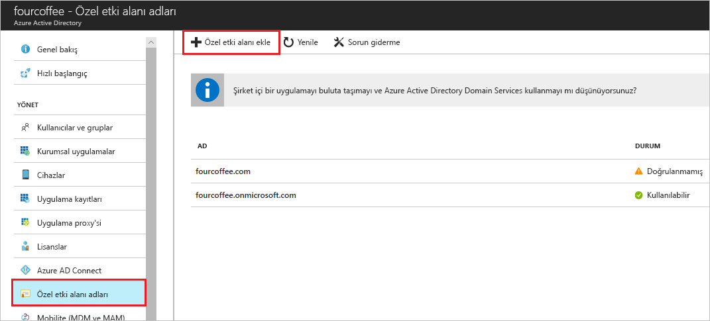

# Azure Active Directory portalı kullanarak özel etki alanı adınızı ekleme
Her yeni Azure AD kiracısı bir ilk etki alanı adı ile gelir *domainname*. onmicrosoft.com. Değiştirme veya silme ilk etki alanı adı, ancak kuruluşunuzun adları listesine ekleyebilirsiniz. Özel etki alanı adları ekleme yardımcı olur, kullanıcılarınızın tanıdığı gibi kullanıcı adları oluşturmak için *alain\@contoso.com*.

## Başlamadan önce
Özel etki alanı eklemeden önce bir etki alanı kayıt şirketi ile etki alanı adınızı oluşturmanız gerekir. Akredite bir etki alanı kayıt şirketi için bkz. [ICANN-Accredited kaydedicilerin](https://www.icann.org/registrar-reports/accredited-list.html).

## Azure AD dizininizi oluşturma
Etki alanı adınızı aldıktan sonra ilk Azure AD dizininizi oluşturabilirsiniz.

1. Oturum [Azure portalında](https://portal.azure.com/) dizininiz için olan bir hesap kullanarak **sahibi** rolü için aboneliğe tıklayın ve ardından **Azure Active Directory**. Abonelik rolleri hakkında daha fazla bilgi için bkz. [Klasik Abonelik Yöneticisi rolleri, Azure RBAC rolleri ve Azure AD yönetici rollerini](../../role-based-access-control/rbac-and-directory-admin-roles.md#azure-rbac-roles).

    

    >[!TIP]
    > Şirket içi Windows Server AD'nizi Azure AD ile birleştirmeyi planlıyorsanız, dizinlerinizi eşitlemek için Azure AD Connect aracını çalıştırdığınızda **Bu etki alanını, yerel Active Directory dizinimde çoklu oturum açmak üzere yapılandırmak istiyorum** onay kutusunu seçmeniz gerekir. Ayrıca aynı etki alanı adını sihirbazın şirket içi dizininizi **Azure AD Etki Alanı** ile birleştirme adımında da kaydetmeniz gerekir. [Bu yönergelerde](../hybrid/how-to-connect-install-custom.md#verify-the-azure-ad-domain-selected-for-federation) sihirbazdaki bu adımın nasıl göründüğünü görebilirsiniz. Azure AD Connect aracınız yoksa [buradan indirebilirsiniz](https://go.microsoft.com/fwlink/?LinkId=615771).

2. İçindeki adımları izleyerek yeni dizininizi oluşturma [kuruluşunuz için yeni bir kiracı](active-directory-access-create-new-tenant.md#create-a-new-tenant-for-your-organization).

    >[!Important]
    >Kiracı oluşturan kişi, otomatik olarak bu Kiracı için genel yönetici olur. Genel yönetici, Kiracı için başka Yöneticiler ekleyebilirsiniz.

## Özel etki alanı adınızı Azure AD'ye ekleme
Dizininizi oluşturduktan sonra özel etki alanı adı ekleyebilirsiniz.

1. Seçin **özel etki alanı adları**ve ardından **özel etki alanı Ekle**.

    

2. Kuruluşunuzun yeni etki alanı adı **özel etki alanı adı** kutusunda (örneğin, _contoso.com_) ve ardından **etki alanı Ekle**.

    Doğrulanmamış etki alanını eklenir ve **Contoso** sayfası görünür DNS bilgilerinizi gösteriliyor.

    >[!Important]
    >.Com, .net veya diğer üst düzey uzantıları bunun düzgün çalışması için eklemeniz gerekir.

    

4. DNS bilgisi kopyalama **Contoso** sayfası. Örneğin, MS ms64983159 =.

    

## Etki alanı kayıt şirketi için DNS bilgilerinizi ekleyin
Azure AD'ye özel etki alanı adınızı ekledikten sonra için etki alanı kayıt şirketinizde dönün ve Azure AD DNS bilgilerini, kopyalanan bir TXT dosyasından eklemeniz gerekir. Oluşturma bu TXT kaydı etki alanınız için "etki alanı adınızı sahipliğini doğrular".

-  Etki alanı kayıt için geri dönün, etki alanınız, kopyalanan DNS bilgilere göre ayarlamak için yeni bir TXT kaydı oluşturun. **TTL** (yaşam süresi) 3600 saniye (60 dakika) ve bilgileri kaydedin.

    >[!Important]
    >İstediğiniz sayıda etki alanı adları kaydedebilirsiniz. Ancak, her etki alanı kendi TXT kaydı, Azure AD'den alır. Etki alanı kayıt şirketinde TXT dosyası bilgilerinizi girerken dikkatli olun. Yanlış girin ya da bilgileri yanlışlıkla çoğaltmak, yeniden denemeden önce TTL (out 60 dakika) zaman beklemeniz gerekecektir.

## Özel etki alanı adınızı doğrulayın
Özel etki alanı adınızı kaydettikten sonra Azure AD'de geçerli olduğundan emin olmanız gerekir. Azure ad etki alanı kayıt şirketinizde gelen yayılmasını anlık olabilir veya etki alanı kayıt şirketinizde bağlı olarak birkaç gün sürebilir.

### Özel etki alanı adınızı doğrulamak için
1. Dizin için bir Genel yönetici hesabı kullanarak [Azure portalda](https://portal.azure.com/) oturum açın.

2. Seçin **Azure Active Directory**ve ardından **özel etki alanı adları**.

3. Üzerinde **Fabrikam - özel etki alanı adları** sayfasında, özel etki alanı adı seçin **Contoso**.

    

4. Üzerinde **Contoso** sayfasında **doğrulama** özel etki alanınızı düzgün şekilde kaydedildiğinden ve Azure AD için geçerli olduğundan emin olun.

    

Özel etki alanı adınızı doğruladıktan sonra doğrulama TXT veya MX dosya silebilirsiniz.

## Sık karşılaşılan doğrulama sorunları
- Azure AD'ye özel etki alanı adını doğrulayamıyorsanız, aşağıdaki önerileri deneyin:
  - **En az bir saat bekleyin ve yeniden deneyin**. Azure AD etki alanı ve bu işlem bir saat veya daha fazla sürebilir doğrulamadan önce DNS kayıtlarının yayılması gerekir.

  - **DNS kaydı doğru olduğundan emin olun.** Etki alanı adı kayıt şirketi siteye geri dönün ve giriş yoktur ve Azure AD tarafından sağlanan DNS girişini bilgilerinin eşleştiğini doğrulayın.

    Kayıt şirketi sitenin kaydı güncelleştiremiyorsanız girdisi ekleyin ve doğru olduğundan emin olun için doğru izinlere sahip biri ile giriş paylaşmanız gerekir.

- **Etki alanı adı zaten başka bir dizindeki kullanımda olmadığından emin olun.** Bir etki alanı adı, yalnızca etki alanı adınızı şu anda başka bir dizinde doğrulanırsa, bu da yeni bir dizinde doğrulanamadığına anlamına gelen bir dizinde doğrulanabilir. Bu çoğaltma sorunu gidermek için etki alanı adı eski dizinden silmeniz gerekir. Etki alanı adlarını silme hakkında daha fazla bilgi için bkz. [özel etki alanı adlarını yönetme](../users-groups-roles/domains-manage.md).

- **Yönetilmeyen hiçbir Power BI Kiracı yoksa emin olun.** Kullanıcılarınızın Power BI Self etkinleştirmiş ve kuruluşunuz için yönetilmeyen bir kiracı oluşturuldu, iç veya dış Yöneticisi olarak Management PowerShell kullanarak atmanız durumunda. Yönetilmeyen bir dizini devralma hakkında daha fazla bilgi için bkz: [Azure Active Directory'de yönetici olarak yönetilmeyen bir dizini devralma](../users-groups-roles/domains-admin-takeover.md).

## Sonraki adımlar

- Başka bir genel yönetici, dizininize ekleyin. Daha fazla bilgi için [roller ve yöneticiler atama](active-directory-users-assign-role-azure-portal.md).

- Kullanıcılar, etki alanına eklemek için bkz: [ekleme veya kullanıcıları silmek](add-users-azure-active-directory.md).

- Azure AD etki alanı adı bilgilerinizi yönetin. Daha fazla bilgi için [özel etki alanı adlarını yönetme](../users-groups-roles/domains-manage.md).

- Şirket içi Azure Active Directory ile birlikte kullanmak üzere istediğiniz Windows Server sürümleri varsa [şirket içi dizinlerinizi Azure Active Directory ile tümleştirme](../connect/active-directory-aadconnect.md).
