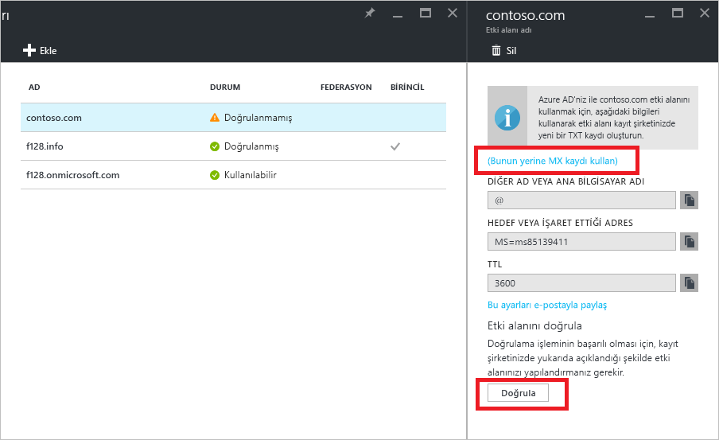

# Hızlı başlangıç: Azure Active Directory'ye özel etki alanı adı ekleyin

Her Azure AD dizini *domainname*.onmicrosoft.com biçiminde bir etki alanı adıyla gelir. İlk etki alanı adı değiştirilemez ve silinemez ancak Azure AD'ye kurumsal etki alanı adınızı ekleyebilirsiniz. Örneğin kuruluşunuzda muhtemelen iş için kullanılan farklı etki alanı adları vardır ve kullanıcılar da şirketin etki alanı adını kullanarak oturum açıyordur. Azure AD'ye özel etki alanı adı eklediğinizde dizinde kullanıcılarınızın aşina olduğu kullanıcı adları ("alice@contoso.com" gibi) atayabilirsiniz. "alice@*domain name*.onmicrosoft.com" şeklinde kullanmanıza gerek kalmaz. Bu basit bir işlemdir:

1. Dizine özel etki alanı adı ekleyin
2. Etki alanı adı kayıt şirketinize etki alanı adı için bir DNS girişi ekleyin
3. Azure AD'de özel etki alanı adını doğrulayın

## Dizine özel etki alanı adı ekleyin
1. Dizin için genel yönetici olan bir hesapla [Azure portalda](https://aad.portal.azure.com/#blade/Microsoft_AAD_IAM/ActiveDirectoryMenuBlade/Overview) oturum açın.
2. Sol taraftan **Özel etki alanı adları**'nı seçin.
3. **Özel etki alanı ekle**'yi seçin.
   
   
5. **Özel etki alanları** sayfasında özel etki alanınızı (contoso.com gibi) kutuya yazın ve **Etki Alanını Ekle**'yi seçin. .com, .net veya diğer üst düzey uzantıları eklemeyi unutmayın.
6. ***Etki alanı adı*** sayfasında (sayfanın başlığı yeni etki alanı adınız olur) Azure AD'de özel etki alanı adınızı doğrulamak üzere DNS girişi bilgilerini alın.
   
   

> [!TIP]
> Şirket içi Windows Server AD'nizi Azure AD ile birleştirmeyi planlıyorsanız, dizinlerinizi eşitlemek için Azure AD Connect aracını çalıştırdığınızda **Bu etki alanını, yerel Active Directory dizinimde çoklu oturum açmak üzere yapılandırmak istiyorum** onay kutusunu seçmeniz gerekir. Ayrıca aynı etki alanı adını sihirbazın şirket içi dizininizi **Azure AD Etki Alanı** ile birleştirme adımında da kaydetmeniz gerekir. [Bu yönergelerde](./../connect/active-directory-aadconnect-get-started-custom.md#verify-the-azure-ad-domain-selected-for-federation) sihirbazdaki bu adımın nasıl göründüğünü görebilirsiniz. Azure AD Connect aracınız yoksa [buradan indirebilirsiniz](http://go.microsoft.com/fwlink/?LinkId=615771).

## Etki alanı adı kayıt şirketinize etki alanı adı için bir DNS girişi ekleyin
Etki alanınızı Azure AD ile kullanmanın sonraki adımı, etki alanına ait DNS bölge dosyasının güncelleştirilmesidir. Bunu yaptığınızda Azure AD, kuruluşunuzun özel etki alanı adına sahip olduğunu doğrulayabilir. Azure/Office 365/Azure'daki dış DNS kayıtları için [Azure DNS](https://docs.microsoft.com/azure/dns/dns-getstarted-portal)'yi kullanabilir veya DNS girişini [farklı bir DNS kayıt kuruluşunda](https://support.office.com/article/Create-DNS-records-for-Office-365-when-you-manage-your-DNS-records-b0f3fdca-8a80-4e8e-9ef3-61e8a2a9ab23/) ekleyebilirsiniz.

1. Etki alanına ilişkin etki alanı adı kayıt şirketinde oturum açın. DNS girişini güncelleştirmek için erişiminiz yoksa bu erişime sahip kişi ya da ekipten adım 2’yi tamamlamasını ve tamamlandığında size bildirmesini isteyin.
2. Azure AD tarafından size sağlanan DNS girişini ekleyerek etki alanına ilişkin DNS bölge dosyasını güncelleştirin. DNS girişi, posta yönlendirme veya web barındırma gibi davranışları değiştirmez.

## Azure AD'de özel etki alanı adını doğrulayın
DNS girişini ekledikten sonra etki alanı adını Azure AD ile doğrulamaya hazır olursunuz. Bir etki alanı adı ancak DNS kayıtları yayıldıktan sonra doğrulanabilir. Bu yayma genellikle yalnızca birkaç saniye sürer, ancak bazen bir saat veya daha fazla sürebilir. İlk denemede doğrulama çalışmazsa daha sonra yeniden deneyin.

1. Kiracı için genel yönetici olan bir hesapla [Azure AD](https://aad.portal.azure.com/#blade/Microsoft_AAD_IAM/ActiveDirectoryMenuBlade/Overview)'de oturum açın.
2. **Özel etki alanı adları**'nı seçin.
3. Doğrulamak istediğiniz doğrulanmamış etki alanı adını seçin.
4. Girişlerinizi denetleyin ve doğrulamayı tamamlamak için **Doğrula**'yı seçin.

Artık [özel etki alanı adınızı içeren kullanıcı adları atayabilirsiniz](../users-groups-roles/domains-manage.md). Özel etki alanı adınızı kullanarak bulut tabanlı kullanıcı hesapları oluşturabilir veya önceden eşitlenmiş şirket içi kullanıcı hesabı bilgilerini güncelleştirebilirsiniz. Ayrıca [Microsoft PowerShell](https://msdn.microsoft.com/library/azure/e1ef403f-3347-4409-8f46-d72dafa116e0#BKMK_ManageDomains) veya [Graph API](https://msdn.microsoft.com/Library/Azure/Ad/Graph/api/domains-operations)'sini kullanarak eşitlenmiş kullanıcı hesabı etki alanı son ekini de değiştirebilirsiniz.

> [!TIP]
> En fazla 900 yönetilen etki alanı ekleyebilirsiniz. Tüm etki alanlarınızı şirket için Active Directory ile birleştirecek şekilde yapılandırırsanız her dizine en fazla 450 etki alanı ekleyebilirsiniz. Daha fazla bilgi için bkz. [Federasyon ve yönetilen etki alanı adları](https://docs.microsoft.com/azure/active-directory/active-directory-add-domain-concepts#federated-and-managed-domain-names).

## Sorun giderme
Bir özel etki alanı adını doğrulayamıyorsanız aşağıdaki sorun giderme adımlarını deneyin:

1. **Bir saat bekleyin**. Azure AD’nin etki alanını doğrulayabilmesi için DNS kayıtlarının yayılması gerekir. Bu işlem bir saat veya daha fazla sürebilir.
2. **DNS kaydının girildiğinden ve doğru olduğundan emin olun**. Bu adımı, etki alanının etki alanı adı kayıt şirketine ait web sitesinde tamamlayın. Azure AD aşağıdaki durumlarda etki alanı adını doğrulayamaz 
  * DNS girişi, DNS bölgesi dosyasında mevcut değil
  * Bu, Azure AD’nin size sağladığı DNS girişiyle tam eşleşmiyor. 
  
  Etki alanı adı kayıt şirketinde etki alanının DNS kayıtlarını güncelleştirmek için erişiminiz yoksa, DNS girişini bu erişime sahip olan kişi veya ekip ile paylaşın ve DNS girişini eklemesini isteyin.
3. **Etki alanı adını Azure AD'deki başka bir dizinden silin**. Bir etki alanı adı yalnızca tek bir dizinde doğrulanabilir. Şu anda bir etki alanı adı farklı bir dizinde doğrulanırsa diğerinde silinmeden yeni dizininizde doğrulanamaz. Etki alanı adlarını silme hakkında bilgi edinmek için bkz. [Özel etki alanı adlarını yönetme](../users-groups-roles/domains-manage.md).    

Her bir etki alanı adını eklemek için bu makaledeki adımları tekrarlayın.

## Daha fazla bilgi edinin
[Azure AD'de özel etki alanı adlarına kavramsal genel bakış](../users-groups-roles/domains-manage.md)

[Özel etki alanı adlarını yönetme](../users-groups-roles/domains-manage.md)

## Sonraki adımlar
Bu hızlı başlangıçta Azure AD'ye özel etki alanı eklemeyi öğrendiniz. 

Aşağıdaki bağlantıyı kullanarak Azure portaldan Azure AD'ye yeni bir özel etki alanı ekleyebilirsiniz.

> [!div class="nextstepaction"]
> [Özel etki alanı ekleme](https://aad.portal.azure.com/#blade/Microsoft_AAD_IAM/ActiveDirectoryMenuBlade/QuickStart) 