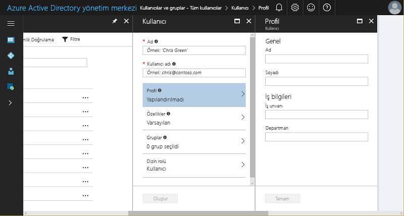
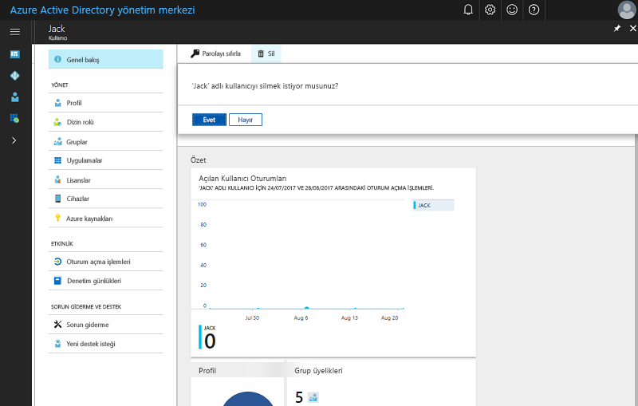

# Hızlı başlangıç: Azure Active Directory'ye yeni kullanıcı ekleme
Bu makalede Azure portalı kullanarak veya şirket içi Windows Server AD kullanıcı hesabı verilerinizi eşitleyerek kuruluşunuzun Azure Active Directory (Azure AD) kiracısına kullanıcı ekleme veya var olan kullanıcıları silme adımları açıklanmaktadır. 

## Bulut tabanlı kullanıcı ekleme
1. Dizin için genel yönetici olan bir hesapla [Azure Active Directory yönetim merkezinde](https://aad.portal.azure.com) oturum açın.
2. **Azure Active Directory**'yi ve ardından **Kullanıcılar ve gruplar**'ı seçin.
3. **Kullanıcılar ve gruplar** sayfasında **Tüm kullanıcılar**'ı ve ardından **Yeni kullanıcı**'yı seçin.
   
4. **Ad** ve **Kullanıcı adı** gibi kullanıcı ayrıntılarını girin. Kullanıcı adının etki alanı adı bölümünün varsayılan ilk etki alanı adı "[etki alanı adı].onmicrosoft.com" veya "contoso.com" gibi doğrulanmış, federasyon olmayan bir [özel etki alanı adı](add-custom-domain.md) olmalıdır.
5. Bu işlem tamamlandıktan sonra kullanıcıyla paylaşabilmek için oluşturulan kullanıcı parolasını kopyalayın veya bir yere not edin.
6. İsteğe bağlı olarak kullanıcının **Profil**, **Gruplar** veya **Dizin rolü** bilgilerini doldurun. Kullanıcı ve yönetici rolleri hakkında daha fazla bilgi için bkz. [Azure AD'de yönetici rolü atama](../users-groups-roles/directory-assign-admin-roles.md).
7. **Kullanıcı** sayfasında **Oluştur**'u seçin.
8. Kullanıcının oturum açabilmesi için oluşturulan parolayı güvenli bir şekilde iletin.

> [!TIP]
> Dilerseniz Şirket içi Windows Server AD'deki kullanıcı hesabı verilerini de eşitleyebilirsiniz. Microsoft’un kimlik çözümleri şirket içi ve bulut tabanlı çözümleri birleştirerek konumdan bağımsız olarak tüm kaynaklara kimlik doğrulaması ve yetkilendirme sağlamak üzere tek bir kullanıcı kimliği oluşturur. Buna Karma Kimlik denir. [Azure AD Connect](https://docs.microsoft.com/azure/active-directory/connect/active-directory-aadconnect), karma kimlik senaryoları için şirket içi dizinlerinizi Azure Active Directory ile tümleştirmek üzere kullanılabilir. Bu sayede kullanıcılarınıza Azure AD ile tümleşik Office 365, Azure ve SaaS uygulamaları için ortak bir kimlik sağlayabilirsiniz. 

## Azure AD’den kullanıcı silme
1. Dizin için genel yönetici olan bir hesapla [Azure Active Directory yönetim merkezinde](https://aad.portal.azure.com) oturum açın.
2. **Kullanıcı ve gruplar**'ı seçin.
3. **Kullanıcılar ve gruplar** dikey penceresinde, listeden silmek istediğiniz kullanıcıyı seçin. 
4. Seçili kullanıcının dikey penceresinde **Genel Bakış**’ı seçin ve ardından komut çubuğunda **Sil**’i seçin.
   

### Daha fazla bilgi edinin 
* [Başka bir dizinden konuk kullanıcılar ekleme](../b2b/what-is-b2b.md) 
* [Azure AD'de bir role kullanıcı atama](active-directory-users-assign-role-azure-portal.md)
* [Kullanıcı profillerini yönetme](active-directory-users-profile-azure-portal.md)
* [Silinen bir kullanıcıyı geri yükleme](active-directory-users-restore.md)

## Sonraki adımlar
Bu hızlı başlangıçta Azure AD Premium'a yeni kullanıcı eklemeyi öğrendiniz. 

Aşağıdaki bağlantıyı kullanarak Azure portaldan Azure AD'de yeni bir kullanıcı oluşturabilirsiniz.

>[!div class="nextstepaction"]
>[Kullanıcıları Azure AD’ye ekleme](https://aad.portal.azure.com/#blade/Microsoft_AAD_IAM/UserManagementMenuBlade/)