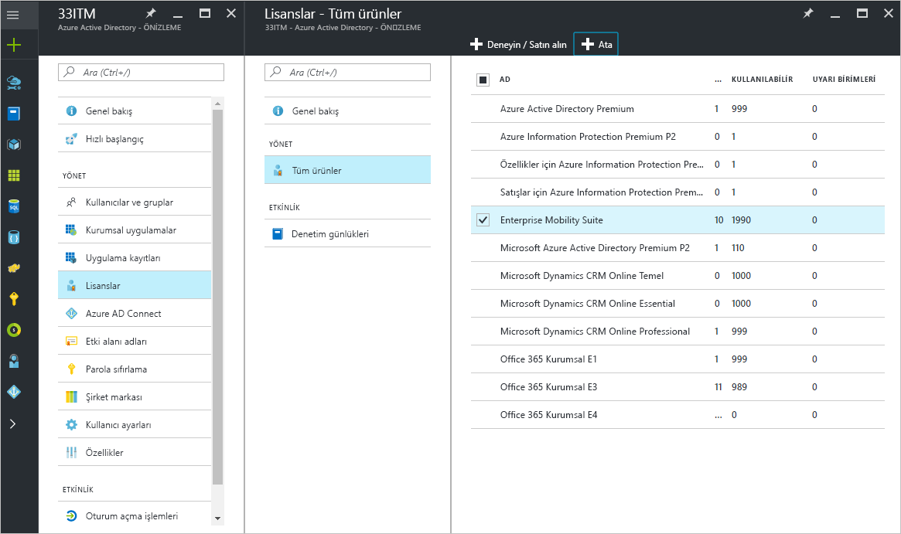
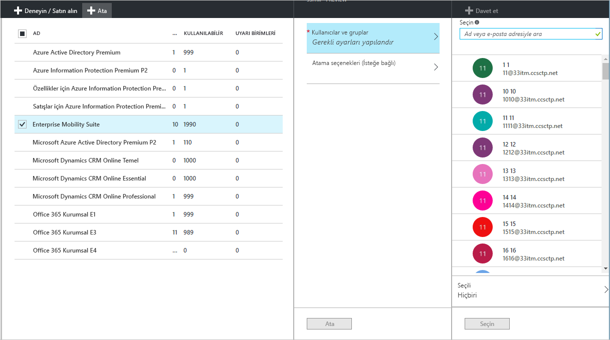
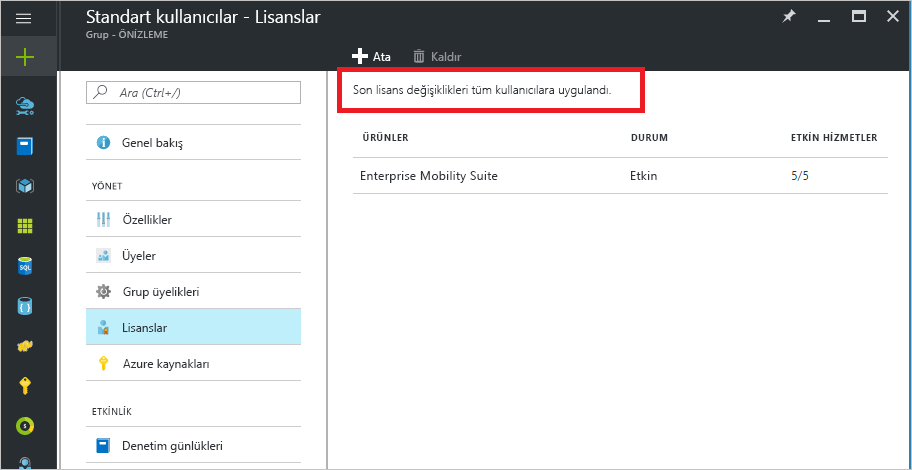
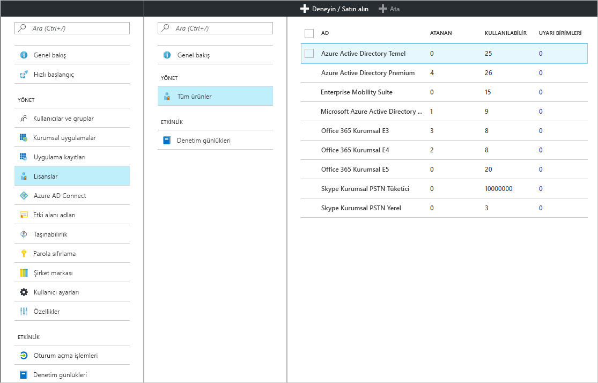
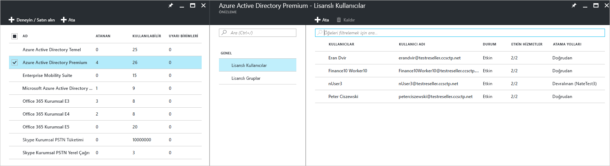
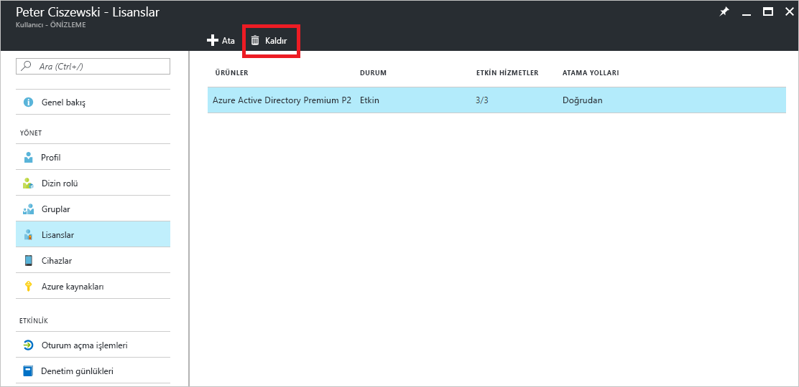

# Hızlı başlangıç: Azure Active Directory'de kullanıcı lisanslama
Lisans tabanlı Azure AD hizmetlerini kullanabilmek için Azure kiracınızda bir Azure Active Directory (Azure AD) aboneliğini etkinleştirmeniz gerekir. Abonelik etkinleştirildikten sonra hizmet özellikleri Azure AD yöneticileri tarafından yönetilir ve lisanslı kullanıcılar tarafından kullanılır. Enterprise Mobility + Security, Azure AD Premium veya Azure AD Basic hizmetlerini satın aldığınızda kiracınız geçerlilik süresi ve ön ödemeli lisanslar dahil olmak üzere bu aboneliği kapsayacak şekilde güncelleştirilir. Atanmış veya kullanılabilir durumdaki lisans sayısı dahil olmak üzere abonelik bilgilerinize Azure portaldaki **Lisanslar** kutucuğunun **Azure Active Directory** bölümünden erişebilirsiniz. Lisans atamalarınızı yönetmek için **Lisanslar** dikey penceresini de kullanabilirsiniz.

Ücretli özellikleri yapılandırmak için tek yapmanız gereken bir abonelik satın almak olsa da ücretli Azure AD özellikleri için kullanıcı lisansı atamanız şarttır. Azure AD ücretli özelliklerine erişmesi gereken veya bu özellikler üzerinden yönetilen tüm kullanıcılara bir lisans atanması gerekir. Lisans ataması, Azure AD Premium, Basic veya Enterprise Mobility + Security gibi satın alınan bir hizmetle kullanıcı arasında gerçekleştirilen eşlemedir.

[Grup tabanlı lisans atamasını](active-directory-licensing-whatis-azure-portal.md) kullanarak aşağıdakilere benzer kurallar ayarlayabilirsiniz:
* Dizininizdeki tüm kullanıcıların otomatik olarak lisans dağıtma
* Uygun iş unvanına sahip herkese lisans dağıtma
* Kararı kuruluştaki diğer yöneticilere de bırakabilirsiniz ([self-service gruplarını](../users-groups-roles/groups-self-service-management.md) kullanarak)

> [!TIP]
> Gelişmiş senaryolar ve Office 365 lisanslama senaryoları dahil olmak üzere gruplara ayrıntılı lisans ataması hakkında ayrıntılı bilgiler için bkz. [Azure Active Directory'de grup üyeliği ile kullanıcılara lisans atama](../active-directory-licensing-group-assignment-azure-portal.md).

## Kullanıcılara ve gruplara lisans atama
Öncelikle etkin bir aboneliği kullanarak kendinize lisans atamanız ve tarayıcı sayfasını yenileyerek aboneliğinizin kapsamında olması gereken tüm özellikleri gördüğünüzden emin olmanız gerekir. Bir sonraki adım, ücretli Azure AD özelliklerine erişmesi gereken kullanıcılara lisans atamaktır. Lisans atamanın kolay yollarından biri, lisansları kullanıcılar yerine gruplara atamaktır. Lisansları bir gruba atadığınızda gruptaki tüm üyelere lisans atamış olursunuz. Gruba eklenen veya gruptan kaldırılan kullanıcılara otomatik olarak lisans atanır veya lisansı kaldırılır. 

> [!NOTE]
> Bazı Microsoft hizmetleri tüm konumlarda kullanılamaz. Bir kullanıcıya lisans atanabilmesi için yöneticinin kullanıcının **Kullanım konumu** özelliğini belirtmesi gerekir. Bu özelliği Azure portalın **Kullanıcı** &gt; **Profil** &gt; **Ayarlar** sayfasından ayarlayabilirsiniz. Gruba lisans atandığında kullanım konumu belirtilmeyen kullanıcılar dizinin konumunu devralır.

Lisans atamak için **Azure Active Directory** &gt; **Lisanslar** &gt; **Tüm Ürünler** bölümünde bir veya daha fazla ürün seçtikten sonra komut çubuğundan **Ata**'yı seçin.

**Kullanıcılar ve gruplar** dikey penceresini kullanarak üründeki hizmet planlarını devre dışı bırakmak üzere birden fazla kullanıcı veya grup seçebilirsiniz. Kullanıcı ve grup adıyla arama yapmak için sayfanın en üstündeki arama kutusunu kullanın.

Bir gruba lisans atadığınızda tüm kullanıcıların lisansı devralması için gereken süre grubun boyutuna göre değişebilir. İlerleme durumunu **Lisanslar** kutucuğunun **Grup** dikey penceresinden takip edebilirsiniz.

Azure AD lisanslarının atanması sırasında atama hataları oluşabilir ancak bu hatalara Azure AD ve Enterprise Mobility + Security ürünlerinin yönetilmesi sırasında daha ender rastlanır. Olası atama hataları şunlarla sınırlıdır:
- Atama çakışması: Kullanıcıya daha önceden geçerli lisansla uyumsuz bir lisans atanması durumunda ortaya çıkar. Bu durumda yeni lisansın atanabilmesi için geçerli lisansın kaldırılması gerekir.
- Kullanılabilir lisans sayısı aşıldı: Atama yapılan gruplardaki kullanıcı sayısı, kullanılabilir durumdaki lisans sayısından fazla olduğunda eksik lisans nedeniyle kullanıcının lisans durumunda atama hatası görüntülenir.

### Azure AD B2B işbirliği lisanslaması

B2B işbirliği, Azure AD hizmetlerine ve sunduğunuz Azure kaynaklarına erişmek üzere Azure AD kiracınıza konuk kullanıcılar davet etmenizi sağlar.  

B2B kullanıcılarını davet etme ve Azure AD'deki bir uygulamaya atama için ücret alınmaz. B2B işbirliği kullanıcıları için konuk kullanıcı başına en fazla 10 uygulama ve 3 temel rapor da ücretsizdir. Konuk kullanıcınıza iş ortağının Azure AD kiracısında atanmış olan uygun lisanslar varsa bu kullanıcılar sizin kiracınızda da lisans sahibi olur.

B2B konuk kullanıcılarına ücreti Azure AD özelliklerine erişim izni vermenize gerek yoktur ancak bunu yapmak isterseniz bu konuklara uygun Azure AD lisansı atanması gerekir. Ücretli Azure AD lisansına sahip olan davet eden kiracı, bu kiracıya davet edilmiş olan ek beş konuk kullanıcıya B2B işbirliği kullanıcısı hakkı atayabilir. Senaryolar ve bilgi için bkz. [B2B işbirliği lisans kılavuzu](../b2b/licensing-guidance.md).

## Atanan lisansları görüntüleme

Atanmış ve kullanılabilir durumdaki lisansların özel görünümüne **Azure Active Directory** &gt; **Lisanslar** &gt; **Tüm ürünler** sayfasından ulaşabilirsiniz.

Belirli bir ürünü seçtiğinizde atanan kullanıcıların ve grupların ayrıntılı listesine ulaşabilirsiniz. **Lisanslı Kullanıcılar** listesinde, lisans sahibi olan kullanıcıların tamamı ve lisansın doğrudan kullanıcıya mı atanmış olduğu yoksa gruptan mı devralındığı bilgisi görüntülenir.

Benzer şekilde **Lisanslı Gruplar** listesinde de lisansların atanmış olduğu tüm gruplar görüntülenir. Bir nesneye atanmış olan tüm lisansları gösteren **Lisanslar** dikey penceresini açmak için bir kullanıcı veya grup seçin.

## Lisansı kaldırma

Bir lisansı kaldırmak için kullanıcıya veya gruba gidip **Lisanslar** kutucuğunu açın. Lisansı seçin ve **Kaldır**'a tıklayın.

Kullanıcının bir gruptan devraldığı lisanslar doğrudan kaldırılamaz. Bunun yerine kullanıcıyı lisansı devraldığı gruptan kaldırabilirsiniz.

## Sonraki adımlar
Bu hızlı başlangıçta Azure AD dizinindeki kullanıcılara ve gruplara lisans atamayı öğrendiniz. 

Aşağıdaki bağlantıyı kullanarak Azure AD içindeki abonelik lisansı atamalarını Azure portaldan yapılandırabilirsiniz.

> [!div class="nextstepaction"]
> [Azure AD lisanslarını atama](https://aad.portal.azure.com/#blade/Microsoft_AAD_IAM/LicensesMenuBlade/Overview) 