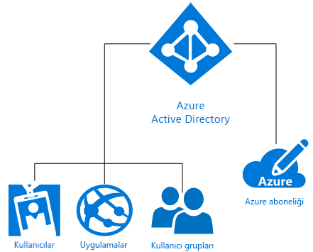

# Azure kimlik çözümlerini anlama
Microsoft Azure Active Directory (Azure AD) dizin hizmetleri, kimlik yönetimi ve uygulama erişim yönetimi özellikleri sunan bir kimlik ve erişim yönetimi bulut çözümüdür. Azure AD, [Azure AD uygulama galerisindeki](https://azure.microsoft.com/marketplace/active-directory/all/) binlerce önceden tümleştirilmiş ticari ve özel uygulamada [çoklu oturum açmayı (SSO)](https://docs.microsoft.com/azure/active-directory/active-directory-enterprise-apps-manage-sso) hızlı bir şekilde etkinleştirmenizi sağlar. Bu uygulamaların çoğu Office 365, Salesforce.com, Box, ServiceNow, Workday gibi muhtemelen kullanmakta olduğunuz uygulamalardır.

Bir Azure aboneliği oluşturulduğunda otomatik olarak tek bir Azure AD diziniyle ilişkilendirilir. Ardından Azure’ın kimlik hizmeti olan Azure AD, bulut tabanlı kaynaklar için tüm kimlik yönetimi ve erişim denetimi işlevlerini üstlenir. Bu kaynaklar aşağıdaki şemada gösterildiği gibi bağımsız bir kiracının (kuruluşun) kullanıcılarını, uygulamalarını ve gruplarını içerebilir:

Microsoft Azure, hizmet olarak kimlik (IDaaS) için kuruluşunuzun ihtiyaçlarını karşılayacak farklı karmaşıklık düzeyinde kullanım yöntemleri sunar. Bu makalenin devamında temel Azure kimlik terminolojisi ve kavramlarının yanı sıra var olan seçeneklerin arasından en iyi seçimi yapmanıza yardımcı olacak öneriler yer almaktadır.

## Bilmeniz gereken terimler

Kuruluşunuz için bir Azure kimlik çözümü seçmeden önce Azure kimlik hizmetlerinde sık kullanılan terimleri kavramanız gerekir.

|Bilmeniz gereken terim| Açıklama|
|-----|-----|
|Azure aboneliği |Abonelikler, Azure bulut hizmetleri için ödeme yapmak amacıyla kullanılır ve genelde bir kredi kartına bağlıdır. Birden fazla aboneliğe sahip olabilirsiniz ancak bu abonelikler arasında kaynak paylaşımı yapmak zor olabilir.|
|Azure kiracısı | Bir Azure AD kiracısı, tek bir kuruluşu temsil eder. Kuruluş Azure, Intune veya Office 365 gibi bir Microsoft bulut hizmeti aboneliğine kaydolduğunda otomatik olarak oluşturulan, ayrılmış ve güvenilen Azure AD örneğidir. Kiracılar ayrılmış bir ortamdaki (tek kiracılı) veya diğer kuruluşlarla paylaşılan bir ortamdaki (çok kiracılı) hizmetlere erişim elde edebilir.|
|Azure AD dizini | Her Azure kiracısının kullanıcılarının, gruplarının ve uygulamalarının bulunduğu ayrılmış ve güvenilen bir Azure AD dizini vardır. Bu dizin kiracı kaynaklarında kimlik ve erişim yönetimi işlevleri sunmak için kullanılır. Azure, Microsoft Intune veya Office 365 gibi bir Microsoft bulut hizmetine kaydolduğunuzda kuruluşunuz için otomatik olarak benzersiz bir Azure AD dizini sağlandığından *kiracı*, *Azure AD* ve *Azure AD dizini* terimlerinin bazen birbirinin yerine kullanıldığını görebilirsiniz. |
|Özel etki alanı | Bir Microsoft bulut hizmeti aboneliğine ilk kez kaydolduğunuzda kiracınız (kuruluşunuz) *.onmicrosoft.com* ile biten bir etki alanı adı kullanır. Ancak çoğu kuruluşun iş yapmak, son kullanıcıların ise şirket kaynaklarına erişmek için kullandığı bir veya daha fazla etki alanı adı vardır. Azure AD hizmetinize kendi özel etki alanı adınızı ekleyerek kullanıcılarınızın bildiği etki alanı adını kullanabilirsiniz; örneğin *alice@contoso.onmicrosoft.com* yerine *alice@contoso.com*. |
|Azure AD hesabı | Bunlar Azure AD veya Office 365 gibi başka bir Microsoft bulut hizmeti kullanıldığında oluşturulan kimliklerdir. Bu kimlikler Azure AD'de depolanır ve bunlara kuruluşun tüm bulut hizmeti aboneliklerinden erişim sağlanabilir. |
|Azure abonelik yöneticisi| Hesap yöneticisi, Azure aboneliğine kaydolan veya aboneliği satın alan kişidir. Bu kişi [Hesap Merkezi](https://account.azure.com/Subscriptions) sayfasını kullanarak abonelik oluşturma, abonelikleri iptal etme, bir aboneliğin faturalama ayarlarını değiştirme veya Hizmet Yöneticisini değiştirme gibi farklı yönetim görevlerini gerçekleştirebilir. |
|Azure AD Genel yöneticisi | Azure AD Genel yöneticileri tüm Azure AD yönetim özelliklerine tam erişime sahiptir. Bir Microsoft bulut hizmeti aboneliğine kaydolan kişi otomatik ve varsayılan olarak genel yönetici olur. Birden fazla genel yöneticiniz olabilir ancak yalnızca genel yöneticiler kullanıcılara [diğer yönetici rollerini](https://docs.microsoft.com/azure/active-directory/active-directory-assign-admin-roles-azure-portal) atayabilir. |
|Microsoft hesabı | Microsoft hesapları (kişisel kullanım için oluşturduğunuz) Outlook (Hotmail), OneDrive, Xbox LIVE veya Office 365 gibi tüketicilere yönelik Microsoft ürünlerine ve bulut hizmetlerine erişim sağlar. Bu kimlikler, Microsoft tarafından yönetilen Microsoft tüketici kimliği hesabı sisteminde oluşturulur ve depolanır.|
|İş veya okul hesapları | İş veya okul hesapları (bir yönetici tarafından iş/akademik kullanım için oluşturulur) Azure, Intune veya Office 365 gibi Microsoft bulut hizmetlerine kurumsal düzeyde erişim sağlar.|

## Anlaşılması gereken kavramlar

Temel Azure kimlik terimlerini öğrendiğinize göre bilinçli bir Azure kimlik hizmeti kararı almanıza yardımcı olacak Azure kimlik kavramları hakkında daha fazla bilgi edinebilirsiniz.

|Anlaşılması gereken kavram |Açıklama|
|-----|-----|
|[Azure aboneliklerinin Azure Active Directory ile ilişkisi](https://docs.microsoft.com/azure/active-directory/active-directory-how-subscriptions-associated-directory) |Her Azure aboneliği kullanıcıların, hizmetlerin ve cihazların kimliğini doğrulamak için Azure AD ile bir güven ilişkisine sahiptir. *Birden fazla abonelik aynı Azure AD dizinine güvenebilir ancak bir abonelik yalnızca tek bir Azure AD dizinine güvenecektir*. Bu güven ilişkisi, bir aboneliğin daha çok abonelik alt kaynakları gibi olan, diğer Azure kaynaklarıyla (web siteleri, veritabanları ve benzeri) sahip olduğu ilişkiye benzer nitelikte değildir. Bir aboneliğin süresi dolarsa Azure AD dışındaki abonelikle ilişkili kaynaklara erişim de durdurulur. Ancak Azure AD dizini Azure içinde kalır, siz de başka bir aboneliği bu dizinle ilişkilendirebilir, kiracı kaynaklarını yönetmeye devam edebilirsiniz.|
|[Azure AD'de lisanslama](https://docs.microsoft.com/azure/active-directory/active-directory-licensing-get-started-azure-portal) | Enterprise Mobility Suite, Azure AD Premium veya Azure AD Basic hizmetlerini satın aldığınızda veya etkinleştirdiğinizde kiracınız geçerlilik süresi ve ön ödemeli lisanslar dahil olmak üzere bu aboneliği kapsayacak şekilde güncelleştirilir. Abonelik etkinleştirildikten sonra hizmet Azure AD genel yöneticileri tarafından yönetilebilir ve lisanslı kullanıcılar tarafından kullanılabilir. Atanmış veya kullanılabilir durumdaki lisans sayısı dahil olmak üzere abonelik bilgilerinize Azure portaldaki **Azure Active Directory** > **Lisanslar** dikey penceresinden erişebilirsiniz. Lisans atamalarınızı yönetmek için de bu pencereyi kullanabilirsiniz.|
|[Azure portalda Rol Tabanlı Erişim Denetimi](https://docs.microsoft.com/azure/role-based-access-control/overview)|Azure Rol Tabanlı Erişim Denetimi (RBAC), Azure kaynakları için ayrıntılı erişim yönetimi sağlanmasına yardımcı olur. Çok fazla izin verilmesi halinde hesaplar saldırganların eline geçebilir. Çok az izin verilmesi halinde çalışanlar işlerini verimli bir şekilde yürütemeyebilir. RBAC kullanarak tüm kaynak gruplarında geçerli olan üç temel rolden faydalanarak çalışanlara tam olarak ihtiyaç duydukları izinleri verebilirsiniz: sahip, katkıda bulunan, okuyucu. Ayrıca ihtiyaçlarınızı karşılamak için 2000 [özel RBAC rolü](https://docs.microsoft.com/azure/role-based-access-control/custom-roles) de oluşturabilirsiniz. |
|[Karma kimlik](https://docs.microsoft.com/azure/active-directory/connect/active-directory-aadconnect)|Karma kimlik, [Azure AD Connect](https://docs.microsoft.com/azure/active-directory/connect/active-directory-aadconnect)'i kullanarak şirket içi Windows Server Active Directory (AD DS) sisteminizi Azure AD ile tümleştirdiğinizde elde edeceğiniz kimliktir. Bu sayede kullanıcılarınıza Azure AD ile tümleşik Office 365, Azure ve şirket içi uygulamalar veya SaaS uygulamaları için ortak bir kimlik sağlayabilirsiniz. Karma kimlik sayesinde şirket içi ortamınızı kimlik ve erişim için verimli bir şekilde buluta genişletmiş olursunuz.|

### Windows Server AD DS ile Azure AD arasındaki fark
Hem Azure Active Directory (Azure AD) hem de şirket içi Active Directory (Active Directory Domain Services veya AD DS) dizin verilerini depolayan ve oturum açma işlemleri, kimlik doğrulaması ve dizin aramaları gibi kullanıcılar ile kaynaklar arasındaki iletişimi yöneten sistemlerdir.

İlk olarak Windows 2000 Server'da kullanılmış olan şirket içi Windows Server Active Directory Domain Services (AD DS) yapısına hakimseniz, kimlik hizmeti temel kavramını muhtemelen anlamışsınızdır. Ancak Azure AD'nin yalnızca buluttaki bir etki alanı denetleyicisi olmadığını anlamanız da önemlidir. Azure'da kullanılan bu hizmet, hizmet olarak kimlik (IDaaS) sağlamanın yepyeni bir yoludur ve bulut tabanlı özellikleri tam olarak kavramanın yanı sıra kuruluşunuzu modern tehditlerden korumak için tamamen yeni bir açıdan bakmanızı gerektirir. 

AD DS, Windows Server üzerinde bir sunucu rolüdür ve bu durum, fiziksel ya da sanal makinelere dağıtılabileceği anlamına gelir. X.500 yaklaşımını temel alan bir hiyerarşik yapıya sahiptir. Nesneleri bulmak için DNS hizmetini kullanır, LDAP ile etkileşim kurulabilir ve kimlik doğrulaması için birincil olarak Kerberos hizmetinden yararlanır. Active Directory, kuruluş birimlerinin (OU) ve Grup İlkesi Nesnelerinin (GPO) kullanılmasının yanı sıra etki alanına makinelerin eklenmesini mümkün kılar ve etki alanları arasında güven ilişkisi oluşturulmasını sağlar.

BT departmanları, güvenlik sınırlarını yıllardır AD DS kullanarak korumuştur ancak modern, sınırların olmadığı ve çalışanlar, müşteriler ile iş ortakları için kimlik ihtiyaçlarını karşılayan kuruluşlar yeni bir kontrol düzlemine ihtiyaç duymaya başlamıştır. Azure AD, bu kimlik kontrol düzlemini sağlamaktadır. Güvenlik şirket güvenlik duvarının ötesine, buluta taşınmıştır ve burada Azure AD, kullanıcılar (şirket içi veya bulut) için tek bir ortak kimlik sağlayarak şirket kaynaklarını ve erişimi korumaktadır. Bu da kullanıcılarınıza işlerini yapmak için ihtiyaç duydukları uygulamalara hemen her cihazdan güvenli bir şekilde erişme esnekliğini tanımaktadır. Makine öğrenimi ve derinlemesine raporlama ile desteklenen sorunsuz risk tabanlı veri koruma denetimleri de BT departmanlarının şirket verilerinin güvenliğini korumasını sağlamak için sunulmuştur.

Azure AD, çok müşterili bir ortak dizin hizmetidir ve bu da Azure AD içinde bulut sunucularınız ve Office 365 gibi uygulamalarınız için bir kiracı oluşturabileceğiniz anlamına gelmektedir. Kullanıcılar ve gruplar, OU veya GPO olmadan düz bir yapıda oluşturulur. Kimlik doğrulaması SAML, WS-Federasyon ve OAuth gibi protokollerle gerçekleştirilir. Azure AD'ye sorgu gönderilebilir ancak LDAP yerine AD Graph API adlı bir REST API'sini kullanmanız gerekir. Bu bileşenler HTTP ve HTTPS üzerinden çalışır.

### Office 365 yönetim ve güvenlik özelliklerini artırma
Office 365 kullanıcısı mısınız? Yerleşik Office 365 özelliklerini Azure AD ile genişletip tüm kaynaklarınızın güvenliğini sağlayarak ve iş gücünüzün tamamı için güvenli üretkenlik olanakları sunarak dijital dönüşüm sürecinizi hızlandırabilirsiniz. Office 365 özelliklerine ek olarak Azure AD'yi kullandığınızda tüm uygulamalar için çoklu oturum açma desteği sunan tek bir kimlikle tüm uygulama portföyünüzün güvenliğini sağlayabilirsiniz. Koşullu erişim özelliklerini yalnızca cihaz durumunu değil kullanıcı, konum, uygulama ve risk düzeyini kapsayacak şekilde genişletebilirsiniz. Multi-factor authentication (MFA) özellikleri ihtiyaç duyduğunuzda daha fazla koruma sağlar. Kullanıcı ayrıcalıklarıyla ilgili ek görüşe sahip olur ve isteğe bağlı, tam zamanında yönetim erişimi sunabilirsiniz. Azure AD'nin unutulan parolaları sıfırlama, uygulama erişim istekleri ve grup oluşturup yönetme gibi self servis özellikleri sayesinde kullanıcılarınız daha üretken hale gelir ve daha az yardım masası bileti oluşturur.

> [!TIP]
> Office 365'te Azure AD kimlik yönetimini kullanma hakkında daha fazla bilgi edinmek ister misiniz? [E-kitabı edinin](https://info.microsoft.com/Extend-Office-365-security-with-EMS.html).

## Microsoft Azure kimlik çözümleri

Microsoft Azure kullanıcı kimliklerinin tamamen şirket içinde, yalnızca bulutta ve hatta ikisinin arasında bir yerde olup olmadığından bağımsız olarak birçok farklı yönetim yöntemi sunar. Bu seçenekler şunlardır: Azure'da kendin yap (DIY) AD DS, Azure Active Directory (Azure AD), Karma Kimlik ve Azure AD Domain Services.

### Kendin yap (DIY) AD DS
Bulutta yalnızca küçük bir ayak izine ihtiyaç duyan şirketler Azure'da **kendin yap (DIY) AD DS** hizmetini kullanabilir. Bu seçenek, Azure'da sanal makine olarak dağıtım için uygun olan birçok Windows Server AD DS senaryosunu destekler. Örneğin uzak ağa bağlı uzaktaki bir veri merkezinde etki alanı denetleyicisi olarak çalışan bir Azure sanal makinesi oluşturabilirsiniz. Bu sanal makine uzak kullanıcıların kimlik doğrulaması isteklerini destekleyerek kimlik doğrulaması performansını artırabilir. Bu seçenek ayrıca Azure'da az sayıda etki alanı denetleyicisi ve tek bir sanal ağ barındırarak normalde yüksek maliyetli olan olağanüstü durum kurtarma sitelerine düşük maliyetli bir alternatif olarak da kullanılabilir. Son olarak Azure'da SharePoint gibi Windows Server AD DS gerektiren ancak şirket içi ağa veya kuruluşun Windows Server Active Directory sunucusuna bağımlı olmayan bir uygulama dağıtmanız gerekebilir. Bu durumda SharePoint sunucu grubunun gereksinimlerini karşılamak için Azure'da bağımsız bir orman dağıtabilirsiniz. Aynı zamanda şirket içi ağ ve şirket içi Active Directory bağlantısı gerektiren ağ uygulamalarının dağıtılması da desteklenir.

### Azure Active Directory (Azure AD)
**Azure AD tek başına** tamamen bulut tabanlı hizmet olarak kimlik ve erişim yönetimi (IDaaS) çözümüdür. Azure AD, kullanıcıları ve grupları yönetmek için kullanabileceğiniz sağlam bir özellik kümesi sunar. Bu çözüm, Office 365 gibi Microsoft web hizmetlerini ve Microsoft tarafından sunulmayan birçok hizmet olarak yazılım (SaaS) uygulamasını da kapsayan şirket içi uygulamalara ve bulut uygulamalarına güvenli erişim sağlanmasına yardımcı olur. Azure AD üç sürüm halinde sunulur: Ücretsiz, Temel ve Premium. Azure AD kurumsal verimliliği artırır ve güvenliği şirket güvenlik duvarının ötesine, Azure makine öğrenimi ve diğer gelişmiş güvenlik özellikleri ile korunan yeni bir kontrol düzlemine taşır.

### Karma kimlik
Şirketinin uzun vadeli rotasını belirlemeye başlamış olan birçok ileri görüşlü CIO ve işletme, şirket içi veya bulut tabanlı kimlik çözümleri arasında seçim yapmak yerine **karma kimlik** çözümleriyle şirket içi dizinlerini bulutla genişletmeye başlamıştır. Karma kimlik sayesinde uygulama kullanıcılarınıza işlerini yapmaları için güvenli ve verimli erişim sunan tamamen global bir kimlik ve erişim yönetimi çözümüne sahip olursunuz.

> [!TIP]
> CIO'ların Azure Active Directory'yi BT stratejilerinin temelinde nasıl konumlandırdıkları hakkında bilgi edinmek için [CIO’s Guide to Azure Active Directory](https://aka.ms/AzureADCIOGuide) (Azure Active Directory CIO Kılavuzu) belgesini indirin.

### Azure AD Domain Services
**Azure AD Domain Services** küçük çaplı Azure sanal makine yapılandırma denetimi için AD DS kullanmak üzere bulut tabanlı seçeneğin yanı sıra ağ üzerinde uygulama geliştirme ve test için şirket içi kimlik gereksinimlerini karşılama yöntemi sunar. Azure AD Domain Services, şirket içi AD DS altyapınızı Azure AD Domain Services tarafından yönetilen Azure sanal makinelerine geçirmeyi hedeflemez. Bunun yerine yönetilen etki alanlarındaki Azure sanal makinelerinin AD DS kimlik doğrulama yöntemlerini gerektiren şirket içi uygulamaların geliştirilmesini, test edilmesini ve buluta taşınmasını destekleme amacıyla kullanılmalıdır.

## Ortak senaryolar ve öneriler

Aşağıda, bazı yaygın kimlik ve erişim senaryoları, hangi Azure kimlik seçeneğinin hangi senaryoya uygun olabileceği hakkında önerilerle birlikte verilmiştir.

|Kimlik senaryosu| Öneri|
|-----|-----|
|Kuruluşum, şirket içi Windows Server Active Directory için büyük yatırımlar yaptı ancak kimlikleri buluta doğru genişletmek istiyoruz.| En yaygın kullanılan Azure kimlik çözümü, [karma kimliktir](https://docs.microsoft.com/azure/active-directory/active-directory-hybrid-identity-design-considerations-overview). Şirket içi AD DS çözümüne yatırım yaptıysanız Azure AD Connect hizmetini kullanarak kimlikleri buluta doğru genişletebilirsiniz.|
|İşletmem faaliyetlerine bulutta başladı ve şirket içi kimlik çözümlerine yatırım yapmadık.| [Azure Active Directory](https://docs.microsoft.com/azure/active-directory/active-directory-whatis), şirket içi yatırım yapmamış olan ve yalnızca bulut üzerinde var olan işletmeler için en iyi seçimdir.|
|Uygulama geliştirme ve test için şirket içi kimlik gereksinimlerini karşılama amacıyla küçük çaplı bir Azure sanal makine yapılandırmasına ve denetimine ihtiyacım var.|Küçük çaplı Azure sanal makine yapılandırması denetimi için AD DS kullanmak veya eski, dizin kullanan şirket içi uygulamaları buluta geçirmek veya bulutta geliştirmek istiyorsanız [Azure AD Domain Services](https://docs.microsoft.com/azure/active-directory-domain-services/active-directory-ds-overview) iyi bir seçenektir.|  
|Azure'da birkaç sanal makineyi desteklemem gerekiyor ancak şirketim şirket içi Active Directory (AD DS) yapısına çok fazla yatırım yapmış durumda.|Birkaç sanal makineyi desteklemeniz gerektiğinde Azure sanal makinelerini kullanmak için ve şirket içi ortamda büyük AD DS yatırımlarınız varsa [DIY AD DS](https://docs.microsoft.com/azure/active-directory-domain-services/active-directory-ds-comparison#do-it-yourself-diy-ad-deployment-options) seçeneğini kullanın. |

## Nereden daha fazla bilgi edinebilirim?
Azure AD hakkında bilgi edinmenize yardımcı olacak birçok çevrimiçi kaynağımız mevcuttur. Kullanmaya başlamanıza yardımcı olacak makalelerin listesini burada bulabilirsiniz:

* [Dizininizi Azure AD Connect ile karma yönetim için etkinleştirme](../connect/active-directory-aadconnect.md)
* [Bağlantılı bir dünya için ek güvenlik adımları](../authentication/multi-factor-authentication.md)
* [Azure Active Directory ile SaaS Uygulamalarına Kullanıcı Hazırlama ve Sağlamayı Kaldırma İşlemlerini Otomatik Hale Getirme](../active-directory-saas-app-provisioning.md)
* [Parolalarınızı istediğiniz yerden yönetin](../user-help/active-directory-passwords-update-your-own-password.md)
* [Azure Active Directory ile uygulama erişimi ve çoklu oturum açma özellikleri nelerdir?](../manage-apps/what-is-single-sign-on.md)
* [Azure Active Directory ile SaaS Uygulamalarına Kullanıcı Hazırlama ve Sağlamayı Kaldırma İşlemlerini Otomatik Hale Getirme](../active-directory-saas-app-provisioning.md)
* [Şirket içi uygulamalara güvenli uzaktan erişim sağlama](../manage-apps/application-proxy.md)
* [Azure Active Directory grupları ile kaynaklara erişimi yönetme](active-directory-manage-groups.md)
* [Microsoft Azure Active Directory lisansı nedir?](active-directory-licensing-whatis-azure-portal.md)
* [Kuruluşumun içinde kullanılan tasdiksiz bulut uygulamalarını nasıl bulabilirim?](../manage-apps/cloud-app-discovery.md)

## Sonraki adımlar

Azure kimlik kavramlarını ve size sunulan seçenekleri kavradığınızda göre belirlediğiniz seçeneği uygulamaya başlamak için aşağıdaki kaynakları kullanabilirsiniz:

[Azure karma kimlik çözümleri hakkında daha fazla bilgi edinin](https://docs.microsoft.com/azure/active-directory/choose-hybrid-identity-solution)

[Azure Kavram Kanıtı ortamında daha fazla bilgi edinin](https://aka.ms/aad-poc)
