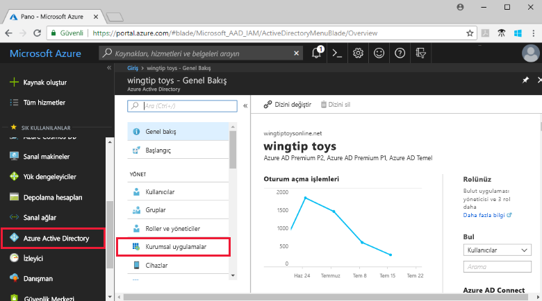

# Hızlı Başlangıç: Azure Active Directory kiracınız için uygulama ekleme

Azure Active Directory (Azure AD), önceden tümleştirilmiş binlerce uygulamanın yer aldığı bir galeriye sahiptir. Galeride kuruluşunuzun kullandığı uygulamaların bazıları da mevcuttur. Bu hızlı başlangıçta Azure portal kullanılarak Azure Active Directory (Azure AD) kiracınıza bir galeri uygulaması eklenmektedir.

Bir uygulamayı Azure AD kiracınıza ekledikten sonra aşağıdaki işlemleri gerçekleştirebilirsiniz:

- Koşullu erişim ilkesi ile uygulamaya kullanıcı erişimini yönetme.
- Kullanıcıları Azure AD hesapları ile uygulamada çoklu oturum açma özelliğini kullanacak şekilde yapılandırma.

## Başlamadan önce

Kiracınıza uygulama eklemek için şunlara ihtiyacınız vardır:

- Azure AD aboneliği
- Uygulamanız için çoklu oturum açma özelliği etkinleştirilmiş abonelik

[Azure portalda](https://portal.azure.com) Azure AD kiracınızın genel yönetici, bulut uygulaması yöneticisi veya uygulama yöneticisi hesabıyla oturum açın.

Bu öğreticideki adımları test etmek için üretim ortamı harici bir ortam kullanmanızı öneririz. Üretim ortamı dışında bir Azure AD ortamınız yoksa [bir aylık deneme](https://azure.microsoft.com/pricing/free-trial/) aboneliği oluşturabilirsiniz.

## Azure AD kiracınıza uygulama ekleme

Azure AD kiracınıza galeri uygulaması eklemek için:

1. İçinde [Azure portalında](https://portal.azure.com), sol gezinti panelinde seçin **Azure Active Directory**.

2. İçinde **Azure Active Directory** bölmesinde **kurumsal uygulamalar**.

    

3. **Tüm uygulamaları** rastgele oluşturulmuş bir örnek uygulamaları Azure AD kiracınızda gösterilecek bölme açılır. Seçin **yeni uygulama** en üstündeki **tüm uygulamaları** bölmesi.

    

4. İçinde **kategorileri** bölmesinde simgeleri altında görürsünüz **özellikli uygulamalara** galeri uygulamalarının bir rastgele örnek alan.  Daha fazla uygulama görmek için seçebilirsiniz **daha fazla Göster**. Ancak, uygulama galerisinde bulunan binlerce olduğundan bu şekilde arama önermemekteyiz.

    

5. Bir uygulama için altında aranacak **Galeriden Ekle**, eklemek istediğiniz uygulamanın adını girin. Uygulama sonuçları ve select seçin **Ekle**. Aşağıdaki örnekte gösterildiği **uygulama Ekle** github.com için aradıktan sonra görünen form.

    

6. Uygulamaya özgü formda özellik bilgilerini değiştirebilirsiniz. Örneğin uygulamanızın adını kuruluşunuzun gereksinimlerine göre düzenleyebilirsiniz. Bu örnekte **GitHub-test** adı kullanılmıştır.

7. Özelliklerine değişiklikleri yapmayı bitirdiğinizde, seçin **Ekle**.

8. Uygulamayı kuruluşunuza göre yapılandırmak için kullanabileceğiniz seçeneklerin bulunduğu bir başlangıç sayfası açılır.

Uygulamanızı ekleme işlemi tamamlandı. Şimdi biraz ara verebilirsiniz. Aşağıdaki bölümlerde uygulamanızın logosunu değiştirme ve diğer özelliklerini düzenleme adımları gösterilmektedir.

## Azure AD kiracısı uygulamanızı bulma

İşlemi burada bırakmak zorunda kaldığınızı ve uygulamayı yapılandırmaya devam etmek için daha sonra tekrar geldiğinizi düşünelim. Yapılacak ilk şey, uygulamanızın bulmaktır.

1. İçinde  **[Azure portalında](https://portal.azure.com)**, sol gezinti panelinde seçin **Azure Active Directory**.

2. İçinde **Azure Active Directory** bölmesinde **kurumsal uygulamalar**.

3. Gelen **uygulama türü** açılan menüsünde, select **tüm uygulamaları**ve ardından **Uygula**. Görüntüleme seçenekleri hakkında daha fazla bilgi edinmek için bkz. [Kiracı uygulamalarını görüntüleme](view-applications-portal.md).

4. Burada Azure AD kiracınızdaki tüm uygulamaların listesini görebilirsiniz. Bu listedeki uygulamalar rastgele seçilmiştir. Daha fazla uygulama görmek için seçin **daha fazla Göster** bir veya daha fazla kez.

5. Bir uygulama kiracınızda hızlıca bulmak için arama kutusuna uygulama adını girin ve seçin **Uygula**. Bu örnek, daha önce eklediğiniz test GitHub uygulama bulur.

    

## Kullanıcı oturum açma özelliklerini yapılandırma

Uygulama buldunuz, açın ve uygulama özelliklerini yapılandırın.

Uygulama özelliklerini düzenlemek için:

1. Uygulamayı açmak için seçin.
2. Seçin **özellikleri** düzenlemek için Özellikler bölmesi açmak için.

    

3. Birkaç dakikanızı ayırarak oturum açma seçeneklerini inceleyin. Atanan veya uygulamaya atanmamış kullanıcılar uygulamaya nasıl kaydolabilirsiniz seçenekleri belirleyin. Ayrıca, bir kullanıcı, uygulamayı erişim panelinde görüyorsanız, aynı zamanda seçenekleri belirleyin.

    - **Kullanıcıların oturum açması için etkinleştirildi**, uygulamaya atanan kullanıcıların oturum açıp açamayacağını belirler.
    - **Kullanıcı ataması gerekli** uygulamaya atanmamış kullanıcılar oturum açabilir olup olmadığını belirler.
    - **Kullanıcıya görünür**, uygulamaya atanan kullanıcıların uygulamayı erişim panelinde ve O365 başlatıcısında görüp göremeyeceğini belirler.

4. Gereksinimleriniz için en iyi seçenekleri belirlemenize yardımcı olması için aşağıdaki tabloları kullanın.

   - **Atanan** kullanıcılar için davranış:

       | Uygulama özelliği ayarları | | | Atanan kullanıcı deneyimi | |
       |---|---|---|---|---|
       | Kullanıcıların oturum açması için etkinleştirildi mi? | Kullanıcı ataması gerekli mi? | Kullanıcılara görünür mü? | Atanan kullanıcılar oturum açabilir mi? | Atanan kullanıcılar uygulamayı görebilir mi?* |
       | evet | evet | evet | evet | evet  |
       | evet | evet | hayır  | evet | hayır   |
       | evet | hayır  | evet | evet | evet  |
       | evet | hayır  | hayır  | evet | hayır   |
       | hayır  | evet | evet | hayır  | hayır   |
       | hayır  | evet | hayır  | hayır  | hayır   |
       | hayır  | hayır  | evet | hayır  | hayır   |
       | hayır  | hayır  | hayır  | hayır  | hayır   |

   - **Atanmayan** kullanıcılar için davranış:

       | Uygulama özelliği ayarları | | | Atanmayan kullanıcı deneyimi | |
       |---|---|---|---|---|
       | Oturum açmak kullanıcılar için etkin mi? | Kullanıcı ataması gerekli mi? | Kullanıcılara görünür mü? | Atanmayan kullanıcılar oturum açabilir mi? | Atanmayan kullanıcılar uygulamayı görebilir mi?* |
       | evet | evet | evet | hayır  | hayır   |
       | evet | evet | hayır  | hayır  | hayır   |
       | evet | hayır  | evet | evet | hayır   |
       | evet | hayır  | hayır  | evet | hayır   |
       | hayır  | evet | evet | hayır  | hayır   |
       | hayır  | evet | hayır  | hayır  | hayır   |
       | hayır  | hayır  | evet | hayır  | hayır   |
       | hayır  | hayır  | hayır  | hayır  | hayır   |

     *Kullanıcı uygulamayı erişim panelinde ve Office 365 uygulama başlatıcıda görebilir mi?

## Özel logo kullanma

Özel logo kullanmak için:

1. 215x215 piksel boyutunda bir logo oluşturun ve PNG biçiminde kaydedin.
2. Uygulamanız zaten buldunuz olduğundan, uygulamayı seçin.
2. Sol bölmede seçin **özellikleri**.
4. Logoyu yükleyin.
5. İşlemi tamamladığınızda, seçin **Kaydet**.

    

## Sonraki adımlar

Bu hızlı başlangıçta Azure AD kiracınıza galeri uygulaması eklemeyi öğrendiniz. Bir uygulamanın özelliklerini düzenlemeyi öğrendiniz.

Artık uygulamayı çoklu oturum açma için yapılandırmaya hazırsınız.

> [!div class="nextstepaction"]
> [Çoklu oturum açmayı yapılandırma](configure-single-sign-on-portal.md)

