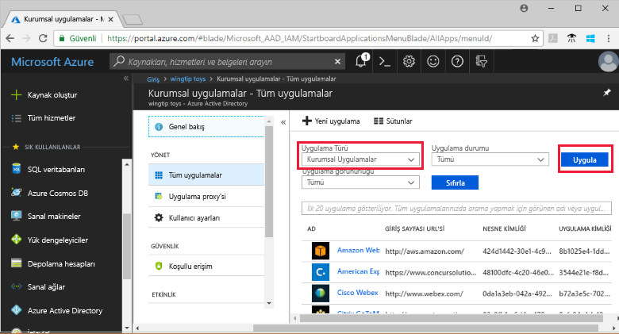
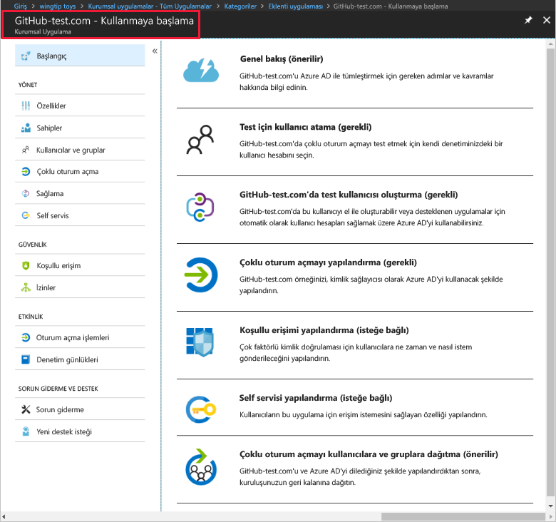

# Hızlı Başlangıç: Azure Active Directory kiracınız için uygulama ekleme

Azure Active Directory (Azure AD), önceden tümleştirilmiş binlerce uygulamanın yer aldığı bir galeriye sahiptir. Galeride kuruluşunuzun kullandığı uygulamaların bazıları da mevcuttur. Bu hızlı başlangıçta Azure portal kullanılarak Azure Active Directory (Azure AD) kiracınıza bir galeri uygulaması eklenmektedir.

Bir uygulamayı Azure AD kiracınıza ekledikten sonra aşağıdaki işlemleri gerçekleştirebilirsiniz:

- Koşullu erişim ilkesi ile uygulamaya kullanıcı erişimini yönetme.
- Kullanıcıları Azure AD hesapları ile uygulamada çoklu oturum açma özelliğini kullanacak şekilde yapılandırma.

## Başlamadan önce

Kiracınıza uygulama eklemek için şunlara ihtiyacınız vardır:

- Azure AD aboneliği
- Uygulamanız için çoklu oturum açma özelliği etkinleştirilmiş abonelik

[Azure portalda](https://portal.azure.com) Azure AD kiracınızın genel yönetici, bulut uygulaması yöneticisi veya uygulama yöneticisi hesabıyla oturum açın.

Bu öğreticideki adımları test etmek için üretim ortamı harici bir ortam kullanmanızı öneririz. Üretim ortamı dışında bir Azure AD ortamınız yoksa [bir aylık deneme](https://azure.microsoft.com/pricing/free-trial/) aboneliği oluşturabilirsiniz.

## Azure AD kiracınıza uygulama ekleme

Azure AD kiracınıza galeri uygulaması eklemek için:

1. [Azure portalda](https://portal.azure.com) sol taraftaki gezinti panelinden **Azure Active Directory**’ye tıklayın.

2. **Azure Active Directory** dikey penceresinde **Kurumsal uygulamalar**’a tıklayın.

    

3. Açılan **Tüm uygulamalar** dikey penceresinde Azure AD kiracınızdaki uygulamalardan rastgele seçilmiş olanlar gösterilir.

    

4. **Tüm uygulamalar** dikey penceresinin en üstünden **Yeni uygulama**’ya tıklayın.

    

5. Galerideki uygulamaların listesini görmek için kullanabileceğiniz en kolay yol, **Kategoriler** simgesini seçmektir. **Öne çıkan uygulamalar** bölümünde rastgele seçilmiş galeri uygulamalarına yer verilir.

    

    Daha fazla uygulama görmek için **Daha fazla göster**’e tıklayabilirsiniz. Galeride binlerce uygulama olduğundan aradığınız uygulamayı bu şekilde bulmaya çalışmanız önerilmez.

6. Uygulama aramak için **Galeriden ekle** bölümüne eklemek istediğiniz uygulamanın adını girin. Sonuçların arasından istediğiniz uygulamayı seçin ve **Ekle**’ye tıklayın. Aşağıdaki örnekte gösterildiği **uygulama Ekle** github.com için aradıktan sonra görünen form.

    

6. Uygulamaya özgü formda özellik bilgilerini değiştirebilirsiniz. Örneğin uygulamanızın adını kuruluşunuzun gereksinimlerine göre düzenleyebilirsiniz. Bu örnekte **GitHub-test** adı kullanılmıştır.

8. Özelliklerde istediğiniz değişiklikleri yaptıktan sonra **Ekle**’ye tıklayın.

9. Uygulamayı kuruluşunuza göre yapılandırmak için kullanabileceğiniz seçeneklerin bulunduğu bir başlangıç sayfası açılır.

    

Uygulamanızı ekleme adımlarını tamamladınız. Şimdi biraz ara verebilirsiniz. Aşağıdaki bölümlerde uygulamanızın logosunu değiştirme ve diğer özelliklerini düzenleme adımları gösterilmektedir.

## Azure AD kiracısı uygulamanızı bulma

İşlemi burada bırakmak zorunda kaldığınızı ve uygulamayı yapılandırmaya devam etmek için daha sonra tekrar geldiğinizi düşünelim. Yapmanız gereken ilk şey uygulamanızı bulmaktır.

1. **[Azure portalda](https://portal.azure.com)** sol taraftaki gezinti panelinden **Azure Active Directory**’ye tıklayın.

2. Azure Active Directory dikey penceresinde **Kurumsal uygulamalar**’a tıklayın.

3. **Uygulama Türü** açılan menüsünden **Tüm Uygulamalar**’ı seçin ve **Uygula**’ya tıklayın. Görüntüleme seçenekleri hakkında daha fazla bilgi edinmek için bkz. [Kiracı uygulamalarını görüntüleme](view-applications-portal.md).

4. Burada Azure AD kiracınızdaki tüm uygulamaların listesini görebilirsiniz. Bu listedeki uygulamalar rastgele seçilmiştir. Daha fazla uygulama görmek için **Daha fazla göster**’e bir veya birkaç kez tıklayın.

5. Kiracınızdaki bir uygulamayı hızlıca bulmak için uygulamanın adını arama kutusuna girip **Uygula**’ya tıklayın. Bu örnekte önceki adımlarda eklediğimiz GitHub-test uygulaması bulunmaktadır.

    

## Kullanıcı oturum açma özelliklerini yapılandırma

Uygulamayı bulduğunuza göre artık açıp özelliklerini yapılandırabilirsiniz.

Uygulama özelliklerini düzenlemek için

1. Uygulamaya tıklayarak açın.
2. **Özellikler**’e tıklayarak düzenleme yapabileceğiniz özellikler dikey penceresini açın.

    

3. Birkaç dakikanızı ayırarak oturum açma seçeneklerini inceleyin. **Kullanıcıların oturum açması için etkinleştirildi**, **Kullanıcı ataması gerekli** ve **Kullanıcıya görünür** seçenekleri birlikte uygulamaya atanan veya atanmayan kullanıcıların oturum açıp açamayacağını belirler. Bu ayarlar ayrıca kullanıcının uygulamayı erişim panelinde görüp göremeyeceğini de belirler.

    - **Kullanıcıların oturum açması için etkinleştirildi**, uygulamaya atanan kullanıcıların oturum açıp açamayacağını belirler.
    - **Kullanıcı ataması gerekli**, uygulamaya atanmayan kullanıcıların oturum açıp açamayacağını belirler.
    - **Kullanıcıya görünür**, uygulamaya atanan kullanıcıların uygulamayı erişim panelinde ve O365 başlatıcısında görüp göremeyeceğini belirler.

4. Aşağıdaki tablolar ihtiyaçlarınıza en uygun seçenekleri belirlemenize yardımcı olur.

    - **Atanan** kullanıcılar için davranış:

        | Uygulama özelliği ayarları | | | Atanan kullanıcı deneyimi | |
        |---|---|---|---|---|
        | Kullanıcıların oturum açması için etkinleştirildi mi? | Kullanıcı ataması gerekli mi? | Kullanıcılara görünür mü? | Atanan kullanıcılar oturum açabilir mi? | Atanan kullanıcılar uygulamayı görebilir mi?* |
        | evet | evet | evet | evet | evet  |
        | evet | evet | hayır  | evet | hayır   |
        | evet | hayır  | evet | evet | evet  |
        | evet | hayır  | hayır  | evet | hayır   |
        | hayır  | evet | evet | hayır  | hayır   |
        | hayır  | evet | hayır  | hayır  | hayır   |
        | hayır  | hayır  | evet | hayır  | hayır   |
        | hayır  | hayır  | hayır  | hayır  | hayır   |

    - **Atanmayan** kullanıcılar için davranış:

        | Uygulama özelliği ayarları | | | Atanmayan kullanıcı deneyimi | |
        |---|---|---|---|---|
        | Kullanıcıların oturum açması için etkinleştirildi mi? | Kullanıcı ataması gerekli mi? | Kullanıcılara görünür mü? | Atanmayan kullanıcılar oturum açabilir mi? | Atanmayan kullanıcılar uygulamayı görebilir mi?* |
        | evet | evet | evet | hayır  | hayır   |
        | evet | evet | hayır  | hayır  | hayır   |
        | evet | hayır  | evet | evet | hayır   |
        | evet | hayır  | hayır  | evet | hayır   |
        | hayır  | evet | evet | hayır  | hayır   |
        | hayır  | evet | hayır  | hayır  | hayır   |
        | hayır  | hayır  | evet | hayır  | hayır   |
        | hayır  | hayır  | hayır  | hayır  | hayır   |

    *Kullanıcı uygulamayı erişim panelinde ve Office 365 uygulama başlatıcıda görebilir mi?

## Özel logo kullanma

Özel logo kullanmak için:

1. 215x215 piksel boyutunda bir logo oluşturun ve PNG biçiminde kaydedin.
2. Uygulamanızı zaten bulduğunuz için üzerine tıklayın.
2. Sol dikey pencerede **Özellikler**’e tıklayın.
4. Logoyu yükleyin.
5. İşlemi tamamladıktan sonra **Kaydet**’e tıklayın.

    

## Sonraki adımlar

Bu hızlı başlangıçta Azure AD kiracınıza galeri uygulaması eklemeyi öğrendiniz. Bir uygulamanın özelliklerini düzenlemeyi öğrendiniz.

Artık uygulamayı çoklu oturum açma için yapılandırmaya hazırsınız.

> [!div class="nextstepaction"]
> [Çoklu oturum açmayı yapılandırma](configure-single-sign-on-portal.md)

