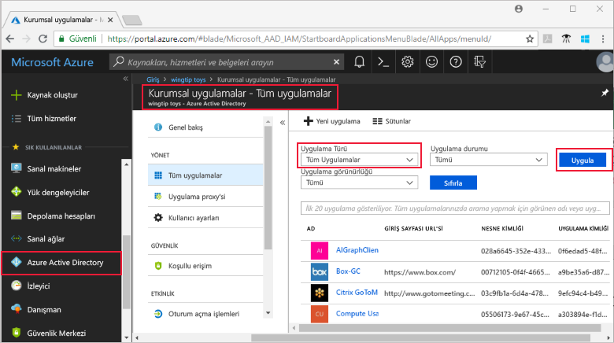
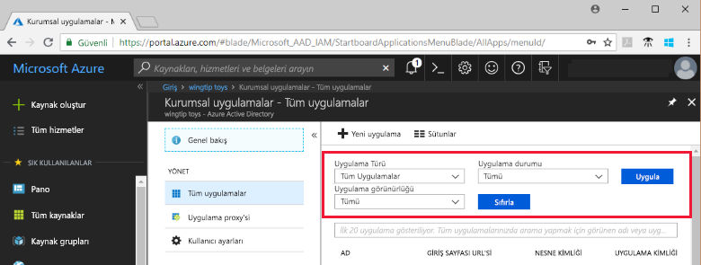

# Azure Active Directory kiracınızdaki uygulamaları görüntüleme

Bu hızlı başlangıçta Azure Active Directory (Azure AD) kiracınızdaki uygulamaları görüntülemek için Azure portal kullanılmaktadır.

## Başlamadan önce

Sonuçları görmek için Azure AD kiracınızda en az bir uygulamanız olması gerekir. Uygulama eklemek için [Uygulama ekleme](add-application-portal.md) hızlı başlangıcına bakın.

[Azure portalda](https://portal.azure.com) Azure AD kiracınızın genel yönetici, bulut uygulaması yöneticisi veya uygulama yöneticisi hesabıyla oturum açın.

## Kiracı uygulamaları listesini bulma

Azure AD kiracınızdaki uygulamaları Azure portalın **Kurumsal uygulamalar** bölümünden görüntüleyebilirsiniz.

Kiracı uygulamalarınızı bulmak için:

1. **[Azure portalda](https://portal.azure.com)** sol taraftaki gezinti panelinden **Azure Active Directory**’ye tıklayın. 

2. Azure Active Directory dikey penceresinde **Kurumsal uygulamalar**’a tıklayın. 

3. **Uygulama Türü** açılan menüsünden **Tüm Uygulamalar**’ı seçin ve **Uygula**’ya tıklayın. Kiracınızdaki uygulamalardan rastgele seçilenler burada görünür.

    
   
4. Daha fazla uygulama görüntülemek için listenin en altındaki **Daha fazla göster**'e tıklayın. Kiracınızdaki uygulama sayısına bağlı olarak listeyi kaydırmak yerine [belirli bir uygulamayı aramak](#search-for-a-tenant-application) daha kolay olabilir.

## Görüntüleme seçeneklerini belirleme

Bu bölümde aradığınız uygulamaya uygun seçenekleri belirleyin.

1. Uygulamaları **Uygulama Türü**, **Uygulama Durumu** ve **Uygulama Görünürlüğü** seçeneklerine göre görüntüleyebilirsiniz. 

    

2. **Uygulama Türü** bölümünde aşağıdaki seçeneklerden birini belirleyin:

    - **Kurumsal Uygulamalar** seçeneği Microsoft harici uygulamaları gösterir.
    - **Microsoft Uygulamaları** seçeneği Microsoft uygulamalarını gösterir.
    - **Tüm Uygulamalar** seçeneği hem Microsoft harici uygulamaları hem de Microsoft uygulamalarını gösterir.

3. **Uygulama Durumu** bölümünde **Tümü**, **Devre dışı** veya **Etkin** seçeneğini belirleyin. **Tümü** seçeneği hem devre dışı hem de etkin uygulamaları gösterir.

4. **Uygulama Görünürlüğü** bölümünde **Tümü** veya **Gizli** seçeneğini belirleyin. **Gizli** seçeneği kiracıda bulunan ancak kullanıcılara görünür olmayan uygulamaları gösterir.

5. İstediğiniz seçenekleri belirledikten sonra **Uygula**'ya tıklayın.
 

## Belirli bir kiracı uygulamasını arama

Belirli bir uygulamayı aramak için:

1. **Uygulama Türü** menüsünden **Tüm uygulamalar**'ı seçin ve **Uygula**'ya tıklayın.

2. Bulmak istediğiniz uygulamanın adını girin. Uygulama Azure AD kiracınıza eklenmişse arama sonuçlarında görünür. Bu örnek, GitHub uygulamasının kiracı uygulamalarına eklenmediğini göstermektedir.

    

3. Uygulama adının ilk birkaç harfini girmeyi deneyin.  Bu örnek **Sales** ile başlayan tüm uygulamaları gösterir.

    

## Sonraki adımlar

Bu hızlı başlangıçta Azure AD kiracınızdaki uygulamaları görüntülemeyi ve uygulama listesini uygulama türüne, durumuna ve görünürlüğüne göre filtrelemeyi öğrendiniz. Ayrıca belirli bir uygulamayı aramayı da öğrendiniz.

Aradığınız uygulamayı bulduğunuza göre [Kiracınıza daha fazla uygulama ekle](add-application-portal.md) bölümüne geçebilir veya uygulamaya tıklayarak özelliklerini ve yapılandırma seçeneklerini görüntüleyebilir veya düzenleyebilirsiniz. Örneğin çoklu oturum açmayı yapılandırabilirsiniz. 

> [!div class="nextstepaction"]
> [Çoklu oturum açmayı yapılandırma](configure-single-sign-on-portal.md)

