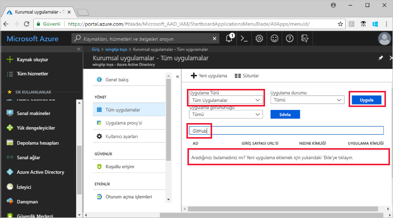
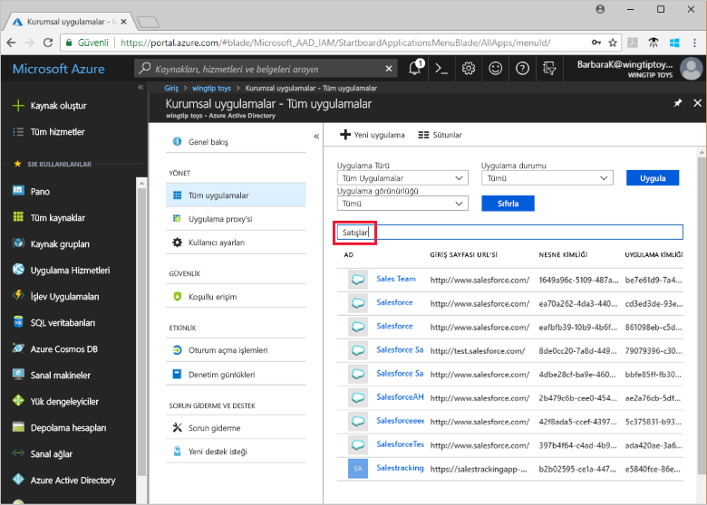

# Azure Active Directory kiracınızdaki uygulamaları görüntüleme

Bu hızlı başlangıçta Azure Active Directory (Azure AD) kiracınızdaki uygulamaları görüntülemek için Azure portal kullanılmaktadır.

## Başlamadan önce

Sonuçları görmek için Azure AD kiracınızda en az bir uygulamanız olması gerekir. Uygulama eklemek için [Uygulama ekleme](add-application-portal.md) hızlı başlangıcına bakın.

[Azure portalda](https://portal.azure.com) Azure AD kiracınızın genel yönetici, bulut uygulaması yöneticisi veya uygulama yöneticisi hesabıyla oturum açın.

## Kiracı uygulamaları listesini bulma

Azure AD kiracınızdaki uygulamaları Azure portalın **Kurumsal uygulamalar** bölümünden görüntüleyebilirsiniz.

Kiracı uygulamalarınızı bulmak için:

1. İçinde  **[Azure portalında](https://portal.azure.com)** , sol gezinti panelinde seçin **Azure Active Directory**. 

1. İçinde **Azure Active Directory** bölmesinde **kurumsal uygulamalar**. 

1. Gelen **uygulama türü** açılan menüsünde, select **tüm uygulamaları**ve **Uygula**. Kiracınızdaki uygulamalardan rastgele seçilenler burada görünür.
   
1. Daha fazla uygulama görüntülemek için seçin **daha fazla Yükle** listenin altındaki. Kiracınızdaki uygulama sayısına bağlı olarak listeyi kaydırmak yerine [belirli bir uygulamayı aramak](#search-for-a-tenant-application) daha kolay olabilir.

## Görüntüleme seçeneklerini belirleme

Aradığınız ne göre seçenekleri belirleyin.

1. Uygulamalar tarafından görüntüleyebileceğiniz **uygulama türü**, **uygulama durumu**, ve **uygulama görünürlüğü**. 

1. **Uygulama Türü** bölümünde aşağıdaki seçeneklerden birini belirleyin:

    - **Kurumsal Uygulamalar** seçeneği Microsoft harici uygulamaları gösterir.
    - **Microsoft Uygulamaları** seçeneği Microsoft uygulamalarını gösterir.
    - **Tüm Uygulamalar** seçeneği hem Microsoft harici uygulamaları hem de Microsoft uygulamalarını gösterir.

1. **Uygulama Durumu** bölümünde **Tümü**, **Devre dışı** veya **Etkin** seçeneğini belirleyin. **Tümü** seçeneği hem devre dışı hem de etkin uygulamaları gösterir.

1. **Uygulama Görünürlüğü** bölümünde **Tümü** veya **Gizli** seçeneğini belirleyin. **Gizli** seçenek kiracıda olan ancak kullanıcılar için görünür olmayan uygulamaları gösterir.

1. Seçmek istediğiniz seçenekleri seçtikten sonra **Uygula**.

## Belirli bir kiracı uygulamasını arama

Belirli bir uygulama için arama yapmak için:

1. İçinde **uygulama türü** menüsünde **tüm uygulamaları**ve **Uygula**.

1. Bulmak istediğiniz uygulamanın adını girin. Uygulamanın Azure AD kiracınıza eklenmişse, arama sonuçlarında görünür. Bu örnek, GitHub Kiracı uygulamalarına eklenmemiş gösterir.

    

1. Uygulama adının ilk birkaç harfini girmeyi deneyin. Bu örnek **Sales** ile başlayan tüm uygulamaları gösterir.

    

## Sonraki adımlar

Bu hızlı başlangıçta, Azure AD kiracınızda uygulamaları görüntüleme öğrendiniz. Uygulama türü, durum ve görünürlük uygulamaların listesini filtrelemek öğrendiniz. Ayrıca belirli bir uygulamayı aramayı da öğrendiniz.

Uygulama buldunuz göre devam edebilirsiniz için arıyorduk [kiracınıza daha fazla uygulama eklemek](add-application-portal.md). Veya, görüntülemek veya özellikleri ve yapılandırma seçenekleri düzenlemek için bir uygulama seçebilirsiniz. Örneğin çoklu oturum açmayı yapılandırabilirsiniz.

> [!div class="nextstepaction"]
> [Çoklu oturum açmayı yapılandırma](configure-single-sign-on-portal.md)
