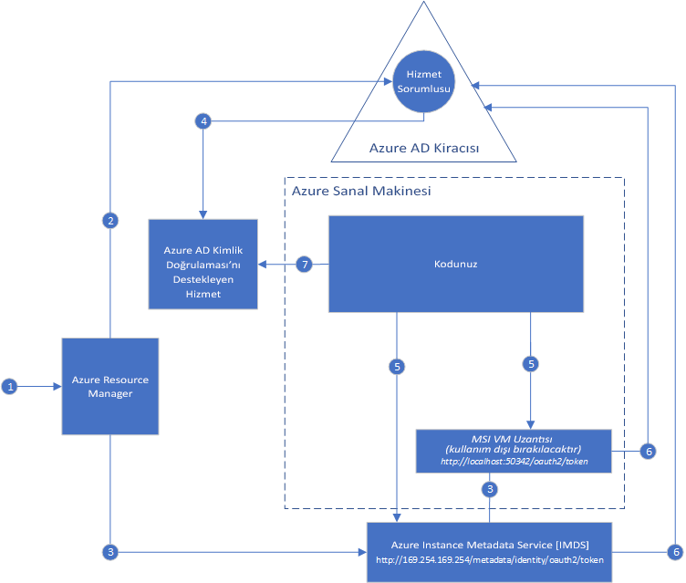

#  Azure kaynakları için Yönetilen Hizmet Kimliği nedir?

[!INCLUDE[preview-notice](../../../includes/active-directory-msi-preview-notice.md)]

Bulut uygulamaları oluştururken yaygın olarak karşılaşılan bir zorluk, bulut hizmetlerinde kimlik doğrulaması yapmak için kodunuzda bulunması gereken kimlik bilgilerinin yönetimidir. Bu kimlik bilgilerinin güvenlik altında tutulması önemli bir görevdir. İdeal olan bunların geliştirici iş istasyonlarında asla gösterilmemesi veya kaynak denetimine kaydedilmesidir. Azure Key Vault kimlik bilgilerini ve diğer anahtarlarla gizli dizileri güvenle depolamak için bir yol sağlar, ama bunları alabilmek için kodunuzun Key Vault'ta kimlik doğrulaması yapması gerekir. Yönetilen Hizmet Kimliği, Azure hizmetlerine Azure Active Directory’de (Azure AD) otomatik olarak yönetilen bir kimlik vererek bu soruna daha basit bir çözüm getirir. Bu kimliği kullanarak, Key Vault da dahil olmak üzere Azure AD kimlik doğrulamasını destekleyen tüm hizmetlerde kodunuzda kimlik bilgileri bulunmasına gerek kalmadan kimlik doğrulaması yapabilirsiniz.

Yönetilen Hizmet Kimliği, Azure aboneliklerinde varsayılan olarak sağlanan Azure Active Directory ücretsiz ile birlikte gelir. Yönetilen Hizmet Kimliği'nin ek maliyeti yoktur.

## Nasıl çalışır?

İki tür Yönetilen Hizmet Kimliği vardır: **Sistem Tarafından Atanan** ve **Kullanıcı Tarafından Atanan**.

- **Sistem Tarafından Atanan Kimlik** doğrudan bir Azure hizmet örneğinde etkinleştirilir. Etkinleştirildiğinde, Azure hizmet örneği aboneliğinin güvendiği Azure AD kiracısında hizmet örneği için bir kimlik oluşturur. Kimlik oluşturulduktan sonra, bu kimliğin bilgileri hizmet örneğine sağlanır. Sistem tarafından atanan kimliğin yaşam döngüsü, içinde etkinleştirildiği Azure hizmet örneğine doğrudan bağlıdır. Hizmet örneği silinirse, Azure AD'deki kimlik bilgileri ve kimlik Azure tarafından otomatik olarak temizlenir.
- **Kullanıcı Tarafından Atanan Kimlik** tek başına bir Azure kaynağı olarak oluşturulur. Bir oluşturma işlemi çerçevesinde, Azure kullanılan abonelik tarafından güvenilen Azure AD kiracısında bir kimlik oluşturur. Kimlik oluşturulduktan sonra, bir veya birden çok Azure hizmet örneğine atanabilir. Kullanıcı tarafından atanan kimliğin yaşam döngüsü, bu kimliğin atandığı Azure hizmet örneklerinin yaşam döngüsünden ayrı olarak yönetilir.

Sonuç olarak, kodunuz Azure AD kimlik doğrulamasını destekleyen hizmetler için erişim belirteçleri istemek amacıyla sistem tarafından atanan veya kullanıcı tarafından atanan kimliği kullanabilir. Hizmet örneği tarafından kullanılan kimlik bilgilerinin dağıtımıyla da tümüyle Azure ilgilenir.

Burada Sistem Tarafından Atanan Kimliklerin Azure Sanal Makineler ile nasıl çalıştığını gösteren bir örnek verilmiştir:

1. Azure Resource Manager sanal makinede sistem tarafından atanan kimliği etkinleştirmek için bir istek alır.
2. Azure Resource Manager, Azure AD'de sanal makinenin kimliğini temsil edecek bir Hizmet Sorumlusu oluşturur. Hizmet Sorumlusu, bu abonelik tarafından güvenilen Azure AD kiracısında oluşturulur.
3. Azure Resource Manager sanal makinede kimliği yapılandırır:
    - Azure Instance Metadata Service kimliği uç noktasını Hizmet Sorumlusu istemci kimliği ve sertifikasıyla güncelleştirir.
    - VM uzantısı sağlar ve Hizmet Sorumlusu istemci kimliğiyle sertifikasını ekler. (kullanım dışı kalacak)
4. Artık sanal makinenin bir kimliği olduğundan, Azure kaynaklarına sanal makine erişimi vermek için Hizmet Sorumlusu bilgilerini kullanırız. Örneğin kodunuzun Azure Resource Manager'ı çağırması gerekiyorsa, Azure AD'de Rol Tabanlı Erişim Denetimini (RBAC) kullanarak sanal makinenin Hizmet Sorumlusuna uygun rolü atayabilirsiniz. Kodunuzun Key Vault'u çağırması gerekiyorsa, kodunuza Key Vault'ta belirli bir gizli diziye veya anahtara erişim verebilirsiniz.
5. Sanal makine üzerinde çalıştırılan kodunuz, yalnızca sanal makinenin içinden erişilebilen iki uç noktadan belirteç isteyebilir:

    - Azure Instance Metadata Service (IMDS) kimliği uç noktası: http://169.254.169.254/metadata/identity/oauth2/token (önerilir)
        - Resource parametresi belirtecin gönderildiği hizmeti belirtir. Örneğin, kodunuzun Azure Resource Manager ile kimlik doğrulaması yapmasını istiyorsanız şunu kullanabilirsiniz: resource=https://management.azure.com/.
        - API version parametresi IMDS sürümünü belirtir; api-version=2018-02-01 veya üstünü kullanın.
    - VM uzantısı uç noktası: http://localhost:50342/oauth2/token (kullanım dışı kalacak)
        - Resource parametresi belirtecin gönderildiği hizmeti belirtir. Örneğin, kodunuzun Azure Resource Manager ile kimlik doğrulaması yapmasını istiyorsanız şunu kullanabilirsiniz: resource=https://management.azure.com/.

6. Azure AD'ye 5. adımda belirtildiği gibi erişim belirteci isteyen bir çağrı yapılır ve bu çağrıda 3. adımda yapılandırılan istemci kimliği ve sertifikası kullanılır. Azure AD bir JSON Web Token (JWT) erişim belirteci döndürür.
7. Kodunuz erişim belirtecini bir çağrıda Azure AD kimlik doğrulamasını destekleyen hizmete gönderir.

Burada, aynı diyagram kullanılarak kullanıcı tarafından atanan MSI'nin Azure Sanal Makineler ile nasıl çalıştığını gösteren bir örnek verilmiştir.

1. Azure Resource Manager kullanıcı tarafından atanan bir kimlik oluşturma isteği alır.
2. Azure Resource Manager, Azure AD'de kullanıcı tarafından atanan kimliği temsil edecek bir Hizmet Sorumlusu oluşturur. Hizmet Sorumlusu, bu abonelik tarafından güvenilen Azure AD kiracısında oluşturulur.
3. Azure Resource Manager sanal makinede kullanıcı tarafından atanan kimliği yapılandırmak için bir istek alır:
    - Azure Instance Metadata Service kimliği uç noktasını kullanıcı tarafından atanan kimlik Hizmet Sorumlusu istemci kimliği ve sertifikasıyla güncelleştirir.
    - VM uzantısını sağlar ve kullanıcı tarafından atanan kimlik Hizmet Sorumlusu istemci kimliğiyle sertifikasını ekler (kullanım dışı kalacak).
4. Artık kullanıcı tarafından atanan kimlik oluşturulduğundan, Azure kaynaklarına erişim vermek için Hizmet Sorumlusu bilgilerini kullanırız. Örneğin kodunuzun Azure Resource Manager'ı çağırması gerekiyorsa, Azure AD'de Rol Tabanlı Erişim Denetimini (RBAC) kullanarak kullanıcı tarafından atanan kimliğin Hizmet Sorumlusuna uygun rolü atayabilirsiniz. Kodunuzun Key Vault'u çağırması gerekiyorsa, kodunuza Key Vault'ta belirli bir gizli diziye veya anahtara erişim verebilirsiniz. Not: Bu adım, 3. adımdan önce de gerçekleştirilebilir.
5. Sanal makine üzerinde çalıştırılan kodunuz, yalnızca sanal makinenin içinden erişilebilen iki uç noktadan belirteç isteyebilir:

    - Azure Instance Metadata Service (IMDS) kimliği uç noktası: http://169.254.169.254/metadata/identity/oauth2/token (önerilir)
        - Resource parametresi belirtecin gönderildiği hizmeti belirtir. Örneğin, kodunuzun Azure Resource Manager ile kimlik doğrulaması yapmasını istiyorsanız şunu kullanabilirsiniz: resource=https://management.azure.com/.
        - Client ID parametresi belirtecin hangi kimlik için istendiğini belirtir. Tek bir sanal makinede birden çok kullanıcı tarafından atanan kimlik olduğunda, belirsizliği ortadan kaldırmak için bu parametre gereklidir.
        - API version parametresi IMDS sürümünü belirtir; api-version=2018-02-01 veya üstünü kullanın.

    - VM uzantısı uç noktası: http://localhost:50342/oauth2/token (kullanım dışı kalacak)
        - Resource parametresi belirtecin gönderildiği hizmeti belirtir. Örneğin, kodunuzun Azure Resource Manager ile kimlik doğrulaması yapmasını istiyorsanız şunu kullanabilirsiniz: resource=https://management.azure.com/.
        - Client ID parametresi belirtecin hangi kimlik için istendiğini belirtir. Tek bir sanal makinede birden çok kullanıcı tarafından atanan kimlik olduğunda, belirsizliği ortadan kaldırmak için bu parametre gereklidir.
6. Azure AD'ye 5. adımda belirtildiği gibi erişim belirteci isteyen bir çağrı yapılır ve bu çağrıda 3. adımda yapılandırılan istemci kimliği ve sertifikası kullanılır. Azure AD bir JSON Web Token (JWT) erişim belirteci döndürür.
7. Kodunuz erişim belirtecini bir çağrıda Azure AD kimlik doğrulamasını destekleyen hizmete gönderir.
     
## Yönetilen Hizmet Kimliği'ni deneme

Farklı Azure kaynaklarına erişime yönelik uçtan uca senaryoları öğrenmek için Yönetilen Hizmet Kimliği öğreticisini deneyin:
  
| Yönetilen kimlik etkin kaynaktan | Nasıl yapacağınızı öğrenin: |
| ------- | -------- |
| Azure VM (Windows) | [Windows VM Yönetilen Hizmet Kimliği ile Azure Data Lake Store'a erişim](tutorial-windows-vm-access-datalake.md) |
|                    | [Windows VM Yönetilen Hizmet Kimliği ile Azure Resource Manager'a erişim](tutorial-windows-vm-access-arm.md) |
|                    | [Windows VM Yönetilen Hizmet Kimliği ile Azure SQL'e erişim](tutorial-windows-vm-access-sql.md) |
|                    | [Windows VM Yönetilen Hizmet Kimliği ile erişim anahtarı üzerinden Azure Depolama'ya erişim](tutorial-windows-vm-access-storage.md) |
|                    | [Windows VM Yönetilen Hizmet Kimliği ile SAS üzerinden Azure Depolama'ya erişim](tutorial-windows-vm-access-storage-sas.md) |
|                    | [Windows VM Yönetilen Hizmet Kimliği ve Azure Key Vault ile Azure AD dışı bir kaynağa erişim](tutorial-windows-vm-access-nonaad.md) |
| Azure VM (Linux)   | [Linux VM Yönetilen Hizmet Kimliği ile Azure Data Lake Store'a erişim](tutorial-linux-vm-access-datalake.md) |
|                    | [Linux VM Yönetilen Hizmet Kimliği ile Azure Resource Manager'a erişim](tutorial-linux-vm-access-arm.md) |
|                    | [Linux VM Yönetilen Hizmet Kimliği ile erişim anahtarı üzerinden Azure Depolama'ya erişim](tutorial-linux-vm-access-storage.md) |
|                    | [Linux VM Yönetilen Hizmet Kimliği ile SAS üzerinden Azure Depolama'ya erişim](tutorial-linux-vm-access-storage-sas.md) |
|                    | [Linux VM Yönetilen Hizmet Kimliği ve Azure Key Vault ile Azure AD dışı bir kaynağa erişim](tutorial-linux-vm-access-nonaad.md) |
| Azure App Service  | [Yönetilen Hizmet Kimliğini Azure App Service veya Azure İşlevleri ile kullanma](/azure/app-service/app-service-managed-service-identity) |
| Azure İşlevleri    | [Yönetilen Hizmet Kimliğini Azure App Service veya Azure İşlevleri ile kullanma](/azure/app-service/app-service-managed-service-identity) |
| Azure Service Bus  | [Yönetilen Hizmet Kimliğini Azure Service Bus ile kullanma](../../service-bus-messaging/service-bus-managed-service-identity.md) |
| Azure Event Hubs   | [Yönetilen Hizmet Kimliğini Azure Event Hubs ile kullanma](../../event-hubs/event-hubs-managed-service-identity.md) |

## Hangi Azure hizmetleri Yönetilen Hizmet Kimliği’ni destekler?

Yönetilen kimlikler, Azure AD kimlik doğrulamasını destekleyen hizmetlerde kimlik doğrulaması yapmak için kullanılabilir. Yönetilen Hizmet Kimliği'ni destekleyen Azure hizmetlerinin listesi için şu makaleye bakın:
- [Yönetilen Hizmet Kimliği’ni destekleyen hizmetler](services-support-msi.md)

## Sonraki adımlar

Azure Yönetilen Hizmet Kimliği'ni kullanmaya başlamak için aşağıdaki hızlı başlangıçlardan yararlanın:

* [Resource Manager'a erişmek için Windows VM Yönetilen Hizmet Kimliği kullanma - Windows VM](tutorial-windows-vm-access-arm.md)
* [Azure Resource Manager'a erişmek için Linux VM Yönetilen Hizmet Kimliği kullanma - Linux VM](tutorial-linux-vm-access-arm.md)
