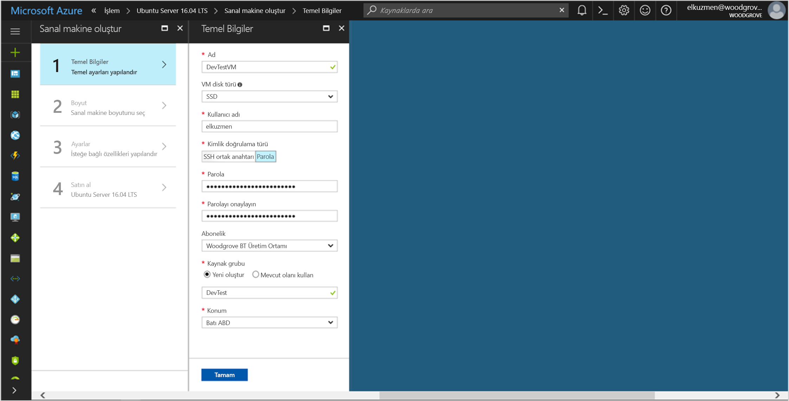

# <a name="use-a-linux-vm-managed-service-identity-msi-to-access-azure-resource-manager"></a>Resource Manager'a erişmek için Linux VM Yönetilen Hizmet Kimliği (MSI) kullanma

[!INCLUDE[preview-notice](../../../includes/active-directory-msi-preview-notice.md)]

Bu öğreticide, Linux Sanal Makinesi için Yönetilen Hizmet Kimliği'ni (MSI) etkinleştirme ve ardından bu kimliği kullanarak Azure Resource Manager API'sine erişme işlemleri gösterilir. Yönetilen Hizmet Kimlikleri Azure tarafından otomatik olarak yönetilir kodunuza kimlik bilgileri girmenize gerek kalmadan Azure AD kimlik doğrulamasını destekleyen hizmetlerde kimlik doğrulaması yapmanıza olanak tanır. Aşağıdakileri nasıl yapacağınızı öğrenirsiniz:

> [!div class="checklist"]
> * Linux Sanal Makinesinde MSI etkinleştirme 
> * Azure Resource Manager’da Kaynak Grubuna VM'niz için erişim verme 
> * VM kimliğini kullanarak erişim belirteci alma ve Azure Resource Manager çağrısı yapmak için bunu kullanma 

## <a name="prerequisites"></a>Ön koşullar

[!INCLUDE [msi-qs-configure-prereqs](../../../includes/active-directory-msi-qs-configure-prereqs.md)]

[!INCLUDE [msi-tut-prereqs](../../../includes/active-directory-msi-tut-prereqs.md)]

## <a name="sign-in-to-azure"></a>Azure'da oturum açma

[https://portal.azure.com](https://portal.azure.com) adresinden Azure portalında oturum açın.

## <a name="create-a-linux-virtual-machine-in-a-new-resource-group"></a>Yeni bir Kaynak Grubunda Linux Sanal Makinesi oluşturma

Bu öğretici için, yeni bir Linux VM oluşturuyoruz. Ayrıca mevcut bir VM'de MSI'yi etkinleştirebilirsiniz.

1. Azure portalının sol üst köşesinde bulunan **Kaynak oluştur** düğmesine tıklayın.
2. **İşlem**'i ve ardından **Ubuntu Server 16.04 LTS**'yi seçin.
3. Sanal makine bilgilerini girin. **Kimlik doğrulama türü** olarak **SSH ortak anahtarı**'nı veya **Parola**'yı seçin. Oluşturulan kimlik bilgileri VM'de oturum açmanıza olanak tanır.

    

4. Açılan listede sanal makine için bir **Abonelik** seçin.
5. İçinde sanal makinenin oluşturulmasını istediğiniz yeni bir **Kaynak Grubu** seçmek için, **Yeni Oluştur**'u seçin. İşlem tamamlandığında **Tamam**’a tıklayın.
6. VM'nin boyutunu seçin. Daha fazla boyut görmek için **Tümünü görüntüle**’yi seçin veya Desteklenen disk türü filtresini değiştirin. Ayarlar dikey penceresinde varsayılan değerleri koruyun ve **Tamam**'a tıklayın.

## <a name="enable-msi-on-your-vm"></a>VM'nizde MSI'yi etkinleştirme

Sanal Makine MSI'si kodunuza kimlik bilgileri yerleştirmeniz gerekmeden Azure AD'den erişim belirteçlerini almanıza olanak tanır. VM'de Yönetilen Hizmet Kimliği'nin etkinleştirilmesi iki işlem yapar: yönetilen kimliğini oluşturmak için VM'nizi Azure Active Directory'ye kaydeder ve kimliği VM'de yapılandırır.

1. MSI'yi etkinleştirmek istediğiniz **Sanal Makine**'yi seçin.
2. Sol gezinti çubuğunda **Yapılandırma**'ya tıklayın.
3. **Yönetilen Hizmet Kimliği**'ni görürsünüz. MSI'yi kaydetmek ve etkinleştirmek için **Evet**'i seçin, devre dışı bırakmak istiyorsanız Hayır'ı seçin.
4. Yapılandırmayı kaydetmek için **Kaydet**’e tıkladığınızdan emin olun.

    

## <a name="grant-your-vm-access-to-a-resource-group-in-azure-resource-manager"></a>Azure Resource Manager’da Kaynak Grubuna VM'niz için erişim verme 

MSI kullanıldığında kodunuz Azure AD kimlik doğrulamasını destekleyen kaynaklarda kimlik doğrulaması yapmak için belirteçlere erişebilir. Azure Resource Manager API’si Azure AD kimlik doğrulamasını destekler. Öncelikle bu VM’in kimliğine Azure Resource Manager’da bulunan bir kaynak için erişim izni vermemiz gerekir; bu durumda bu kaynak VM’in içinde yer aldığı Kaynak Grubudur.  

1. **Kaynak Grupları** sekmesine gidin.
2. Önceden oluşturduğunuz **Kaynak Grubu**’nu seçin.
3. Sol paneldeki **Erişim denetimi (IAM)** öğesine gidin.
4. VM’nize yeni rol ataması eklemek için **Ekle**’ye tıklayın. **Rol** olarak **Okuyucu**'yu seçin.
5. Sonraki açılan listede **Erişimin atanacağı hedef** olarak **Sanal Makine**’yi seçin.
6. Ardından, **Abonelik** açılan listesinde uygun aboneliğin listelendiğinden emin olun. **Kaynak Grubu** için de **Tüm kaynak grupları**'nı seçin.
7. Son olarak **Seç** alanındaki açılan listeden Linux Sanal Makinenizi seçin ve **Kaydet**’e tıklayın.

    

## <a name="get-an-access-token-using-the-vms-identity-and-use-it-to-call-resource-manager"></a>VM kimliğini kullanarak erişim belirteci alma ve Resource Manager çağrısı yapmak için bunu kullanma 

Bu adımları tamamlamak bir SSH istemciniz olmalıdır. Windows kullanıyorsanız, [Linux için Windows Alt Sistemi](https://msdn.microsoft.com/commandline/wsl/about)'ndeki SSH istemcisini kullanabilirsiniz. SSSH istemcinizin anahtarlarını yapılandırmak için yardıma ihtiyacınız olursa, bkz. [Azure'da Windows ile SSH anahtarlarını kullanma](../../virtual-machines/linux/ssh-from-windows.md) veya [Azure’da Linux VM’ler için SSH ortak ve özel anahtar çifti oluşturma](../../virtual-machines/linux/mac-create-ssh-keys.md).

1. Portalda Linux VM’nize gidin ve **Genel Bakış**’ta **Bağlan**’a tıklayın.  
2. Tercih ettiğiniz SSH istemcisiyle VM’ye bağlanmak için **Bağlan**’ı seçin. 
3. Terminal penceresinde, Azure Resource Manager erişim belirtecini almak için CURL'yi kullanarak yerel MSI uç noktasına istek gönderin.  
 
    Erişim belirteci için CURL isteği aşağıda yer alır.  
    
    ```bash
    curl 'http://169.254.169.254/metadata/identity/oauth2/token?api-version=2018-02-01&resource=https%3A%2F%2Fmanagement.azure.com%2F' -H Metadata:true   
    ```
    
    > [!NOTE]
    > "Resource" parametre değeri Azure AD'nin beklediği değerle tam olarak eşleşmelidir.  Resource Manager kaynak kimliğinin kullanılması durumunda, URI'nin sonundaki eğik çizgiyi de eklemelisiniz. 
    
    Yanıtta, Azure Resource Manager’a erişmek için ihtiyacınız olan erişim belirteci vardır. 
    
    Yanıt:  

    ```bash
    {"access_token":"eyJ0eXAiOi...",
    "refresh_token":"",
    "expires_in":"3599",
    "expires_on":"1504130527",
    "not_before":"1504126627",
    "resource":"https://management.azure.com",
    "token_type":"Bearer"} 
    ```
    
    Azure Resource Manager’a erişmek ve örneğin daha önceden bu VM’ye erişim verdiğiniz Kaynak Grubunun ayrıntılarını okumak için bu erişim belirtecini kullanabilirsiniz. \<SUBSCRIPTION ID\>, \<RESOURCE GROUP\>, ve \<ACCESS TOKEN\> değerlerini daha önce oluşturduğunuz değerlerle değiştirin. 
    
    > [!NOTE]
    > URL büyük/küçük harfe duyarlıdır; dolayısıyla daha önce Kaynak Grubunu adlandırırken kullandığınız büyük/küçük harf düzenini kullanmaya dikkat edin ("resourceGroups" adındaki büyük "G" harfine de dikkat edin).  
    
    ```bash 
    curl https://management.azure.com/subscriptions/<SUBSCRIPTION ID>/resourceGroups/<RESOURCE GROUP>?api-version=2016-09-01 -H "Authorization: Bearer <ACCESS TOKEN>" 
    ```
    
    Belirli Kaynak Grubu bilgileriyle gelen yanıt: 
     
    ```bash
    {"id":"/subscriptions/98f51385-2edc-4b79-bed9-7718de4cb861/resourceGroups/DevTest","name":"DevTest","location":"westus","properties":{"provisioningState":"Succeeded"}} 
    ```     

## <a name="next-steps"></a>Sonraki adımlar

Bu öğreticide, kullanıcı tarafından atanan bir kimlik oluşturmayı ve Azure Resource Manager API'sine erişmek için bu kimliği bir Azure Sanal Makinesine eklemeyi öğrendiniz.  Azure Resource Manager hakkında daha fazla bilgi edinmek için bkz:

> [!div class="nextstepaction"]
>[Azure Resource Manager](/azure/azure-resource-manager/resource-group-overview)