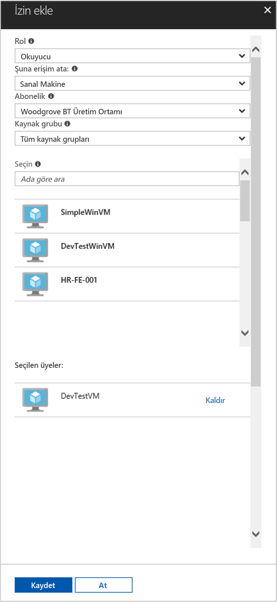

# <a name="use-a-linux-vm-managed-service-identity-msi-to-access-azure-resource-manager"></a>Azure Kaynak Yöneticisi'ne erişmek için bir Linux VM yönetilen hizmet kimliği (MSI) kullanın

[!INCLUDE[preview-notice](../../../includes/active-directory-msi-preview-notice.md)]

Bu öğretici bir Linux sanal makine için Yönetilen hizmet kimliği (MSI) etkinleştirmek ve Azure Kaynak Yöneticisi API'si erişmek için bu kimlik kullanmak gösterilmektedir. Yönetilen hizmet kimliği Azure tarafından otomatik olarak yönetilir ve Azure AD kimlik doğrulama kimlik bilgileri kodunuza eklemek zorunda kalmadan destekleyen hizmetler için kimlik doğrulaması sağlar. Aşağıdakileri nasıl yapacağınızı öğrenirsiniz:

> [!div class="checklist"]
> * Bir Linux sanal makinede MSI etkinleştir 
> * Bir kaynak grubu Azure Kaynak Yöneticisi'nde, VM erişim 
> * VM kimliğini kullanarak bir erişim belirteci alın ve Azure Resource Manager çağırmak için kullanın 

## <a name="prerequisites"></a>Önkoşullar

[!INCLUDE [msi-qs-configure-prereqs](../../../includes/active-directory-msi-qs-configure-prereqs.md)]

[!INCLUDE [msi-tut-prereqs](../../../includes/active-directory-msi-tut-prereqs.md)]

## <a name="sign-in-to-azure"></a>Azure'da oturum açma

[https://portal.azure.com](https://portal.azure.com) adresinden Azure portalında oturum açın.

## <a name="create-a-linux-virtual-machine-in-a-new-resource-group"></a>Yeni bir kaynak grubunda bir Linux sanal makine oluşturun

Bu öğretici için yeni bir Linux VM oluşturun. Mevcut bir VM'yi üzerinde MSI de etkinleştirebilirsiniz.

1. Azure portalının sol üst köşesinde bulunan **Kaynak oluştur** düğmesine tıklayın.
2. **İşlem**'i ve ardından **Ubuntu Server 16.04 LTS**'yi seçin.
3. Sanal makine bilgilerini girin. İçin **kimlik doğrulama türü**seçin **SSH ortak anahtarını** veya **parola**. Oluşturulan kimlik bilgileri, VM'ye oturum açmak izin verir.

    

4. Seçin bir **abonelik** sanal makine açılır.
5. Yeni bir seçmek için **kaynak grubu** sanal makinenin oluşturulması, seçmek istediğiniz **Yeni Oluştur**. İşlem tamamlandığında **Tamam**’a tıklayın.
6. VM boyutunu seçin. Daha fazla boyutları görmek için seçin **tüm görüntüle** veya desteklenen disk türü filtresini değiştirin. Ayarlar dikey penceresinde varsayılan değerleri koruyun ve **Tamam**'a tıklayın.

## <a name="enable-msi-on-your-vm"></a>MSI VM üzerinde etkinleştir

Bir sanal makine MSI erişim belirteçleri, kimlik bilgileri kodunuza koyma gereksinimi olmadan Azure AD'den almanızı sağlar. Yönetilen hizmet kimliği bir VM'de etkinleştirme iki şey yapar: yazmaçlar yönetilen kimliğini ve oluşturmak için Azure Active Directory ile VM VM kimliğini yapılandırır.

1. Seçin **sanal makine** MSI etkinleştirmek istediğiniz.
2. Sol gezinti çubuğunda **yapılandırma**.
3. Gördüğünüz **yönetilen hizmet kimliği**. Kaydolun ve MSI etkinleştirmek için seçin **Evet**, devre dışı bırakmak istiyorsanız seçin No
4. Tıklattığınız olun **kaydetmek** yapılandırmayı kaydetmek için.

    

## <a name="grant-your-vm-access-to-a-resource-group-in-azure-resource-manager"></a>Bir kaynak grubu Azure Kaynak Yöneticisi'nde, VM erişim 

MSI kullanarak kodunuzu Azure AD kimlik doğrulamasını destekleyen kaynaklar için kimlik doğrulaması için erişim belirteçleri elde edebilirsiniz. Azure Kaynak Yöneticisi API'si Azure AD kimlik doğrulamasını destekler. İlk olarak, biz bu VM'in kimlik bir kaynağa erişim izni Azure Kaynak Yöneticisi'nde, bu durumda VM yer alan kaynak grubu vermeniz gerekir.  

1. İçin sekmesine gidin **kaynak grupları**.
2. Belirli seçin **kaynak grubu** daha önce oluşturduğunuz.
3. Git **control(IAM) erişim** sol panelinde.
4. Tıklatıp **Ekle** , VM için yeni bir rol ataması. Seçin **rol** olarak **okuyucu**.
5. Sonraki açılır **atamak için erişim** kaynak **sanal makine**.
6. Ardından, uygun abonelik listelenir olun **abonelik** açılır. Ve **kaynak grubu**seçin **tüm kaynak gruplarının**.
7. Son olarak, içinde **seçin** açılır ve tıklatın, Linux sanal makine seçin **kaydetmek**.

    

## <a name="get-an-access-token-using-the-vms-identity-and-use-it-to-call-resource-manager"></a>VM kimliğini kullanarak bir erişim belirteci alın ve Resource Manager çağırmak için kullanın 

Bu adımları tamamlamak için bir SSH istemcisi gerekir. Windows kullanıyorsanız, SSH İstemcisi'nde kullanabileceğiniz [Linux için Windows alt](https://msdn.microsoft.com/commandline/wsl/about). SSH istemcinin anahtarları yapılandırma yardıma gereksinim duyarsanız, bkz: [kullanmak SSH anahtarları nasıl Windows Azure üzerinde ile](../../virtual-machines/linux/ssh-from-windows.md), veya [nasıl oluşturulacağı ve Linux VM'ler için Azure'da bir SSH ortak ve özel anahtar çifti kullanılmak](../../virtual-machines/linux/mac-create-ssh-keys.md).

1. Linux VM hem de Portalı'nda gidin **genel bakış**, tıklatın **Bağlan**.  
2. **Connect** tercih ettiğiniz SSH istemcisi ile VM. 
3. Terminal penceresinde CURL, kullanarak Azure Resource Manager için bir erişim belirteci almak üzere yerel MSI uç nokta için bir isteği oluşturun.  
 
    Erişim belirteci CURL talebi aşağıdadır.  
    
    ```bash
    curl 'http://169.254.169.254/metadata/identity/oauth2/token?api-version=2018-02-01&resource=https%3A%2F%2Fmanagement.azure.com%2F' -H Metadata:true   
    ```
    
    > [!NOTE]
    > "Kaynak" parametresinin değeri, Azure AD tarafından beklenen bir tam eşleşme olmalıdır.  Resource Manager kaynak kimliği söz konusu olduğunda, eğik URI üzerinde eklemeniz gerekir. 
    
    Yanıt, Azure Resource Manager erişim için gereken erişim belirteci içeriyor. 
    
    Yanıtı:  

    ```bash
    {"access_token":"eyJ0eXAiOi...",
    "refresh_token":"",
    "expires_in":"3599",
    "expires_on":"1504130527",
    "not_before":"1504126627",
    "resource":"https://management.azure.com",
    "token_type":"Bearer"} 
    ```
    
    Örneğin kaynak grubu için daha önce bu VM erişim izni ayrıntılarını okumak Azure Kaynak Yöneticisi'ne erişmek için bu erişim belirteci kullanabilirsiniz. Değerlerini değiştirmek \<ABONELİK kimliği\>, \<kaynak grubu\>, ve \<erişim BELİRTECİ\> daha önce oluşturduğunuz fiyatlarla. 
    
    > [!NOTE]
    > URL büyük/küçük harfe duyarlıdır, bu nedenle kaynak grubu ve büyük harf "G" "kaynak grubu" adlı başlattığınızda, daha önce kullanılan tam aynı durumda kullanıyorsanız olun.  
    
    ```bash 
    curl https://management.azure.com/subscriptions/<SUBSCRIPTION ID>/resourceGroups/<RESOURCE GROUP>?api-version=2016-09-01 -H "Authorization: Bearer <ACCESS TOKEN>" 
    ```
    
    Belirli kaynak grubu bilgileriyle geri yanıtı: 
     
    ```bash
    {"id":"/subscriptions/98f51385-2edc-4b79-bed9-7718de4cb861/resourceGroups/DevTest","name":"DevTest","location":"westus","properties":{"provisioningState":"Succeeded"}} 
    ```     

## <a name="next-steps"></a>Sonraki adımlar

Bu öğreticide, bir kullanıcı kimliği atanır oluşturun ve Azure Resource Manager API erişmek için Azure sanal makinesinde kullanıma öğrendiniz.  Azure Resource Manager bakın hakkında daha fazla bilgi için:

> [!div class="nextstepaction"]
>[Azure Resource Manager](/azure/azure-resource-manager/resource-group-overview)