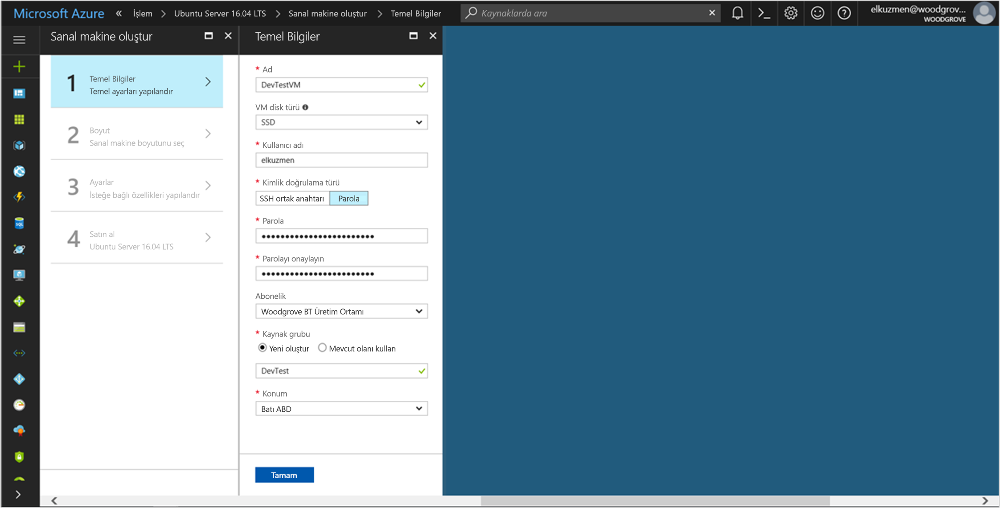
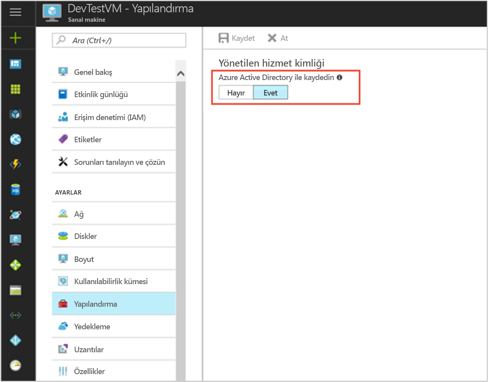

# <a name="tutorial-use-managed-service-identity-for-a-linux-vm-to-access-azure-data-lake-store"></a>Öğretici: Linux VM için Yönetilen Hizmet Kimliği'ni kullanarak Azure Data Lake Store'a erişme

[!INCLUDE[preview-notice](../../../includes/active-directory-msi-preview-notice.md)]

Bu öğreticide, Linux sanal makinesi için Yönetilen Hizmet Kimliği'ni kullanarak Azure Data Lake Store'a erişme işlemi gösterilir. Azure, MSI aracılığıyla oluşturduğunuz kimlikleri otomatik olarak yönetir. Kodunuza kimlik bilgileri girmenize gerek kalmadan Azure Active Directory (Azure AD) kimlik doğrulamasını destekleyen hizmetlerde kimlik doğrulaması yapmak için MSI kullanabilirsiniz. 

Bu öğreticide şunların nasıl yapıldığını öğreneceksiniz:

> [!div class="checklist"]
> * Linux VM'de MSI'yi etkinleştirme. 
> * Azure Data Lake Store'a VM'niz için erişim verme.
> * VM kimliğini kullanarak erişim belirteci alma ve Azure Data Lake Store'a erişmek için bunu kullanma.

## <a name="prerequisites"></a>Ön koşullar

[!INCLUDE [msi-qs-configure-prereqs](../../../includes/active-directory-msi-qs-configure-prereqs.md)]

[!INCLUDE [msi-tut-prereqs](../../../includes/active-directory-msi-tut-prereqs.md)]

## <a name="sign-in-to-azure"></a>Azure'da oturum açma

[Azure Portal](https://portal.azure.com) oturum açın.

## <a name="create-a-linux-virtual-machine-in-a-new-resource-group"></a>Yeni bir kaynak grubunda Linux sanal makinesi oluşturma

Bu öğretici için, yeni bir Linux VM oluşturuyoruz. Ayrıca mevcut bir VM'de MSI'yi etkinleştirebilirsiniz.

1. Azure portalının sol üst köşesinde bulunan **Yeni** düğmesini seçin.
2. **İşlem**'i ve ardından **Ubuntu Server 16.04 LTS**'yi seçin.
3. Sanal makine bilgilerini girin. **Kimlik doğrulama türü** olarak **SSH ortak anahtarı**'nı veya **Parola**'yı seçin. Oluşturulan kimlik bilgileri VM'de oturum açmanıza olanak tanır.

   

4. **Abonelik** listesinde, sanal makine için bir abonelik seçin.
5. İçinde sanal makinenin oluşturulmasını istediğiniz yeni bir kaynak grubu seçmek için, **Kaynak grubu** > **Yeni oluştur**'u seçin. İşiniz bittiğinde **Tamam**'a tıklayın.
6. VM'nin boyutunu seçin. Daha fazla boyut görmek için **Tümünü görüntüle**’yi seçin veya **Desteklenen disk türü** filtresini değiştirin. Ayarlar bölmesinde varsayılan değerleri koruyun ve **Tamam**'ı seçin.

## <a name="enable-msi-on-your-vm"></a>VM'nizde MSI'yi etkinleştirme

VM MSI'si kodunuza kimlik bilgileri yerleştirmeniz gerekmeden Azure AD'den erişim belirteçlerini almanıza olanak tanır. VM'de Yönetilen Hizmet Kimliği'nin etkinleştirilmesi iki işlem yapar: yönetilen kimliğini oluşturmak için VM'nizi Azure Active Directory'ye kaydeder ve kimliği VM'de yapılandırır.

1. **Sanal Makine** olarak, üzerinde MSI'yi etkinleştirmek istediğiniz sanal makineyi seçin.
2. Sol bölmede **Yapılandırma**'yı seçin.
3. **Yönetilen hizmet kimliği**'ni görürsünüz. MSI'yi kaydetmek ve etkinleştirmek için **Evet**'i seçin. Devre dışı bırakmak istiyorsanız **Hayır**'ı seçin.
   
4. **Kaydet**’i seçin.

## <a name="grant-your-vm-access-to-azure-data-lake-store"></a>Azure Data Lake Store'a VM'niz için erişim verme

Artık VM'nize Azure Data Lake Store'daki dosyalar ve klasörler için erişim verebilirsiniz. Bu adımda, mevcut Data Lake Store örneğini kullanabilir veya yeni bir sunucu oluşturabilirsiniz. Azure portalını kullanarak Data Lake Store örneği oluşturmak için, [Azure Data Lake Store hızlı başlangıcı](https://docs.microsoft.com/azure/data-lake-store/data-lake-store-get-started-portal)'nı izleyin. [Azure Data Lake Store belgeleri](https://docs.microsoft.com/azure/data-lake-store/data-lake-store-overview) arasında Azure CLI'nin ve Azure PowerShell'in kullanıldığı hızlı başlangıçlar da vardır.

Data Lake Store'da yeni bir klasör oluşturun ve MSI'ye bu klasördeki dosyaları okuma, yazma ve yürütme izni verin:

1. Azure portalında, sol bölmedeki **Data Lake Store**'u seçin.
2. Kullanmak istediğiniz Data Lake Store örneğini seçin.
3. Komut çubuğunda **Veri Gezgini**'ni seçin.
4. Data Lake Store örneğinin kök klasörü seçilidir. Komut çubuğunda **Erişim**'i seçin.
5. **Add (Ekle)** seçeneğini belirleyin.  **Seç** kutusuna VM'nizin adını girin (örneğin, **DevTestVM**). Arama sonuçları arasından VM'nizi seçin ve ardından **Seç**'e tıklayın.
6. **İzin Seç**'e tıklayın.  **Okuma** ve **Yürütme**'yi seçin, **Bu klasör**'e ekleyin ve **Yalnızca erişim izni** olarak ekleyin. **Tamam**’ı seçin.  İzin başarıyla eklenmiş olmalıdır.
7. **Erişim** bölmesini kapatın.
8. Bu öğretici için, yeni bir klasör oluşturun. Komut çubuğunda **Yeni Klasör**'ü seçin ve yeni klasöre bir ad verin (örneğin, **TestFolder**).  **Tamam**’ı seçin.
9. Oluşturduğunuz klasörü seçin ve sonra da komut çubuğunda **Erişim**'e seçin.
10. 5. adıma benzer biçimde, **Ekle**'yi seçin. **Seç** kutusuna VM'nizin adını girin. Arama sonuçları arasından VM'nizi seçin ve ardından **Seç**'e tıklayın.
11. 6. adıma benzer biçimde, **İzin Seç**'i seçin. **Okuma**, **Yazma** ve **Yürütme**'yi seçin, **Bu klasör**'e ekleyin ve **Erişim izni girdisi ve varsayılan erişim girdisi** olarak ekleyin. **Tamam**’ı seçin.  İzin başarıyla eklenmiş olmalıdır.

MSI artık oluşturduğunuz klasördeki dosyalar üzerinde tüm işlemleri gerçekleştirebilir. Data Lake Store'a erişimi yönetme hakkında daha fazla bilgi için bkz. [Data Lake Store’da Erişim Denetimi](https://docs.microsoft.com/azure/data-lake-store/data-lake-store-access-control).

## <a name="get-an-access-token-and-call-the-data-lake-store-file-system"></a>Erişim belirteci alma ve Data Lake Store dosya sistemine çağrı yapma

Azure Data Lake Store, Azure AD kimlik doğrulamasını yerel olarak desteklediğinden MSI aracılığıyla alınan erişim belirteçlerini doğrudan kabul eder. Data Lake Store dosya sisteminde kimliği doğrulamak için, Azure AD tarafından verilen bir erişim belirtecini Data Lake Store dosya sistemi uç noktanıza gönderirsiniz. Erişim belirteci yetkilendirme üst bilgisi içinde, "Bearer \<ACCESS_TOKEN_VALUE\>" biçimindedir.  Data Lake Store'da Azure AD kimlik doğrulaması desteği hakkında daha fazla bilgi edinmek için bkz. [Azure Active Directory kullanarak Data Lake Store ile kimlik doğrulaması yapma](https://docs.microsoft.com/azure/data-lake-store/data-lakes-store-authentication-using-azure-active-directory).

Bu öğreticide, REST istekleri yapmak üzere cURL kullanarak Data Lake Store dosya sistemi için REST API'de kimlik doğrulaması yaparsınız.

> [!NOTE]
> Data Lake Store dosya sistemi için istemci SDK'ları henüz Yönetilen Hizmet Kimliği'ni desteklememektedir.

Bu adımları tamamlamak bir SSH istemciniz olmalıdır. Windows kullanıyorsanız, [Linux için Windows Alt Sistemi](https://msdn.microsoft.com/commandline/wsl/about)'ndeki SSH istemcisini kullanabilirsiniz. SSH istemcinizin anahtarlarını yapılandırmak için yardıma ihtiyacınız olursa, bkz. [Azure'da Windows ile SSH anahtarlarını kullanma](../../virtual-machines/linux/ssh-from-windows.md) veya [Azure’da Linux VM’ler için SSH ortak ve özel anahtar çifti oluşturma](../../virtual-machines/linux/mac-create-ssh-keys.md).

1. Portalda Linux VM'nizi bulun. **Genel Bakış**'ta **Bağlan**'ı seçin.  
2. Tercih ettiğiniz SSH istemcisini kullanarak VM'ye bağlanın. 
3. Terminal penceresinde, Data Lake Store dosya sisteminin erişim belirtecini almak için cURL'yi kullanarak yerel MSI uç noktasına bir istek gönderin. Data Lake Store için kaynak tanımlayıcısı "https://datalake.azure.net/" değeridir.  Kaynak tanımlayıcısına sondaki eğik çizgiyi eklemek önemlidir.
    
   ```bash
   curl 'http://169.254.169.254/metadata/identity/oauth2/token?api-version=2018-02-01&resource=https%3A%2F%2Fdatalake.azure.net%2F' -H Metadata:true   
   ```
    
   Başarılı bir yanıt Data Lake Store'da kimlik doğrulaması için kullandığınız erişim belirtecini döndürür:

   ```bash
   {"access_token":"eyJ0eXAiOiJ...",
    "refresh_token":"",
    "expires_in":"3599",
    "expires_on":"1508119757",
    "not_before":"1508115857",
    "resource":"https://datalake.azure.net/",
    "token_type":"Bearer"}
   ```

4. cURL kullanarak, kök klasördeki klasörleri listelemek için Data Lake Store dosya sisteminizin REST uç noktasına bir istek gönderin. Bu, her şeyin doğru yapılandırılıp yapılandırılmadığını denetlemenin basit bir yoludur. Önceki adımdan erişim belirtecinin değerini kopyalayın. Yetkilendirme üst bilgisindeki "Bearer" dizesinde büyük harf "B" kullanılması önemlidir. Data Lake Store örneğinizin adını, Azure portalındaki **Data Lake Store** bölmesinin **Genel Bakış** bölümünde bulabilirsiniz.

   ```bash
   curl https://<YOUR_ADLS_NAME>.azuredatalakestore.net/webhdfs/v1/?op=LISTSTATUS -H "Authorization: Bearer <ACCESS_TOKEN>"
   ```
    
   Başarılı bir yanıt şöyle görünür:

   ```bash
   {"FileStatuses":{"FileStatus":[{"length":0,"pathSuffix":"TestFolder","type":"DIRECTORY","blockSize":0,"accessTime":1507934941392,"modificationTime":1508105430590,"replication":0,"permission":"770","owner":"bd0e76d8-ad45-4fe1-8941-04a7bf27f071","group":"bd0e76d8-ad45-4fe1-8941-04a7bf27f071"}]}}
   ```

5. Artık Data Lake Store örneğinize bir dosya yüklemeyi deneyebilirsiniz. Önce karşıya yüklenecek dosyayı oluşturun.

   ```bash
   echo "Test file." > Test1.txt
   ```

6. cURL kullanarak, dosyayı daha önce oluşturduğunuz klasöre yüklemek için Data Lake Store dosya sisteminizin REST uç noktasına bir istek gönderin. Karşıya yükleme işlemi bir yeniden yönlendirme içerir ve cURL yeniden yönlendirmeyi otomatik olarak izler. 

   ```bash
   curl -i -X PUT -L -T Test1.txt -H "Authorization: Bearer <ACCESS_TOKEN>" 'https://<YOUR_ADLS_NAME>.azuredatalakestore.net/webhdfs/v1/<FOLDER_NAME>/Test1.txt?op=CREATE' 
   ```

    Başarılı bir yanıt şöyle görünür:

   ```bash
   HTTP/1.1 100 Continue
   HTTP/1.1 307 Temporary Redirect
   Cache-Control: no-cache, no-cache, no-store, max-age=0
   Pragma: no-cache
   Expires: -1
   Location: https://mytestadls.azuredatalakestore.net/webhdfs/v1/TestFolder/Test1.txt?op=CREATE&write=true
   x-ms-request-id: 756f6b24-0cca-47ef-aa12-52c3b45b954c
   ContentLength: 0
   x-ms-webhdfs-version: 17.04.22.00
   Status: 0x0
   X-Content-Type-Options: nosniff
   Strict-Transport-Security: max-age=15724800; includeSubDomains
   Date: Sun, 15 Oct 2017 22:10:30 GMT
   Content-Length: 0
       
   HTTP/1.1 100 Continue
       
   HTTP/1.1 201 Created
   Cache-Control: no-cache, no-cache, no-store, max-age=0
   Pragma: no-cache
   Expires: -1
   Location: https://mytestadls.azuredatalakestore.net/webhdfs/v1/TestFolder/Test1.txt?op=CREATE&write=true
   x-ms-request-id: af5baa07-3c79-43af-a01a-71d63d53e6c4
   ContentLength: 0
   x-ms-webhdfs-version: 17.04.22.00
   Status: 0x0
   X-Content-Type-Options: nosniff
   Strict-Transport-Security: max-age=15724800; includeSubDomains
   Date: Sun, 15 Oct 2017 22:10:30 GMT
   Content-Length: 0
   ```

Data Lake Store dosya sistemi için başka API'ler kullanarak dosyaların sonuna ekleyebilir, dosyaları indirebilir ve daha birçok işlem yapabilirsiniz.

Tebrikler! Linux VM sisteminiz için MSI'yi kullanarak Data Lake Store dosya sisteminde başarıyla kimlik doğrulaması yaptınız.

## <a name="next-steps"></a>Sonraki adımlar

Bu öğreticide, Azure Data Lake Store'a erişmek için Linux sanal makinesinde Yönetilen Hizmet Kimliği'ni kullanmayı öğrendiniz. Azure Data Lake Store hakkında daha fazla bilgi edinmek için bkz:

> [!div class="nextstepaction"]
>[Azure Data Lake Store](/azure/data-lake-store/data-lake-store-overview)
