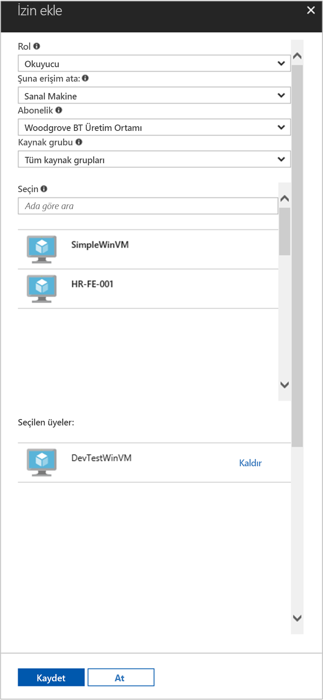

# <a name="use-a-windows-vm-managed-service-identity-msi-to-access-resource-manager"></a>Kaynak Yöneticisi'ne erişmek için bir Windows VM yönetilen hizmet kimliği (MSI) kullanın

[!INCLUDE[preview-notice](../../../includes/active-directory-msi-preview-notice.md)]

Bu öğretici, bir Windows sanal makine (VM) için Yönetilen hizmet kimliği (MSI) etkinleştirme gösterir. Sonra Azure Kaynak Yöneticisi API'si erişmek için kimliğini kullanabilirsiniz. Yönetilen hizmet kimliği Azure tarafından otomatik olarak yönetilir ve Azure AD kimlik doğrulama kimlik bilgileri kodunuza eklemek zorunda kalmadan destekleyen hizmetler için kimlik doğrulaması sağlar. Aşağıdakileri nasıl yapacağınızı öğrenirsiniz:

> [!div class="checklist"]
> * Bir Windows VM MSI etkinleştir 
> * Bir kaynak grubu Azure Kaynak Yöneticisi'nde, VM erişim 
> * VM kimliğini kullanarak bir erişim belirteci alın ve Azure Resource Manager çağırmak için kullanın

## <a name="prerequisites"></a>Önkoşullar

[!INCLUDE [msi-qs-configure-prereqs](../../../includes/active-directory-msi-qs-configure-prereqs.md)]

[!INCLUDE [msi-tut-prereqs](../../../includes/active-directory-msi-tut-prereqs.md)]

## <a name="sign-in-to-azure"></a>Azure'da oturum açma
[https://portal.azure.com](https://portal.azure.com) adresinden Azure portalında oturum açın.

## <a name="create-a-windows-virtual-machine-in-a-new-resource-group"></a>Yeni bir kaynak grubunda bir Windows sanal makine oluşturma

Bu öğretici için yeni bir Windows VM oluşturun.  Mevcut bir VM'yi üzerinde MSI de etkinleştirebilirsiniz.

1.  Azure portalının sol üst köşesinde bulunan **Kaynak oluştur** düğmesine tıklayın.
2.  **İşlem**'i seçin ve sonra da **Windows Server 2016 Datacenter**'ı seçin. 
3.  Sanal makine bilgilerini girin. **Kullanıcıadı** ve **parola** için kullandığınız kimlik bilgileri İşte oluşturulan sanal makineye oturum açma.
4.  Uygun seçin **abonelik** sanal makine açılır.
5.  Yeni bir seçmek için **kaynak grubu** içinde sanal makine oluşturmak, seçim **Yeni Oluştur**. İşlem tamamlandığında **Tamam**’a tıklayın.
6.  VM boyutunu seçin. Daha fazla boyut görmek için **Tümünü görüntüle**’yi seçin veya **Desteklenen disk türü** filtresini değiştirin. Ayarlar sayfasında, Varsayılanları tutun ve tıklatın **Tamam**.

    

## <a name="enable-msi-on-your-vm"></a>MSI VM üzerinde etkinleştir 

Bir VM MSI erişim belirteçleri, kimlik bilgileri kodunuza koyma gereksinimi olmadan Azure AD'den almanızı sağlar. Yönetilen hizmet kimliği bir VM'de etkinleştirme iki şey yapar: yazmaçlar yönetilen kimliğini ve oluşturmak için Azure Active Directory ile VM VM kimliğini yapılandırır.

1.  Seçin **sanal makine** MSI etkinleştirmek istediğiniz.  
2.  Sol gezinti çubuğunda **yapılandırma**. 
3.  Gördüğünüz **yönetilen hizmet kimliği**. Kaydolun ve MSI etkinleştirmek için seçin **Evet**, devre dışı bırakmak istiyorsanız seçin No 
4.  Tıklattığınız olun **kaydetmek** yapılandırmayı kaydetmek için.  
    

## <a name="grant-your-vm-access-to-a-resource-group-in-resource-manager"></a>Bir kaynak grubu Kaynak Yöneticisi'nde, VM erişim
MSI kullanarak kodunuzu Azure AD kimlik doğrulamasını destekleyen kaynaklar için kimlik doğrulaması için erişim belirteçleri elde edebilirsiniz.  Azure Resource Manager Azure AD kimlik doğrulamasını destekler.  İlk olarak, biz bu VM'in kimlik bir kaynağa erişim izni Kaynak Yöneticisi'nde, bu durumda VM yer alan kaynak grubu vermeniz gerekir.  

1.  İçin sekmesine gidin **kaynak grupları**. 
2.  Belirli seçin **kaynak grubu** için oluşturduğunuz, **Windows VM**. 
3.  Git **erişim denetimi (IAM)** sol panelinde. 
4.  Ardından **Ekle** için yeni bir rol ataması, **Windows VM**.  Seçin **rol** olarak **okuyucu**. 
5.  Sonraki açılan, **atamak için erişim** kaynak **sanal makine**. 
6.  Ardından, uygun abonelik listelenir olun **abonelik** açılır. Ve **kaynak grubu**seçin **tüm kaynak gruplarının**. 
7.  Son olarak, içinde **seçin** tıklayın ve açılan içinde Windows VM tercih **kaydetmek**.

    

## <a name="get-an-access-token-using-the-vm-identity-and-use-it-to-call-azure-resource-manager"></a>VM kimliğini kullanarak bir erişim belirteci alın ve Azure Resource Manager çağırmak için kullanın 

Kullanmanız gerekecektir **PowerShell** bu bölümünde.  Yüklenmemiş varsa yükleme [burada](https://docs.microsoft.com/powershell/azure/overview?view=azurermps-4.3.1). 

1.  Portalı'nda gidin **sanal makineleri** ve Windows sanal makinenizi gidin ve buna **genel bakış**, tıklatın **Bağlan**. 
2.  Girin, **kullanıcıadı** ve **parola** Windows VM oluşturduğunuzda, eklediğiniz için. 
3.  Oluşturduğunuza göre bir **Uzak Masaüstü Bağlantısı** sanal makineyle açmak **PowerShell** uzak oturumda. 
4.  PowerShell'in Invoke-WebRequest kullanarak, Azure kaynak yöneticisi için bir erişim belirteci almak üzere yerel MSI uç nokta için bir isteği oluşturun.

    ```powershell
       $response = Invoke-WebRequest -Uri 'http://169.254.169.254/metadata/identity/oauth2/token?api-version=2018-02-01&resource=https%3A%2F%2Fmanagement.azure.com%2F' -Method GET -Headers @{Metadata="true"}
    ```
    
    > [!NOTE]
    > "Kaynak" parametresinin değeri, Azure AD tarafından beklenen bir tam eşleşme olmalıdır. Azure Resource Manager kaynak kimliği'ni kullanırken eğik URI üzerinde eklemeniz gerekir.
    
    Ardından, bir JavaScript nesne gösterimi (JSON) biçimlendirilmiş dize $response nesnesi olarak depolanan tam yanıtı ayıklayın. 
    
    ```powershell
    $content = $response.Content | ConvertFrom-Json
    ```
    Ardından, erişim belirteci yanıttan ayıklayın.
    
    ```powershell
    $ArmToken = $content.access_token
    ```
    
    Son olarak, Azure Resource Manager erişim belirtecini kullanarak çağırın. Bu örnekte, biz de PowerShell'in Invoke-WebRequest için Azure Resource Manager çağırmaya ve yetkilendirme üst bilgisinde erişim belirteci eklemek için kullanıyorsunuz.
    
    ```powershell
    (Invoke-WebRequest -Uri https://management.azure.com/subscriptions/<SUBSCRIPTION ID>/resourceGroups/<RESOURCE GROUP>?api-version=2016-06-01 -Method GET -ContentType "application/json" -Headers @{ Authorization ="Bearer $ArmToken"}).content
    ```
    > [!NOTE] 
    > URL büyük/küçük harfe duyarlıdır, bu nedenle kaynak grubu ve büyük harf "G" "resourceGroups." adlı başlattığınızda, daha önce kullanılan tam aynı durumda kullanıyorsanız emin olun
        
    Aşağıdaki komut, kaynak grubu ayrıntılarını döndürür:

    ```powershell
    {"id":"/subscriptions/98f51385-2edc-4b79-bed9-7718de4cb861/resourceGroups/DevTest","name":"DevTest","location":"westus","properties":{"provisioningState":"Succeeded"}}
    ```

## <a name="related-content"></a>İlgili içerik

- MSI genel bakış için bkz: [yönetilen hizmet Kimliği'ne genel bakış](overview.md).

Geri bildirim sağlamak ve iyileştirmek ve içeriği şekil yardımcı olmak için aşağıdaki açıklamaları bölümü kullanın.

