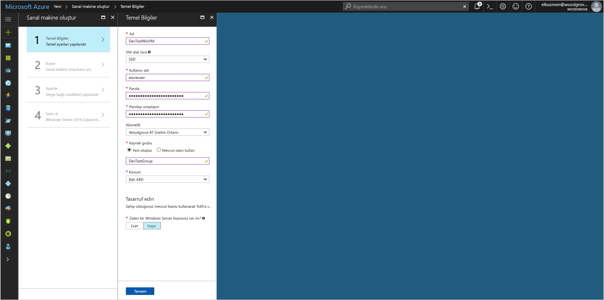
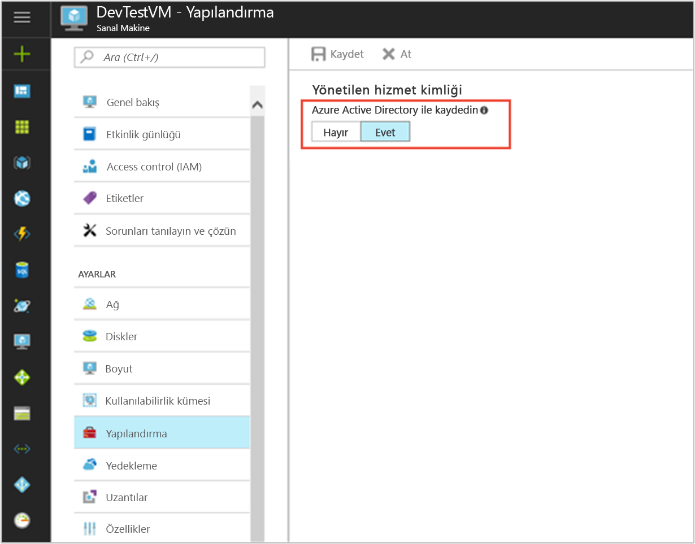

# <a name="tutorial-use-a-windows-vm-managed-service-identity-msi-to-access-azure-data-lake-store"></a>Öğretici: Azure Data Lake Store’a erişmek için Windows VM Yönetilen Hizmet Kimliği (MSI) kullanma

[!INCLUDE[preview-notice](../../../includes/active-directory-msi-preview-notice.md)]

Bu öğreticide, Azure Data Lake Store’a erişmek için Windows sanal makinesi (VM) için Yönetilen Hizmet Kimliği'ni (MSI) nasıl kullanacağınız gösterilir. Yönetilen Hizmet Kimlikleri Azure tarafından otomatik olarak yönetilir kodunuza kimlik bilgileri girmenize gerek kalmadan Azure AD kimlik doğrulamasını destekleyen hizmetlerde kimlik doğrulaması yapmanıza olanak tanır. Aşağıdakileri nasıl yapacağınızı öğrenirsiniz:

> [!div class="checklist"]
> * Windows VM'sinde MSI'yi etkinleştirme 
> * Azure Data Lake Store'a VM'niz için erişim verme
> * VM kimliğini kullanarak erişim belirteci alma ve Azure Data Lake Store'a erişmek için bunu kullanma

## <a name="prerequisites"></a>Ön koşullar

[!INCLUDE [msi-qs-configure-prereqs](../../../includes/active-directory-msi-qs-configure-prereqs.md)]

[!INCLUDE [msi-tut-prereqs](../../../includes/active-directory-msi-tut-prereqs.md)]

## <a name="sign-in-to-azure"></a>Azure'da oturum açma

[https://portal.azure.com](https://portal.azure.com) adresinden Azure portalında oturum açın.

## <a name="create-a-windows-virtual-machine-in-a-new-resource-group"></a>Yeni bir kaynak grubunda Windows sanal makinesi oluşturma

Bu öğretici için, yeni bir Windows VM oluşturuyoruz.  Ayrıca mevcut bir VM'de MSI'yi etkinleştirebilirsiniz.

1. Azure portalının sol üst köşesinde bulunan **Kaynak oluştur** düğmesine tıklayın.
2. **İşlem**'i seçin ve sonra da **Windows Server 2016 Datacenter**'ı seçin. 
3. Sanal makine bilgilerini girin. Burada oluşturulan **Kullanıcı adı** ve **Parola**, sanal makinede oturum açmak için kullandığınız kimlik bilgileridir.
4. Açılan listede sanal makine için uygun **Aboneliği** seçin.
5. İçinde sanal makinenizi oluşturacağınız yeni bir **Kaynak Grubu** seçmek için **Yeni Oluştur**'u seçin. İşlem tamamlandığında **Tamam**’a tıklayın.
6. VM'nin boyutunu seçin. Daha fazla boyut görmek için **Tümünü görüntüle**’yi seçin veya **Desteklenen disk türü** filtresini değiştirin. Ayarlar penceresinde varsayılan değerleri koruyun ve **Tamam**'a tıklayın.

   

## <a name="enable-msi-on-your-vm"></a>VM'nizde MSI'yi etkinleştirme 

VM MSI'si kodunuza kimlik bilgileri yerleştirmeniz gerekmeden Azure AD'den erişim belirteçlerini almanıza olanak tanır. MSI'nin etkinleştirilmesi Azure'a VM'niz için bir yönetilen kimlik oluşturmasını bildirir. MSI'nin etkinleştirilmesi arka planda iki işlem yapar: yönetilen kimliğini oluşturmak için VM'nizi Azure Active Directory'ye kaydeder ve kimliği VM'de yapılandırır.

1. MSI'yi etkinleştirmek istediğiniz **Sanal Makine**'yi seçin.  
2. Sol gezinti çubuğunda **Yapılandırma**'ya tıklayın. 
3. **Yönetilen Hizmet Kimliği**'ni görürsünüz. MSI'yi kaydetmek ve etkinleştirmek için **Evet**'i seçin, devre dışı bırakmak istiyorsanız Hayır'ı seçin. 
4. Yapılandırmayı kaydetmek için **Kaydet**’e tıkladığınızdan emin olun.  
   

5. Bu VM’de hangi uzantıların bulunduğunu denetlemek ve doğrulamak isterseniz **Uzantılar**’a tıklayın. MSI etkinse, listede **ManagedIdentityExtensionforWindows** görüntülenir.

   

## <a name="grant-your-vm-access-to-azure-data-lake-store"></a>Azure Data Lake Store'a VM'niz için erişim verme

Artık VM'nize Azure Data Lake Store'daki dosyalar ve klasörler için erişim verebilirsiniz.  Bu adımda, mevcut Data Lake Store’u kullanabilir veya yeni bir tane oluşturabilirsiniz.  Azure portalını kullanarak yeni bir Data Lake Store oluşturmak için bu [Azure Data Lake Store hızlı başlangıcı](https://docs.microsoft.com/azure/data-lake-store/data-lake-store-get-started-portal)'nı izleyin. [Azure Data Lake Store belgeleri](https://docs.microsoft.com/azure/data-lake-store/data-lake-store-overview) arasında Azure CLI'nin ve Azure PowerShell'in kullanıldığı hızlı başlangıçlar da vardır.

Data Lake Store'unuzda yeni bir klasör oluşturun ve VM MSI'nize bu klasördeki dosyaları okuma, yazma ve yürütme izni verin:

1. Azure portalında, sol gezintide **Data Lake Store**’a tıklayın.
2. Bu öğretici için kullanmak istediğiniz Data Lake Store’a tıklayın.
3. Komut çubuğunda **Veri Gezgini**'ne tıklayın.
4. Data Lake Store’un kök klasörü seçilidir.  Komut çubuğunda **Erişim**’e tıklayın.
5. **Ekle**'ye tıklayın.  **Seç** alanına VM'nizin adını girin (örneğin, **DevTestVM**).  Arama sonuçları arasından VM'nizi tıklayarak seçin, ardından **Seç**'e tıklayın.
6. **İzin Seç**'e tıklayın.  **Okuma** ve **Yürütme**'yi seçin, **Bu klasör**'e ekleyin ve **Yalnızca erişim izni** olarak ekleyin.  **Tamam**’a tıklayın.  İzin başarıyla eklenmiş olmalıdır.
7. **Erişim** dikey penceresini kapatın.
8. Bu öğretici için, yeni bir klasör oluşturun.  Komut çubuğunda **Yeni Klasör**'e tıklayın ve yeni klasöre bir ad verin (örneğin, **TestFolder**).  **Tamam**’a tıklayın.
9. Oluşturduğunuz klasöre tıklayın, sonra da komut çubuğunda **Erişim**’e tıklayın.
10. 5. adımdaki gibi **Ekle**’ye tıklayın, **Seç** alanına VM’nizin adını girin, bunu seçin ve **Seç**’e tıklayın.
11. 6. adımdaki gibi **İzin Seç**’e tıklayın, **Okuma**, **Yazma** ve **Yürütme**'yi seçin, **Bu klasör**'e ekleyin ve **Erişim izni girdisi ve varsayılan erişim girdisi** olarak ekleyin.  **Tamam**’a tıklayın.  İzin başarıyla eklenmiş olmalıdır.

VM MSI’niz artık oluşturduğunuz klasördeki dosyalar üzerinde tüm işlemleri gerçekleştirebilir.  Data Lake Store'a erişimi yönetme hakkında daha fazla bilgi için [Data Lake Store’da Erişim Denetimi](https://docs.microsoft.com/azure/data-lake-store/data-lake-store-access-control) makalesini okuyun.

## <a name="get-an-access-token-using-the-vm-msi-and-use-it-to-call-the-azure-data-lake-store-filesystem"></a>VM MSI kullanarak erişim belirteci alma ve Azure Data Lake Store dosya sistemini çağırmak için bunu kullanma

Azure Data Lake Store, Azure AD kimlik doğrulamasını yerel olarak desteklediğinden MSI kullanılarak alınan erişim belirteçlerini doğrudan kabul eder.  Data Lake Store dosya sisteminde kimliği doğrulamak için, Azure AD tarafından verilen bir erişim belirtecini "Bearer<ACCESS_TOKEN_VALUE>" biçiminde Yetkilendirme üst bilgisinde Data Lake Store dosya sistemi uç noktanıza gönderirsiniz.  Data Lake Store'da Azure AD kimlik doğrulaması desteği hakkında daha fazla bilgi edinmek için [Azure Active Directory kullanarak Data Lake Store ile kimlik doğrulaması yapma](https://docs.microsoft.com/azure/data-lake-store/data-lakes-store-authentication-using-azure-active-directory) konusunu okuyun.

> [!NOTE]
> Data Lake Store dosya sistemi istemci SDK'ları henüz Yönetilen Hizmet Kimliği'ni desteklememektedir.  Bu öğretici, SDK’ye destek eklendiğinde güncelleştirilecektir.

Bu öğreticide, REST istekleri göndermek için PowerShell kullanarak Data Lake Store dosya sistemi REST API'sinde kimlik doğrulaması yaparsınız. Kimlik doğrulamasında VM MSI’yi kullanmak için VM’den istek göndermelisiniz.

1. Portalda, **Sanal Makineler**'e ve Windows VM’nize gidin, **Genel Bakış**'ta **Bağlan**'a tıklayın.
2. Windows VM'sini oluştururken eklendiğiniz hesabın **Kullanıcı adı** ve **Parola** değerlerini girin. 
3. Artık sanal makineyle **Uzak Masaüstü Bağlantısı**'nı oluşturduğunuza göre, uzak oturumda **PowerShell**'i açın. 
4. PowerShell’in `Invoke-WebRequest` komutunu kullanarak, yerel MSI uç noktasına Azure Data Lake Store için erişim belirteci alma isteğinde bulunun.  Data Lake Store için kaynak tanımlayıcısı "https://datalake.azure.net/" değeridir.  Data Lake kaynak tanımlayıcısında tam eşleştirme yapar ve sonundaki eğik çizgi önemlidir.

   ```powershell
   $response = Invoke-WebRequest -Uri 'http://169.254.169.254/metadata/identity/oauth2/token?api-version=2018-02-01&resource=https%3A%2F%2Fdatalake.azure.net%2F' -Method GET -Headers @{Metadata="true"}
   ```
    
   Yanıtı JSON nesnesinden PowerShell nesnesine dönüştürün. 
    
   ```powershell
   $content = $response.Content | ConvertFrom-Json
   ```

   Yanıttan erişim belirtecini ayıklayın.
    
   ```powershell
   $AccessToken = $content.access_token
   ```

5. PowerShell’in 'Invoke-WebRequest' komutunu kullanarak, kök klasördeki klasörleri listelemek için Data Lake Store’unuzun REST uç noktasına bir istek gönderin.  Bu, her şeyin doğru yapılandırılıp yapılandırılmadığını denetlemenin basit bir yoludur.  Yetkilendirme üst bilgisindeki "Bearer" dizesinde büyük harf "B" kullanılması önemlidir.  Data Lake Store’unuzun adını, Azure portalındaki Data Lake Store dikey penceresinin **Genel Bakış** bölümünde bulabilirsiniz.

   ```powershell
   Invoke-WebRequest -Uri https://<YOUR_ADLS_NAME>.azuredatalakestore.net/webhdfs/v1/?op=LISTSTATUS -Headers @{Authorization="Bearer $AccessToken"}
   ```

   Başarılı bir yanıt şöyle görünür:

   ```powershell
   StatusCode        : 200
   StatusDescription : OK
   Content           : {"FileStatuses":{"FileStatus":[{"length":0,"pathSuffix":"TestFolder","type":"DIRECTORY", "blockSize":0,"accessTime":1507934941392, "modificationTime":1507944835699,"replication":0, "permission":"770","ow..."
   RawContent        : HTTP/1.1 200 OK
                       Pragma: no-cache
                       x-ms-request-id: b4b31e16-e968-46a1-879a-3474aa7d4528
                       x-ms-webhdfs-version: 17.04.22.00
                       Status: 0x0
                       X-Content-Type-Options: nosniff
                       Strict-Transport-Security: ma...
   Forms             : {}
   Headers           : {[Pragma, no-cache], [x-ms-request-id, b4b31e16-e968-46a1-879a-3474aa7d4528],
                       [x-ms-webhdfs-version, 17.04.22.00], [Status, 0x0]...}
   Images            : {}
   InputFields       : {}
   Links             : {}
   ParsedHtml        : System.__ComObject
   RawContentLength  : 556
   ```

6. Artık Data Lake Store’unuza dosya yüklemeyi deneyebilirsiniz.  Önce karşıya yüklenecek dosyayı oluşturun.

   ```powershell
   echo "Test file." > Test1.txt
   ```

7. PowerShell’in `Invoke-WebRequest` komutunu kullanarak, dosyayı daha önce oluşturduğunuz klasöre yüklemek için Data Lake Store’unuzun REST uç noktasına bir istek gönderin.  İstek iki adımdan oluşur.  İlk adımda bir istek gönderip dosyanın yüklenmesi gereken yere yeniden yönlendirme alırsınız.  İkinci adımda dosyayı gerçekten karşıya yüklersiniz.  Bu öğreticideki verilenlerden farklı değerler kullandıysanız, klasörün ve dosyanın adını gerektiği gibi ayarlamayı unutmayın. 

   ```powershell
   $HdfsRedirectResponse = Invoke-WebRequest -Uri https://<YOUR_ADLS_NAME>.azuredatalakestore.net/webhdfs/v1/TestFolder/Test1.txt?op=CREATE -Method PUT -Headers @{Authorization="Bearer $AccessToken"} -Infile Test1.txt -MaximumRedirection 0
   ```

   `$HdfsRedirectResponse` değerini incelerseniz, şu yanıta benzemelidir:

   ```powershell
   PS C:\> $HdfsRedirectResponse

   StatusCode        : 307
   StatusDescription : Temporary Redirect
   Content           : {}
   RawContent        : HTTP/1.1 307 Temporary Redirect
                       Pragma: no-cache
                       x-ms-request-id: b7ab492f-b514-4483-aada-4aa0611d12b3
                       ContentLength: 0
                       x-ms-webhdfs-version: 17.04.22.00
                       Status: 0x0
                       X-Content-Type-Options: nosn...
   Headers           : {[Pragma, no-cache], [x-ms-request-id, b7ab492f-b514-4483-aada-4aa0611d12b3], 
                       [ContentLength, 0], [x-ms-webhdfs-version, 17.04.22.00]...}
   RawContentLength  : 0
   ```

   Yeniden yönlendirme uç noktasına istek göndererek karşıya yüklemeyi tamamlayın:

   ```powershell
   Invoke-WebRequest -Uri $HdfsRedirectResponse.Headers.Location -Method PUT -Headers @{Authorization="Bearer $AccessToken"} -Infile Test1.txt -MaximumRedirection 0
   ```

   Başarılı bir yanıt şuna benzer:

   ```powershell
   StatusCode        : 201
   StatusDescription : Created
   Content           : {}
   RawContent        : HTTP/1.1 201 Created
                       Pragma: no-cache
                       x-ms-request-id: 1e70f36f-ead1-4566-acfa-d0c3ec1e2307
                       ContentLength: 0
                       x-ms-webhdfs-version: 17.04.22.00
                       Status: 0x0
                       X-Content-Type-Options: nosniff
                       Strict...
   Headers           : {[Pragma, no-cache], [x-ms-request-id, 1e70f36f-ead1-4566-acfa-d0c3ec1e2307],
                       [ContentLength, 0], [x-ms-webhdfs-version, 17.04.22.00]...}
   RawContentLength  : 0
   ```

Başka Data Lake Store dosya sistemi API'leri kullanarak dosyaların sonuna ekleyebilir, dosyaları indirebilir ve daha birçok işlem yapabilirsiniz.

Tebrikler!  VM MSI'yi kullanarak Data Lake Store dosya sisteminde başarıyla kimlik doğrulaması yaptınız.

## <a name="next-steps"></a>Sonraki adımlar

Bu öğreticide, Azure Data Lake Store'a erişmek için Windows sanal makinesinde Yönetilen Hizmet Kimliği'ni kullanmayı öğrendiniz. Azure Data Lake Store hakkında daha fazla bilgi edinmek için bkz:

> [!div class="nextstepaction"]
>[Azure Data Lake Store](/azure/data-lake-store/data-lake-store-overview)
