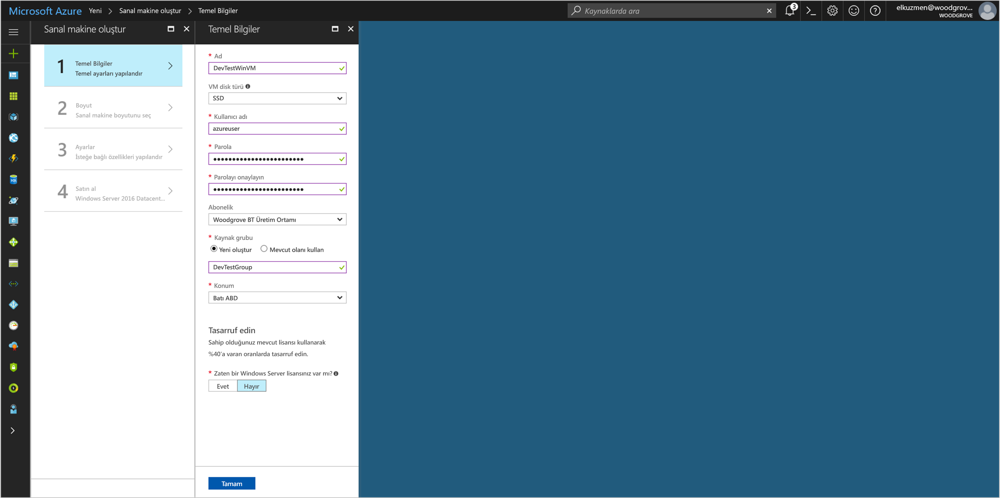

# <a name="tutorial-use-a-windows-vm-managed-service-identity-to-access-azure-storage-via-access-key"></a>Öğretici: Azure depolama erişim tuşu erişmek için bir Windows VM yönetilen hizmet kimliği kullanın.

[!INCLUDE[preview-notice](../../../includes/active-directory-msi-preview-notice.md)]

Bu öğretici bir Windows sanal makine için Yönetilen hizmet kimliği (MSI) etkinleştirmek ve ardından depolama hesabı erişim anahtarlarını almak için bu kimlik kullanmak gösterilmektedir. Her zamanki gibi depolama SDK'yı kullanarak, örneğin depolama işlemleri yaparken depolama erişim tuşlarını kullanabilirsiniz. Bu öğretici için karşıya yükleme ve Azure Storage PowerShell kullanarak blob'lara indirin. Şunları öğreneceksiniz nasıl yapılır:


> [!div class="checklist"]
> * Bir Windows sanal makinesinde MSI etkinleştir 
> * Depolama hesabı erişim anahtarlarını Kaynak Yöneticisi'nde, VM erişim 
> * VM kimliğini kullanarak bir erişim belirteci alın ve Kaynak Yöneticisi'nden depolama erişim tuşlarını almak için kullanın 

## <a name="prerequisites"></a>Önkoşullar

[!INCLUDE [msi-qs-configure-prereqs](../../../includes/active-directory-msi-qs-configure-prereqs.md)]

[!INCLUDE [msi-tut-prereqs](../../../includes/active-directory-msi-tut-prereqs.md)]

## <a name="sign-in-to-azure"></a>Azure'da oturum açma

[https://portal.azure.com](https://portal.azure.com) adresinden Azure portalında oturum açın.

## <a name="create-a-windows-virtual-machine-in-a-new-resource-group"></a>Yeni bir kaynak grubunda bir Windows sanal makine oluşturma

Bu öğretici için yeni bir Windows VM oluşturun. Mevcut bir VM'yi üzerinde MSI de etkinleştirebilirsiniz.

1.  Tıklatın **+/ yeni hizmet oluşturma** düğme Azure portalında sol üst köşesinde bulundu.
2.  **İşlem**'i seçin ve sonra da **Windows Server 2016 Datacenter**'ı seçin. 
3.  Sanal makine bilgilerini girin. **Kullanıcıadı** ve **parola** için kullandığınız kimlik bilgileri İşte oluşturulan sanal makineye oturum açma.
4.  Uygun seçin **abonelik** sanal makine açılır.
5.  Yeni bir seçmek için **kaynak grubu** oluşturulması, seçmek için sanal makine için istediğiniz **Yeni Oluştur**. İşlem tamamlandığında **Tamam**’a tıklayın.
6.  VM boyutunu seçin. Daha fazla boyut görmek için **Tümünü görüntüle**’yi seçin veya **Desteklenen disk türü** filtresini değiştirin. Ayarlar dikey penceresinde varsayılan değerleri koruyun ve **Tamam**'a tıklayın.

    

## <a name="enable-msi-on-your-vm"></a>MSI VM üzerinde etkinleştir

Bir sanal makine MSI erişim belirteçleri, kimlik bilgileri kodunuza koyma gereksinimi olmadan Azure AD'den almanızı sağlar. Perde arkasında MSI etkinleştirme iki işlemi yapar: yazmaçlar yönetilen kimliğini ve oluşturmak için Azure Active Directory ile VM VM kimliğini yapılandırır.

1. Yeni bir sanal makine kaynak grubuna gidin ve önceki adımda oluşturduğunuz sanal makineyi seçin.
2. Sol taraftaki "ayarlar" VM altında tıklatın **yapılandırma**.
3. Kaydolun ve MSI etkinleştirmek için seçin **Evet**, devre dışı bırakmak istiyorsanız seçin No
4. Tıklattığınız olun **kaydetmek** yapılandırmayı kaydetmek için.

    

## <a name="create-a-storage-account"></a>Depolama hesabı oluşturma 

Zaten yoksa, şimdi bir depolama hesabı oluşturacak. Ayrıca, bu adımı atlayın ve var olan bir depolama hesabı anahtarları, VM MSI erişim. 

1. Tıklatın **+/ yeni hizmet oluşturma** düğme Azure portalında sol üst köşesinde bulundu.
2. Tıklatın **depolama**, ardından **depolama hesabı**, ve yeni bir "depolama hesabı oluşturma" panelinde görüntülenir.
3. Daha sonra kullanacaksınız depolama hesabı için bir ad girin.  
4. **Dağıtım modeli** ve **tür hesap** "Resource manager" ve "Genel amaçlı", sırasıyla ayarlanmalıdır. 
5. Olun **abonelik** ve **kaynak grubu** VM'nizi oluşturduğunuzda önceki adımda belirttiğiniz olanlarla eşleşmesi.
6. **Oluştur**’a tıklayın.

    

## <a name="create-a-blob-container-in-the-storage-account"></a>Depolama hesabında blob kapsayıcısı oluşturma

Daha sonra biz karşıya yükleyin ve yeni depolama hesabı dosya indirme. Dosyaları blob depolama gerektirdiğinden, biz dosyasının depolanacağı bir blob kapsayıcısı oluşturmanız gerekir.

1. Yeni oluşturulan depolama hesabınıza geri gidin.
2. Tıklatın **kapsayıcıları** "Blob hizmeti" altındaki sol bağlantı
3. Tıklatın **+ kapsayıcı** sayfa ve "yeni bir kapsayıcı" üst kısmında çıkış paneli slayt.
4. Kapsayıcı bir ad verin, erişim düzeyi seçin ve ardından **Tamam**. Belirtilen ad daha sonra öğreticide kullanılır. 

    

## <a name="grant-your-vms-msi-access-to-use-storage-account-access-keys"></a>Depolama hesabı erişim anahtarları kullanmak için VM MSI erişim 

Azure Storage, Azure AD kimlik doğrulaması yerel olarak desteklemez.  Ancak, bir MSI depolama hesabı erişim anahtarlarını Kaynak Yöneticisi'nden almanızı sonra depolama erişmek için bir anahtar kullanın.  Bu adımda, VM MSI anahtarları depolama hesabınıza erişim.   

1. Yeni oluşturulan depolama hesabınıza geri gidin.  
2. Tıklatın **erişim denetimi (IAM)** sol panelinde bağlantı.  
3. Tıklatın **+ Ekle** VM için yeni bir rol ataması eklemek için sayfanın en üstünde
4. Ayarlama **rol** "Depolama hesabı anahtarı işleci hizmeti rolü", sayfanın sağ tarafında. 
5. Sonraki açılır listede ayarlamak **atamak için erişim** "Sanal makine" kaynak.  
6. Ardından, uygun abonelik listelenir olun **abonelik** açılan listesinde, daha sonra ayarlamak **kaynak grubu** "Tüm kaynak gruplarına".  
7. Son olarak, altında **seçin** açılır listede, Windows sanal makine seçin ve ardından **kaydetmek**. 

    

## <a name="get-an-access-token-using-the-vms-identity-and-use-it-to-call-azure-resource-manager"></a>VM kimliğini kullanarak bir erişim belirteci alın ve Azure Resource Manager çağırmak için kullanın 

Öğretici kalanı için size daha önce oluşturduğumuz sanal makineden çalışmaz. 

Bu bölümünde Azure Resource Manager PowerShell cmdlet'lerini kullanmanız gerekecektir.  Yüklü, yoksa [en son sürümü karşıdan](https://docs.microsoft.com/powershell/azure/overview) devam etmeden önce.

1. Azure portalında gidin **sanal makineleri**gidin Windows sanal makinenizi, ardından **genel bakış** sayfasında **Bağlan** üstünde. 
2. Girin, **kullanıcıadı** ve **parola** Windows VM oluşturduğunuzda, eklediğiniz için. 
3. Oluşturduğunuza göre bir **Uzak Masaüstü Bağlantısı** sanal makineyle PowerShell uzak oturum açın.
4. PowerShell'in Invoke-WebRequest kullanarak, Azure kaynak yöneticisi için bir erişim belirteci almak üzere yerel MSI uç nokta için bir isteği oluşturun.

    ```powershell
       $response = Invoke-WebRequest -Uri 'http://169.254.169.254/metadata/identity/oauth2/token?api-version=2018-02-01&resource=https%3A%2F%2Fmanagement.azure.com%2F' -Method GET -Headers @{Metadata="true"}
    ```
    
    > [!NOTE]
    > "Kaynak" parametresinin değeri, Azure AD tarafından beklenen bir tam eşleşme olmalıdır. Azure Resource Manager kaynak kimliği'ni kullanırken eğik URI üzerinde eklemeniz gerekir.
    
    Ardından, bir JavaScript nesne gösterimi (JSON) biçimlendirilmiş dize $response nesnesi olarak depolanan "İçerik" öğesi ayıklayın. 
    
    ```powershell
    $content = $response.Content | ConvertFrom-Json
    ```
    Ardından, erişim belirteci yanıttan ayıklayın.
    
    ```powershell
    $ArmToken = $content.access_token
    ```
 
## <a name="get-storage-account-access-keys-from-azure-resource-manager-to-make-storage-calls"></a>Depolama çağrı yapmak için Azure Resource Manager alanından depolama hesabı erişim anahtarlarını alma  

Artık Kaynak Yöneticisi'ni önceki bölümde biz alınan erişim belirteci kullanarak çağırmak için PowerShell kullanın depolama erişim anahtarı alınamadı. Depolama erişim tuşu sahip olduğumuz sonra biz depolama yükleme/indirme işlemleri çağırabilirsiniz.

```powershell
$keysResponse = Invoke-WebRequest -Uri https://management.azure.com/subscriptions/<SUBSCRIPTION-ID>/resourceGroups/<RESOURCE-GROUP>/providers/Microsoft.Storage/storageAccounts/<STORAGE-ACCOUNT>/listKeys/?api-version=2016-12-01 -Method POST -Headers @{Authorization="Bearer $ARMToken"}
```
> [!NOTE] 
> URL büyük/küçük harfe duyarlıdır, bu nedenle olun "ResourceGroups." olarak büyük harf "G" gibi kaynak grubu adında daha önce kullanılan tam aynı durumda kullanın 

```powershell
$keysContent = $keysResponse.Content | ConvertFrom-Json
$key = $keysContent.keys[0].value
```

Sonraki "sınama.txt" adlı bir dosya oluşturun. Kimlik doğrulaması yapmak için depolama erişim tuşu kullanmak `New-AzureStorageContent` cmdlet'ini bizim blob kapsayıcısına dosyasını karşıya yükleyin, ardından dosyasını indirin.

```bash
echo "This is a test text file." > test.txt
```

Kullanarak Azure depolama cmdlet'leri ilk olarak, yüklediğinizden emin olun `Install-Module Azure.Storage`. Az önce oluşturduğunuz kullanarak blob karşıya yükleme `Set-AzureStorageBlobContent` PowerShell cmdlet:

```powershell
$ctx = New-AzureStorageContext -StorageAccountName <STORAGE-ACCOUNT> -StorageAccountKey $key
Set-AzureStorageBlobContent -File test.txt -Container <CONTAINER-NAME> -Blob testblob -Context $ctx
```

Yanıtı:

```powershell
ICloudBlob        : Microsoft.WindowsAzure.Storage.Blob.CloudBlockBlob
BlobType          : BlockBlob
Length            : 56
ContentType       : application/octet-stream
LastModified      : 9/13/2017 6:14:25 PM +00:00
SnapshotTime      :
ContinuationToken :
Context           : Microsoft.WindowsAzure.Commands.Storage.AzureStorageContext
Name              : testblob
```

Ayrıca, yeni karşıya yüklediğiniz, kullanarak blob indirebilirsiniz `Get-AzureStorageBlobContent` PowerShell cmdlet:

```powershell
Get-AzureStorageBlobContent -Blob testblob -Container <CONTAINER-NAME> -Destination test2.txt -Context $ctx
```

Yanıtı:

```powershell
ICloudBlob        : Microsoft.WindowsAzure.Storage.Blob.CloudBlockBlob
BlobType          : BlockBlob
Length            : 56
ContentType       : application/octet-stream
LastModified      : 9/13/2017 6:14:25 PM +00:00
SnapshotTime      :
ContinuationToken :
Context           : Microsoft.WindowsAzure.Commands.Storage.AzureStorageContext
Name              : testblob
```


## <a name="related-content"></a>İlgili içerik

- MSI genel bakış için bkz: [yönetilen hizmet Kimliği'ne genel bakış](overview.md).
- Depolama SAS kimlik bilgilerini kullanarak bu öğreticiyi yapmak öğrenmek için bkz: [bir SAS kimlik bilgisi Azure depolama erişmek için bir Windows VM yönetilen hizmet kimliği kullanın](tutorial-windows-vm-access-storage-sas.md)
- Azure depolama hesabı SAS özelliği hakkında daha fazla bilgi için bkz:
  - [Paylaşılan erişim imzaları (SAS) kullanma](/azure/storage/common/storage-dotnet-shared-access-signature-part-1.md)
  - [Hizmet SAS oluşturma](/rest/api/storageservices/Constructing-a-Service-SAS.md)

Geri bildirim sağlamak ve iyileştirmek ve içeriği şekil yardımcı olmak için aşağıdaki açıklamaları bölümünü kullanın


