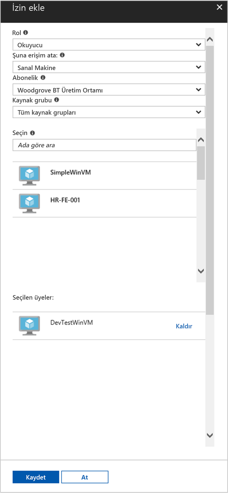

# <a name="use-a-windows-vm-managed-service-identity-msi-to-access-resource-manager"></a>Resource Manager'a erişmek için bir Windows VM yönetilen hizmet kimliği (MSI) kullanma

[!INCLUDE[preview-notice](~/includes/active-directory-msi-preview-notice-ua.md)]

Bu öğreticide bir Windows sanal makine (VM) için Yönetilen hizmet kimliği (MSI) etkinleştirme gösterilmektedir. Ardından, Azure Resource Manager API'si erişmek için bu kimlik kullanabilirsiniz. Yönetilen hizmet kimlikleri, Azure tarafından otomatik olarak yönetilir ve kimlik bilgilerini kodunuza eklemek zorunda kalmadan Azure AD kimlik doğrulamasını destekleyen hizmetler için kimlik doğrulaması sağlar. Aşağıdakileri nasıl yapacağınızı öğrenirsiniz:

> [!div class="checklist"]
> * Bir Windows VM üzerinde MSI etkinleştir 
> * Bir kaynak grubu, Azure Resource Manager, VM erişim 
> * VM kimliğini kullanarak bir erişim belirteci alma ve Azure Resource Manager'ı çağırmak için kullanın

## <a name="prerequisites"></a>Önkoşullar

[!INCLUDE [msi-core-prereqs](~/includes/active-directory-msi-core-prereqs-ua.md)]

[!INCLUDE [msi-tut-prereqs](~/includes/active-directory-msi-tut-prereqs.md)]

## <a name="sign-in-to-azure"></a>Azure'da oturum açma
[https://portal.azure.com](https://portal.azure.com) adresinden Azure portalında oturum açın.

## <a name="create-a-windows-virtual-machine-in-a-new-resource-group"></a>Yeni bir kaynak grubunda bir Windows sanal makine oluşturun

Bu öğretici için yeni bir Windows VM'yi oluştururuz.  Mevcut VM'yi MSI de etkinleştirebilirsiniz.

1.  Tıklayın **kaynak Oluştur** sol üst köşesinde Azure portal'ın üzerinde.
2.  **İşlem**'i seçin ve sonra da **Windows Server 2016 Datacenter**'ı seçin. 
3.  Sanal makine bilgilerini girin. **Kullanıcıadı** ve **parola** için kullandığınız kimlik bilgilerini İşte oluşturulan sanal makineye oturum açma.
4.  Uygun seçin **abonelik** sanal makinenin açılır.
5.  Yeni bir seçilecek **kaynak grubu** seçin, sanal makinenizi oluşturmak, **Yeni Oluştur**. İşlem tamamlandığında **Tamam**’a tıklayın.
6.  Sanal makine için boyutu seçin. Daha fazla boyut görmek için **Tümünü görüntüle**’yi seçin veya **Desteklenen disk türü** filtresini değiştirin. Ayarları sayfasında, varsayılan değerleri koruyun ve tıklayın **Tamam**.

    

## <a name="enable-msi-on-your-vm"></a>Vm'nizde MSI etkinleştir 

VM MSI, kimlik bilgilerini kodunuza koyma gereksinimi olmadan Azure AD'den erişim belirteci alma olanak tanır. MSI etkinleştirmesine VM'niz için yönetilen bir kimlik oluşturmak için Azure'da söyler. Perde MSI etkinleştirmesine iki şeyi yapar: VM'NİZDE MSI VM uzantısı yükler ve Azure Resource Manager'daki MSI sağlar.

1.  Seçin **sanal makine** MSI etkinleştirmek istiyorsanız.  
2.  Sol gezinti çubuğunda Koruma'ya tıklayın **yapılandırma**. 
3.  Gördüğünüz **yönetilen hizmet kimliği**. Kaydolun ve MSI etkinleştirmek için **Evet**, devre dışı bırakmak istiyorsanız seçin No 
4.  Tıkladığınız olun **Kaydet** yapılandırmayı kaydetmek için.  
    

5. Denetleyin ve bu VM üzerinde hangi uzantıları doğrulamak isterseniz tıklayın **uzantıları**. MSI, ardından etkinse **ManagedIdentityExtensionforWindows** listede görünür.

    

## <a name="grant-your-vm-access-to-a-resource-group-in-resource-manager"></a>Bir kaynak grubu Kaynak Yöneticisi'nde, VM erişim
MSI kullanarak kodunuzu Azure AD kimlik doğrulamasını destekleyen kaynakların kimliğini doğrulamak için erişim belirteçleri elde edebilirsiniz.  Azure Resource Manager, Azure AD kimlik doğrulamasını destekler.  İlk olarak, VM içeren kaynak grubunu bir ' % s'kaynak Kaynak Yöneticisi'nde, bu durumda bu sanal makinenin kimliğini erişim vermek ihtiyacımız var.  

1.  İçin sekmesinde gidin **kaynak grupları**. 
2.  Belirli seçin **kaynak grubu** için oluşturduğunuz, **Windows VM**. 
3.  Git **erişim denetimi (IAM)** sol bölmesinde. 
4.  Ardından **Ekle** için yeni bir rol ataması, **Windows VM**.  Seçin **rol** olarak **okuyucu**. 
5.  Sonraki açılan, **erişim Ata** kaynak **sanal makine**. 
6.  Ardından, uygun abonelik listelendiğinden emin olmak **abonelik** açılır. Ve **kaynak grubu**seçin **tüm kaynak grupları**. 
7.  Son olarak **seçin** tıklayın ve açılan içinde Windows VM'nizi seçin **Kaydet**.

    

## <a name="get-an-access-token-using-the-vm-identity-and-use-it-to-call-azure-resource-manager"></a>VM kimliğini kullanarak bir erişim belirteci alma ve Azure Resource Manager'ı çağırmak için kullanın 

Kullanmanız gerekecektir **PowerShell** bu bölümünde.  Yüklenmemiş varsa yükleme [burada](https://docs.microsoft.com/powershell/azure/overview?view=azurermps-4.3.1). 

1.  Portalda gidin **sanal makineler** ve Windows sanal makinenizi gidin ve buna **genel bakış**, tıklayın **Connect**. 
2.  Girin, **kullanıcıadı** ve **parola** Windows sanal Makineyi oluştururken, eklediğiniz için. 
3.  Sizin oluşturduğunuz bir **Uzak Masaüstü Bağlantısı** sanal makineyle açın **PowerShell** uzak oturumu içinde. 
4.  PowerShell'in Invoke-WebRequest kullanarak, Azure Resource Manager için bir erişim belirteci almak için yerel MSI uç noktasına bir istek olun.

    ```powershell
       $response = Invoke-WebRequest -Uri http://localhost:50342/oauth2/token -Method GET -Body @{resource="https://management.azure.com/"} -Headers @{Metadata="true"}
    ```
    
    > [!NOTE]
    > "Kaynak" parametresinin değerini, Azure AD tarafından beklenen değer için bir tam eşleşme olmalıdır. Azure Resource Manager kaynak kimliği kullanıldığında, URI üzerinde sonunda eğik çizgi içermelidir.
    
    Ardından, $response nesneyi JavaScript nesne gösterimi (JSON) biçimlendirilen dizesinde olarak depolanan tam yanıtı ayıklayın. 
    
    ```powershell
    $content = $response.Content | ConvertFrom-Json
    ```
    Ardından, erişim belirtecini yanıttan ayıklayın.
    
    ```powershell
    $ArmToken = $content.access_token
    ```
    
    Son olarak, Azure Resource Manager erişim belirtecini kullanarak çağırın. Bu örnekte, aynı zamanda PowerShell'in Invoke-WebRequest Azure Resource Manager'a çağrı yapıp erişim belirtecini içeren yetkilendirme üst bilgisinde kullanıyoruz.
    
    ```powershell
    (Invoke-WebRequest -Uri https://management.azure.com/subscriptions/<SUBSCRIPTION ID>/resourceGroups/<RESOURCE GROUP>?api-version=2016-06-01 -Method GET -ContentType "application/json" -Headers @{ Authorization ="Bearer $ArmToken"}).content
    ```
    > [!NOTE] 
    > URL büyük/küçük harfe duyarlıdır, bu nedenle kaynak grubunu ve büyük harf "G" "resourceGroups." olarak adlandırılmış, daha önce kullandığınız gibi tam aynı çalışması kullanıyorsanız emin olun
        
    Aşağıdaki komut, kaynak grubunun ayrıntılarını döndürür:

    ```powershell
    {"id":"/subscriptions/98f51385-2edc-4b79-bed9-7718de4cb861/resourceGroups/DevTest","name":"DevTest","location":"westus","properties":{"provisioningState":"Succeeded"}}
    ```

## <a name="related-content"></a>İlgili içerik

- MSI genel bakış için bkz. [yönetilen hizmet Kimliği'ne genel bakış](msi-overview.md).

Aşağıdaki yorum bölümünde geri bildirim sağlamak ve geliştirmek ve içeriklerimizde şekil yardımcı kullanın.

