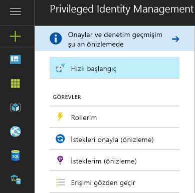
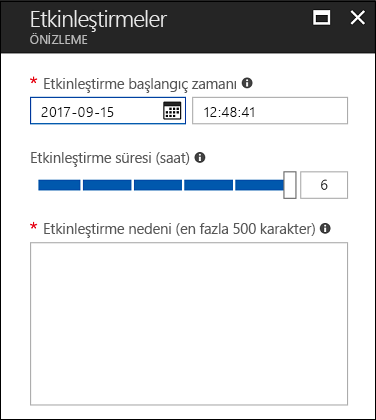
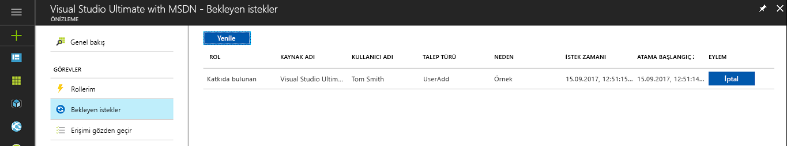
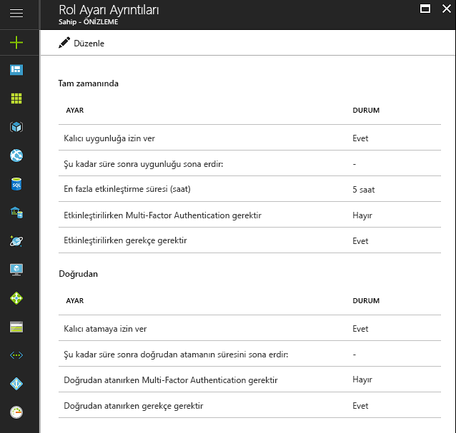

# Azure AD Privileged Identity Management nedir?

Azure Active Directory (AD) Privileged Identity Management sayesinde kuruluşunuz içindeki erişimi yönetebilir, denetleyebilir ve izleyebilirsiniz. Azure AD, Azure Kaynakları (Önizleme) ve Office 365 veya Microsoft Intune gibi diğer Microsoft Online Services hizmetlerindeki kaynaklara erişim de bu kapsama dahildir.

> [!NOTE]
> Privileged Identity Management'ı kiracınızda etkinleştirdiğinizde bu hizmet ile etkileşim kuran veya ondan faydalanmak isteyen her kullanıcı için geçerli bir Azure AD Premium P2 veya Enterprise Mobility + Security E5 ücretli veya ücretsiz deneme lisansı gerekir. Örnek olarak şu kullanıcılar/grup içindeki kullanıcılar verilebilir:
>
>- Ayrıcalıklı Rol Yöneticisi rolüne atanmış 
>- PIM üzerinden yönetilebilen diğer dizin rolleri için uygun olarak atanmış 
>- PIM'deki istekleri onaylayabilen/reddedebilen 
>- Anlık veya Doğrudan (Zamana dayalı) atamalar ile bir Azure kaynağı rolüne atanmış  
>- Bir erişim gözden geçirmesine atanmış
>
>Daha fazla bilgi için bkz. [Azure Active Directory sürümleri](../fundamentals/active-directory-whatis.md).

Kuruluşlar, kötü niyetli bir kullanıcının erişim elde etme veya yetkisi olan bir kullanıcının hassas bir kaynağı yanlışlıkla etkileme ihtimalini azalttığından güvenli bilgilere veya kaynaklara erişimi olan kullanıcı sayısını en aza indirmek istemektedir.  Ancak kullanıcıların Azure AD, Azure, Office 365 veya SaaS uygulamalarında yine ayrıcalıklı işlemleri gerçekleştirmesi gerekir. Kuruluşlar kullanıcılara Abonelikler ve Azure AD gibi Azure kaynaklarına ayrıcalıklı erişim verebilir. Bu kullanıcıların yönetici ayrıcalıklarıyla gerçekleştirdikleri işlemlerle ilgili gözetim yapılması gerekir. Azure AD Privileged Identity Management erişim haklarının aşırı, gereksiz veya yanlış kullanım riskinin azaltılmasına yardımcı olur.

Azure AD Privileged Identity Management, kuruluşunuza şu alanlarda yardımcı olur:

- Azure kaynaklarını (Önizleme) yönetmek için ayrıcalıklı roller atanmış olan ve Azure AD'de yönetici rolü atanmış olan kullanıcıları görme
- Office 365 ve Intune gibi Microsoft Online Services hizmetlerinin yanı sıra abonelikler, kaynak grupları ve Sanal Makineler gibi bireysel kaynaklardan oluşan Azure kaynaklarına (Önizleme) istek üzerine ve "anlık" yönetimsel erişimi etkinleştirme 
-   Azure kaynaklarında (Önizleme) yapılan yönetici değişiklikleri dahil olmak üzere yönetici etkinliklerinin geçmişini görme
- Yönetici atamalarındaki değişikliklerle ilgili uyarılar alma
- Azure AD ayrıcalıklı yönetim rollerini (Önizleme) etkinleştirmek için onay isteme 
- Yönetici rollerinin üyeliğini gözden geçirme ve kullanıcıların üyeliğin devam etmesi için gerekçe sağlamasını gerektirme

Azure AD Privileged Identity Management, Azure AD'de Genel Yönetici gibi yerleşik Azure AD kuruluş rollerine atanmış olan kullanıcıları yönetebilir. Azure AD Privileged Identity Management, Azure'da Sahip ve Katkıda Bulunan dahil olmak üzere Azure RBAC ile atanmış olan kullanıcıları ve grupları yönetebilir.

## Anlık yönetici erişimi

Önceden bir kullanıcıya yönetici rolünü Azure portaldan, diğer Microsoft Online Services portallarından veya Windows PowerShell'deki Azure AD cmdlet'lerinden atamak mümkündü. Sonuç olarak bu kullanıcı atanmış rolde sürekli etkin olan bir **sürekli yönetici** oluyordu. Azure AD Privileged Identity Management, **uygun yönetici** kavramını getirmiştir. Uygun yöneticiler, ayrıcalıklı erişime ihtiyaç duyan ancak buna her gün ve bütün gün sahip olması gerekmeyen kullanıcılar olmalıdır. Bu rol, kullanıcı erişime ihtiyaç duyana kadar devre dışıdır ancak kullanıcı bir etkinleştirme işlemini tamamladıktan sonra önceden belirlenen süre boyunca etkin bir yönetici olur. Her geçen gün daha fazla kuruluş bu yaklaşımı, ayrıcalıklı rollere "sürekli yönetici erişimini" sınırlandırmak veya ortadan kaldırmak için seçmektedir.

## Dizininiz için Privileged Identity Management'ı etkinleştirme

Azure AD Privileged Identity Management'ı [Azure portal](https://portal.azure.com/)'da kullanmaya başlayabilirsiniz.

> [!NOTE]
> Bir dizin için Azure AD Privileged Identity Management'ı etkinleştirme amacıyla Microsoft hesabı (örneğin, @outlook.com) değil kurumsal hesap (örneğin, @yourdomain.com) kullanan bir genel yönetici olmanız gerekir.

1. [Azure portalında](https://portal.azure.com/) dizininizin genel yöneticisi olarak oturum açın.
2. Kuruluşunuz birden fazla dizine sahipse Azure portalının sağ üst köşesinde kullanıcı adınızı seçin. Azure AD Privileged Identity Management'ı kullanacağınız dizini seçin.
3. **Tüm hizmetler** seçeneğini belirleyin ve **Azure AD Privileged Identity Management** araması yapmak için Filtre metin kutusunu kullanın.
4. **Panoya sabitle**'yi işaretleyin ve ardından **Oluştur**’a tıklayın. Privileged Identity Management uygulaması açılır.

Dizininizde Azure AD Privileged Identity Management'ı ilk kez siz kullanıyorsanız, Azure AD dizin rollerine gittiğinizde bir [güvenlik sihirbazı](pim-security-wizard.md) ilk atama deneyiminizde size yol gösterir. Bunun ardından, otomatik olarak dizinin ilk **Güvenlik yöneticisi** ve **Ayrıcalıklı rol yöneticisi** olursunuz.

Azure AD rolleri için yalnızca Ayrıcalıklı Rol Yöneticisi rolüne sahip olan kullanıcı, Azure AD PIM'deki diğer yöneticilerin atamalarını yönetebilir. [Başka kullanıcılara PIM'deki dizin rollerini yönetme izni verebilirsiniz](pim-how-to-give-access-to-pim.md). Genel Yöneticiler, Güvenlik Yöneticileri ve Güvenlik Okuyucuları, Azure AD PIM'de Azure AD rolü atamalarını görüntüleyebilir.
Azure RBAC rolleri için yalnızca abonelik yöneticisi, kaynak sahibi veya kaynak kullanıcısı erişim yöneticisi Azure AD PIM'deki diğer yöneticilerin atamalarını yönetebilir.  Ayrıcalıklı Rol Yöneticileri, Güvenlik Yöneticileri veya Güvenlik Okuyucuları varsayılan olarak Azure AD PIM'deki Azure RBAC rolü atamalarını görüntüleme erişime sahip değildir.

## Privileged Identity Management'a Genel Bakış (Giriş Noktası)

Azure AD Privileged Identity Management, Azure AD dizin rollerinin ve Azure Kaynakları (Önizleme) rollerinin yönetilmesini destekler. Azure kaynaklarının rollerinin işleviyle Azure AD'deki yönetici rolleri birbirinden farklıdır. Azure kaynağı rolleri, atanmış olduğu kaynak için ve kaynak hiyerarşisinde altında bulunan tüm kaynaklar için (devralma olarak bilinir) ayrıntılı izinler sağlar. [RBAC, kaynak hiyerarşisi ve devralma hakkında daha fazla bilgi edinin](../../role-based-access-control/role-assignments-portal.md). Azure AD dizin rolleri ve Azure Kaynakları (Önizleme) için PIM hizmeti, PIM'e Genel Bakış giriş noktası sol gezinti menüsünün Yönetim bölümündeki ilgili bağlantıya erişilerek yönetilebilir.

PIM sol gezinti menüsünün Görevler bölümünden rolleri etkinleştirebilir, bekleyen etkinleştirmeleri/istekleri, bekleyen onayları (Azure AD dizin rolleri) ve bekleyen incelemeleri görüntüleyebilirsiniz.

Genel Bakış giriş noktasından Görevler menüsündeki öğelere eriştiğinizde açılan görünümde hem Azure AD dizin rolleri hem de Azure Kaynağı rolleri (Önizleme) sonuçları görünür.

Rollerim bölümünde Azure AD dizin rolleri ve Azure Kaynağı rolleri (Önizleme) için etkin ve uygun rol atamalarının listesi bulunur. [Uygun rol atamalarını etkinleştirme hakkında daha fazla bilgi edinin](pim-how-to-activate-role.md).

Azure Kaynakları (Önizleme) rollerini etkinleştirme işlemi, bir rolün uygun üyelerini gelecekteki bir tarih/saat için etkinleştirme zamanlama ve yöneticiler tarafından belirlenen maksimum süreye kadar belirli bir etkinleştirme süresi seçme imkanı sunan yeni bir deneyim sunar.

Zamanlanmış etkinliğe artık ihtiyaç duyulmadığında kullanıcılar sol gezinti menüsünden bekleyen isteklere gidip bekleyen isteğin yanındaki İptal düğmesine tıklayarak ilgili isteği iptal edebilir.

## Privileged Identity Management yönetici panosu

Azure AD Privileged Identity Manager, size aşağıdaki önemli bilgileri sunan bir yönetici panosu sunar:

* Güvenliğin artırılmasına yardımcı olan fırsatları gösteren uyarılar
* Her bir ayrıcalıklı role atanmış olan kullanıcı sayısı  
* Uygun ve sürekli yöneticilerin sayısı
* Dizinindeki ayrıcalıklı rol etkinleştirmelerinin grafiği
*   Azure Kaynağı rolleri (Önizleme) için Anlık, Zamana dayalı ve Sürekli atamaların sayısı
*   Son 30 gün içinde yeni rol atamasına sahip olan kullanıcılar ve gruplar (Azure Kaynağı rolleri)

## Ayrıcalıklı rol yönetimi

Azure AD Privileged Identity Management ile Azure AD dizin rollerinde sürekli veya uygun yönetici ekleme veya çıkarma işlemi gerçekleştirerek yöneticileri yönetebilirsiniz. Azure Kaynakları (Önizleme) için PIM hizmetiyle kiracılarındaki Aboneliklerin yönetimini etkinleştiren Sahipler, Kullanıcı Erişimi Yöneticileri ve Genel Yöneticiler, kullanıcılarına veya gruplarına Azure kaynağı rollerine başlangıç ve bitiş tarihi/saati ile veya sürekli olarak (rol ayarlarında etkinleştirilmişse) uygun (Anlık erişim) veya Zamana dayalı (etkinleştirme gerekmez) erişim atayabilir.

## Rol etkinleştirme ayarlarını yapılandırma

[Rol ayarlarını](pim-how-to-change-default-settings.md) kullanarak aşağıdakiler dahil olmak üzere Azure AD dizin rollerinin uygun rol etkinleştirme özelliklerini yapılandırabilirsiniz:

* Rol etkinleştirme süresinin uzunluğu
* Rol etkinleştirme bildirimi
* Kullanıcının rol etkinleştirme işlemi sırasında sağlaması gereken bilgiler
* Hizmet bileti veya olay numarası
* [Onay iş akışı gereksinimleri - Önizleme](./azure-ad-pim-approval-workflow.md)

Görüntüde **Multi-Factor Authentication** düğmelerinin devre dışı olduğuna dikkat edin. Belirli yüksek ayrıcalıklı rollerde daha yüksek koruma düzeyi sağlamak için MFA kullanılmasını istiyoruz.

Azure Kaynağı rolleri (Önizleme) rol ayarları, yöneticilerin aşağıdakiler dahil olmak üzere Anlık ve Doğrudan atama ayarlarını yapılandırmasını sağlar:

- Kullanıcıları veya grupları bitiş tarihi/saati olmadan rollere atama özelliği (sürekli atama)
- Bir atamanın varsayılan süresi (sürekli olmadığında)
- Maksimum etkinleştirme süresi (uygun rol üyesi etkinleştirdiğinde)
- Kullanıcının rol etkinleştirmesi (Anlık atamalar) veya atama işlemi (doğrudan atamalar) sırasında sağlaması gereken bilgiler

## Rol etkinleştirme

Uygun bir yönetici, [bir rolü etkinleştirmek için](pim-how-to-activate-role.md) role ait zamana dayalı "etkinleştirme" isteğinde bulunur. Etkinleştirme isteği Azure AD Privileged Identity Management içindeki **Rolümü etkinleştir** seçeneği kullanılarak gönderilebilir.

Bir rolü etkinleştirmek isteyen yöneticilerin Azure portaldan Azure AD Privileged Identity Management'ı başlatması gerekir.

Rol etkinleştirme süreci özelleştirilebilir. PIM ayarlarında etkinleştirme süresini ve yöneticinin rolü etkinleştirmesi için sağlaması gereken bilgileri belirleyebilirsiniz.

## Rol etkinliğini gözden geçirme

Çalışanlarınızın ve yöneticilerin ayrıcalıklı rolleri nasıl kullandığını takip etmek için kullanabileceğiniz iki yöntem vardır. İlk seçenek [Dizin Rolleri denetim geçmişini](pim-how-to-use-audit-log.md) kullanmaktır. Denetim geçmişi günlükleri ayrıcalıklı rol atamalarını, rol etkinleştirme geçmişini ve Azure Kaynağı rolleri (Önizleme) ayarlarında yapılan değişiklikleri izler. 

İkinci seçenek düzenli [erişim gözden geçirmeleri](pim-how-to-start-security-review.md) ayarlamaktır. Bu erişim gözden geçirme işlemleri atanmış bir gözden geçiren (ekip yöneticisi gibi) veya çalışanların kendileri tarafından yapılabilir. Erişime ihtiyaç duyanlarla duymayanları takip etmenin en iyi yöntemi budur.

## Abonelik süresinin sonunda Azure AD PIM

Azure AD PIM hizmetini kullanmak isteyen bir kiracıda Azure AD Premium P2 (veya EMS E5) ücretli veya ücretsiz deneme aboneliği bulunmalıdır.  Ayrıca bu lisansların kiracının yöneticilerine atanmış olması gerekir.  Lisansların özellikle Azure AD PIM aracılığıyla yönetilen Azure AD rollerindeki yöneticilere, Azure AD PIM aracılığıyla yönetilen Azure RBAC rollerindeki yöneticilere ve erişim gözden geçirmesi gerçekleştiren yönetici olmayan kullanıcılara atanması gerekir.
Kuruluşunuz Azure AD Premium P2 aboneliğini yenilemez veya deneme sürümünüzün süresi dolarsa Azure AD PIM özellikleri kiracınızda kullanılamaz, uygun rol atamaları kaldırılır ve kullanıcılar artık rolleri etkinleştiremez. [Azure AD PIM abonelik gereksinimleri](./subscription-requirements.md) konusunda daha fazla bilgiye ulaşabilirsiniz

## Sonraki adımlar

[!INCLUDE [active-directory-privileged-identity-management-toc](../../../includes/active-directory-privileged-identity-management-toc.md)]
