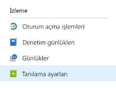
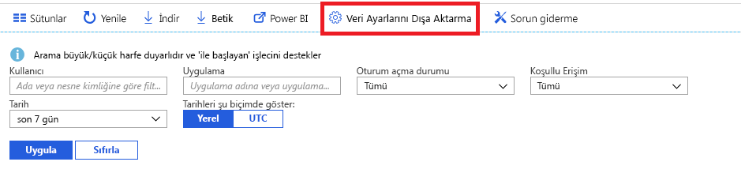

# Azure Active Directory izleme nedir? (önizleme)

Azure Active Directory (Azure AD) izleme özellikleriyle artık Azure AD etkinlik günlüklerinizi farklı uç noktalara yönlendirebilirsiniz. Ardından bu günlükleri uzun vadeli kullanım için saklayabilir veya ortamınızla ilgili içgörülere ulaşmak için üçüncü taraf Güvenlik Bilgileri ve Olay Yönetimi (SIEM) araçlarıyla tümleştirebilirsiniz.

Günlükleri şu an için şu hedeflere yönlendirebilirsiniz:

- Bir Azure depolama hesabı.
- Splunk ve Sumologic örneklerinizle tümleştirmek üzere bir Azure olay hub'ı.
- Verileri analiz edip belirli olaylar için pano ve uyarı oluşturabileceğiniz Azure Log Analytics çalışma alanı

> [!VIDEO https://www.youtube.com/embed/syT-9KNfug8]

[!INCLUDE [azure-monitor-log-analytics-rebrand](../../../includes/azure-monitor-log-analytics-rebrand.md)]

## Tanılama ayarlarını yapılandırma

Azure AD etkinlik günlükleri izleme ayarlarını yapılandırmak için [Azure portalda](https://portal.azure.com) oturum açın ve **Azure Active Directory**'yi seçin. Buradan tanılama ayarları yapılandırma sayfasına erişmek için kullanabileceğiniz iki yöntem vardır:

* **İzleme** bölümünden **Tanılama ayarları**'nı seçin.

    
    
* **Denetim Günlükleri** veya **Oturum açma işlemleri**'ni ve ardından **Dışarı aktarma ayarları**'nı seçin. 

    

## Günlükleri depolama hesabına yönlendirme

Günlükleri bir Azure depolama hesabına yönlendirerek [saklama ilkelerimizde](reference-reports-data-retention.md) belirtilen varsayılan saklama süresinden daha uzun bir süre boyunca saklayabilirsiniz. [Verileri depolama hesabınıza yönlendirmeyi](quickstart-azure-monitor-route-logs-to-storage-account.md) öğrenin.

## Günlükleri olay hub’ına aktarma

Günlükleri bir Azure olay hub'ına aktarmak, Sumologic ve Splunk gibi üçüncü taraf SIEM araçlarına tümleştirmenizi sağlar. Bu tümleştirme, Azure AD etkinlik günlüğü verileri ortamınızı daha zengin Öngörüler sağlamak için SIEM tarafından yönetilen diğer verilerle birleştirmek sağlar. [Olay hub'ına günlük akışı yapmayı](tutorial-azure-monitor-stream-logs-to-event-hub.md) öğrenin.

## Azure İzleyici günlüklerine günlükleri gönderme

[Azure İzleyici günlüklerine](https://docs.microsoft.com/azure/log-analytics/log-analytics-overview) izleme farklı kaynaklardan verileri bir araya getirir ve uygulamalarınızın ve kaynaklarınızın çalışmasını öngörülerin bir sorgu dili ve analiz altyapısı sağlayan bir çözümdür. Göndererek Azure AD etkinlik günlüklerini Azure İzleyici günlüklerine hızlı bir şekilde alabilirsiniz, izleme ve uyarılar toplanan verileri. Bilgi edinmek için nasıl [veri göndermek için Azure İzleyici günlüklerine](howto-integrate-activity-logs-with-log-analytics.md).

Oturum açma ve denetim etkinlikleri gibi yaygın senaryoları izlemek için önceden oluşturulmuş Azure AD etkinlik günlüklerini de görüntüleyebilirsiniz. Bilgi nasıl [yüklemek ve log analytics görünümleri kullanmak için Azure AD etkinlik günlüklerini](howto-install-use-log-analytics-views.md).

## Sonraki adımlar

* [Azure İzleyici'deki etkinlik günlükleri](concept-activity-logs-azure-monitor.md)
* [Günlükleri olay hub’ına aktarma](tutorial-azure-monitor-stream-logs-to-event-hub.md)
* [Azure İzleyici günlüklerine günlükleri gönderme](howto-integrate-activity-logs-with-log-analytics.md)
