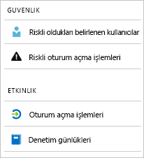

# Azure Active Directory raporları nelerdir?

Azure Active Directory (Azure AD) raporlar, ortamınızda etkinlik kapsamlı bir görünümünü sağlar. Sağlanan verilerle:

- Uygulama ve hizmetlerinizin kullanıcılarınız tarafından nasıl kullanıldığını saptayabilirsiniz
- Ortamınızın durumunu etkileyebilecek olası riskleri algılayabilirsiniz
- Kullanıcılarınızın işlerini yapmalarını engelleyen sorunları giderebilirsiniz  

Raporlama mimarisinin iki ana dayanağı vardır:

- [Güvenlik raporları](#security-reports)
- [Etkinlik raporları](#activity-reports)

## Güvenlik raporları

Güvenlik raporları kuruluşunuzun kimliklerini korumanıza yardımcı olur. İki tür güvenlik raporu vardır:

- **Riskli oldukları belirlenen kullanıcılar** - [Riskli oldukları belirlenen kullanıcılar güvenlik raporundan](concept-user-at-risk.md), gizliliği bozulmuş olabilecek kullanıcı hesaplarına genel bir bakış elde edersiniz.

- **Riskli oturum açma işlemleri** - [Riskli oturum açma işlemleri güvenlik raporuyla](concept-risky-sign-ins.md), kullanıcı hesabının meşru sahibi olmayan biri tarafından gerçekleştirilmiş olabilecek oturum açma işlemleriyle ilgili göstergeler elde edersiniz. 

### Güvenlik raporuna erişebilmek için hangi Azure AD lisansınızın olması gerekir?  

Azure AD'in tüm sürümlerinde risk ve riskli oturum açma işlemleri raporları için işaretlenmiş kullanıcılar sağlar. Bununla birlikte, rapordaki ayrıntı düzeyi sürümler arasında değişiklik gösterir: 

- İçinde **Azure Active Directory ücretsiz ve temel sürümlerinde**, risk ve riskli oturum açma işlemleri için işaretlenmiş kullanıcılar listesini alın. 

- **Azure Active Directory Premium 1** sürümü bu modeli genişleterek her raporda algılanmış olan temel risk olaylarından bazılarını incelemenize olanak tanır. 

- **Azure Active Directory Premium 2** sürümü temel risk olayları hakkında en ayrıntılı bilgileri sağlar ve ayrıca, yapılandırılmış risk düzeylerine otomatik olarak yanıt veren güvenlik ilkeleri yapılandırmanıza da olanak tanır.

## Etkinlik raporları

Etkinlik raporları, kuruluşunuzdaki kullanıcılardan davranışını anlamanıza yardımcı olur. Azure AD'de iki tür Etkinlik Raporu vardır:

- **Denetim günlükleri** - [Denetim günlükleri etkinlik raporu](concept-audit-logs.md), kiracınızda gerçekleştirilen her görevin geçmişine erişmenizi sağlar.

- **Oturum açma işlemleri** - [Oturum açma işlemleri etkinlik raporuyla](concept-sign-ins.md), denetim günlükleri raporunda bildirilen görevleri kimlerin gerçekleştirdiğini saptayabilirsiniz.

### Denetim günlükleri raporu 

[Denetim günlükleri raporu](concept-audit-logs.md) uyumluluk amacıyla sistem etkinliklerinin kayıtlarını sağlar. Bu veriler, şu yaygın senaryolara çözüm getirmenize olanak sağlar:

- Kiracımda birisi yönetici grubuna erişim aldı. Ona kim erişim verdi? 

- Belirli bir uygulamayı yeni ekledim ve iyi çalışıp çalışmadığını bilmek istiyorum; bu nedenle uygulamada oturum açan kullanıcıların listesini öğrenmek istiyorum

- Kiracımda kaç parola sıfırlama işlemi yapıldığını bilmek istiyorum

#### Hangi Azure AD lisansınızın denetim günlükleri raporuna erişebilmek gerekiyor mu?  

Denetim günlükleri raporu, lisansınız olan özellikler için sağlanır. Belirli bir özelliğin lisansına sahipseniz, o özelliğin denetim günlüğü bilgilerine de erişebilirsiniz. Daha fazla ayrıntı için [Azure Active Directory özellikleri ve yetenekleri](https://www.microsoft.com/cloud-platform/azure-active-directory-features).   

### Oturum açma işlemleri raporu

[Oturum açma işlemleri raporu](concept-sign-ins.md) gibi soruların yanıtlarını bulmanızı sağlar:

- Belirli bir kullanıcının oturum açma düzeni nedir?
- Bir hafta içerisinde kaç adet kullanıcı oturum açtı?
- Bu açılan oturumların durumu nedir?

#### Hangi Azure AD lisansınızın oturum açma işlemleri etkinlik raporuna erişebilmek gerekiyor mu?  

Oturum açma işlemleri etkinlik raporuna erişebilmek için, kiracınızın ilişkili bir Azure AD Premium lisansı olması gerekir.

## Programlı erişim

Kullanıcı arabirimine ek olarak, Azure AD aynı zamanda size sağlar [programlı erişim](concept-reporting-api.md) raporları verilerine bir dizi REST tabanlı API'leri aracılığıyla. Çeşitli programlama dilleri ve araçlarından bu API'leri çağırabilirsiniz. 

## Sonraki adımlar

- [Riskli oturum açma işlemleri raporu](concept-risky-sign-ins.md)
- [Denetim günlükleri raporu](concept-audit-logs.md)
- [Oturum açma günlükleri raporu](concept-sign-ins.md)
