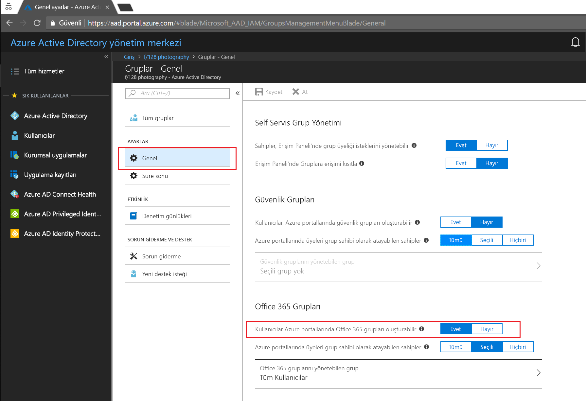
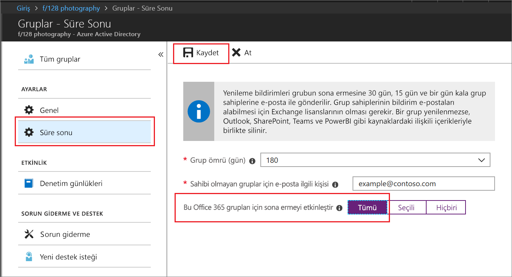

# Hızlı Başlangıç: Office 365 grupları Azure Active Directory'de dolmak üzere

Bu hızlı başlangıçta Office 365 gruplarınız için süre sonu ilkesini ayarlayacaksınız. Kullanıcılar kendi gruplarını oluşturma iznine sahip olduğunda, kullanılmayan grupların sayısı artabilir. Kullanılmayan grupları yönetmenin bir yolu, bu grupların için sona erme ilkesi ayarlayarak grupları el ile silme zahmetini ortadan kaldırmaktır.

Süre sonu ilkesi oldukça basittir:

* Grup sahiplerine süresi dolan bir grupla ilgili yenileme bildirimi gönderilir
* Yenilenmeyen gruplar silinir
* Silinen Office 365 grupları, grup sahibi veya bir Azure AD yöneticisi tarafından 30 gün içinde geri yüklenebilir

Azure aboneliğiniz yoksa başlamadan önce [ücretsiz bir hesap oluşturun](https://azure.microsoft.com/free/).

## Önkoşul

 Grubun sona erme tarihi için gerekli en az ayrıcalıklı rol, kuruluş içindeki kullanıcı yöneticisidir.

## Kullanıcılar için grup oluşturma özelliğini açma

1. Oturum [Azure portalında](https://portal.azure.com) kullanıcı yönetici hesabıyla.

2. **Gruplar**'ı ve ardından **Genel**'i seçin.
  
   

3. **Kullanıcılar Office 365 grupları oluşturabilir** ayarını **Evet** olarak belirleyin.

4. İşiniz tamamlandığında grup ayarlarını kaydetmek için **Kaydet**'i seçin.

## Grup süre sonunu ayarlama

1. Oturum [Azure portalında](https://portal.azure.com)seçin **Azure Active Directory** > **grupları** > **sona erme** için sona erme Ayarları'nı açın.
  
   

2. Süre sonu aralığını ayarlayın. Önceden belirlenmiş değerlerden birini seçin veya 31 günden yüksek bir değer girin. 

3. Sahibi olmayan gruplar için sona erme bildirimlerinin gönderileceği e-posta adresini girin.

4. Bu hızlı başlangıç için **Bu Office 365 grupları için sona ermeyi etkinleştir** ayarını **Tümü** olarak belirleyin.

5. İşiniz tamamlandığında süre sonu ayarlarını kaydetmek için **Kaydet**'i seçin.

İşte bu kadar! Bu hızlı başlangıçta seçilen Office 365 grupları için süre sonu ilkesini başarıyla ayarladınız.

## Kaynakları temizleme

### Süre sonu ilkesi kaldırmak için

1. Kiracınızın Genel Yöneticisi olan bir hesapla [Azure portalda](https://portal.azure.com) oturum açtığınızdan emin olun.
2. **Azure Active Directory** > **Gruplar** > **Süre Sonu**'nu seçin.
3. **Bu Office 365 grupları için sona ermeyi etkinleştir** ayarını **Yok** olarak değiştirin.

### Grupları için kullanıcı oluşturma devre dışı bırakmak için

1. **Azure Active Directory** > **Gruplar** > **Genel**'i seçin. 
2. **Kullanıcılar, Azure portallarında Office 365 grupları oluşturabilir** ayarını **Hayır** olarak değiştirin.

## Sonraki adımlar

PowerShell yönergeleri ve teknik kısıtlamalar dahil olmak üzere son kullanma hakkında daha fazla bilgi için şu makaleye bakın:

> [!div class="nextstepaction"]
> [Süre sonu ilkesi PowerShell](groups-lifecycle.md)
