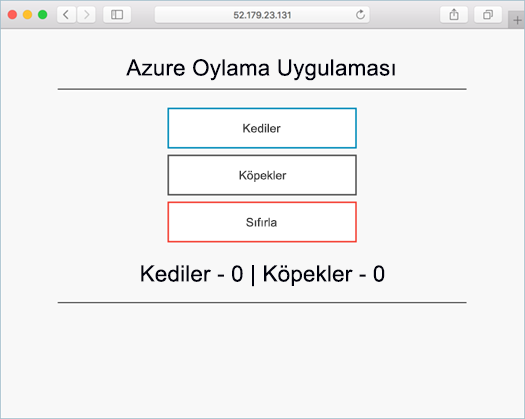
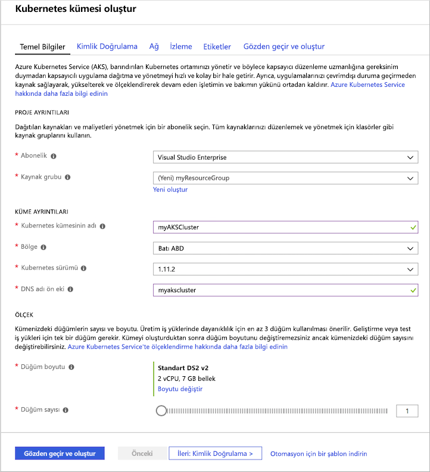
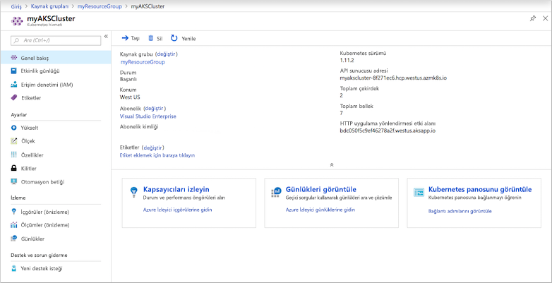
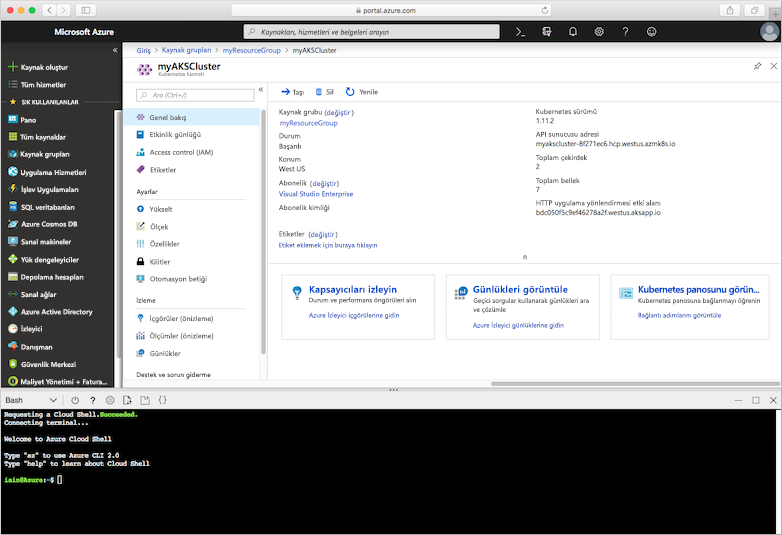
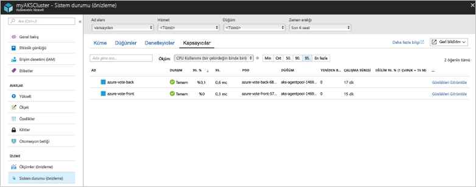
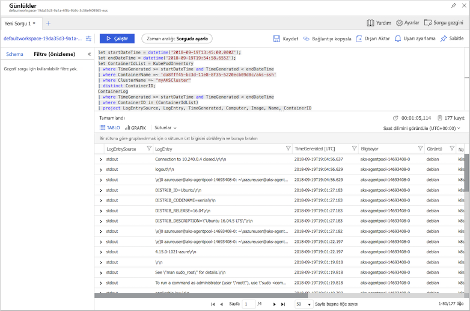

# <a name="quickstart-deploy-an-azure-kubernetes-service-aks-cluster-using-the-azure-portal"></a>Hızlı Başlangıç: Azure portalını kullanarak bir Azure Kubernetes Service (AKS) kümesini dağıtma

Azure Kubernetes Service (AKS) hızla dağıtın ve kümelerini yönetme sağlayan yönetilen bir Kubernetes hizmetidir. Bu hızlı başlangıçta, Azure portalını kullanarak bir AKS kümesi dağıtırsınız. Bir web ön ucu ve bir Redis örneğinden oluşan çok kapsayıcılı bir uygulama, kümede çalıştırılır. Daha sonra uygulamanızı çalıştıran pod'ların ve küme izlemesi öğrenin.



Bu hızlı başlangıç, Kubernetes kavramlarının temel olarak bilindiğini varsayar. Daha fazla bilgi için [Kubernetes kavramlarını Azure Kubernetes Service (AKS) için çekirdek][kubernetes-concepts].

Azure aboneliğiniz yoksa başlamadan önce [ücretsiz bir hesap](https://azure.microsoft.com/free/?WT.mc_id=A261C142F) oluşturun.

## <a name="sign-in-to-azure"></a>Azure'da oturum açma

[https://portal.azure.com](https://portal.azure.com ) adresinden Azure portalında oturum açın.

## <a name="create-an-aks-cluster"></a>AKS kümesi oluşturma

Azure portalının sol üst köşesinde seçin **+ kaynak Oluştur** > **kapsayıcıları** >  **Kubernetes hizmeti**.

AKS kümesi oluşturmak için aşağıdaki adımları tamamlayın:

1. Üzerinde **Temelleri** sayfasında, aşağıdaki seçenekleri yapılandırın:
   - *PROJE AYRINTILARINI*: Bir Azure aboneliği seçin sonra seçin veya bir Azure kaynak grubu gibi oluşturma *myResourceGroup*. **Kubernetes kümesi adı** alanına *myAKSCluster* gibi bir ad girin.
   - *KÜME AYRINTILARI*: Bölge, Kubernetes sürümü ve DNS adı ön eki için AKS kümesi seçin.
   - **BİRİNCİL düğüm HAVUZU**: AKS düğümleri için VM boyutunu seçin. AKS kümesi dağıtıldıktan sonra, sanal makine boyutu **değiştirilemez**. 
       - Kümeye dağıtılacak düğüm sayısını seçin. Bu hızlı başlangıç **Düğüm sayısı** değerini *1* olarak belirleyin. Küme dağıtıldıktan sonra düğüm sayısı **ayarlanabilir**.
    
     

     Seçin **sonraki: Ölçek** tamamlandığında.

2. Üzerinde **ölçek** sayfasında, varsayılan seçenekleri tutun. Ekranın alt kısmında tıklayın **sonraki: kimlik doğrulaması**.
3. Üzerinde **kimlik doğrulaması** sayfasında, aşağıdaki seçenekleri yapılandırın:
   - Bırakarak yeni bir hizmet sorumlusu oluşturma **hizmet sorumlusu** alanına **(yeni) varsayılan hizmet sorumlusu**. Veya seçebilirsiniz *yapılandırma hizmet sorumlusu* var olan bir kullanılacak. Mevcut bir kullanırsanız, SPN istemci Kimliğini ve parolasını sağlamanız gerekir.
   - Kubernetes rol tabanlı erişim denetimleri (RBAC) seçeneğini etkinleştirin. Bu, AKS kümesinde dağıtılan Kubernetes kaynaklara erişim üzerinde daha ayrıntılı denetim sağlar.

    Varsayılan olarak, *temel* ağ kullanılır ve kapsayıcılar için Azure İzleyici etkinleştirilir. Tıklayın **gözden geçir + Oluştur** ardından **Oluştur** doğrulama tamamlandığında.

AKS kümesi oluşturmak için birkaç dakika sürer. Dağıtım tamamlandığında, tıklayın **kaynağa Git**, AKS küme kaynak grubunu, gibi veya *myResourceGroup*ve AKS kaynak gibi seçin *myAKSCluster*. AKS küme Panosu, bu örnekte olduğu gibi gösterilir:



## <a name="connect-to-the-cluster"></a>Kümeye bağlanma

Bir Kubernetes kümesini yönetmek için kullandığınız [kubectl][kubectl], Kubernetes komut satırı istemcisi. `kubectl` istemcisi Azure Cloud Shell’de önceden yüklüdür.

Açık Cloud Shell kullanarak `>_` Azure portalın üst kısmındaki düğmesi.



Yapılandırmak için `kubectl` Kubernetes kümenize bağlanmak için [az aks get-credentials][az-aks-get-credentials] komutu. Bu komut, kimlik bilgilerini indirir ve Kubernetes CLI'yi bunları kullanacak şekilde yapılandırır. Aşağıdaki örnek *myResourceGroup* adlı kaynak grubu içindeki *myAKSCluster* adlı kümenin kimlik bilgilerini alır:

```azurecli-interactive
az aks get-credentials --resource-group myResourceGroup --name myAKSCluster
```

Kümenize bağlantıyı doğrulamak için [kubectl get][kubectl-get] komutunu kullanarak küme düğümleri listesini alın.

```azurecli-interactive
kubectl get nodes
```

Aşağıdaki örnekte önceki adımlarda oluşturulan tek düğüm gösterilmiştir. Düğüm durumu olduğundan emin olun *hazır*:

```
NAME                       STATUS    ROLES     AGE       VERSION
aks-agentpool-14693408-0   Ready     agent     15m       v1.11.5
```

## <a name="run-the-application"></a>Uygulamayı çalıştırma

Kubernetes bildirim dosyası çalıştırmak için hangi kapsayıcı görüntüleri gibi küme için istenen durumu tanımlar. Bu hızlı başlangıçta, Azure Vote uygulamasını çalıştırmak için gerekli tüm nesneleri oluşturmak için bir bildirim kullanılır. Bu bildirimi iki içerir [Kubernetes dağıtımları][kubernetes-deployment] - one for the sample Azure Vote Python applications, and the other for a Redis instance. Two [Kubernetes Services][kubernetes-service] ayrıca oluşturulur - Redis örneği için bir iç hizmet ve internet'ten Azure Vote uygulaması erişmek için bir dış hizmet.

> [!TIP]
> Bu hızlı başlangıçta, uygulama bildirimlerini el ile oluşturup AKS kümesine dağıtacaksınız. Daha fazla gerçek senaryoda kullanabileceğiniz [Azure geliştirme alanları][azure-dev-spaces] hızla yineleyin ve kodunuzu doğrudan AKS kümesi hata ayıklamak için. Dev Spaces’ı işletim sistemi platformları ile geliştirme ortamlarında kullanabilir ve ekibinizdeki diğer kişilerle birlikte çalışabilirsiniz.

Cloud shell'de kullanmak `nano` veya `vi` adlı bir dosya oluşturmak için `azure-vote.yaml` aşağıdaki YAML tanımı kopyalayın:

```yaml
apiVersion: apps/v1
kind: Deployment
metadata:
  name: azure-vote-back
spec:
  replicas: 1
  selector:
    matchLabels:
      app: azure-vote-back
  template:
    metadata:
      labels:
        app: azure-vote-back
    spec:
      nodeSelector:
        "beta.kubernetes.io/os": linux
      containers:
      - name: azure-vote-back
        image: redis
        resources:
          requests:
            cpu: 100m
            memory: 128Mi
          limits:
            cpu: 250m
            memory: 256Mi
        ports:
        - containerPort: 6379
          name: redis
---
apiVersion: v1
kind: Service
metadata:
  name: azure-vote-back
spec:
  ports:
  - port: 6379
  selector:
    app: azure-vote-back
---
apiVersion: apps/v1
kind: Deployment
metadata:
  name: azure-vote-front
spec:
  replicas: 1
  selector:
    matchLabels:
      app: azure-vote-front
  template:
    metadata:
      labels:
        app: azure-vote-front
    spec:
      nodeSelector:
        "beta.kubernetes.io/os": linux
      containers:
      - name: azure-vote-front
        image: microsoft/azure-vote-front:v1
        resources:
          requests:
            cpu: 100m
            memory: 128Mi
          limits:
            cpu: 250m
            memory: 256Mi
        ports:
        - containerPort: 80
        env:
        - name: REDIS
          value: "azure-vote-back"
---
apiVersion: v1
kind: Service
metadata:
  name: azure-vote-front
spec:
  type: LoadBalancer
  ports:
  - port: 80
  selector:
    app: azure-vote-front
```

Kullanarak uygulamayı dağıtma [kubectl uygulamak][kubectl-apply] komut ve YAML bildiriminizi adını belirtin:

```azurecli-interactive
kubectl apply -f azure-vote.yaml
```

Aşağıdaki örnek çıktıda, Hizmetleri başarıyla oluşturuldu ve dağıtımları gösterir:

```
deployment "azure-vote-back" created
service "azure-vote-back" created
deployment "azure-vote-front" created
service "azure-vote-front" created
```

## <a name="test-the-application"></a>Uygulamayı test etme

Uygulama çalıştırıldığında, uygulama ön ucu İnternet'e bir Kubernetes hizmeti sunar. Bu işlemin tamamlanması birkaç dakika sürebilir.

İlerleme durumunu izlemek için [kubectl get service][kubectl-get] komutunu `--watch` bağımsız değişkeniyle birlikte kullanın.

```azurecli-interactive
kubectl get service azure-vote-front --watch
```

Başlangıçta *EXTERNAL-IP* için *azure-vote-front* hizmet olarak gösterildiği *bekleyen*.

```
NAME               TYPE           CLUSTER-IP   EXTERNAL-IP   PORT(S)        AGE
azure-vote-front   LoadBalancer   10.0.37.27   <pending>     80:30572/TCP   6s
```

Zaman *EXTERNAL-IP* adresi değişirse *bekleyen* gerçek genel IP adresi için `CTRL-C` durdurmak için `kubectl` işlemi izleyin. Hizmete atanan geçerli genel IP adresi aşağıdaki örnek çıktı gösterilmektedir:

```
azure-vote-front   LoadBalancer   10.0.37.27   52.179.23.131   80:30572/TCP   2m
```

Uygulamada Azure Vote uygulamasını görmek için hizmetin dış IP adresini bir web tarayıcısı açın.


## <a name="monitor-health-and-logs"></a>Sistem durumunu ve günlükleri izleme

Kümeyi oluştururken, kapsayıcılar için Azure İzleyici etkinleştirildi. Bu izleme özelliği hem AKS kümesi hem de kümede çalışan pod'lar için sistem durumu ölçümleri sağlar.

Azure portalında bu verilerin doldurulması birkaç dakika sürebilir. Azure Vote pod'larının geçerli durumunu, çalışma süresini ve kaynak kullanımını görmek için Azure portalda *myAKSCluster* gibi bir AKS kaynağına geri gidin. Sistem durumuna aşağıdaki şekilde erişebilirsiniz:

1. Altında **izleme** seçin sol tarafta **öngörüleri**
1. Üst taraftan **+ Filtre Ekle**'yi seçin
1. *Ad alanı* özelliğini ve ardından *\<kube-system hariç tümünü\> seçin*
1. **Kapsayıcılar** bölümünü görüntüleyin.

Aşağıdaki örnekte olduğu gibi *azure-vote-back* ve *azure-vote-front* kapsayıcıları görüntülenir:



`azure-vote-front` pod'unun günlüklerini görmek için kapsayıcı listesinin sağ tarafındaki **Kapsayıcı günlüklerini görüntüle** bağlantısını seçin. Bu günlükler, kapsayıcıdaki *stdout* ve *stderr* akışlarını içerir.



## <a name="delete-cluster"></a>Kümeyi silme

Küme artık gerekli olmadığında, tüm ilişkili kaynaklarla birlikte küme kaynağını silin. AKS kümesi panosunda **Sil** düğmesi seçilerek Azure portalında bu işlem tamamlanabilir. Alternatif olarak, [az aks Sil][az-aks-delete] komutu, Cloud Shell'de kullanılabilir:

```azurecli-interactive
az aks delete --resource-group myResourceGroup --name myAKSCluster --no-wait
```

> [!NOTE]
> Kümeyi sildiğinizde, AKS kümesi tarafından kullanılan Azure Active Directory hizmet sorumlusu kaldırılmaz. Hizmet sorumlusunu kaldırma adımları için bkz: [AKS hizmet sorumlusu hakkında önemli noktalar ve silme][sp-delete].

## <a name="get-the-code"></a>Kodu alma

Bu hızlı başlangıçta, Kubernetes dağıtımı oluşturmak için önceden oluşturulmuş kapsayıcı görüntüleri kullanılan. İlgili uygulama kodu, Dockerfile ve Kubernetes bildirim dosyası GitHub'da bulunur.

[https://github.com/Azure-Samples/azure-voting-app-redis][azure-vote-app]

## <a name="next-steps"></a>Sonraki adımlar

Bu hızlı başlangıçta, bir Kubernetes kümesi dağıtıp ve bu kümeye çok kapsayıcılı bir uygulama dağıttınız.

AKS hakkında daha fazla bilgi ve dağıtım örneği için tam kod açıklaması için Kubernetes küme öğreticisine geçin.

> [!div class="nextstepaction"]
> [AKS Öğreticisi][aks-tutorial]

<!-- LINKS - external -->
[azure-vote-app]: https://github.com/Azure-Samples/azure-voting-app-redis.git
[kubectl]: https://kubernetes.io/docs/user-guide/kubectl/
[kubectl-apply]: https://kubernetes.io/docs/reference/generated/kubectl/kubectl-commands#apply
[kubectl-get]: https://kubernetes.io/docs/reference/generated/kubectl/kubectl-commands#get
[kubernetes-documentation]: https://kubernetes.io/docs/home/

<!-- LINKS - internal -->
[kubernetes-concepts]: concepts-clusters-workloads.md
[az-aks-get-credentials]: /cli/azure/aks?view=azure-cli-latest#az-aks-get-credentials
[az-aks-delete]: /cli/azure/aks#az-aks-delete
[aks-monitor]: ../monitoring/monitoring-container-health.md
[aks-network]: ./concepts-network.md
[aks-tutorial]: ./tutorial-kubernetes-prepare-app.md
[http-routing]: ./http-application-routing.md
[sp-delete]: kubernetes-service-principal.md#additional-considerations
[azure-dev-spaces]: https://docs.microsoft.com/azure/dev-spaces/
[kubernetes-deployment]: concepts-clusters-workloads.md#deployments-and-yaml-manifests
[kubernetes-service]: concepts-network.md#services