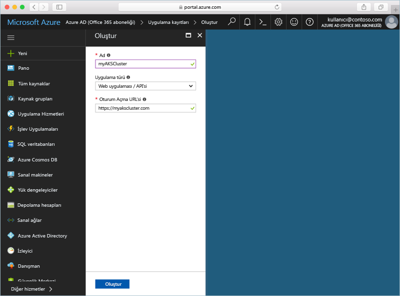
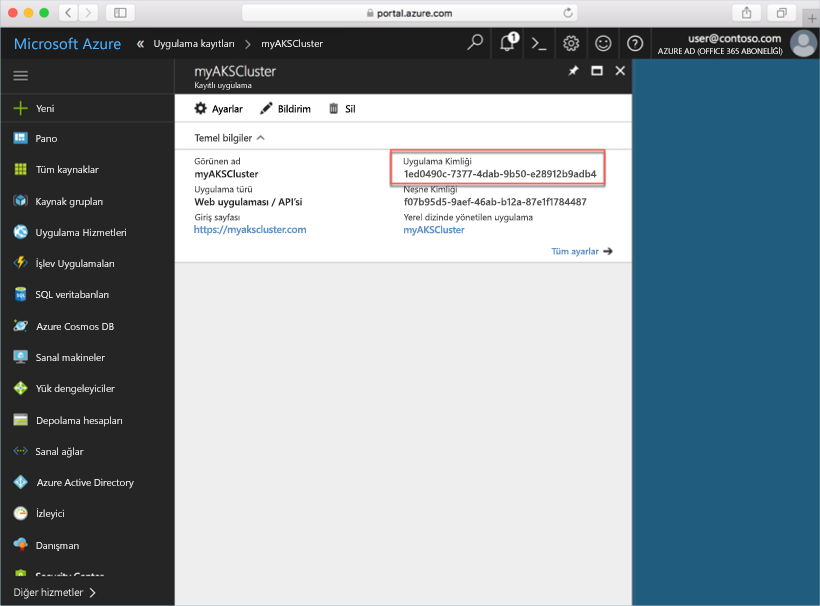

# <a name="deploy-an-azure-container-service-aks-cluster"></a>Azure Container Service (AKS) kümesini dağıtma

Bu hızlı başlangıçta, Azure portalını kullanarak bir AKS kümesi dağıtırsınız. Ardından web ön ucu ve bir Redis örneğinden oluşan çok kapsayıcılı bir uygulama küme üzerinde çalıştırılır. Tamamlandığında, uygulamaya İnternet üzerinden erişilebilir.


Bu hızlı başlangıç, Kubernetes kavramlarının temel olarak bilindiğini varsayar. Kubernetes hakkında ayrıntılı bilgi için bkz. [Kubernetes belgeleri][kubernetes-documentation].

## <a name="sign-in-to-azure"></a>Azure'da oturum açma

http://portal.azure.com sayfasından Azure portalında oturum açın.

## <a name="create-service-principal"></a>Hizmet sorumlusu oluşturma

Azure portalında AKS kümesi oluşturmadan önce bir hizmet sorumlusu oluşturmanız gerekir. Azure bu hizmet sorumlusunu kullanarak AKS kümesiyle ilişkili altyapıyı yönetir.

**Azure Active Directory** > **Uygulama kayıtları** > **Yeni uygulama kaydı**’nı seçin.

Uygulama için bir ad girin, herhangi bir değer olabilir. Uygulama türü için **Web uygulaması / API** öğesini seçin. **Oturum açma URL'si** için bir değer girin; geçerli URL biçiminde herhangi bir değer olabilir, ancak gerçek bir uç nokta olması gerekmez.

Bittiğinde **Oluştur**’u seçin.



Yeni oluşturulan uygulama kaydını seçin ve Uygulama Kimliğini not edin. Bu değer AKS kümesi oluşturulurken gereklidir.



Sonra, hizmet sorumlusu için bir parola eklemeniz gerekir. **Tüm Ayarlar** > **Anahtarlar**’ı seçin ve anahtar açıklaması için herhangi bir değer girin. Hizmet sorumlusunun geçerli olduğu süreyi ifade eden bir süre seçin.

**Kaydet**’e tıklayın ve parola değerini not edin. Parola, bir AKS kümesi oluşturulurken gereklidir.


## <a name="create-aks-cluster"></a>AKS kümesi oluşturma

**Kaynak oluştur** > **Kapsayıcılar** > **Azure Container Service - AKS (önizleme)** seçeneğini belirleyin.

Küme için bir küme adı, DNS ön eki, kaynak grubu adı, konum ve Kubernetes sürümü belirtin. Küme adı ve kaynak grubu adını not adın; kümeye bağlanırken bunlar gereklidir.

Bittiğinde **Tamam**’ı seçin.


Yapılandırma formunda aşağıdakileri girin:

- Kullanıcı Adı: Küme düğümleri üzerindeki yönetim hesaplarına verilen ad.
- SSH ortak anahtarı: Küme düğümlerine erişmek için kullanılacak anahtarla ilişkilidir.
- Hizmet sorumlusu istemci kimliği: Bu belgede daha önce oluşturduğunuz hizmet sorumlusunun uygulama kimliği.
- Hizmet sorumlusu gizli anahtarı: Bu belgede daha önce oluşturduğunuz hizmet sorumlusu parolası.
- Düğüm sayısı: Oluşturulacak AKS düğümü sayısı.
- Düğüm sanal makine boyutu: AKS düğümleri için VM boyutu
- İşletim sistemi disk boyutu: AKS düğümleri işletim sistemi diskinin boyutu.

Bittiğinde **Tamam**’ı seçin ve doğrulama tamamlandıktan sonra tekrar **Tamam**’ı seçin.


Kısa bir beklemeden sonra AKS kümesi dağıtılmıştır ve kullanıma hazırdır.

## <a name="connect-to-the-cluster"></a>Kümeye bağlanma

Kubernetes kümesini yönetmek için Kubernetes komut satırı istemcisi [kubectl][kubectl]’i kullanın. Kubectl istemcisi Azure Cloud Shell’de önceden yüklüdür.

Azure portalının sağ üst köşesindeki düğmeyi kullanarak Cloud Shell’i açın.


[az aks get-credentials][az-aks-get-credentials] komutunu kullanarak, kubectl istemcisini Kubernetes kümenize bağlanacak şekilde yapılandırın.

Aşağıdaki komutu kopyalayıp Cloud Shell’e yapıştırın. Gerekirse, kaynak grubu ve küme adını değiştirin.

```azurecli-interactive
az aks get-credentials --resource-group myAKSCluster --name myAKSCluster
```

Kümenize bağlantıyı doğrulamak için [kubectl get][kubectl-get] komutunu kullanarak küme düğümleri listesini alın.

```azurecli-interactive
kubectl get nodes
```

Çıktı:

```
NAME                       STATUS    ROLES     AGE       VERSION
aks-agentpool-14693408-0   Ready     agent     6m        v1.8.1
aks-agentpool-14693408-1   Ready     agent     6m        v1.8.1
aks-agentpool-14693408-2   Ready     agent     7m        v1.8.1
```

## <a name="run-the-application"></a>Uygulamayı çalıştırma

Kubernetes bildirim dosyası, hangi kapsayıcı görüntülerinin çalıştırılması gerektiği de dahil olmak üzere, küme için istenen durumu tanımlar. Bu örnekte, Azure Vote uygulamasını çalıştırmak için gerekli tüm nesneleri oluşturmak için bir bildirim kullanırsınız.

`azure-vote.yaml` adlı bir dosya oluşturun ve dosyayı aşağıdaki YAML koduna kopyalayın. Azure Cloud Shell'de çalışıyorsanız, bu dosyayı bir sanal veya fiziksel sistemde olduğu gibi vi veya Nano kullanarak oluşturabilirsiniz.

```yaml
apiVersion: apps/v1beta1
kind: Deployment
metadata:
  name: azure-vote-back
spec:
  replicas: 1
  template:
    metadata:
      labels:
        app: azure-vote-back
    spec:
      containers:
      - name: azure-vote-back
        image: redis
        ports:
        - containerPort: 6379
          name: redis
---
apiVersion: v1
kind: Service
metadata:
  name: azure-vote-back
spec:
  ports:
  - port: 6379
  selector:
    app: azure-vote-back
---
apiVersion: apps/v1beta1
kind: Deployment
metadata:
  name: azure-vote-front
spec:
  replicas: 1
  template:
    metadata:
      labels:
        app: azure-vote-front
    spec:
      containers:
      - name: azure-vote-front
        image: microsoft/azure-vote-front:v1
        ports:
        - containerPort: 80
        env:
        - name: REDIS
          value: "azure-vote-back"
---
apiVersion: v1
kind: Service
metadata:
  name: azure-vote-front
spec:
  type: LoadBalancer
  ports:
  - port: 80
  selector:
    app: azure-vote-front
```

Uygulamayı çalıştırmak için [kubectl create][kubectl-create] komutunu kullanın.

```azurecli-interactive
kubectl create -f azure-vote.yaml
```

Çıktı:

```
deployment "azure-vote-back" created
service "azure-vote-back" created
deployment "azure-vote-front" created
service "azure-vote-front" created
```

## <a name="test-the-application"></a>Uygulamayı test etme

Uygulama çalıştırıldığında, uygulama ön ucunu İnternet üzerinden kullanıma sunan bir [Kubernetes hizmeti][kubernetes-service] oluşturulur. Bu işlemin tamamlanması birkaç dakika sürebilir.

İlerleme durumunu izlemek için [kubectl get service][kubectl-get] komutunu `--watch` bağımsız değişkeniyle birlikte kullanın.

```azurecli-interactive
kubectl get service azure-vote-front --watch
```

Başlangıçta *azure-vote-front* için *EXTERNAL-IP* durumu *pending* olarak görünür.

```
NAME               TYPE           CLUSTER-IP   EXTERNAL-IP   PORT(S)        AGE
azure-vote-front   LoadBalancer   10.0.37.27   <pending>     80:30572/TCP   6s
```

*EXTERNAL-IP* adresi *pending* durumundan *IP address* değerine değiştiğinde kubectl izleme işlemini durdurmak için `CTRL-C` komutunu kullanın.

```
azure-vote-front   LoadBalancer   10.0.37.27   52.179.23.131   80:30572/TCP   2m
```

Artık Azure Vote Uygulamasını görmek için dış IP adresine göz atabilirsiniz.


## <a name="delete-cluster"></a>Kümeyi silme

Küme artık gerekli olmadığında, ilişkili tüm kaynaklarla birlikte küme kaynak grubunu silebilirsiniz. Bu işlem, Azure portalında kaynak grubu seçilip sil düğmesine tıklanarak tamamlanabilir. Alternatif olarak, Cloud Shell’de [az group delete][az-group-delete] komutu kullanılabilir.

```azurecli-interactive
az group delete --name myAKSCluster --no-wait
```

## <a name="get-the-code"></a>Kodu alma

Bu hızlı başlangıçta, Kubernetes dağıtımı oluşturmak için önceden oluşturulmuş kapsayıcı görüntüleri kullanılır. İlgili uygulama kodu, Dockerfile ve Kubernetes bildirim dosyası GitHub'da bulunur.

[https://github.com/Azure-Samples/azure-voting-app-redis][azure-vote-app]

## <a name="next-steps"></a>Sonraki adımlar

Bu hızlı başlangıçta, bir Kubernetes kümesi dağıtıp ve bu kümeye çok kapsayıcılı bir uygulama dağıttınız.

AKS hakkında daha fazla bilgi ve dağıtım örneği için tam kod açıklaması için Kubernetes küme öğreticisine geçin.

> [!div class="nextstepaction"]
> [AKS öğreticisi][aks-tutorial]

<!-- LINKS - external -->
[azure-vote-app]: https://github.com/Azure-Samples/azure-voting-app-redis.git
[kubectl]: https://kubernetes.io/docs/user-guide/kubectl/
[kubectl-create]: https://kubernetes.io/docs/reference/generated/kubectl/kubectl-commands#create
[kubectl-get]: https://kubernetes.io/docs/reference/generated/kubectl/kubectl-commands#get
[kubernetes-documentation]: https://kubernetes.io/docs/home/
[kubernetes-service]: https://kubernetes.io/docs/concepts/services-networking/service/

<!-- LINKS - internal -->
[az-aks-get-credentials]: /cli/azure/aks?view=azure-cli-latest#az_aks_get_credentials
[az-group-delete]: /cli/azure/group#delete
[aks-tutorial]: ./tutorial-kubernetes-prepare-app.md


